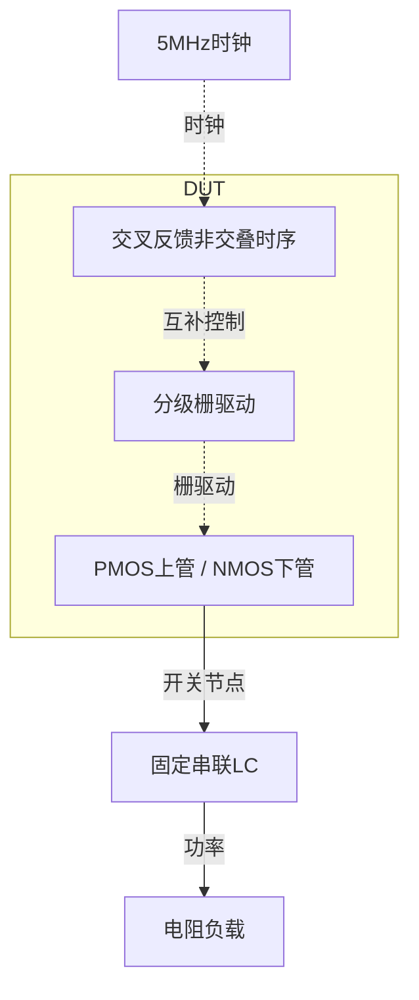

# 01 · Class-D半桥：分组功率管、完整供电积分与双温度负载矩阵

本模块把5MHz时钟变为1.8V半桥开关波形，经外部串联LC向电阻负载传输功率。PMOS上管与NMOS下管交替导通，利用低导通电阻减小传输损耗；交叉反馈延迟链控制换向，分级驱动器充放大功率管栅极。代价是较大的器件面积、栅极动态功耗与换向损耗。芯片中可用于谐振功率驱动和开关输出级；本例只验证固定时钟与指定负载，不包含音频调制或闭环失真指标。

状态：**SMIC18MMRF / TT / 1.8 V / 27°C，全部对应 nominal 指标在10%放宽条件内通过；原门槛差异见正文**。只宣称原理图级 nominal；未执行其他PVT、失配或版图验证。审查PDF已逐页检查中文、图表和网表可读性。

[审查 PDF](../evidence/01-class-d/review.pdf) · [精确电路](../evidence/01-class-d/circuit.scs) · [验收合同](../evidence/01-class-d/contract.json) · [实测结果](../evidence/01-class-d/latest_results.json)

当前报告：**9页正文＋6页完整电路图，共15页**。下文历史交付记录中的页数对应当时的正文版本。

本项保留TT下27°C与125°C各7种负载的全部14点，以及原5MHz/50Ω时钟和18–20us功率积分窗；并非只测27°C。现用Spectre24.1。

<!-- REPORT-MARKDOWN -->
## 可编辑报告与系统结构

[完整报告MD](../evidence/01-class-d/review_report.md) · [对应PDF](../evidence/01-class-d/review.pdf) · [Mermaid源文件](../evidence/01-class-d/system_block_diagram.mmd) · [框图SVG](../evidence/01-class-d/markdown_assets/system-block.svg)

本例是固定时钟驱动的功率级，LC和电阻是外部负载；没有实现音频调制器。

实线为信号或能量通路，虚线为时钟、控制或偏置。

<!-- END-REPORT-MARKDOWN -->

## 本次结果

SMIC18MMRF TT、1.8V下保留原27°C和125°C两个温度，各测1/2/3/6/8/12/16Ω七个负载，共14点。5MHz输入时钟、2ns边沿、50Ω源阻抗、外部3uH和345pF串联谐振网络、20us运行及18–20us评分窗均不变。五组验收量在10%允许范围内完成，只有27°C最低效率未达原值。

|验收量|实测|原门槛|10%门槛|
|---|---:|---:|---:|
|27°C峰值效率|95.759682%|>95%|>85.5%|
|27°C最低效率|82.698836%|>85%|>76.5%|
|125°C峰值效率|95.290394%|>90%|>81%|
|125°C最低效率|81.664420%|>80%|>72%|
|全14点最低输出功率|40.320567mW|>30mW|>30mW，固定|

效率比较均保留严格大于。防止无功率输出的30mW功能门槛，以及功率为正、有限值、效率≤100%的合理性检查均不放宽。27°C最低效率比原下限低2.301164个百分点，不能写成全部原门槛通过。所有输入、运行路径和门槛在[原合同](../evidence/01-class-d/contract.json)与[实测结果](../evidence/01-class-d/latest_results.json)中列出。

## 原厂HD逻辑驱动原生功率MOS

最终上管为四组p18、下管为两组n18，各单位W=50um、L=0.18um，每组m=512；总宽分别102400um和51200um。全部源漏面积与周长明确给出：单位扩散延伸0.3um，AD=AS=15um²、PD=PS=100.6um。此处是原理图几何假设，尚未完成版图或验证扩散共享。

功率管初算使用本工程新表征的W50um/L0.18um目标PDK LUT，在VDS=1.8V、VSB=0V下取完整VGS=1.8V端点。NMOS表初次gm/ID范围截掉该端点，随后用同一次原始扫描重提取至gm/ID≥0.5，没有外推。表征电流用于几何选择，不是功率级实际直流偏置；开关导通时低VDS区域的损耗仍由真实瞬态模型计算。[选型记录](../evidence/01-class-d/sizing.json)保留表哈希和端点。

控制器用原厂INHDV1、INHDV4、INHDV8、INHDV32、NAND2HDV1，内部晶体管尺寸与模型名均未修改。bank4为四个完整INHDV32并联。P路驱动为IN4→IN32→2×bank4→8×bank4的四级同相链；N路为IN8→bank4→4×bank4的三级反相链。交叉NAND与两个四级延迟链控制先关后开的逻辑时序，每个延迟级带0.1pF原生MIM。

DUT无理想R/C/L、独立源或行为器件；外部LC、RL和时钟源都位于测试台。数字单元的VNW/VPW分别接vdd/vss，完整层次和每个端子在六页晶体管/单元图中展开。逻辑意图不代表任何工作状态下都没有直通电流，驱动损耗实际计入总供电。

## 为什么拒绝看似通过的首版

首版用单个p18实例m=2048，Spectre出现CMI-2318：单实例源漏串联寄生电阻低于默认minr，被删除。虽然三个初测负载的效率看似可用，模型寄生已经改变，因此该版本未计入验收。

最终把相同总宽度分为四个m=512实例，下管也分为两个m=512，使物理串联寄生保留。没有调整minr或PDK电阻参数；随后重新跑完整14点。另一次无效L1:p保存项也被明确删除，以严格串联的零伏感测源电流替代。失败日志与原因全部保存在[迭代记录](../evidence/01-class-d/iteration_history.json)。

## 完整功耗口径

各点对18–20us内全部非均匀时间样本做时间加权梯形积分，边界先对电压、电流分别插值。

- 输入功率Pin = |1.8·mean(I_VDD)| + |mean(VSS·I_VSS)| + |mean(VCLK·I_VCLK)|。
- 输出功率Pout = |mean(V_RLnode·I_VMEAS_RL)|，并独立以mean(V_RL²/RL)核对。
- 效率η = Pout/Pin；先积分带符号功率，再按原式取绝对值。

时钟功率取50Ω源阻抗之前，全部HD控制、缓冲和栅驱动供电均包含在内。VSS为理想零伏，其项仍明确保留。不从Pin中扣除驱动损耗、LC储能增长或其他实际消耗。

|RL/Ω|27°C Pout/mW|27°C η/%|125°C Pout/mW|125°C η/%|
|---:|---:|---:|---:|---:|
|1|122.596955|90.328951|122.492231|89.644586|
|2|163.315740|95.759682|163.007739|95.290394|
|3|150.847100|95.618845|150.583803|95.172368|
|6|98.070600|92.649087|97.959644|92.068453|
|8|76.971860|90.503074|76.903469|89.817918|
|12|53.106950|86.433071|53.074309|85.558949|
|16|40.339454|82.698836|40.320567|81.664420|

低阻负载谐振电流较大，导通及换向损耗显著；高阻时输出功率下降，动态逻辑与栅驱动损耗占比增加，所以原题同时限制峰值与最低效率。

## 固定窗口与真实储能变化

按E=0.5·L·I²+0.5·C·V_C²保存18us、20us两端能量。27°C/1Ω的ΔE/Δt约5.019755mW，125°C/1Ω约4.975033mW；低Q负载的该项接近零。低阻高Q轨迹在原20us终点不能自动当作严格周期稳态。

本次完整执行原评分窗，并单独报告储能变化；没有用延长运行、移动窗口或扣除储能换取更高效率。因此这些数值是原合同指定有限窗口的结果，不能直接推广为所有负载的无限时长稳态效率。

14点窗口内SW节点包络为−0.169439V至2.340004V，换向时确有轨外尖峰。原合同没有专门端间应力或死区时间验收，但报告保留实际波形；效率通过不能证明可靠性、零直通或版图实现通过。

## 数值收敛先失败，再收紧全矩阵

初始全部14点采用1ns最大步长、reltol=1e-5、traponly。因开关边沿出现SPECTRE-16780局部截断误差通知，事先对两个温度的1/3/16Ω六个代表点规定：效率差≤0.1个百分点，Pin与Pout差各≤0.2mW，且验收分级不变。

1ns/1e-5与0.5ns/1e-6第一次对照失败，最大功率差约0.679mW、最大效率差约0.143个百分点。未放宽这些界限；重新把全部14点统一到0.25ns/1e-7，再将六个代表点与中间精度比较。最终最大效率差0.0325126个百分点、最大功率差0.155941mW，全部满足原先界限，电气分级仍为10%。其他八点也使用相同最终精度，但未声称全部14点各自都有0.5/0.25ns两级比较。

[数值复核](../evidence/01-class-d/numerical_confirmation.json)、[初始基线](../evidence/01-class-d/numerical_baseline.json)、[中间精度结果](../evidence/01-class-d/numerical_midpoint.json)和每一原始运行分别保存。最终LTE边沿警告仍按实记录，最终无CMI寄生删除、器件越界或无效save警告。

## 审查证据与边界

独立审计从14组原始PSF逐段标量积分重算7类功率量，共98项核对；重建原m0–m13后交给冻结的原验收器main和sanity_error。所有时钟周期、负载、电容电感、温度与供电条件逐项核对，模型、原厂HD、源资料和LUT哈希不变。[测量复核](../evidence/01-class-d/measurement-review.md)、[独立审计](../evidence/01-class-d/verification_audit.json)、[完整总图](../evidence/01-class-d/schematic/full.pdf)与连接映射随15页审查PDF归档。

本项覆盖原题TT双温度全部14点，但目标工艺已经迁移为SMIC18，不宣称Sky130原工艺签核。未验证其他工艺角、失配、音频调制与失真、外部电感电容损耗、PCB/封装、布局/PEX或器件寿命。原Sky130资料及既有PDK、Bridge、Spectre、LUT环境保持原样。

[完整 LUT 查询](../evidence/01-class-d/sizing.json)

[HD 单元来源与哈希](../evidence/01-class-d/hd_cells_manifest.json)

## 复现与证据

[完整电路总图 SVG](../evidence/01-class-d/schematic/full.svg) · [总图 PDF](../evidence/01-class-d/schematic/full.pdf) · [6页电路分图](../evidence/01-class-d/schematic/sheets.pdf) · [引脚与层次连接映射](../evidence/01-class-d/schematic/connectivity.json) · [图纸审计](../evidence/01-class-d/schematic_audit.json)

- [Spectre 运行记录](https://github.com/SannBunnSyoSeTsu/smic18-benchmark-reproduction/blob/6ae3e1434914297c4ed12b93cb8d6a297ef8339a/runs/01/20260926T051037108905Z_t27_r1/run.json) · 原始输出（本地归档，未随仓库分发）
- [Spectre 运行记录](https://github.com/SannBunnSyoSeTsu/smic18-benchmark-reproduction/blob/6ae3e1434914297c4ed12b93cb8d6a297ef8339a/runs/01/20260926T051341249987Z_t27_r2/run.json) · 原始输出（本地归档，未随仓库分发）
- [Spectre 运行记录](https://github.com/SannBunnSyoSeTsu/smic18-benchmark-reproduction/blob/6ae3e1434914297c4ed12b93cb8d6a297ef8339a/runs/01/20260926T051645617788Z_t27_r3/run.json) · 原始输出（本地归档，未随仓库分发）
- [Spectre 运行记录](https://github.com/SannBunnSyoSeTsu/smic18-benchmark-reproduction/blob/6ae3e1434914297c4ed12b93cb8d6a297ef8339a/runs/01/20260926T051953301889Z_t27_r6/run.json) · 原始输出（本地归档，未随仓库分发）
- [Spectre 运行记录](https://github.com/SannBunnSyoSeTsu/smic18-benchmark-reproduction/blob/6ae3e1434914297c4ed12b93cb8d6a297ef8339a/runs/01/20260926T052300189660Z_t27_r8/run.json) · 原始输出（本地归档，未随仓库分发）
- [Spectre 运行记录](https://github.com/SannBunnSyoSeTsu/smic18-benchmark-reproduction/blob/6ae3e1434914297c4ed12b93cb8d6a297ef8339a/runs/01/20260926T052608480231Z_t27_r12/run.json) · 原始输出（本地归档，未随仓库分发）
- [Spectre 运行记录](https://github.com/SannBunnSyoSeTsu/smic18-benchmark-reproduction/blob/6ae3e1434914297c4ed12b93cb8d6a297ef8339a/runs/01/20260926T052914085074Z_t27_r16/run.json) · 原始输出（本地归档，未随仓库分发）
- [Spectre 运行记录](https://github.com/SannBunnSyoSeTsu/smic18-benchmark-reproduction/blob/6ae3e1434914297c4ed12b93cb8d6a297ef8339a/runs/01/20260926T053219210203Z_t125_r1/run.json) · 原始输出（本地归档，未随仓库分发）
- [Spectre 运行记录](https://github.com/SannBunnSyoSeTsu/smic18-benchmark-reproduction/blob/6ae3e1434914297c4ed12b93cb8d6a297ef8339a/runs/01/20260926T053507154334Z_t125_r2/run.json) · 原始输出（本地归档，未随仓库分发）
- [Spectre 运行记录](https://github.com/SannBunnSyoSeTsu/smic18-benchmark-reproduction/blob/6ae3e1434914297c4ed12b93cb8d6a297ef8339a/runs/01/20260926T053756539736Z_t125_r3/run.json) · 原始输出（本地归档，未随仓库分发）
- [Spectre 运行记录](https://github.com/SannBunnSyoSeTsu/smic18-benchmark-reproduction/blob/6ae3e1434914297c4ed12b93cb8d6a297ef8339a/runs/01/20260926T054045118518Z_t125_r6/run.json) · 原始输出（本地归档，未随仓库分发）
- [Spectre 运行记录](https://github.com/SannBunnSyoSeTsu/smic18-benchmark-reproduction/blob/6ae3e1434914297c4ed12b93cb8d6a297ef8339a/runs/01/20260926T054332098270Z_t125_r8/run.json) · 原始输出（本地归档，未随仓库分发）
- [Spectre 运行记录](https://github.com/SannBunnSyoSeTsu/smic18-benchmark-reproduction/blob/6ae3e1434914297c4ed12b93cb8d6a297ef8339a/runs/01/20260926T054617269761Z_t125_r12/run.json) · 原始输出（本地归档，未随仓库分发）
- [Spectre 运行记录](https://github.com/SannBunnSyoSeTsu/smic18-benchmark-reproduction/blob/6ae3e1434914297c4ed12b93cb8d6a297ef8339a/runs/01/20260926T054902877283Z_t125_r16/run.json) · 原始输出（本地归档，未随仓库分发）
- [工程脚本](https://github.com/SannBunnSyoSeTsu/smic18-benchmark-reproduction/tree/6ae3e1434914297c4ed12b93cb8d6a297ef8339a/scripts) · [项目状态](https://github.com/SannBunnSyoSeTsu/smic18-benchmark-reproduction/blob/6ae3e1434914297c4ed12b93cb8d6a297ef8339a/status.json)

原Sky130案例保持原样；本页是目标工艺实测的新记录。模型文件留在既有本地PDK目录，没有上传或修改。
