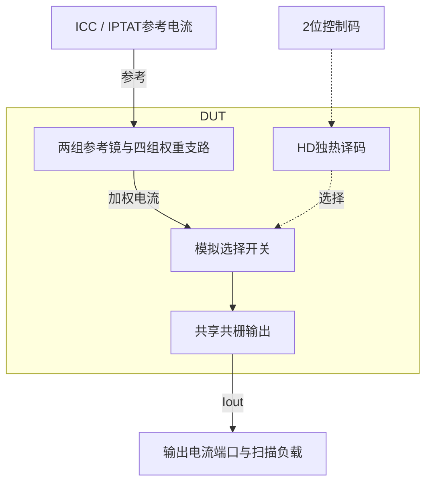

# 02 · 可编程电流镜：单元复制、低余量共栅与完整端口合同

本模块把两路参考电流按数字码选择的权重相加，生成可编程偏置电流。相比固定比例电流镜，它可调节两路参考的贡献，并用共栅级降低输出电压对电流的影响。芯片中常用于偏置分配、温度补偿权重调整和校准；本次只验证给定参考电流的nominal行为。

状态：**SMIC18MMRF / TT / 1.8 V / 27°C，全部对应 nominal 原始指标通过**。只宣称原理图级 nominal；未执行其他PVT、失配或版图验证。审查PDF已逐页检查中文、图表和网表可读性。

[审查 PDF](../evidence/02-mirror/review.pdf) · [精确电路](../evidence/02-mirror/circuit.scs) · [验收合同](../evidence/02-mirror/contract.json) · [实测结果](../evidence/02-mirror/latest_results.json)

当前报告：**4页正文＋2页完整电路图，共6页**。下文历史交付记录中的页数对应当时的正文版本。

<!-- REPORT-MARKDOWN -->
## 可编辑报告与系统结构

[完整报告MD](../evidence/02-mirror/review_report.md) · [对应PDF](../evidence/02-mirror/review.pdf) · [Mermaid源文件](../evidence/02-mirror/system_block_diagram.mmd) · [框图SVG](../evidence/02-mirror/markdown_assets/system-block.svg)

译码只控制模拟电流支路；电流端口的外部电压源属于测量夹具。

实线为信号或能量通路，虚线为时钟、控制或偏置。

<!-- END-REPORT-MARKDOWN -->

## 设计与完整验收

两个n18二极管参考的单元W/L=34.78/1 µm，目标50 µA、gm/ID=16。四组输出支路分别复制(16,4)、(12,8)、(8,12)、(4,16)个相同单元。HD两只反相器与四只NOR产生独热选择；每支路一个n18模拟开关，单位W/L=32.84/0.18 µm。

共栅管使用2.12/0.36 µm单元m=200，偏置复制管m=1；原始选点gm/ID=18，目标总电流1 mA。VDD经210 kΩ、二极管与50 kΩ串接形成偏置，实际辅助电流4.815 µA。模拟选择开关由gm/ID点得到初宽，实际在线性区工作，nominal Ron约23.36 Ω；饱和区余量要求不适用于该开关。

四码名义输出均为973.539 µA，误差2.6461%；独立权重最大误差4.4974%，权重比误差0.005814%。每码41个均匀点覆盖0.45–1.60 V，最坏电流变化0.08095%，局部输出电阻815.33 kΩ以上。参考端电压0.47885–0.49117 V，包含所有独立±5 µA扰动。辅助VDD已扣除100 µA外部参考，数字电流在模型中为零。

## 工程认识

相同L仍不够：电流镜用相同W/L单元并联，既避免单实例宽度超出模型范围，又避免把大幅改变W引入的模型宽度效应混入镜像比。所有参考与输出单元保持一致，最终四码名义电流重合。这里的m是原理图并联倍数，不是已完成的版图匹配阵列。

共栅输出使底部镜管的漏端接近0.218 V，显著隔离0.45–1.60 V的输出变化。单元VDS仍小于参考二极管的约0.485 V，因此存在约2.65%的总电流偏差；它符合合同，不应被误解为理想无误差复制。

只有1 mA标称值不能证明贡献比例正确。本例保留20个静态参考/代码组合、每码完整compliance扫描、±5 mV的局部输出电阻测量，以及参考引脚和电流端口检查。参考隔离和数字引脚的零值限定于该确定性模型与数值精度，不能推出真实漏电为零。

## 模型范围的纠正记录

初始输出支路按总宽度写成单个器件，部分宽度超过SMIC18 n18/p18模型的100 µm上限，出现CMI-2441。即使外部测量曾通过，也不能作为有效复现。相关运行标为invalid_model_dimensions并保留；最终改为并联单元后重新验证，模型日志无越界警告。项目现对该警告直接阻止完成判定。

[LUT与并联单元记录](../evidence/02-mirror/sizing.json) · [HD来源与哈希](../evidence/02-mirror/hd_cells_manifest.json)

## 复现与证据

[完整电路总图 SVG](../evidence/02-mirror/schematic/full.svg) · [总图 PDF](../evidence/02-mirror/schematic/full.pdf) · [2页电路分图](../evidence/02-mirror/schematic/sheets.pdf) · [引脚与层次连接映射](../evidence/02-mirror/schematic/connectivity.json) · [图纸审计](../evidence/02-mirror/schematic_audit.json)

- [Spectre 运行记录](https://github.com/SannBunnSyoSeTsu/smic18-benchmark-reproduction/blob/6ae3e1434914297c4ed12b93cb8d6a297ef8339a/runs/02/20260922T062026366425Z_mirror/run.json) · 原始输出（本地归档，未随仓库分发）
- [工程脚本](https://github.com/SannBunnSyoSeTsu/smic18-benchmark-reproduction/tree/6ae3e1434914297c4ed12b93cb8d6a297ef8339a/scripts) · [项目状态](https://github.com/SannBunnSyoSeTsu/smic18-benchmark-reproduction/blob/6ae3e1434914297c4ed12b93cb8d6a297ef8339a/status.json)

原Sky130案例保持原样；本页是目标工艺实测的新记录。模型文件留在既有本地PDK目录，没有上传或修改。
