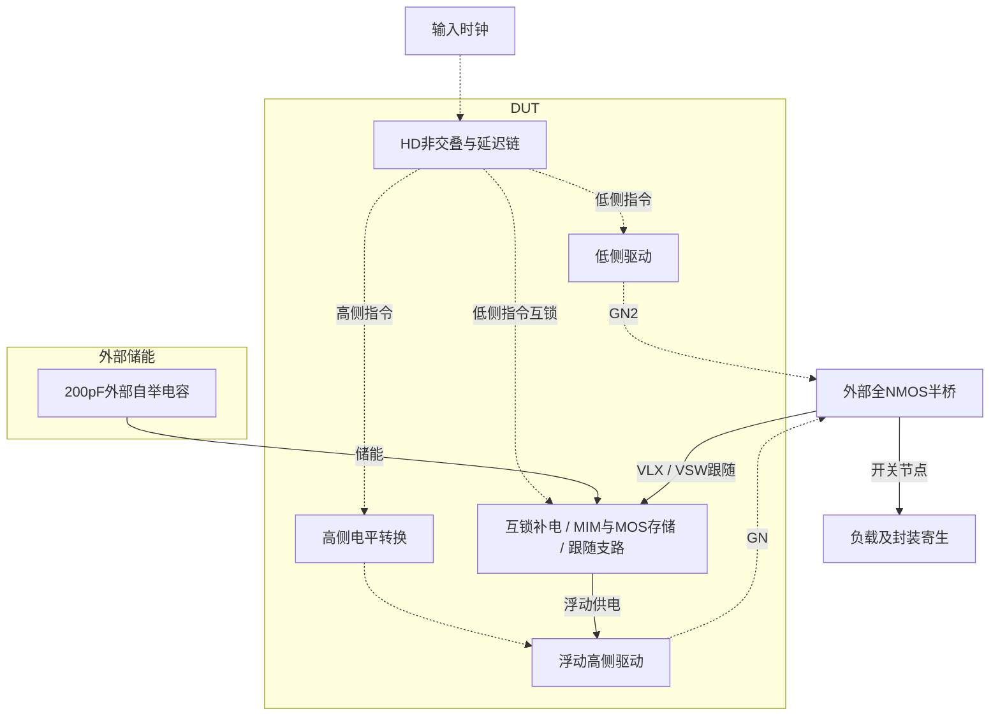

# 05 · NMOS半桥自举驱动：浮动供电、充电路径与死区

本模块为外部全NMOS半桥产生交替的低侧驱动和浮动高侧驱动。自举存储使高侧栅极随开关节点抬升，非交叠控制避免两管同时导通，互锁补电与跟随支路控制寄生电感下的过冲；代价是存储面积、动态功耗、短脉冲驱动能力和器件电压限制需要共同权衡。芯片中可用于低压半桥开关控制，本次只验证指定外部功率管与负载的标称开环行为。

状态：**SMIC18MMRF / TT / 1.8 V / 27°C，全部对应 nominal 指标在10%放宽条件内通过；原门槛差异见正文**。只宣称原理图级 nominal；未执行其他PVT、失配或版图验证。审查PDF已逐页检查中文、图表和网表可读性。

[审查 PDF](../evidence/05-bootstrap-driver/review.pdf) · [精确电路](../evidence/05-bootstrap-driver/circuit.scs) · [验收合同](../evidence/05-bootstrap-driver/contract.json) · [实测结果](../evidence/05-bootstrap-driver/latest_results.json)

当前报告：**7页正文＋15页完整电路图，共22页**。下文历史交付记录中的页数对应当时的正文版本。

<!-- REPORT-MARKDOWN -->
## 可编辑报告与系统结构

[完整报告MD](../evidence/05-bootstrap-driver/review_report.md) · [对应PDF](../evidence/05-bootstrap-driver/review.pdf) · [Mermaid源文件](../evidence/05-bootstrap-driver/system_block_diagram.mmd) · [框图SVG](../evidence/05-bootstrap-driver/markdown_assets/system-block.svg)

驱动器是DUT；功率MOS、负载、封装寄生和指定外部自举电容按原夹具单列。

实线为信号或能量通路，虚线为时钟、控制或偏置。

<!-- END-REPORT-MARKDOWN -->

## 结果与范围

TT/1.8V/27°C，原20/50/80ns输入脉宽全部达到10%档，原指标未通过。平均高侧VGS范围1.49847214–1.56736845V；死区范围2.99678487–4.36351676ns；最坏DUT功耗3.09026894mW。平均VGS低于原1.65V，最短死区略低于原3ns。

峰值限制未放宽：高侧VGS 1.70596357V、自举两端1.81260414V、低侧栅1.80142013V均<2.15V；高侧电流0.613884054A<0.8A。VBST对地3.56976483V，满足额外3.63V节点筛查；它不是全端子应力或寿命签核。展开WLm面积33470.8131um²≤35000，外接自举200pF≤100nF。

## 实现与核验

原生gm/ID初算3.3V电平转换/补电与1.8V底板复位；原厂HD非交叠及四级驱动。补电与底板复位由低侧命令互锁，增加浮动充电缓冲与p33跟随支路。原生MIM加80×9.6um、m34的MOS电容储能，PDK模型和外部功率管/负载/寄生保持冻结。

100→50ps与全局reltol1e-5→1e-6确认36项数值差异通过；独立37项测量/面积核对通过，原8项电气界限中的失败项保留。五周期窗口每侧各5次升/降沿，全部非交叠。只完成三种脉宽nominal，未做其他温度、FS/SF、失配、PEX或可靠性。

[可编辑报告](../evidence/05-bootstrap-driver/review_report.md)、[独立复核](../evidence/05-bootstrap-driver/measurement-review.md)、[边沿记录](../evidence/05-bootstrap-driver/switching_records.json)、[面积展开](../evidence/05-bootstrap-driver/area_audit.json)、[数值确认](../evidence/05-bootstrap-driver/numerical_confirmation.json)、[完整图纸](../evidence/05-bootstrap-driver/schematic/sheets.pdf)、[生成脚本](../evidence/05-bootstrap-driver/implementation)均保留。PDF由Matplotlib生成，MD不是其编译输入。

电路SHA-256：`51ae51fce4ab67a9ce5b7e74e61e746bf6f22c7480f2c2802fef5c3ee071cd12`。

[完整 LUT 查询](../evidence/05-bootstrap-driver/sizing.json)

[HD 单元来源与哈希](../evidence/05-bootstrap-driver/hd_cells_manifest.json)

## 复现与证据

[完整电路总图 SVG](../evidence/05-bootstrap-driver/schematic/full.svg) · [总图 PDF](../evidence/05-bootstrap-driver/schematic/full.pdf) · [15页电路分图](../evidence/05-bootstrap-driver/schematic/sheets.pdf) · [引脚与层次连接映射](../evidence/05-bootstrap-driver/schematic/connectivity.json) · [图纸审计](../evidence/05-bootstrap-driver/schematic_audit.json)

- [Spectre 运行记录](https://github.com/SannBunnSyoSeTsu/smic18-benchmark-reproduction/blob/6ae3e1434914297c4ed12b93cb8d6a297ef8339a/runs/05/20260929T044821278822Z_pw20/run.json) · 原始输出（本地归档，未随仓库分发）
- [Spectre 运行记录](https://github.com/SannBunnSyoSeTsu/smic18-benchmark-reproduction/blob/6ae3e1434914297c4ed12b93cb8d6a297ef8339a/runs/05/20260929T044848930584Z_pw50/run.json) · 原始输出（本地归档，未随仓库分发）
- [Spectre 运行记录](https://github.com/SannBunnSyoSeTsu/smic18-benchmark-reproduction/blob/6ae3e1434914297c4ed12b93cb8d6a297ef8339a/runs/05/20260929T044916615613Z_pw80/run.json) · 原始输出（本地归档，未随仓库分发）
- [工程脚本](https://github.com/SannBunnSyoSeTsu/smic18-benchmark-reproduction/tree/6ae3e1434914297c4ed12b93cb8d6a297ef8339a/scripts) · [项目状态](https://github.com/SannBunnSyoSeTsu/smic18-benchmark-reproduction/blob/6ae3e1434914297c4ed12b93cb8d6a297ef8339a/status.json)

原Sky130案例保持原样；本页是目标工艺实测的新记录。模型文件留在既有本地PDK目录，没有上传或修改。
