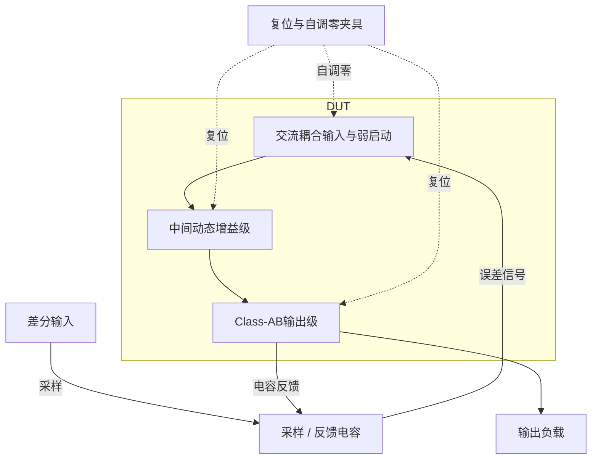

# 06 · 三级环形放大器：自调零、启动与电容反馈

本模块利用三级动态放大路径和电容反馈，把采样差分输入放大约八倍。自调零阶段保存级间偏置，放大阶段的Class-AB输出级提供瞬态电流，弱启动支路帮助交流耦合输入从零状态建立偏置；代价是时钟复位、偏置记忆、非线性建立与电容比例需要共同设计。芯片中可用于开关电容增益级和流水线ADC余量放大。

状态：**SMIC18MMRF / TT / 1.8 V / 27°C，全部对应 nominal 原始指标通过**。只宣称原理图级 nominal；未执行其他PVT、失配或版图验证。审查PDF已逐页检查中文、图表和网表可读性。

[审查 PDF](../evidence/06-ring-amplifier/review.pdf) · [精确电路](../evidence/06-ring-amplifier/circuit.scs) · [验收合同](../evidence/06-ring-amplifier/contract.json) · [实测结果](../evidence/06-ring-amplifier/latest_results.json)

当前报告：**7页正文＋6页完整电路图，共13页**。下文历史交付记录中的页数对应当时的正文版本。

<!-- REPORT-MARKDOWN -->
## 可编辑报告与系统结构

[完整报告MD](../evidence/06-ring-amplifier/review_report.md) · [对应PDF](../evidence/06-ring-amplifier/review.pdf) · [Mermaid源文件](../evidence/06-ring-amplifier/system_block_diagram.mmd) · [框图SVG](../evidence/06-ring-amplifier/markdown_assets/system-block.svg)

图中保留外部开关电容闭环和复位边界；三级信号路径对应DUT，目标闭环增益约8。

实线为信号或能量通路，虚线为时钟、控制或偏置。

<!-- END-REPORT-MARKDOWN -->

## 标称结果

四个输入+20/+10/0/−20mV，固定25uA偏置、10pF/侧负载、500ns周期、50ns复位。原始指标全部通过：正区间增益8.29330744，双极性增益7.99263712，最坏静态误差0.61536387%，建立35.228193ns，VDD功耗296.96605uW，零残差0.28274138mV。

## 启动与尺寸迁移

保留三级SC/环形路径及全部外部复位端口。交流耦合输入的零状态启动需要实际弱充电支路：两只0.5/1um原生NMOS门极接ibias，其电导随输入节点上升而减弱。没有额外初值、辅助时钟或理想启动源。第二级级联尺寸保持双侧匹配，输出倍率1.2，Cs=800fF、Cf=109.5fF；有限放大增益和动态状态使实际斜率不能只按电容比推算。

## 验证口径和局限

第三周期1.05us阶跃；均值/纹波1.4–1.45us，供电1.2–1.45us；建立目标固定±160mV的±10%带。maxstep0.25→0.125ns、reltol1e−6→1e−7通过预定差异限。独立逐段积分和交叉检测重算17项标量，检查全部7组原门槛。

复位开关以Spectre模型vth=0.25V、hysteresis=0.1V、trans=1uV实现迟滞；早期仅vt1/vt2的平滑电导翻译已归档并作废，最终全部结果重跑。

保留skipdc零状态及源bench的1fF节点数值并联电容。R/C/L为原题允许的理想抽象，1GH不能理解为可实现的片上电感。仅TT/1.8V/27°C原四点，未覆盖噪声、失配、PVT、PEX或长期偏置漂移。VDD功耗不包含原题排除的外部偏置/复位/时钟源。

## 可编辑资料

[报告Markdown](../evidence/06-ring-amplifier/review_report.md)与Matplotlib PDF使用相同正文保存；[独立测量](../evidence/06-ring-amplifier/measurement-review.md)、[验收合同](../evidence/06-ring-amplifier/contract.json)、[数值确认](../evidence/06-ring-amplifier/numerical_confirmation.json)、[尺寸角色](../evidence/06-ring-amplifier/sizing.json)、[生成脚本](../evidence/06-ring-amplifier/implementation)保留。全部6页完整图纸及端子映射随报告保存。

电路SHA-256：`96db77eac120380432cda805f3bfadaea45f6e649c99cefedde1bc0a7fa674a1`。

[完整 LUT 查询](../evidence/06-ring-amplifier/sizing.json)

## 复现与证据

[完整电路总图 SVG](../evidence/06-ring-amplifier/schematic/full.svg) · [总图 PDF](../evidence/06-ring-amplifier/schematic/full.pdf) · [6页电路分图](../evidence/06-ring-amplifier/schematic/sheets.pdf) · [引脚与层次连接映射](../evidence/06-ring-amplifier/schematic/connectivity.json) · [图纸审计](../evidence/06-ring-amplifier/schematic_audit.json)

- [Spectre 运行记录](https://github.com/SannBunnSyoSeTsu/smic18-benchmark-reproduction/blob/6ae3e1434914297c4ed12b93cb8d6a297ef8339a/runs/06/20260929T033134585984Z_pos20/run.json) · 原始输出（本地归档，未随仓库分发）
- [Spectre 运行记录](https://github.com/SannBunnSyoSeTsu/smic18-benchmark-reproduction/blob/6ae3e1434914297c4ed12b93cb8d6a297ef8339a/runs/06/20260929T033137074976Z_pos10/run.json) · 原始输出（本地归档，未随仓库分发）
- [Spectre 运行记录](https://github.com/SannBunnSyoSeTsu/smic18-benchmark-reproduction/blob/6ae3e1434914297c4ed12b93cb8d6a297ef8339a/runs/06/20260929T033145699191Z_zero/run.json) · 原始输出（本地归档，未随仓库分发）
- [Spectre 运行记录](https://github.com/SannBunnSyoSeTsu/smic18-benchmark-reproduction/blob/6ae3e1434914297c4ed12b93cb8d6a297ef8339a/runs/06/20260929T033147677778Z_neg20/run.json) · 原始输出（本地归档，未随仓库分发）
- [工程脚本](https://github.com/SannBunnSyoSeTsu/smic18-benchmark-reproduction/tree/6ae3e1434914297c4ed12b93cb8d6a297ef8339a/scripts) · [项目状态](https://github.com/SannBunnSyoSeTsu/smic18-benchmark-reproduction/blob/6ae3e1434914297c4ed12b93cb8d6a297ef8339a/status.json)

原Sky130案例保持原样；本页是目标工艺实测的新记录。模型文件留在既有本地PDK目录，没有上传或修改。
