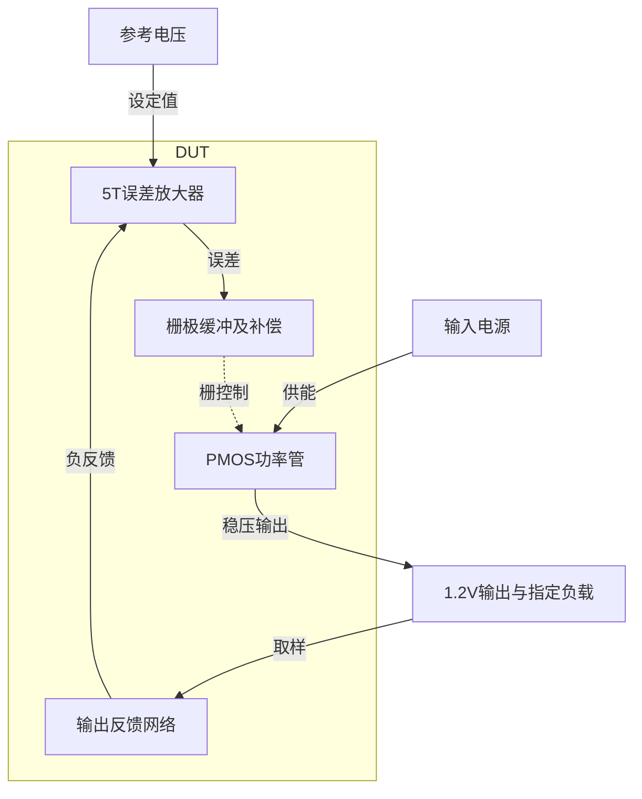

# 07 · PMOS LDO：误差放大器余量、栅极缓冲与补偿

本模块通过误差放大器控制PMOS功率管，将变化的输入电源稳压为1.2 V输出。相比直接驱动功率管栅极的基础5T OTA结构，栅极缓冲和频率补偿可改善大栅电容下的稳定性，但会增加静态电流、面积与启动设计约束。芯片中常用于给模拟前端、基准和其他低噪声电路提供局部稳压电源。

状态：**SMIC18MMRF / TT / 1.8 V / 27°C，全部对应 nominal 指标在15%放宽条件内通过；原门槛差异见正文**。只宣称原理图级 nominal；未执行其他PVT、失配或版图验证。审查PDF已逐页检查中文、图表和网表可读性。

[审查 PDF](../evidence/07-ldo-ota5/review.pdf) · [精确电路](../evidence/07-ldo-ota5/circuit.scs) · [验收合同](../evidence/07-ldo-ota5/contract.json) · [实测结果](../evidence/07-ldo-ota5/latest_results.json)

当前报告：**7页正文＋2页完整电路图，共9页**。下文历史交付记录中的页数对应当时的正文版本。

<!-- REPORT-MARKDOWN -->
## 可编辑报告与系统结构

[完整报告MD](../evidence/07-ldo-ota5/review_report.md) · [对应PDF](../evidence/07-ldo-ota5/review.pdf) · [Mermaid源文件](../evidence/07-ldo-ota5/system_block_diagram.mmd) · [框图SVG](../evidence/07-ldo-ota5/markdown_assets/system-block.svg)

反馈、补偿和功率管构成同一稳压环路；参考与负载按本题合同保留。

实线为信号或能量通路，虚线为时钟、控制或偏置。

<!-- END-REPORT-MARKDOWN -->

## 结构与gm/ID初值

DUT包含12只MOS、工艺片阻和MIM。五管误差放大器为PMOS输入对、NMOS镜负载与PMOS尾源；PMOS翻转电压跟随器FVF隔离功率管栅电容，pbuf调节MBUF的上拉电流。误差级输出ampout通过30 kΩ与200 pF串联到VSS。gate_drive/gate不在内部短接，测试台可在两端间插入注入源或iprobe。

- 输入对：p18总W238.56/L1 um，拆成W79.52 um、m3；每支目标50 uA、gm/ID18。
- NMOS镜：n18 W86.32/L4 um，每支50 uA、gm/ID14；复用第12项的补充LUT，VDS0.9 V。
- N偏置：n18 W23.42/L1 um，目标50 uA、gm/ID14；MREF/MNPT/MNBUF分别m1/.2/.6。
- P偏置：p18 W32.26/L1 um，单位10 uA、gm/ID16；参考m1、尾源m10。
- FVF：MSF p18 W12.36/L.18 um、30 uA、gm/ID16；MBUF p18 W.74/L.18 um、30 uA、gm/ID4。
- 功率管：p18 W49.88/L.18 um、m60，单位初选1 mA、gm/ID6，实际每单位电流随负载变化。

所有单位W在原模型范围内。m是原理图并联缩放，.2/.6并非已完成整数匹配阵列。输入PMOS共享单独井并接tail，MSF单独井接gate_drive，其余PMOS井接VIN。这些体连接须由未来版图正确实现，本次没有版图或井寄生验证。

原厂rpposab_3t为W1/L91.1083 um，按片阻311.3 Ω/方与两侧蚀刻修正得到约30 kΩ；MIM为30×30 um单位、m228.859，约200 pF和0.206 mm²有效面积。全电路没有内部理想源、行为源或数字逻辑。采用工艺无源器件，没有把板级外部1 uF偷偷移入DUT。

## 三项可复用的工程认识

**电压注入比不总能代替真实环路返回比。** 初版无缓冲、功率管m12的同一候选，原函数最小PM71.0103°，独立STB却只有27.410°。源AC/DC门槛通过仍不能据此交付。该电压比忽略了功率管反向电容和两侧节点加载对注入测量的影响；在某些更大功率管候选中还出现高频回穿或没有下降交越。最终同时保留原−V(gate_drive)/V(gate)提取和真实STB。历史证据分别在runs/07/20260922T100606658693Z_matrix与20260922T100607261808Z_stb_matrix。

**栅极缓冲需要重新分配直流余量。** 给NMOS输入OTA接PMOS源跟随器会要求ampout比功率管栅再低一个VSG。低VIN重载时MINN进入三极区，直流误差与PSRR恶化；增加输入管长度不能修复失去的漏源余量。最终换用PMOS输入的五管核心，使低输出电位由NMOS镜承担。在保存的1.62V/1mA、1.62V/30mA、1.8V/10mA三个OP中，12只MOS余量均为正，最小68.65 mV。该结论只覆盖这三个保存的OP，不能扩写成全PVT器件饱和保证。

**小信号补偿与大信号启动必须分别检查。** 片内串联RC在DC开路，保留静态增益；高频把OTA输出阻抗限制到约30 kΩ，降低交越并在更高频恢复相位。1/(2πRC)约26.5 kHz只是零点量级，真实响应还包含OTA输出电阻和寄生。较小功率管m30虽通过AC/DC，但1 uF启动充电不足：持续90%约33.185 us，部分补偿设置的斜坡后±2%建立达到16.205 us。功率管改为m60后，启动和压差改善，但栅电容与电源跳变增大，因此必须联动检查而不能只调大尺寸。

最终电容面积较大，是保留简单五管误差级、输出负载和电流约束下的明确代价。它不是已经完成面积优化的量产LDO，也未增加或声称验证短路限流、过温保护、空载稳定。

## 真实环路与局部环路

17个主STB扫描1 Hz–100 MHz，各只有一次下降0 dB交越，随后保存频点没有回穿。FVF另在pbuf至MBUF栅间插入零压iprobe，主输出反馈保持闭合；17个输出网络点从1 Hz扫到1 GHz，全部一次交越、无回穿，最小PM59.047429°，通过额外45°工程线。局部环路通过不能替代主环路60°原门槛。

## 测量定义与边界

直接调用冻结原verify.py的analyze函数提取环路、PSRR、压差、噪声及全部瞬态。主/局部STB是额外目标工艺诊断，不伪造源验证器完整PVT摘要。

- DC电流为abs(I(VIN))−ILOAD，含50 uA参考、镜偏置、FVF和外部分压。没有扣掉内部辅助电流。
- 压差在30 mA、VIN1.15–1.8 V、2 mV步长共326点。首次达到且其后始终≥1.188 V时插值，VIN约1.355593 V，减1.188 V得到167.593 mV；不是减名义1.2 V。
- 低VIN失调区，理想30 mA恒流负载仍强制抽取电流，保存的VOUT最低约−2.4 V；没有欠压卸载或输出钳位模型。该失调区不作可用输出/器件应力保证。压差阈值处为VIN约1.3556 V、VOUT1.188 V，结果不把负值失调区纳入稳压工作范围。
- 输出噪声固定10 Hz–1 MHz，501点，对输出谱密度平方在频率上做梯形积分再开方。外部分压电阻模型噪声按原连接保留。
- 启动VIN0 V至1 us，1–21 us线性升至1.8 V，负载120 Ω，观察到70 us。VREF0.8 V和IBIAS50 uA按原bench始终存在，不能据此宣称已验证片上参考源冷启动。
- 负载1→25→1 mA，电源1.98→1.62→1.98 V；两次边沿分别始于20/40.2 us，边长200 ns。原判定窗为20–40.2 us和40.2–65 us，误差相对固定1.2 V。建立取窗口内最后一个超出±15 mV的保存样点时间减边沿起点；负载建立0表示从未越出该带，不是无动态延迟。
- 瞬态最大步2 ns、保存5 ns，共14001点；启动持续判据考虑所有后续样点。放宽只作用于性能限额，启动±2%、负载/电源±15 mV资格窗不变。

所有最终运行无Spectre警告，无模型尺寸越界。未执行另外126个DC PVT点、非nominal压差/AC/PSRR/动态行、SS125输出网络瞬态、30次失配或PEX；原题最小负载1 mA，不含0 mA。最终结果只支持此次TT27给定合同。

## 证据与复现

最终运行依次为：

1. runs/07/20260922T102553666969Z_matrix
2. runs/07/20260922T102554556954Z_stb_matrix
3. runs/07/20260922T102555553119Z_dropout_noise
4. runs/07/20260922T102555785585Z_transient
5. runs/07/20260922T102730830668Z_local_fvf

原instruction/reference/verifier/benches在source冻结；每次运行含inputs快照、PDK和依赖哈希、日志及PSF。geometry.json给全部D/G/S/B和乘数，sizing.json给LUT查询，verification_audit.json给完整计数、单交越和哈希检查。

复现使用既有Bridge Python执行 `scripts/case07_ldo.py --tail-uA 100 --input-gmid 18 --mirror-L 4 --mirror-gmid 14 --pinput --fvf --pass-m 60 --lag-C-pF 200 --lag-R 30000 --full`，再调用同模块 `local_fvf()`。PDF使用 `scripts/review_pdf.py 7`。

[完整 LUT 查询](../evidence/07-ldo-ota5/sizing.json)

## 复现与证据

[完整电路总图 SVG](../evidence/07-ldo-ota5/schematic/full.svg) · [总图 PDF](../evidence/07-ldo-ota5/schematic/full.pdf) · [2页电路分图](../evidence/07-ldo-ota5/schematic/sheets.pdf) · [引脚与层次连接映射](../evidence/07-ldo-ota5/schematic/connectivity.json) · [图纸审计](../evidence/07-ldo-ota5/schematic_audit.json)

- [Spectre 运行记录](https://github.com/SannBunnSyoSeTsu/smic18-benchmark-reproduction/blob/6ae3e1434914297c4ed12b93cb8d6a297ef8339a/runs/07/20260922T102553666969Z_matrix/run.json) · 原始输出（本地归档，未随仓库分发）
- [Spectre 运行记录](https://github.com/SannBunnSyoSeTsu/smic18-benchmark-reproduction/blob/6ae3e1434914297c4ed12b93cb8d6a297ef8339a/runs/07/20260922T102554556954Z_stb_matrix/run.json) · 原始输出（本地归档，未随仓库分发）
- [Spectre 运行记录](https://github.com/SannBunnSyoSeTsu/smic18-benchmark-reproduction/blob/6ae3e1434914297c4ed12b93cb8d6a297ef8339a/runs/07/20260922T102555553119Z_dropout_noise/run.json) · 原始输出（本地归档，未随仓库分发）
- [Spectre 运行记录](https://github.com/SannBunnSyoSeTsu/smic18-benchmark-reproduction/blob/6ae3e1434914297c4ed12b93cb8d6a297ef8339a/runs/07/20260922T102555785585Z_transient/run.json) · 原始输出（本地归档，未随仓库分发）
- [工程脚本](https://github.com/SannBunnSyoSeTsu/smic18-benchmark-reproduction/tree/6ae3e1434914297c4ed12b93cb8d6a297ef8339a/scripts) · [项目状态](https://github.com/SannBunnSyoSeTsu/smic18-benchmark-reproduction/blob/6ae3e1434914297c4ed12b93cb8d6a297ef8339a/status.json)

原Sky130案例保持原样；本页是目标工艺实测的新记录。模型文件留在既有本地PDK目录，没有上传或修改。
