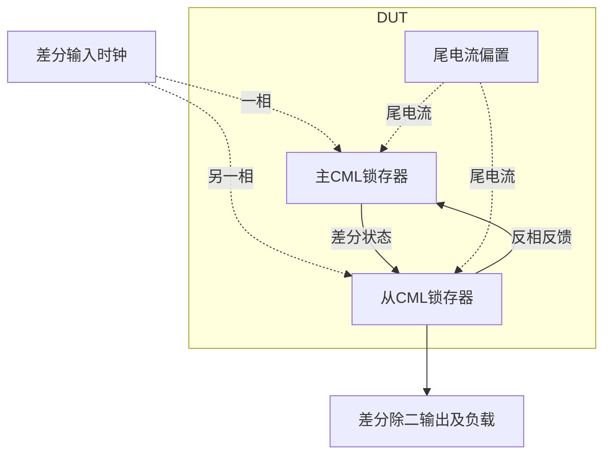

# 09 · CML二分频：尾电流分配、锁存动态与逐周期验收

本模块把差分时钟频率除以二，用于高速时钟链和PLL反馈分频。主从CML锁存器以近似恒定尾电流在透明与保持支路之间切换，小电压摆幅减轻节点充放电负担；代价是持续静态功耗、差分输入需求及有限输出摆幅。它适合接收高速差分时钟，不能直接替代具有全摆幅输出和异步复位的普通数字触发器。

状态：**SMIC18MMRF / TT / 1.8 V / 27°C，全部对应 nominal 原始指标通过**。只宣称原理图级 nominal；未执行其他PVT、失配或版图验证。审查PDF已逐页检查中文、图表和网表可读性。

[审查 PDF](../evidence/09-cml-divider/review.pdf) · [精确电路](../evidence/09-cml-divider/circuit.scs) · [验收合同](../evidence/09-cml-divider/contract.json) · [实测结果](../evidence/09-cml-divider/latest_results.json)

当前报告：**8页正文＋2页完整电路图，共10页**。下文历史交付记录中的页数对应当时的正文版本。

<!-- REPORT-MARKDOWN -->
## 可编辑报告与系统结构

[完整报告MD](../evidence/09-cml-divider/review_report.md) · [对应PDF](../evidence/09-cml-divider/review.pdf) · [Mermaid源文件](../evidence/09-cml-divider/system_block_diagram.mmd) · [框图SVG](../evidence/09-cml-divider/markdown_assets/system-block.svg)

主从锁存闭环实现除二；本例没有完整PLL或额外复位控制器。

实线为信号或能量通路，虚线为时钟、控制或偏置。

<!-- END-REPORT-MARKDOWN -->

## 合同和最终结果

在SMIC18MMRF TT、1.8V、27°C，保持原1/2/5/10GHz四个频点。输入为300mVpp差分时钟、0.9V共模、每端50Ω源阻抗、10ps边沿；每端输出10fF。丢弃前5ns后观察40个输入周期。每周期0.4T处差分采样必须超过±10mV并连续交替，且每周期摆幅和fIN/2时间加权分量均≥200mVpp。停钟至两输入0.9V时VDD功耗须严格小于1.5mW，包含从VDD提供的150µA参考。

|输入GHz|最小周期摆幅mVpp|fIN/2分量mVpp|连续交替周期|过零实测输出GHz|
|---:|---:|---:|---:|---:|
|1|712.887|776.786|40|0.5|
|2|676.257|738.823|40|1|
|5|536.488|655.096|40|2.5|
|10|210.371|430.828|40|5|

静态功耗**1.455351mW**，全部13项原门槛通过。10GHz最小摆幅余量约5.19%，功耗余量约2.98%。10%/15%放宽仅适用于幅值和功耗，固定频点、40周期功能、原负载和输入条件不变。

## gm/ID尺寸与动态电流分配

主从静态CML锁存器各用一条共享尾电流，互补时钟在数据差分对和交叉耦合再生对之间分配电流。主级接收交换极性的outn/outp反馈，从级接收mp/mn。所有15只MOS均为目标工艺n18，体端接vss；DUT另有4个原合同允许的有限正值理想电阻，没有内部独立源、受控源或行为模型。

参考/尾源单元37.86/0.36µm，目标150µA、gm/ID=16；MBIAS倍数1，两尾倍数2.3。四只时钟管13.52/0.18µm，gm/ID=14；八只数据/再生管4.06/0.18µm，gm/ID=8。所有选点来自既有TT、VDS0.45V、VSB0V LUT，路径与哈希保存在[sizing.json](../evidence/09-cml-divider/sizing.json)。单位器件fT分别3.720/14.604/25.869GHz只作初算，不替代真实电路功能验证。

RMP/RSN=1200Ω，RMN/RSP=1206Ω；0.5%不对称及outp1.0V/outn0.8V的释放式nodeset仅帮助选择DC相位。瞬态未强制节点，也没有预制输出轨迹。m=2.3是原理图倍数，不宣称完成版图。

实际静态尾电流各329.264µA，iref节点0.515069V。停钟时数据与再生支路同时分流，单只上层管约82µA、gm/ID约11.2；这与初算150µA时gm/ID=8的尺寸依据不同。上层公共源约0.8433V，体效应显著。不能用零体偏置LUT栅压或停钟OP代替动态锁存状态。

## 保留失败迭代，而非只记最终尺寸

首版尾倍数2、1200Ω负载、再生gm/ID=8时，1/2/5GHz通过。10GHz虽然40周期正确交替、目标分量300.652mVpp，但最小逐周期摆幅只有145.417mVpp，连15%边界170mV也失败；静态功耗1.303206mW。

尾倍数升至2.3，同时改900Ω和再生gm/ID=10，波形塌陷、仅1周期交替、目标分量3.423mVpp。改1400Ω但维持再生gm/ID=10，整体摆幅557.3mVpp看似充足，却只31周期交替，目标分量4.524mVpp，未正确分频。因为同时调整多项参数，不能据此断言某个单参数的独立因果。

最终恢复1200Ω、再生gm/ID=8，仅相对首版把尾倍数2提高到2.3，10GHz最小周期摆幅达到210.371mVpp，功耗仍低于上限。四版原始运行和逐项数据见[迭代记录](../evidence/09-cml-divider/iteration_history.json)。核心认识是：RC、静态跨导或整体摆幅均不足以证明高速锁存；采样传递、再生保持、相位关系和目标分量必须一起验收。

## 测量定义和真实错误必须分清

10GHz输出全窗峰峰值416.916mV，而最小单输入周期为210.371mV；验收采用后者。fIN/2时间加权分量430.828mVpp是扣除DC投影后的基波等效幅值，非正弦波的该值可以大于实际全波形峰峰值。输出频率另从20次正向过零测得，不把预设投影频率当作测量结果。

独立复核把实际Spectre时间、outp、outn数据传入未修改的原`divider_metrics`和`speed_check`，四频点16项数值及独立功耗共17项一致。见[测量复核](../evidence/09-cml-divider/measurement-review.md)、[完整审计](../evidence/09-cml-divider/verification_audit.json)。输入PWL逐点与原PULSE解析时序核对；每频点均保留5ns启动丢弃和完整40周期窗口。

早期5GHz测试台因浮点尾点产生重复时间，实际Spectre报CMI-2204，不能作为有效数据。测试台已改为整数飞秒节点，最终五组运行全部重用最终电路并成功结束。该真实错误与Bridge字符串误报`license error`分别保留：最终日志许可检查成功且0错误/0警告，输入快照和原始PSF完整；没有删改Bridge诊断来制造通过。

## 报告、复现和适用边界

[审查PDF](https://github.com/SannBunnSyoSeTsu/smic18-benchmark-reproduction/blob/6ae3e1434914297c4ed12b93cb8d6a297ef8339a/reports/09-cml-divider-review.pdf)包含8页正文、2页完整晶体管电路图。图纸19个实例、68个端子均与精确网表独立核对；[完整总图](../evidence/09-cml-divider/schematic/full.pdf)、[连接清单](../evidence/09-cml-divider/schematic/connectivity.json)、[图纸独立审计](../evidence/09-cml-divider/schematic_independent_review.json)一并保留。

工程根目录使用既有`virtuoso-bridge-lite/.venv`运行`python scripts/case09_cml.py`，再依次运行`schematic09.py`、`audit09.py`、`review09.py`。原始题目与verifier见[source](../evidence/09-cml-divider/source)，五组最终路径见[latest_runs.json](../evidence/09-cml-divider/latest_runs.json)，最终环境见[environment.json](../evidence/09-cml-divider/environment.json)。报告重新生成须重新目检，不能自动继承当前交付结论。

范围仅TT/1.8V/27°C的四频点功能及静态功耗。未执行ff/ss/fs/sf、供电温度扫描、随机失配、相位噪声、版图或PEX；静态功耗也不包括外部时钟驱动器能量。原Sky130资料和目标PDK、Bridge、Spectre、原LUT环境保持原样。

[完整 LUT 查询](../evidence/09-cml-divider/sizing.json)

## 复现与证据

[完整电路总图 SVG](../evidence/09-cml-divider/schematic/full.svg) · [总图 PDF](../evidence/09-cml-divider/schematic/full.pdf) · [2页电路分图](../evidence/09-cml-divider/schematic/sheets.pdf) · [引脚与层次连接映射](../evidence/09-cml-divider/schematic/connectivity.json) · [图纸审计](../evidence/09-cml-divider/schematic_audit.json)

- [Spectre 运行记录](https://github.com/SannBunnSyoSeTsu/smic18-benchmark-reproduction/blob/6ae3e1434914297c4ed12b93cb8d6a297ef8339a/runs/09/20260926T033542023288Z_10g/run.json) · 原始输出（本地归档，未随仓库分发）
- [Spectre 运行记录](https://github.com/SannBunnSyoSeTsu/smic18-benchmark-reproduction/blob/6ae3e1434914297c4ed12b93cb8d6a297ef8339a/runs/09/20260926T033543923307Z_power/run.json) · 原始输出（本地归档，未随仓库分发）
- [Spectre 运行记录](https://github.com/SannBunnSyoSeTsu/smic18-benchmark-reproduction/blob/6ae3e1434914297c4ed12b93cb8d6a297ef8339a/runs/09/20260926T033652802398Z_1g/run.json) · 原始输出（本地归档，未随仓库分发）
- [Spectre 运行记录](https://github.com/SannBunnSyoSeTsu/smic18-benchmark-reproduction/blob/6ae3e1434914297c4ed12b93cb8d6a297ef8339a/runs/09/20260926T033655636370Z_2g/run.json) · 原始输出（本地归档，未随仓库分发）
- [Spectre 运行记录](https://github.com/SannBunnSyoSeTsu/smic18-benchmark-reproduction/blob/6ae3e1434914297c4ed12b93cb8d6a297ef8339a/runs/09/20260926T033657262874Z_5g/run.json) · 原始输出（本地归档，未随仓库分发）
- [工程脚本](https://github.com/SannBunnSyoSeTsu/smic18-benchmark-reproduction/tree/6ae3e1434914297c4ed12b93cb8d6a297ef8339a/scripts) · [项目状态](https://github.com/SannBunnSyoSeTsu/smic18-benchmark-reproduction/blob/6ae3e1434914297c4ed12b93cb8d6a297ef8339a/status.json)

原Sky130案例保持原样；本页是目标工艺实测的新记录。模型文件留在既有本地PDK目录，没有上传或修改。
