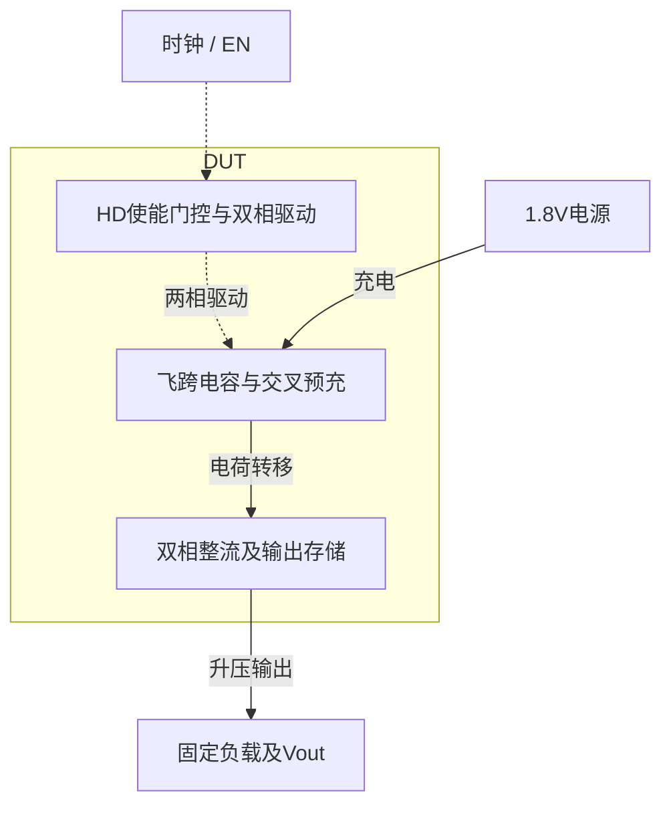

# 15 · 未稳压倍压泵：预充与整流选型、回流损耗及独立关断测量

本模块利用两相时钟搬运飞跨电容的电荷，从1.8V电源产生更高的直流输出，并通过使能门控停止泵送。交叉耦合预充与双相整流可减少单相泵的输出间歇，结构简单且无需电感；代价是整流压降、电容面积，以及输出随工艺和负载变化。它适合小电流偏置和辅助栅驱动供电，未稳压结构本身不能提供精密恒定输出。

状态：**SMIC18MMRF / TT / 1.8 V / 40°C，全部对应 nominal 指标在10%放宽条件内通过；原门槛差异见正文**。只宣称原理图级 nominal；未执行其他PVT、失配或版图验证。审查PDF已逐页检查中文、图表和网表可读性。

[审查 PDF](../evidence/15-unregulated-pump/review.pdf) · [精确电路](../evidence/15-unregulated-pump/circuit.scs) · [验收合同](../evidence/15-unregulated-pump/contract.json) · [实测结果](../evidence/15-unregulated-pump/latest_results.json)

当前报告：**8页正文＋1页完整电路图，共9页**。下文历史交付记录中的页数对应当时的正文版本。

<!-- REPORT-MARKDOWN -->
## 可编辑报告与系统结构

[完整报告MD](../evidence/15-unregulated-pump/review_report.md) · [对应PDF](../evidence/15-unregulated-pump/review.pdf) · [Mermaid源文件](../evidence/15-unregulated-pump/system_block_diagram.mmd) · [框图SVG](../evidence/15-unregulated-pump/markdown_assets/system-block.svg)

电路没有稳压反馈；独立关闭电流沿用使能端口测试。

实线为信号或能量通路，虚线为时钟、控制或偏置。

<!-- END-REPORT-MARKDOWN -->

## 原始合同与最终结果

只复现原八个代表点中的**TT/1.8V/40°C**。保留10MHz时钟、1ps边沿、时钟和EN各50Ω源阻抗。开启台一直带50µA负载及1nF外部电容，运行200µs，190–200µs测量；独立关闭台只有1nF，EN从零时刻为0，时钟仍运行，9–10µs测量供电电流。两个状态不共享供电感测支路。

|指标|最终实测|原门槛|10%边界|15%边界|
|---|---:|---:|---:|---:|
|输出平均|2.301660961V|2.2–2.8V|2.17–2.83V|2.155–2.845V|
|输出纹波|4.727337mVpp|≤5mVpp|≤5.5mVpp|≤5.75mVpp|
|开启平均供电电流|206.141847µA|≤200µA|≤220µA|≤230µA|
|关闭平均供电电流|0.770041nA|≤100nA|≤110nA|≤115nA|

交付等级为**complete_10pct**。只有开启电流超出原门槛，超出约3.07%；其余三项原门槛通过。电压放宽以2.5V中心扩大误差，未平移目标电压。平均供电电流先按时间积分，再取绝对值；不是瞬时电流绝对值的平均。

最终窗口VOUT最小/最大2.298769820/2.303497157V，最后一个周期均值2.301660966V。没有用末端均值扣除趋势来缩小纹波。

## 最终结构与尺寸依据

NAND2HDV1门控输入时钟，两个INHDV16串联形成底板ph0/ph1。两块目标工艺MIM交替抬升p0/p1；交叉耦合的预充管连接AVDD与泵节点，低阈值整流管将高相电荷送到VOUT。所有四只模拟MOS为厚氧低阈值`nnt33`，体端接AVSS。

- MPRE0/MPRE1：W3.36/L1µm，gm/ID=6，初算50µA。
- MRECT0/MRECT1：W16.84/L1µm，gm/ID=6，初算250µA。
- CF0/CF1：工艺`mim`，各100×51.49330587µm，名义各5pF；总板面积约10298.7µm²。
- 三个HD实例内部共8只原厂MOS，CDL尺寸、模型、并联数和井端均保持原样。

新LUT只写入本工程`lut_supplement`，模型和既有LUT环境未修改。选点为TT/27°C、VDS1.8V、VSB0V；最终原合同在40°C执行。`nnt33`的正VGS表中gm/ID范围约2–6.963，曾请求8被明确拒绝，最终使用表内6，没有钳位或外推。预测VGS36.378mV体现零体偏置下的低阈值特性；实际泵节点有显著体效应、交变电流和源漏角色交换，不能把该LUT点视为整个开关周期的实际工作点。详见[sizing.json](../evidence/15-unregulated-pump/sizing.json)和[使用的LUT](../evidence/15-unregulated-pump/lut)。

DUT没有内部源、行为器件或理想R/C；1nF与50µA为原测试台外部负载。当前是未稳压电荷平衡结构，没有误差放大器或闭环调节输出。

## 失败迭代提供的证据

常规厚氧n33用gm/ID=8、W17.04/L0.36µm时输出2.062354V；加宽到gm/ID=14、70.92µm后仅2.088267V，均低于15%电压边界。加宽同时降低部分导通压降、增加被驱动的寄生，不能消除体效应阈值损失。

四只管全部换成16.84/1µm nnt33、每侧10pF后，输出达到2.614240V，却有290.002µA开启电流和5.320mV纹波；减至5pF后输出跌至2.062160V，仍不合格。

曾尝试n33预充加nnt33整流，以及返回AVDD的MOS钳位。部分版本出现泵节点超过固定3.63V工程筛查线；3pF钳位版在200µs尚未稳定，190–200µs总纹波达39.35mV。更关键的是，混合器件版本在早期瞬态触发CMI-2144/CMI-2139体结电流及模型线性化警告，**这些运行只用于诊断，未用于验收**，没有提高模型电流阈值或忽略警告来制造通过。

最终回到全nnt33，将预充宽度单独从16.84减至3.36µm，整流宽度保留16.84µm。相同10pF时开启电流降至233.642µA，但输出2.830883V；再改每侧5pF，输出、纹波与关闭电流达到原门槛，开启电流落在10%范围。该结果与减少预充路径回流及寄生负载的设计判断一致；本次没有单独积分每条支路的回流电荷，不能定量分离两者贡献。

[全部迭代原始运行与结果](../evidence/15-unregulated-pump/iteration_history.json)保留每版输入快照及失败诊断，最终电路未保留试验钳位。

## 数值、测量与器件边界

最终只出现边沿附近SPECTRE-16780局部截断误差容差警告，没有CMI体结模型警告或尺寸越界。因该具体数值问题，另以同一电路把最大步长1ns减至0.5ns、reltol从1e-5收紧到1e-6，完整重跑开启200µs和关闭10µs。最终采用收紧后的结果。

输出均值变化14.074µV、纹波变化1.482µV、开启电流变化0.14005µA、关闭电流变化0.01452nA，均在预先设置的收敛容差内，完成等级保持10%。[数值复核](../evidence/15-unregulated-pump/numerical_confirmation.json)给出两个运行集及全部差值。收紧设置仍保留LTE警告，不能把收敛对照写成日志零警告。

独立逐段梯形积分、边界插值和峰值搜索复核了五个原始量：VOUT平均/最大/最小、开启与关闭感测电流；随后调用未修改的上游`checks(rows,{TT40C})`。原开启电流判据如实返回失败，按本工程预定10%政策通过。源幅度、控制状态、最后窗口的实际10MHz边沿也独立检查。见[测量复核](../evidence/15-unregulated-pump/measurement-review.md)、[完整审计](../evidence/15-unregulated-pump/verification_audit.json)。

保存轨迹上的模拟MOS最大端压为3.208839V，低于固定3.63V工程筛查线。该线仅为1.1×标称端压的工程筛查，不是工厂寿命或结击穿保证。0–2µs及180–200µs保留全部自适应点，2–180µs仅保存每100点之一；求解器仍计算所有步。测量窗口和关闭轨迹没有抽点；中段稀疏数据不支持宣称所有开关尖峰的严格全程上界。

端压表按精确网表的端名计算。MRECT门极与所声明源端同接泵节点，因此该表的VGS恒为0；整流导通时有效源漏交换，应结合VGD判断有效栅过驱动，不能据VGS=0断言没有整流电流。关闭台还有正负供电电流尖峰，原指标的带符号积分与瞬时峰值是不同量。

## 完整报告和复现

[9页审查PDF](https://github.com/SannBunnSyoSeTsu/smic18-benchmark-reproduction/blob/6ae3e1434914297c4ed12b93cb8d6a297ef8339a/reports/15-unregulated-pump-review.pdf)包含8页正文及1页完整电路图；[总图](../evidence/15-unregulated-pump/schematic/full.pdf)绘出4只模拟MOS、2块MIM与3个HD实例，共9个顶层实例、39个端子。原厂HD内部CDL另完整归档；[连接清单](../evidence/15-unregulated-pump/schematic/connectivity.json)及[独立图纸检查](../evidence/15-unregulated-pump/schematic_independent_review.json)与精确网表逐项核对。

工程根目录使用既有`virtuoso-bridge-lite/.venv`，依次运行`python scripts/case15_pump.py`、`confirm15.py`、`schematic15.py`、`audit15.py`、`review15.py`。重新生成后必须重新目检PDF及总图。原题与verifier见[source](../evidence/15-unregulated-pump/source)，运行入口见[latest_runs.json](../evidence/15-unregulated-pump/latest_runs.json)，精确电路见[circuit.scs](../evidence/15-unregulated-pump/circuit.scs)。

未执行另外七个代表性PVT点、完整PVT、随机失配、效率、版图或PEX。关闭台是从零时刻EN=0，并非先充电再关闭，不能由0.770nA推断已充电输出会快速降为零。原Sky130知识和PDK、Bridge、Spectre、原LUT环境均保持原样。

[完整 LUT 查询](../evidence/15-unregulated-pump/sizing.json)

[HD 单元来源与哈希](../evidence/15-unregulated-pump/hd_cells_manifest.json)

## 复现与证据

[完整电路总图 SVG](../evidence/15-unregulated-pump/schematic/full.svg) · [总图 PDF](../evidence/15-unregulated-pump/schematic/full.pdf) · [1页电路分图](../evidence/15-unregulated-pump/schematic/sheets.pdf) · [引脚与层次连接映射](../evidence/15-unregulated-pump/schematic/connectivity.json) · [图纸审计](../evidence/15-unregulated-pump/schematic_audit.json)

- [Spectre 运行记录](https://github.com/SannBunnSyoSeTsu/smic18-benchmark-reproduction/blob/6ae3e1434914297c4ed12b93cb8d6a297ef8339a/runs/15/20260926T041705233014Z_enabled/run.json) · 原始输出（本地归档，未随仓库分发）
- [Spectre 运行记录](https://github.com/SannBunnSyoSeTsu/smic18-benchmark-reproduction/blob/6ae3e1434914297c4ed12b93cb8d6a297ef8339a/runs/15/20260926T041846193656Z_disabled/run.json) · 原始输出（本地归档，未随仓库分发）
- [工程脚本](https://github.com/SannBunnSyoSeTsu/smic18-benchmark-reproduction/tree/6ae3e1434914297c4ed12b93cb8d6a297ef8339a/scripts) · [项目状态](https://github.com/SannBunnSyoSeTsu/smic18-benchmark-reproduction/blob/6ae3e1434914297c4ed12b93cb8d6a297ef8339a/status.json)

原Sky130案例保持原样；本页是目标工艺实测的新记录。模型文件留在既有本地PDK目录，没有上传或修改。
