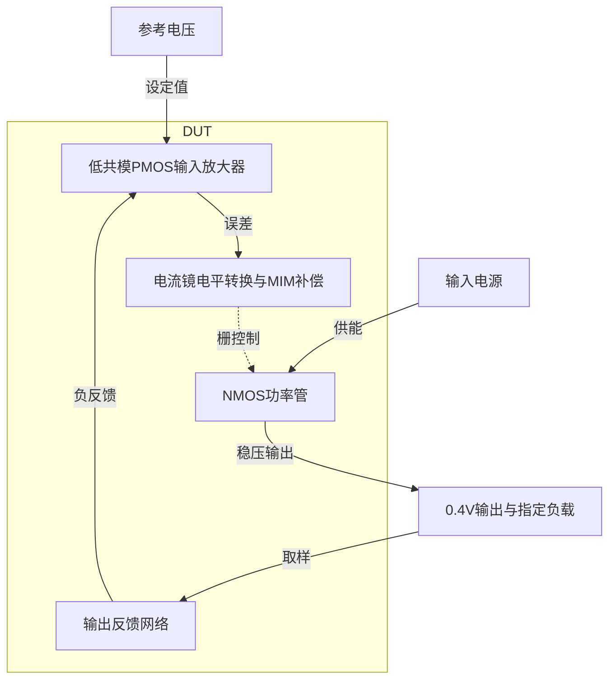

# 17 · 0.4V NMOS LDO：电流镜电平转换、原生MIM与双负载稳定性

本模块通过误差放大器控制NMOS功率管，将1.8V输入稳压至约0.4V。PMOS输入对适应低参考电压，电流镜把误差信号转移到较高的功率管栅压，栅极MIM补偿控制环路带宽；代价是额外镜像支路电流、补偿面积和较大的输入输出压差。芯片中可为低压模拟或数字子模块提供局部电源，本次只验证1mA与5mA负载的标称工作。

状态：**SMIC18MMRF / TT / 1.8 V / 27°C，全部对应 nominal 原始指标通过**。只宣称原理图级 nominal；未执行其他PVT、失配或版图验证。审查PDF已逐页检查中文、图表和网表可读性。

[审查 PDF](../evidence/17-nmos-ldo/review.pdf) · [精确电路](../evidence/17-nmos-ldo/circuit.scs) · [验收合同](../evidence/17-nmos-ldo/contract.json) · [实测结果](../evidence/17-nmos-ldo/latest_results.json)

当前报告：**6页正文＋2页完整电路图，共8页**。下文历史交付记录中的页数对应当时的正文版本。

<!-- REPORT-MARKDOWN -->
## 可编辑报告与系统结构

[完整报告MD](../evidence/17-nmos-ldo/review_report.md) · [对应PDF](../evidence/17-nmos-ldo/review.pdf) · [Mermaid源文件](../evidence/17-nmos-ldo/system_block_diagram.mmd) · [框图SVG](../evidence/17-nmos-ldo/markdown_assets/system-block.svg)

反馈、补偿和功率管构成同一稳压环路；参考与负载按本题合同保留。

实线为信号或能量通路，虚线为时钟、控制或偏置。

<!-- END-REPORT-MARKDOWN -->

## 完整标称结果

SMIC18MMRF TT、1.8V、27°C，VREF=0.4V，外部40uA从ibias流向VSS，外部CLOAD=10pF。保留1mA与5mA两种负载，各项原门槛均通过，额外的真实STB也通过，无需性能放宽。

|指标|1mA|5mA|原要求|
|---|---:|---:|---|
|输出/V|0.401540540|0.401113694|0.35–0.45|
|IQ/uA|246.391643|247.044272|0≤IQ<400|
|原注入UGB/MHz|1.906026|1.908764|有限下降交越|
|原注入PM/度|88.143173|88.761789|>45|
|原注入GM/dB|40.399371|47.335669|>6|
|真实STB UGB/MHz|1.900255|1.902911|附加诊断|
|真实STB PM/度|87.964535|88.582803|附加同门槛>45|
|真实STB GM/dB|38.597550|44.716499|附加同门槛>6|
|1kHz PSRR/dB|46.882079|46.833902|>40|
|有流MOS最小余量/mV|393.790880|393.877591|固定>30|

[原合同](../evidence/17-nmos-ldo/contract.json)和[最终结果](../evidence/17-nmos-ldo/latest_results.json)保存全部原/10%/15%边界。输出电压围绕0.4V扩大误差窗，不能改变参考中心；PM>45°、IQ非负、有流MOS余量>30mV均不放宽。其余52个PVT/负载组合及50个失配种子未执行，未宣称54点完整PVT或输出三倍标准差通过。

## 电路和gm/ID依据

共11个MOS和2个原生MIM，13实例48端子。PMOS参考管接外部40uA电流下拉，生成尾源偏置；PMOS输入对分别接vref与vout，其漏端接NMOS二极管。两路倍流镜把差分电流送至高电压loop_out节点，再驱动NMOS源跟随功率管。输入共模和功率管所需栅压因此不共用同一个输入管漏端。

既有目标工艺LUT的选点和哈希见[尺寸依据](../evidence/17-nmos-ldo/sizing.json)：

- PMOS偏置/输出镜：单位20.78/1um，10uA、gm/ID14；MPREF m4，MPTAIL m8，MPD/MPOUT各m8。
- PMOS输入：单位47.72/1um，10uA、gm/ID18；两只各m4。
- NMOS镜：单位4.38/1um，10uA、gm/ID14；两个二极管各m4，MNSINK/MNOUT各m8。
- NMOS功率管：单位4.30/0.18um，50uA、gm/ID14，m100，总宽430um。实际5mA时gm/ID14.1157；1mA时电流密度更低。

目标尾电流80uA、两镜像支路各80uA，IQ约240uA。实际尾源约80.57uA，镜支路约82–83uA，IQ约246–247uA；目标电流与实际工作点分开记录。NMOS体端接VSS，PMOS体端接VDD，体效应由实际OP反映。两负载全部11只MOS电流均超过1nA，最小余量约394mV。

CGATE与COUT使用原生mim，单位100×100um，倍率分别10.298661174与2.05973223481，名义100pF和20pF。实际工艺电容模型保留，不用用户理想电容替代。约100pF栅补偿把UGB限制在约1.9MHz，获得大相位裕量，同时增加电容面积并限制速度。外部10pF完全保留；该题没有规定启动/负载跃变门槛，本次不据AC结果推断这些动态性能。

## 环路测量的符号和双向耦合

DUT保留独立loop_out与pass_gate端口，测试台以DC0V/AC1V串联源和iprobe相连，没有在DUT内短接两者。原口径T=−V(loop_out)/V(pass_gate)，在1Hz–1GHz中寻找首个下降0dB交越和首个下降−180°交越，并线性插值得到PM与GM。

另外使用真实STB，PSF中的loopGain是带符号返回量，低频相位为+180°；按T=−loopGain归一后才能用180°+phase计算PM。最初读取该诊断时，缺少这一步会使相位裕量多180°，且找不到要求的−180°交越；提取检查拦截了该情况。修正的是相位约定，没有重调电路或伪造裕量。

原串联电压比和真实STB低频几乎一致，高频因反馈网络双向耦合出现差异，所以两者分别报告，并使用较差稳定性约束。两种负载和两种定义都只有一次下降0dB交越，此后不回穿；所有GM都是扫描内真实相位交越所得有限值。曲线和完整图见审查PDF及[总图](../evidence/17-nmos-ldo/schematic/full.pdf)。

PSRR单独把串联源AC置0、VDD AC置1，保留完整闭环，按−20log10|VOUT|测1kHz。IQ严格沿用−I(VDD)−ILOAD−40uA，原题要求扣除的外部偏置不混入IQ，也不把供电总电流误当IQ。

## 数值复核和独立审计

基线为每十倍频40点、reltol1e-6；最终为160点、reltol1e-7。全部原频点被包含，四个基线和四个最终运行的电路、模型与夹具一致，日志均0错误/0警告。[预设数值界限](../evidence/17-nmos-ldo/numerical_plan.json)、[基线](../evidence/17-nmos-ldo/numerical_baseline.json)及[最终对照](../evidence/17-nmos-ldo/numerical_confirmation.json)分开保存。

20项数值比较全部通过：最大UGB差550.471Hz，小于预设6000Hz；原PM差最大0.000479°，GM差0.032729dB，各小于0.05；输出、电流、PSRR及最小MOS余量为0差异。所有等级保持原指标通过。

[独立审计](../evidence/17-nmos-ldo/verification_audit.json)用复数乘共轭恒等式和另一套逆序数组插值重算环路，用功率谱形式重算PSRR，并从供电电流重新分解IQ，交叉核对20个标量。原verifier没有单独的标称函数，因此导入其原门槛常量，按原5组不等式检查两个明确标称负载，共10组通过；没有修改上游完整矩阵定义。[审查明细](../evidence/17-nmos-ldo/measurement-review.md)和[有流器件列表](../evidence/17-nmos-ldo/independent_measurement_details.json)保存结果。

8页报告包含6页正文与2页完整图纸，全部页面和总图已实际检查。独立解析器核对13实例48端子；体端、所有MIM参数和外部环路端口均保留。最终电路SHA-256为050cce2389d138c31156a14b1bf955093cbefb0018a2ec14f29689e12d65298d。

原资料、PDK、Bridge、Spectre及既有LUT环境未修改。未执行失配、PVT扩展、噪声、瞬态负载、布局或PEX；相关结论保持未验证状态。

[完整 LUT 查询](../evidence/17-nmos-ldo/sizing.json)

## 复现与证据

[完整电路总图 SVG](../evidence/17-nmos-ldo/schematic/full.svg) · [总图 PDF](../evidence/17-nmos-ldo/schematic/full.pdf) · [2页电路分图](../evidence/17-nmos-ldo/schematic/sheets.pdf) · [引脚与层次连接映射](../evidence/17-nmos-ldo/schematic/connectivity.json) · [图纸审计](../evidence/17-nmos-ldo/schematic_audit.json)

- [Spectre 运行记录](https://github.com/SannBunnSyoSeTsu/smic18-benchmark-reproduction/blob/6ae3e1434914297c4ed12b93cb8d6a297ef8339a/runs/17/20260928T172845560178Z_loop1/run.json) · 原始输出（本地归档，未随仓库分发）
- [Spectre 运行记录](https://github.com/SannBunnSyoSeTsu/smic18-benchmark-reproduction/blob/6ae3e1434914297c4ed12b93cb8d6a297ef8339a/runs/17/20260928T172846225879Z_psrr1/run.json) · 原始输出（本地归档，未随仓库分发）
- [Spectre 运行记录](https://github.com/SannBunnSyoSeTsu/smic18-benchmark-reproduction/blob/6ae3e1434914297c4ed12b93cb8d6a297ef8339a/runs/17/20260928T172846881873Z_loop5/run.json) · 原始输出（本地归档，未随仓库分发）
- [Spectre 运行记录](https://github.com/SannBunnSyoSeTsu/smic18-benchmark-reproduction/blob/6ae3e1434914297c4ed12b93cb8d6a297ef8339a/runs/17/20260928T172847548848Z_psrr5/run.json) · 原始输出（本地归档，未随仓库分发）
- [工程脚本](https://github.com/SannBunnSyoSeTsu/smic18-benchmark-reproduction/tree/6ae3e1434914297c4ed12b93cb8d6a297ef8339a/scripts) · [项目状态](https://github.com/SannBunnSyoSeTsu/smic18-benchmark-reproduction/blob/6ae3e1434914297c4ed12b93cb8d6a297ef8339a/status.json)

原Sky130案例保持原样；本页是目标工艺实测的新记录。模型文件留在既有本地PDK目录，没有上传或修改。
