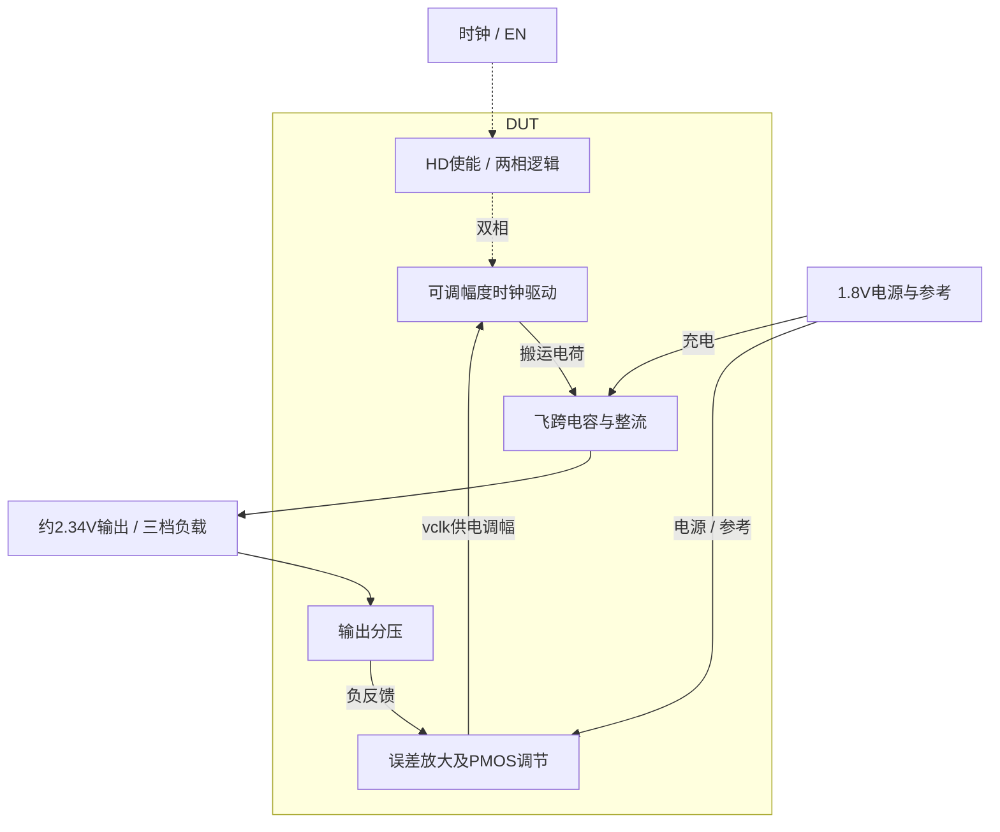

# 18 · 稳压电荷泵：开关功率级、反馈调节与完整功耗

本模块用双相飞跨电容产生高于1.8V的辅助电源，再以电阻分压、误差放大器和PMOS调节时钟驱动幅度，使输出靠近2.34V。相比未稳压电荷泵，它能减小负载引起的输出变化，但增加静态电流、反馈补偿及稳定性设计。芯片中可用于小电流偏置和辅助栅驱动，本次保留三档负载和独立关闭电流测量。

状态：**SMIC18MMRF / TT / 1.8 V / 40°C，全部对应 nominal 指标在10%放宽条件内通过；原门槛差异见正文**。只宣称原理图级 nominal；未执行其他PVT、失配或版图验证。审查PDF已逐页检查中文、图表和网表可读性。

[审查 PDF](../evidence/18-regulated-pump/review.pdf) · [精确电路](../evidence/18-regulated-pump/circuit.scs) · [验收合同](../evidence/18-regulated-pump/contract.json) · [实测结果](../evidence/18-regulated-pump/latest_results.json)

当前报告：**7页正文＋6页完整电路图，共13页**。下文历史交付记录中的页数对应当时的正文版本。

<!-- REPORT-MARKDOWN -->
## 可编辑报告与系统结构

[完整报告MD](../evidence/18-regulated-pump/review_report.md) · [对应PDF](../evidence/18-regulated-pump/review.pdf) · [Mermaid源文件](../evidence/18-regulated-pump/system_block_diagram.mmd) · [框图SVG](../evidence/18-regulated-pump/markdown_assets/system-block.svg)

反馈改变时钟驱动幅度，未把该电路画成PWM或变频控制器。

实线为信号或能量通路，虚线为时钟、控制或偏置。

<!-- END-REPORT-MARKDOWN -->

## 验收结果

SMIC18MMRF TT、1.8V、40°C，10MHz时钟和50Ω源阻抗，外部输出1nF。三种负载各运行200µs，190–200µs评分。**10%放宽档通过，唯一需要放宽的是50µA负载的AVDD电流**。[完整结果](../evidence/18-regulated-pump/latest_results.json)保留原/10%/15%全部边界。

|负载/µA|平均输出/V|误差/mV|纹波/mV|AVDD电流/µA|
|---:|---:|---:|---:|---:|
|1|2.338852287|1.147713|0.739390|117.369707|
|25|2.338631014|1.368986|1.073062|166.165706|
|50|2.339086421|0.913579|1.774309|217.336564|

原目标为2.34V±117mV、纹波≤5mV、开启电流≤200µA；10%边界为±128.7mV、5.5mV、220µA。关闭独立DC电流1.095479732nA≤原100nA。50µA负载电流距10%上限2.663436µA，其余所有指标达到原门槛。

## 电路与尺寸

参考分压AVDD/2、反馈分压VOUT/2.6，五管OTA比较后控制MCTRL，令底板驱动供电vclk在不同负载下变化。使能关闭时分压回路断开，偏置及控制节点被钳位。升压预充与整流采用真实nnt33，未用1.8V器件别名代替。

[gm/ID依据](../evidence/18-regulated-pump/sizing.json)：偏置n18 0.44/1µm、gm/ID14、1µA；输入0.70/0.36µm、22、0.5µA；PMOS负载1.04/1µm、14、0.5µA；MCTRL p18 23.46/0.36µm、12、50µA单位、m4。使能n/p分别0.38/0.18、1.14/0.18µm。nnt33预充3.36/1µm、整流16.84/1µm，初算gm/ID6，单位50/250µA。开关全周期不以固定饱和gm/ID描述。

两飞跨MIM各7.5pF，参考/反馈各1pF，控制补偿80pF。补偿电容串联3段W1/L240µm原生多晶电阻，约230kΩ；两组分压共24段多晶电阻。原厂HD采用INHDV1、INHDV16、NAND2HDV1，保留内部MOS尺寸和原CDL哈希，驱动井端接AVDD。合计16模拟MOS、5MIM、27电阻、6HD，54实例192端子。

## 补偿经验与测量口径

首版CC直接接AVDD发生约20–40kHz振荡，三负载纹波约18.279/20.132/17.925mV，50µA电流220.807µA。加入串联RZ后稳定至表中结果。[迭代记录](../evidence/18-regulated-pump/iteration_history.json)保留失败候选与实际运行，未抹去原200µA门槛失败。

[合同](../evidence/18-regulated-pump/contract.json)沿用原AVDD电流感测定义：外部1µA偏置接在感测上游，因此不包含在报告AVDD电流内。关闭试验为EN=CLK=0、无负载独立DC，并非已充电输出的关断瞬态。2–180µs通过skipcount100减少保存点，求解仍完整执行maxstep；190–200µs评分区间保存全部求解点。

## 验证证据

[数值计划](../evidence/18-regulated-pump/numerical_plan.json)先固定界限，再以maxstep1→0.5ns、reltol1e-5→1e-6复算；[25项数值确认](../evidence/18-regulated-pump/numerical_confirmation.json)全部通过，最大开启电流差0.084215µA<0.25µA。8次基线/精算均实际0错误，但6个开启运行各有5条SPECTRE-16780 LTE警告；精度复算证明报告指标稳定，没有消除警告，也未忽略其他警告。

[独立审计](../evidence/18-regulated-pump/verification_audit.json)重算25个性能标量及48个负载×器件的六类端电压极值；原4组检查返回3通过、1开启电流未通过，另行确认10%档。固定n18/p18 1.98V、nnt33 3.63V筛查通过，仅适用于保存点，不是连续时间峰值保证或寿命认证。模型、LUT、原任务、HD与输入快照哈希全部核对。参见[测量复核](../evidence/18-regulated-pump/measurement-review.md)和[独立明细](../evidence/18-regulated-pump/independent_measurement_details.json)。

13页报告包含7页正文和6页完整图纸，已实际逐页查看；[完整总图](../evidence/18-regulated-pump/schematic/full.pdf)也已实际检查。网表SHA-256：6fc878c0bf1ec3399b2991d1291687c0777fa5b3c642e9e8266ef6f957560e0c。

工程根目录用既有Bridge Python依次运行scripts/case18_regulated_pump.py、confirm18.py、schematic18.py、audit18.py、review18.py；重生成后须再次实际查看。未执行其余5开启/4关闭PVT点、负载突变、带电关断、失配、噪声、版图、PEX和寿命可靠性。PDK、Bridge、Spectre与原LUT环境保持不变。

[完整 LUT 查询](../evidence/18-regulated-pump/sizing.json)

[HD 单元来源与哈希](../evidence/18-regulated-pump/hd_cells_manifest.json)

## 复现与证据

[完整电路总图 SVG](../evidence/18-regulated-pump/schematic/full.svg) · [总图 PDF](../evidence/18-regulated-pump/schematic/full.pdf) · [6页电路分图](../evidence/18-regulated-pump/schematic/sheets.pdf) · [引脚与层次连接映射](../evidence/18-regulated-pump/schematic/connectivity.json) · [图纸审计](../evidence/18-regulated-pump/schematic_audit.json)

- [Spectre 运行记录](https://github.com/SannBunnSyoSeTsu/smic18-benchmark-reproduction/blob/6ae3e1434914297c4ed12b93cb8d6a297ef8339a/runs/18/20260928T180657145570Z_load1/run.json) · 原始输出（本地归档，未随仓库分发）
- [Spectre 运行记录](https://github.com/SannBunnSyoSeTsu/smic18-benchmark-reproduction/blob/6ae3e1434914297c4ed12b93cb8d6a297ef8339a/runs/18/20260928T181032550097Z_load25/run.json) · 原始输出（本地归档，未随仓库分发）
- [Spectre 运行记录](https://github.com/SannBunnSyoSeTsu/smic18-benchmark-reproduction/blob/6ae3e1434914297c4ed12b93cb8d6a297ef8339a/runs/18/20260928T181411096708Z_load50/run.json) · 原始输出（本地归档，未随仓库分发）
- [Spectre 运行记录](https://github.com/SannBunnSyoSeTsu/smic18-benchmark-reproduction/blob/6ae3e1434914297c4ed12b93cb8d6a297ef8339a/runs/18/20260928T181752376863Z_disabled/run.json) · 原始输出（本地归档，未随仓库分发）
- [工程脚本](https://github.com/SannBunnSyoSeTsu/smic18-benchmark-reproduction/tree/6ae3e1434914297c4ed12b93cb8d6a297ef8339a/scripts) · [项目状态](https://github.com/SannBunnSyoSeTsu/smic18-benchmark-reproduction/blob/6ae3e1434914297c4ed12b93cb8d6a297ef8339a/status.json)

原Sky130案例保持原样；本页是目标工艺实测的新记录。模型文件留在既有本地PDK目录，没有上传或修改。
