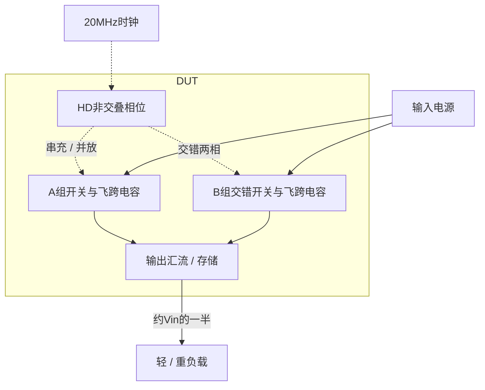

# 19 · 2:1开关电容变换器：双相电荷转移与负载效率

本模块用两组交错飞跨电容把电源降至约一半，HD非交叠逻辑控制每组在串联充电和并联放电之间切换。相比线性降压，它通过搬运电荷降低损耗且无需电感；代价是大电容面积、开关纹波及随负载变化的等效输出电阻。芯片中可用于中间电源轨和低功率片内供电，本次验证固定20MHz下的轻重负载。

状态：**SMIC18MMRF / TT / 1.8 V / 27°C，全部对应 nominal 原始指标通过**。只宣称原理图级 nominal；未执行其他PVT、失配或版图验证。审查PDF已逐页检查中文、图表和网表可读性。

[审查 PDF](../evidence/19-sc-converter/review.pdf) · [精确电路](../evidence/19-sc-converter/circuit.scs) · [验收合同](../evidence/19-sc-converter/contract.json) · [实测结果](../evidence/19-sc-converter/latest_results.json)

当前报告：**6页正文＋5页完整电路图，共11页**。下文历史交付记录中的页数对应当时的正文版本。

<!-- REPORT-MARKDOWN -->
## 可编辑报告与系统结构

[完整报告MD](../evidence/19-sc-converter/review_report.md) · [对应PDF](../evidence/19-sc-converter/review.pdf) · [Mermaid源文件](../evidence/19-sc-converter/system_block_diagram.mmd) · [框图SVG](../evidence/19-sc-converter/markdown_assets/system-block.svg)

固定频率开环电荷转移；没有额外误差放大器或负载调频环。

实线为信号或能量通路，虚线为时钟、控制或偏置。

<!-- END-REPORT-MARKDOWN -->

## 完整标称结果

SMIC18MMRF TT、1.8V、27°C，时钟20MHz、50Ω源阻抗；680Ω重载与6800Ω轻载均保留。原13个标量门槛及固定端电压筛查通过，无需放宽。[完整结果](../evidence/19-sc-converter/latest_results.json)列出原/10%/15%边界。

|指标|680Ω|6800Ω|原要求|
|---|---:|---:|---|
|平均输出/V|0.835078269|0.889526694|对应转换比范围|
|转换比|0.463932371|0.494181497|0.42–0.51 / 0.45–0.51|
|效率/%|77.760038|34.567621|70–100 / 30–100|
|纹波/mV|43.997311|5.348968|重载≤80；轻载诊断|
|VDD平均功率/µW|1319.027254|336.470076|含全部HD和栅极驱动|
|正向时钟功率/µW|0.150690|0.150690|不抵扣返回能量|
|负载功率/µW|1025.793265|116.361790|mean(VOUT²/R)|
|总输入功率/µW|1319.177945|336.620766|轻载≤500|
|最后上穿启动/ns|31.675116|未评分|≤200|
|200–700ns最小输出/V|0.809153804|未评分|固定≥0.6804|

匹配负载等效输出电阻49.622918Ω≤100Ω。效率最大100%、功率非负、固定启动保持目标和端电压筛查均不放宽。未执行其余44有源PVT点及ll/hh两种无源极端；不是完整47条件签核。

## 拓扑与尺寸

串联相把飞跨电容上板接VDD，下板接VOUT；并联相把上板接VOUT，下板接地。两支路相反工作，以降低输出供能间断。交叉反馈NAND和HD反相链形成非交叠，内部全部数字尺寸来自原厂CDL，不用自定义MOS替代数字门。

[尺寸依据](../evidence/19-sc-converter/sizing.json)冻结既有SMIC18实测LUT选点：浮置NMOS单位1.36/0.18µm，gm/ID8、50µA，m60，每只总宽81.6µm；高侧PMOS单位4.00/0.18µm，gm/ID8、50µA，m24，总宽96µm；底板NMOS单位2.04/0.18µm，gm/ID10、50µA，m64，总宽130.56µm。开关工作包含线性区、关断及反向电流，初始饱和gm/ID不冒充全周期实际工作点。

两只飞跨MIM各名义100pF，输出280pF，两个底板MIM各2pF，总484pF。大电容单位为100×100µm，倍率10.298661174/28.8362512873；底板为20×102.98661174µm。模型包含原生工艺特性，未改成理想电容。全部器件为8功率MOS、5MIM、22HD，共35实例176端子；HD使用INHDV1、INHDV2、INHDV16及NAND2HDV1。

## 启动筛查与代价

首版底板m16的外部性能已通过原门槛，但MN4B启动|VGD|约2.204V，超过预先1.98V工程筛查上限，候选被拒绝。将底板开关加大至m64后，全程保存点上六类端电压差的最大值为1.919500516V。它不是可靠性寿命认证，也不替代连续时间尖峰界限或PEX。

加宽开关增加驱动损耗：重载效率约79.29%降为77.76%，轻载约37.85%降为34.57%；报告保留这一代价及原失败运行。[迭代历史](../evidence/19-sc-converter/iteration_history.json)不覆盖。实际PDK、Bridge、Spectre和原LUT均未修改。

## 测量定义与验证

[合同](../evidence/19-sc-converter/contract.json)固定0.7µs瞬态及0.3–0.7µs的8周期评分窗。skipdc=yes对应原uic的零储能启动。启动取0.378VDD=0.6804V最后一次上穿，而非第一次瞬间达到；另查200ns到终点的保持值。

效率为mean(VOUT²/R)除以mean(−VDD·I(VDD))+mean(max(−VCLK·I(VCLK),0))。外部时钟返回能量不抵扣；HD时钟和功率栅驱动损耗计入VDD。输出电阻为(Vlight−Vheavy)/(Iheavy−Ilight)，使用同一模型和供电的匹配负载均值。

[数值计划](../evidence/19-sc-converter/numerical_plan.json)预先固定容差；maxstep0.5→0.25ns，reltol1e-6→1e-7，[25项对照](../evidence/19-sc-converter/numerical_confirmation.json)全部通过。最大效率差0.011254个百分点<0.1个百分点，功率差0.183756µW<2µW，输出电阻差0.001472Ω<0.1Ω，启动差0.0115ps。原门槛等级保持通过。

[独立审计](../evidence/19-sc-converter/verification_audit.json)以逐区间积分重算25性能标量、96个功率MOS端电压极值，共121项；调用原8组检查函数，仅将预期点集显式投影至TT1.8V27°C，原文件与门槛不变。4个基线和最终运行均0错误，模型、LUT、源资料、原厂HD和输入快照哈希通过。参见[测量复核](../evidence/19-sc-converter/measurement-review.md)及[独立明细](../evidence/19-sc-converter/independent_measurement_details.json)。

11页报告为6页正文加5页完整图纸。[完整总图](../evidence/19-sc-converter/schematic/full.pdf)及所有PDF页面均实际查看；修正HD顶端标注、输出电容参数截断和一处时间单位换算后重新检查，未变正文渲染哈希一致。电路SHA-256为69f65f854aa02cd025a190dd4448aa16840e73ba6a835cdde88687dfe010f144。

复现入口依次为scripts/case19_sc_converter.py、confirm19.py、schematic19.py、audit19.py、review19.py，使用既有Bridge Python从工程根目录运行。重生成报告须再次实际查看。噪声、失配、版图、PEX和完整PVT仍未验证。

[完整 LUT 查询](../evidence/19-sc-converter/sizing.json)

[HD 单元来源与哈希](../evidence/19-sc-converter/hd_cells_manifest.json)

## 复现与证据

[完整电路总图 SVG](../evidence/19-sc-converter/schematic/full.svg) · [总图 PDF](../evidence/19-sc-converter/schematic/full.pdf) · [5页电路分图](../evidence/19-sc-converter/schematic/sheets.pdf) · [引脚与层次连接映射](../evidence/19-sc-converter/schematic/connectivity.json) · [图纸审计](../evidence/19-sc-converter/schematic_audit.json)

- [Spectre 运行记录](https://github.com/SannBunnSyoSeTsu/smic18-benchmark-reproduction/blob/6ae3e1434914297c4ed12b93cb8d6a297ef8339a/runs/19/20260928T180312781626Z_heavy/run.json) · 原始输出（本地归档，未随仓库分发）
- [Spectre 运行记录](https://github.com/SannBunnSyoSeTsu/smic18-benchmark-reproduction/blob/6ae3e1434914297c4ed12b93cb8d6a297ef8339a/runs/19/20260928T180328082966Z_light/run.json) · 原始输出（本地归档，未随仓库分发）
- [工程脚本](https://github.com/SannBunnSyoSeTsu/smic18-benchmark-reproduction/tree/6ae3e1434914297c4ed12b93cb8d6a297ef8339a/scripts) · [项目状态](https://github.com/SannBunnSyoSeTsu/smic18-benchmark-reproduction/blob/6ae3e1434914297c4ed12b93cb8d6a297ef8339a/status.json)

原Sky130案例保持原样；本页是目标工艺实测的新记录。模型文件留在既有本地PDK目录，没有上传或修改。
