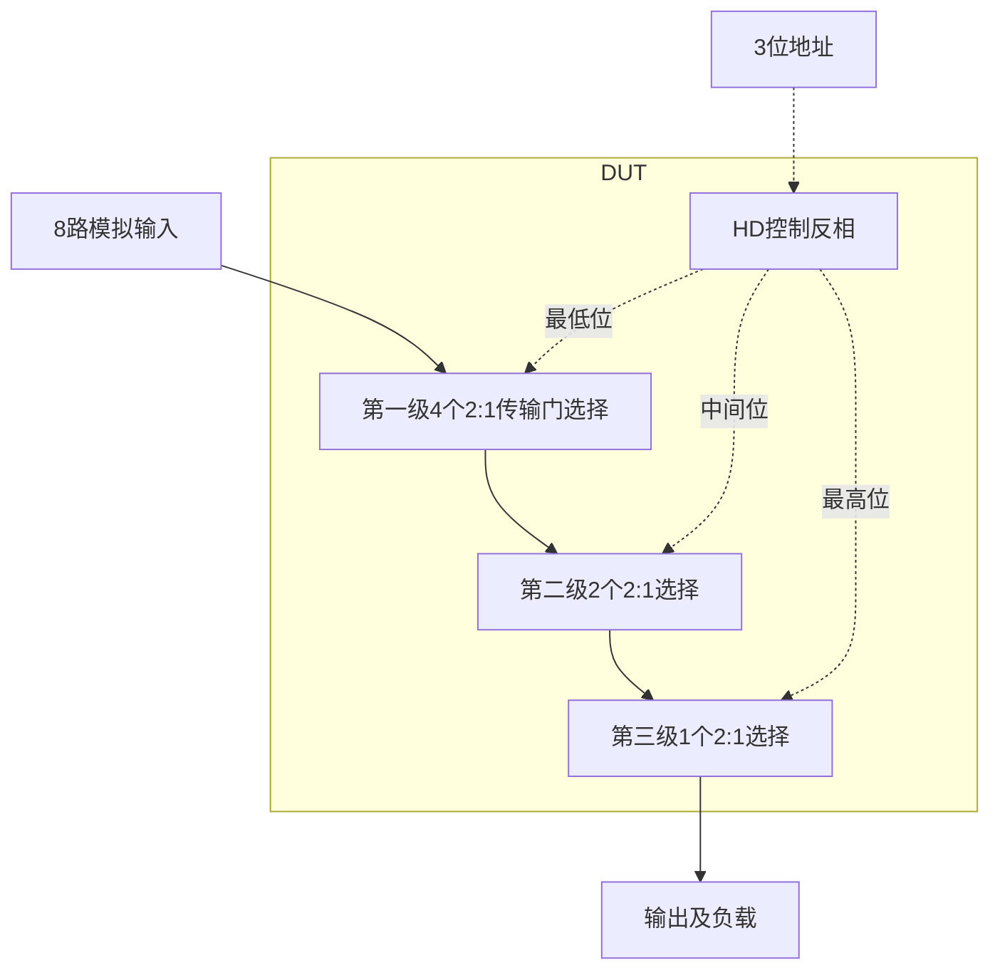

# 20 · 八选一模拟MUX：共模相关导通电阻与完整隔离矩阵

本模块用三位数字码，从八路模拟输入中选择一路送到公共输出。相比单NMOS开关，互补传输门可改善接近两条电源轨时的传输能力；三级二选一树简化控制，但导通电阻会串联累积。芯片中常用于多通道传感器共享ADC、模拟测试通路和输入选择，动态切换性能需另行检查。

状态：**SMIC18MMRF / TT / 1.8 V / 40°C，全部对应 nominal 原始指标通过**。只宣称原理图级 nominal；未执行其他PVT、失配或版图验证。审查PDF已逐页检查中文、图表和网表可读性。

[审查 PDF](../evidence/20-mux/review.pdf) · [精确电路](../evidence/20-mux/circuit.scs) · [验收合同](../evidence/20-mux/contract.json) · [实测结果](../evidence/20-mux/latest_results.json)

当前报告：**4页正文＋3页完整电路图，共7页**。下文历史交付记录中的页数对应当时的正文版本。

<!-- REPORT-MARKDOWN -->
## 可编辑报告与系统结构

[完整报告MD](../evidence/20-mux/review_report.md) · [对应PDF](../evidence/20-mux/review.pdf) · [Mermaid源文件](../evidence/20-mux/system_block_diagram.mmd) · [框图SVG](../evidence/20-mux/markdown_assets/system-block.svg)

实际实现为三级二选一树，未画成未实现的八路独热译码器。

实线为信号或能量通路，虚线为时钟、控制或偏置。

<!-- END-REPORT-MARKDOWN -->

## 电路与完整验收

14组互补传输门构成三级二选一树；每条选中路径串联3组。模拟n18为W1.46/L0.36 µm、p18为W6.08/L0.36 µm，均由gm/ID=10、20 µA、VDS=0.9 V的27°C LUT取得初始几何。3只原厂INHDV0生成选择位反相，内部n18/p18尺寸与阱连接保持原CDL。总计28只模拟MOS、6只HD内部MOS。

沿用原任务明确指定的nominal温度40°C，电源1.8 V。全部8路输入、3个选择位及AVDD各经50 Ω驱动，AVSS直接接地；输出负载1 pF。共模0、0.9、1.8 V各检查8个选择码，每个状态独立激励8路输入，共24条选通及168条未选通传输。每条测量使用独立DUT，不把同时激励的输入之和当作逐路隔离结果。

全部原指标通过：最大选通近DC增益绝对误差0.00002606 dB，最坏未选通近DC/1 MHz传输为−116.9804/−117.0155 dB，最小选通−3 dB带宽24.97097 MHz，最大AVDD静态电流0.137084 nA。对应原门槛为±0.001 dB、−80 dB、5 MHz和5 µA。24个状态、192条传输的逐项结果及全频复数数据均保留。

## 互补开关仍有共模依赖

0、0.9、1.8 V共模下，单级Ron分别823.32、1974.21、870.81 Ω，三段路径分别2469.97、5922.63、2612.43 Ω；最小带宽分别60.293、24.971、55.553 MHz。互补开关能改善两端电平传输，但不保证全摆幅Ron恒定。本例中间电平最慢，只验证0 V和VDD会漏掉最坏带宽。

gm/ID饱和表用于确定初始几何，不应把实际VDS≈0的开关按饱和电流源验收。导通电阻由工作点的1/(gds,n+gds,p)求得，最终传输与带宽来自完整电路AC；没有用饱和区公式或27°C查表替代40°C实际验证。

## 测量口径与工程边界

原验证程序在运行时把公开deck中的db(v(...))改为mag(v(...))，随后自行换算dB。本例保持有限线性幅度再转换；近DC取1 mHz，带宽按自身该点幅度乘10^(−3/20)，即下降3.000 dB。不能照抄公开deck未替换部分中的dB乘法，也不能把3.000 dB与精确半功率门槛混为一谈。

每个状态的8路输入使用相同DC共模；没有验证任意不同输入DC电平的组合。有限模型的极小漏电、对称数值零和静态隔离不代表真实芯片零漏电，也不覆盖切码毛刺、馈通、噪声和切换功耗。其他4个代表性PVT行、失配及版图均未执行。

第一次电气通过后，发现电路内部HD include仍指向可变工作目录；将HD include移到bench顶层，由公共运行器冻结为同目录依赖，再对最终同一电路重新验证。最终运行是`runs/20/20260922T074025982055Z_matrix`，全部依赖快照和模型哈希可追溯。4页审查PDF含开篇功能/优势/用途、传输门树、Ron表、完整矩阵、响应曲线和精确网表。

[完整 LUT 查询](../evidence/20-mux/sizing.json)

[HD 单元来源与哈希](../evidence/20-mux/hd_cells_manifest.json)

## 复现与证据

[完整电路总图 SVG](../evidence/20-mux/schematic/full.svg) · [总图 PDF](../evidence/20-mux/schematic/full.pdf) · [3页电路分图](../evidence/20-mux/schematic/sheets.pdf) · [引脚与层次连接映射](../evidence/20-mux/schematic/connectivity.json) · [图纸审计](../evidence/20-mux/schematic_audit.json)

- [Spectre 运行记录](https://github.com/SannBunnSyoSeTsu/smic18-benchmark-reproduction/blob/6ae3e1434914297c4ed12b93cb8d6a297ef8339a/runs/20/20260922T074025982055Z_matrix/run.json) · 原始输出（本地归档，未随仓库分发）
- [工程脚本](https://github.com/SannBunnSyoSeTsu/smic18-benchmark-reproduction/tree/6ae3e1434914297c4ed12b93cb8d6a297ef8339a/scripts) · [项目状态](https://github.com/SannBunnSyoSeTsu/smic18-benchmark-reproduction/blob/6ae3e1434914297c4ed12b93cb8d6a297ef8339a/status.json)

原Sky130案例保持原样；本页是目标工艺实测的新记录。模型文件留在既有本地PDK目录，没有上传或修改。
