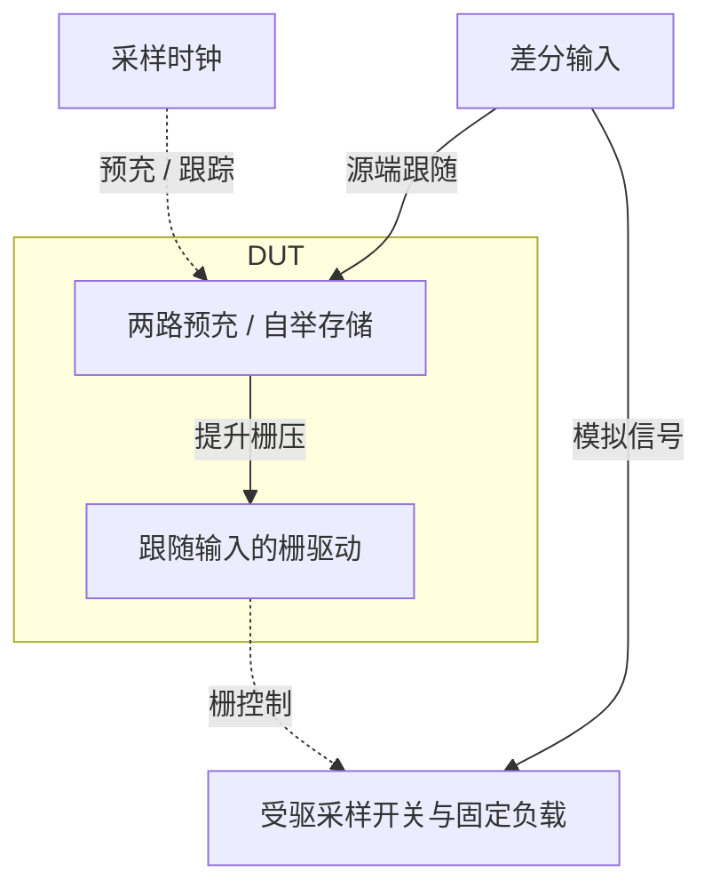

# 22 · 自举栅驱动：近奈奎斯特采样、跟踪过驱动与预充保护

本模块为差分采样开关生成随输入电压抬升的栅极驱动。相比直接用电源范围内时钟驱动NMOS，自举可使导通时的栅源电压更恒定，改善宽输入摆幅下的导通线性度；同时需要控制预充和关断时的器件端电压。芯片中常用于高速ADC输入采样、开关电容网络和精密采样保持电路。

状态：**SMIC18MMRF / TT / 1.8 V / 27°C，全部对应 nominal 原始指标通过**。只宣称原理图级 nominal；未执行其他PVT、失配或版图验证。审查PDF已逐页检查中文、图表和网表可读性。

[审查 PDF](../evidence/22-bootstrap/review.pdf) · [精确电路](../evidence/22-bootstrap/circuit.scs) · [验收合同](../evidence/22-bootstrap/contract.json) · [实测结果](../evidence/22-bootstrap/latest_results.json)

当前报告：**5页正文＋2页完整电路图，共7页**。下文历史交付记录中的页数对应当时的正文版本。

<!-- REPORT-MARKDOWN -->
## 可编辑报告与系统结构

[完整报告MD](../evidence/22-bootstrap/review_report.md) · [对应PDF](../evidence/22-bootstrap/review.pdf) · [Mermaid源文件](../evidence/22-bootstrap/system_block_diagram.mmd) · [框图SVG](../evidence/22-bootstrap/markdown_assets/system-block.svg)

框图描述自举驱动及其受驱采样夹具；器件保护和端电压仍以原理图为准。

实线为信号或能量通路，虚线为时钟、控制或偏置。

<!-- END-REPORT-MARKDOWN -->

## 覆盖范围与结果

SMIC18MMRF tt / 1.8 V / 27°C，100 MHz时钟驱动差分采样网络。输入46.875 MHz、每侧0.4 V峰值、共模0.9 V，保持电容每侧1 pF。全部原nominal功能门槛通过；其余10个PVT点、热噪声、随机失配和PEX未运行。

| 指标 | 最终实测 | 原门槛 |
|---|---:|---:|
| 32点相干SDR | 72.378282 dB | ≥72 dB |
| 64个跟踪中点最小VGS/VDD | 0.864447020 | ≥0.8 |
| 正样本输入反转后的有符号保留增益 | 0.974533333 | ≥0.9 |
| 负样本输入反转后的有符号保留增益 | 0.974533333 | ≥0.9 |
| DUT VDD平均功耗 | 254.955574 µW | 0…500 µW |
| 额外最大栅至通道端差 | 1.861416 V | ≤1.98 V工程筛查线 |
| 额外最大漏源差 | 1.913125 V | ≤1.98 V工程筛查线 |

72 dB SDR只有0.378 dB余量，因此用完全相同的电路作最大时间步5→2.5 ps复核。两轮都通过原门槛，SDR变化0.0000665901 dB，最小VGS比例变化9.62e−9，功耗变化0.00166964 µW，保留增益变化7.29e−9。最终交付2.5 ps结果，不需要反复无目的扫描。

## 架构、LUT与迁移边界

每侧一个自举驱动，共两只1.5 pF飞跨电容、18只模拟MOS与两只原厂INHDV8内部反相器。自举n18单位W/L=5.10/0.18 µm，p18单位14.80/0.18 µm；MPRE/MGTRK/MPVIN/MCASC/MPRGUARD采用n18单位m=2，其余m=1。尺寸均由TT、VDS=0.9 V、VSB=0、gm/ID=8、200 µA参考点产生，LUT路径和SHA-256在`sizing.json`。

CLK=0时内部CLKP=1，输入跟踪开关让CBB随VIN变化，储能电容使CBT和栅极VG随输入抬升。CLK=1时CBB放电、栅极关断，输出保持。实际VGS小于理想VDD，因为自举电容有限且必须驱动采样栅与内部寄生电容；本例最小跟踪VGS约1.5560 V，因此必须逐个时刻检查，不能用“有自举电容”替代驱动幅度证据。

第31项暴露了直接把MPRE连接在CLK和升压VG之间的端差问题。本题首版就采用受保护路径：MPRE源端接PRE，MPRGUARD串接PRE与VG、栅固定VDD。保护管隔离预充端，三组波形共72条器件端电压记录覆盖全部DUT MOS和外部采样MOS。1.98 V只是额外工程筛查线，不是已验证的工艺寿命/氧化层额定值。MLIM/MBPP的PMOS体端接CBT，物理实现需要对应独立井。

原测试台采样开关宽64 µm、长0.15 µm；目标n18的最小合法长度为0.18 µm，因此映射为W64/L0.18 µm，宽度和1 pF负载始终固定。该固定尺寸通过gm/ID=8的LUT电流密度反查，对应约2.51228 mA初始选点；不是电路实际恒流，也未按结果调小测试负载。

原手工两级时钟缓冲改用INHDV8→INHDV16，保持50 Ω源阻抗、50 ps边沿、100 MHz周期及高电平4 ns平台。所有HD内部尺寸不变，数字实现没有另画MOS门。这些器件与长度替换是明确的目标工艺迁移差异，不把本次结果称作相同Sky130测试夹具下的直接A/B比较。

## SDR不是SFDR

从34 ns开始每10 ns取一个held差分输出，结束344 ns，共32点；46.875 MHz正好是采样率的15/32，基波落在DFT bin15和共轭bin17。直接调用冻结的原`analyze_fft`函数：

`Psignal = |X15|² + |X17|²`

`Pdistortion = Σ(k=1…31)|Xk|² − Psignal`

`SDR = 10log10(Psignal/Pdistortion)`

全部非DC、非基波能量进入失真分母，包括Nyquist bin16；没有加窗，没有把某些样本剔除，没有以最大单个杂散代替总失真。另用直接求和非基波bin计算72.3782820966 dB，与原减法结果72.3782820957 dB相差8.62e−10 dB，排除了该指标被大数相减误差主导的疑虑。

跟踪中点为38…348 ns，正负两侧各32点，VGS从实际gate−vin计算。VG对地电压不是VGS；保持时栅压应降下去，不能把持续导通误判为良好跟踪。

此处为确定性采样失真，没有热噪声；不能把SDR当作SNDR或据此声明ENOB。第31项SFDR在5 MHz输入下取得105.9 dB，两题的频率、指标定义与采样拓扑不同，不能直接排名为架构优劣。

## 双向保持和功耗边界

两份静态副本分别先采+0.8 V和−0.8 V。22.0–22.1 ns在保持区内反转输入，24 ns读出差分；正方向除0.8，负方向先取负再除0.8，保留增益均0.974533333。符号必须保留，绝对值可能把透明穿通后的反向输出错误判为通过。PDF包含19–27 ns输入/输出波形，下一次跟踪再响应反转后的输入。

功率窗30–350 ns，共320 ns、32个时钟周期，DUT门槛取`−1.8×mean(I(VDD))`。外部HD时钟缓冲供电为58.873537 µW，50 Ω前时钟源为1.906795 µW，依原合同不加入DUT的500 µW门槛。输入源也可能向网络送能，本题没有全部源总能耗评分；不能把254.956 µW写成整套采样系统功耗。这与第31项五个外部源全计入的合同有实质区别。

## 警告、复核与证据

两轮相同电路均通过原nominal，没有尺寸调整迭代。静态运行无警告；FFT在部分HD/自举管内部节点报告SPECTRE-16780局部LTE放宽，日志保留。缩步复核使用相同reltol=2e−6、iabstol=1e−12 A、vabstol=1e−9 V、conservative。固定几何均在模型尺寸范围内。

最终运行`runs/22/20260922T094323883356Z_static`和`runs/22/20260922T094326591746Z_fft`。最初数据提取调用了本地NumPy没有的`trapezoid`名称，改为已安装版本的`trapz`后从现有PSF提取；没有为这个脚本兼容问题重新仿真。随后单独为近门槛SDR和LTE警告执行了上述缩步确认。

`scripts/case22_bootstrap.py --maxstep-ps 2.5`可在既有Bridge venv中复现，`scripts/review_pdf.py 22`生成五页审查PDF。原instruction、reference、verifier和两个bench冻结在`source/`；`numerical_confirmation.json`保存同电路对照，`latest_results.json`含采样、VGS和端电压记录。全部运行输入、模型、LUT、HD来源保留哈希，未修改既有环境。

[完整 LUT 查询](../evidence/22-bootstrap/sizing.json)

[HD 单元来源与哈希](../evidence/22-bootstrap/hd_cells_manifest.json)

## 复现与证据

[完整电路总图 SVG](../evidence/22-bootstrap/schematic/full.svg) · [总图 PDF](../evidence/22-bootstrap/schematic/full.pdf) · [2页电路分图](../evidence/22-bootstrap/schematic/sheets.pdf) · [引脚与层次连接映射](../evidence/22-bootstrap/schematic/connectivity.json) · [图纸审计](../evidence/22-bootstrap/schematic_audit.json)

- [Spectre 运行记录](https://github.com/SannBunnSyoSeTsu/smic18-benchmark-reproduction/blob/6ae3e1434914297c4ed12b93cb8d6a297ef8339a/runs/22/20260922T094323883356Z_static/run.json) · 原始输出（本地归档，未随仓库分发）
- [Spectre 运行记录](https://github.com/SannBunnSyoSeTsu/smic18-benchmark-reproduction/blob/6ae3e1434914297c4ed12b93cb8d6a297ef8339a/runs/22/20260922T094326591746Z_fft/run.json) · 原始输出（本地归档，未随仓库分发）
- [工程脚本](https://github.com/SannBunnSyoSeTsu/smic18-benchmark-reproduction/tree/6ae3e1434914297c4ed12b93cb8d6a297ef8339a/scripts) · [项目状态](https://github.com/SannBunnSyoSeTsu/smic18-benchmark-reproduction/blob/6ae3e1434914297c4ed12b93cb8d6a297ef8339a/status.json)

原Sky130案例保持原样；本页是目标工艺实测的新记录。模型文件留在既有本地PDK目录，没有上传或修改。
