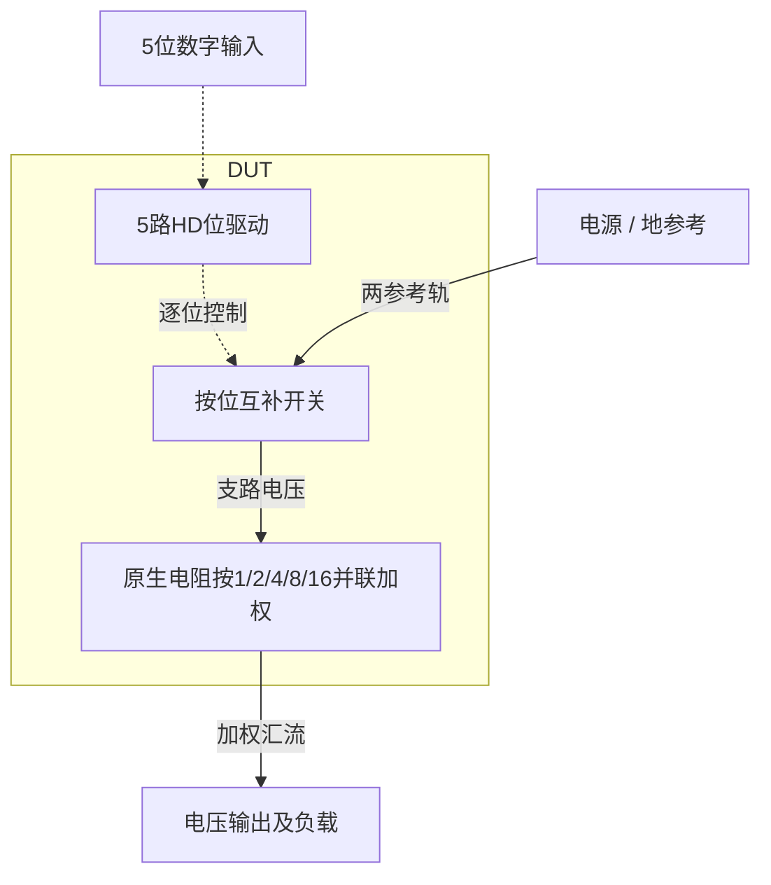

# 23 · 5位电阻DAC：开关电阻、码间线性度与建立时间

本模块将5位数字码转换为模拟电压，用CMOS开关选择电阻网络的连接状态。电阻式DAC的优势是传输关系直观，便于实现静态单调性；相对电流舵结构，其输出阻抗和开关导通电阻更直接影响驱动与建立速度。芯片中常用于偏置调节、门限设定和低分辨率校准，实际精度还取决于电阻匹配及负载。

状态：**SMIC18MMRF / TT / 1.8 V / 27°C，全部对应 nominal 原始指标通过**。只宣称原理图级 nominal；未执行其他PVT、失配或版图验证。审查PDF已逐页检查中文、图表和网表可读性。

[审查 PDF](../evidence/23-resistor-dac/review.pdf) · [精确电路](../evidence/23-resistor-dac/circuit.scs) · [验收合同](../evidence/23-resistor-dac/contract.json) · [实测结果](../evidence/23-resistor-dac/latest_results.json)

当前报告：**6页正文＋3页完整电路图，共9页**。下文历史交付记录中的页数对应当时的正文版本。

<!-- REPORT-MARKDOWN -->
## 可编辑报告与系统结构

[完整报告MD](../evidence/23-resistor-dac/review_report.md) · [对应PDF](../evidence/23-resistor-dac/review.pdf) · [Mermaid源文件](../evidence/23-resistor-dac/system_block_diagram.mmd) · [框图SVG](../evidence/23-resistor-dac/markdown_assets/system-block.svg)

这是二进制加权电阻支路，非电阻串抽头译码结构。

实线为信号或能量通路，虚线为时钟、控制或偏置。


<!-- END-REPORT-MARKDOWN -->

## 验收范围与结论

原任务为 `sky130-cmos-switched-resistor-dac-5bit-pvt`，原有11个代表PVT点和8个固定种子局部失配回归。本轮约化为**确定性TT、1.8 V、27°C**，电阻角为 `res_tt`；保留该点全部功能维度：32个代码、31个正向步进、六个大进位方向、六个输出电阻代码，以及原功耗积分区间。数字输入经过两级有限强度HD缓冲，命令边沿50 ps，外部输出负载1 pF，代码速率200 MS/s。

全部九个数值指标与非放宽功能检查达到原门槛，状态为 `complete_original`。下表列出预定义10%和15%上限，实际未使用放宽。误差理想中心、逻辑功能、码单调性、有限数据和模型尺寸约束不放宽；5 ns代码/观察窗也未改变。

| 指标 | 实测 | 原上限 | 10%上限 | 15%上限 | 单位 |
|---|---:|---:|---:|---:|---|
| 端点拟合INL | 0.0536013 | ≤0.25 | ≤0.275 | ≤0.2875 | LSB |
| 绝对DNL | 0.051479 | ≤0.25 | ≤0.275 | ≤0.2875 | LSB |
| 码0绝对误差 | 0.116587 | ≤2 | ≤2.2 | ≤2.3 | mV |
| 码31绝对误差 | 3.2987 | ≤5 | ≤5.5 | ≤5.75 | mV |
| DUT平均功耗 | 645.254 | ≤1000 | ≤1100 | ≤1150 | µW |
| 最坏大进位建立时间 | 3.08389 | ≤5 | ≤5.5 | ≤5.75 | ns |
| 5ns窗末误差 | 0.0489016 | ≤0.25 | ≤0.275 | ≤0.2875 | LSB |
| 指令电平外峰值 | 0.865725 | ≤1 | ≤1.1 | ≤1.15 | LSB |
| 最大输出电阻 | 993.872 | ≤2000 | ≤2200 | ≤2300 | Ω |

31个步长均为正，最小53.249810 mV；所有32×5个输入位采样均为正确逻辑电平，低位最高约7.46 nV，高位最低约1.79999996 V。全码平均DUT功耗645.253534 µW，外部两级驱动另耗172.006984 µW，合计817.260518 µW。原合同只对独立DUT VDD积分，外部VDRV功耗单列，没有借外部供电掩盖DUT内部电阻或控制逻辑的耗电。

其余10个PVT点、8个局部失配样本、Monte Carlo良率、噪声、频谱动态指标和版图寄生未执行。八个固定种子虽在TT温压下运行，仍属于失配统计回归，不属于此次确定性nominal完成声明；不得把本例称为原benchmark的全PVT/失配通过。

## 拓扑、器件及尺寸依据

电路端口保持 `vss b0 b1 b2 b3 b4 vdd vout`，`b0`为LSB。每一位先由一个原厂HD反相器产生 `nb[i]`，再控制接VSS的n18与接VDD的p18模拟导通支路。两管漏极汇于 `sw[i]`，五组电阻接在 `sw[i]` 与输出之间。`b[i]=1`时p18导通，该组接高电位；`b[i]=0`时n18导通，该组接地。各管衬底/阱分别接VSS/VDD。

五组电阻由1、2、4、8、16个完全相同的单位电阻并联组成，另外一个单位电阻从输出永久接地。这样总电导为32份，高电位电导为码值k份，理想输出为 `k/32 × VDD`。地终端不能省略，否则分母会变成31。

所有单位电阻均采用SMIC的三端 `rpposab_3t`，W=1 µm、L=96 µm，第三端接VSS。没有用理想电阻替代工艺模型，也没有通过把电阻宽度简单乘二来忽略模型蚀刻项。采用32个同几何单元，可保持确定性单位电导的整数比例；模型仍包含电压系数、温度系数和基底电容。匹配和真实版图面积仍需后续布局设计。

电阻初始估算使用模型名义片阻311.3 Ω/方和有效宽度 `1−2×0.0273=0.9454 µm`：

- 单位电阻约 `311.3×96/0.9454 = 31.611 kΩ`；忽略小温度/电压修正的输出电阻约987.84 Ω。
- 实测六代码输出电阻986.74–993.87 Ω，与工艺电阻及小开关导通电阻的预期一致。
- `Pstatic(k)≈VDD²/Rout × (k/32)(1−k/32)`，32码平均约546.12 µW。实测含内部动态充放电约645.25 µW，不把这两者的差额全解释成某一种损耗。
- 单位电阻基底电容的一阶面积加周边估计约27 fF，32份合计约0.864 pF，其中约半数加载输出。加1 pF外载后，一阶输出时间常数约1.4 ns；建立时间同时还受到驱动延迟、开关注入和进位毛刺影响，因此用实际瞬态验收。

模拟MOS尺寸采用既有SMIC18实测gm/ID LUT，只读使用 `/home/IC/CodeX/gmoverid_smic18/lut/tt/`。本例无需补表。选择L=0.18 µm、VDS=0.9 V、gm/ID=6 V⁻¹、参考电流200 µA，以强反型起步满足高速开关驱动。

| 模型 | LUT ID/W (µA/µm) | 初算W (µm) | 实际单位W/L (µm) | LUT VGS/VSG (V) | LUT fT (GHz) |
|---|---:|---:|---|---:|---:|
| n18 | 61.6991 | 3.24154 | 3.24 / 0.18 | 0.725475 | 32.2152 |
| p18 | 22.0226 | 9.08157 | 9.08 / 0.18 | 0.762430 | 11.9998 |

该200 µA是查表尺寸参考，电路没有200 µA偏置源。模拟开关在实际全摆幅栅压下大多工作于线性区，不能将上述饱和LUT点误称为实际OP。每位MOS采用m=1、2、4、8、16，与电阻电导同比增加。最大PMOS总宽145.28 µm由W=9.08 µm的16个合法单位并联表示，所有单实例宽度处于n18/p18模型范围。32码采样的最大开关轨压降约14.20 mV，出现在码1的LSB高电位支路，约占电源0.79%。这些实际导通误差已包含在线性度、端点和负载响应中。

数字逻辑均使用 `SCC018UG_HD_RVT` 原厂单元：DUT接收器依次为 `INHDV2/4/8/16/32`；每路外部驱动为 `INHDV3→INHDV32`。原厂CDL只做机械Spectre语法转换，模型与内部W/L未改。外部小级总W=4.4 µm，大级总W=46.88 µm，保留原两级有限驱动结构。该驱动是SMIC迁移后的真实负载响应，并非声称与Sky130缓冲逐点电气等效。模拟n18/p18承担电阻支路导通及模拟电流，不充当额外自定义数字逻辑。

最终DUT有5个HD反相器、10个带倍数的模拟MOS实例、32个PDK电阻，无内部额外MIM电容、理想R/C、理想开关或行为源。电阻的模型寄生仍然保留。网表及数字单元清单分别为 `circuit.scs`、`hd_cells.scs`、`hd_cells_manifest.json`。

## 测量方法与完整nominal证据

### 全码爬码、INL/DNL和端点

原测试 `tb_code_ramp.spi` 的PULSE命令逐项翻译成Spectre；第一次LSB上升从7.5 ns开始，命令50%点为7.525 ns，后续代码边界保持5 ns。初始条件沿用原UIC意义，Spectre采用 `skipdc=yes`。输出样本在 `t[k]=(7+5k) ns`，即各码结束前0.5 ns取样。

`LSBfit=(V[31]−V[0])/31=56.13982949 mV`，`INL[k]=(V[k]−V[0])/LSBfit−k`，`DNL[k]=(V[k]−V[k−1])/LSBfit−1`。绝对端点仍以0 V和31/32×1.8=1.74375 V为目标。功耗为 `−1.8×∫I(VDD)dt/160ns`，积分窗口2.5–162.5 ns，保存完整电源电流PSF。

| 码 | 采样/ns | 实测Vout/V | INL/LSB | DNL/LSB |
|---:|---:|---:|---:|---:|
| 0 | 7.0 | 0.000116587 | 0.000000 | — |
| 1 | 12.0 | 0.053366397 | -0.051479 | -0.051479 |
| 2 | 17.0 | 0.109550178 | -0.050696 | 0.000783 |
| 3 | 22.0 | 0.165526908 | -0.053601 | -0.002905 |
| 4 | 27.0 | 0.222096355 | -0.045949 | 0.007653 |
| 5 | 32.0 | 0.277810916 | -0.053524 | -0.007575 |
| 6 | 37.0 | 0.334100327 | -0.050859 | 0.002664 |
| 7 | 42.0 | 0.390112081 | -0.053141 | -0.002281 |
| 8 | 47.0 | 0.447246386 | -0.035426 | 0.017714 |
| 9 | 52.0 | 0.502479394 | -0.051579 | -0.016153 |
| 10 | 57.0 | 0.558788631 | -0.048562 | 0.003018 |
| 11 | 62.0 | 0.614832795 | -0.050266 | -0.001704 |
| 12 | 67.0 | 0.671475921 | -0.041301 | 0.008965 |
| 13 | 72.0 | 0.727252331 | -0.047774 | -0.006473 |
| 14 | 77.0 | 0.783611144 | -0.043874 | 0.003901 |
| 15 | 82.0 | 0.839688465 | -0.044987 | -0.001113 |
| 16 | 87.0 | 0.897795914 | -0.009938 | 0.035049 |
| 17 | 92.0 | 0.952217084 | -0.040552 | -0.030614 |
| 18 | 97.0 | 1.008569946 | -0.036758 | 0.003795 |
| 19 | 102.0 | 1.064678682 | -0.037312 | -0.000554 |
| 20 | 107.0 | 1.121394963 | -0.027043 | 0.010268 |
| 21 | 112.0 | 1.177232708 | -0.032424 | -0.005381 |
| 22 | 117.0 | 1.233660446 | -0.027296 | 0.005128 |
| 23 | 122.0 | 1.289802839 | -0.027250 | 0.000046 |
| 24 | 127.0 | 1.347099411 | -0.006646 | 0.020605 |
| 25 | 132.0 | 1.402439707 | -0.020887 | -0.014242 |
| 26 | 137.0 | 1.458886280 | -0.015424 | 0.005464 |
| 27 | 142.0 | 1.515060568 | -0.014810 | 0.000614 |
| 28 | 147.0 | 1.571849590 | -0.003246 | 0.011564 |
| 29 | 152.0 | 1.627748152 | -0.007543 | -0.004298 |
| 30 | 157.0 | 1.684244339 | -0.001196 | 0.006348 |
| 31 | 162.0 | 1.740451301 | 0.000000 | 0.001196 |

200 MS/s码31输出1.740451301 V，端点误差3.298699 mV。长驻留输出电阻测试中，码31未加载为1.743296167 V，距理想端点仅0.453833 mV。两者差异主要反映动态取样与长驻留条件不同；本例没有用更好的静态结果替换200 MS/s验收。

### 六个大进位方向

原命令时刻20、25、45、50、70、75 ns分别对应3→4、4→3、7→8、8→7、15→16、16→15。每次保持原5 ns测量窗，目标码理想LSB固定为56.25 mV，误差带为±14.0625 mV。

按正式verifier定义，找窗口内 `abs(Vout−target)=0.25LSB` 的最后交叉，并额外确认该交叉方向是入带。末端误差在命令后4.99 ns采样；越界峰值是输出超过两条指令电平包络的最大距离，除以理想LSB，不把正常1LSB跃迁幅度误算为毛刺。本例六条都只有一次交叉。

| 跃迁 | 最后入带/ns | 末端误差/LSB | 指令电平外峰值/LSB |
|---|---:|---:|---:|
| 3→4 | 1.973526 | 0.037625 | 0.008430 |
| 4→3 | 2.397521 | 0.034008 | 0.114924 |
| 7→8 | 1.646530 | 0.037819 | 0.017113 |
| 8→7 | 2.639483 | 0.035788 | 0.343161 |
| 15→16 | 0.691756 | 0.032919 | 0.026768 |
| 16→15 | 3.083893 | 0.048902 | 0.865725 |

最坏项均发生于16→15：MSB关闭及四个低位开启的延迟、开关注入不同，先产生高于码16的上冲，再向码15收敛。15→16恰有有利的短时正向变化，入带更快。验证方向不能省略，也不能用单一“最大进位向上”测试代表全部六种转换。当前毛刺距原1LSB上限约13.43%，比INL、Rout等项目更接近边界；未扩展为PVT结论。

### 六代码外部负载扰动

代码顺序为0、4、15、16、28、31，每码30 ns。前15 ns无附加负载，后15 ns施加5 µA；各窗14 ns和29 ns取样。码0向输出注入电流，其余从输出吸收电流，避免把端点强推到电源范围外。码0计算 `(Vloaded−Vunloaded)/5µA`，其余取相反电压差。

| 码 | 扰动方向 | 未加载/V | 加载/V | Rout/Ω |
|---:|---|---:|---:|---:|
| 0 | 注入输出 | 0.000000835 | 0.004964502 | 992.733492 |
| 4 | 从输出吸收 | 0.224474780 | 0.219521538 | 990.648471 |
| 15 | 从输出吸收 | 0.842490587 | 0.837556904 | 986.736598 |
| 16 | 从输出吸收 | 0.898761883 | 0.893792521 | 993.872385 |
| 28 | 从输出吸收 | 1.574207507 | 1.569272745 | 986.952336 |
| 31 | 从输出吸收 | 1.743296167 | 1.738330201 | 993.193188 |

这六点是原合同指定代表代码，不称为全32码输出电阻扫描。有限差分包括工艺电阻与导通开关的共同作用，没有用晶体管小信号1/gds或Runit/32手算替代实测。

## 迭代、数值核对与限制

仅用一次LUT初始尺寸形成电路候选即通过全部原nominal门槛，未进行试探式尺寸优化。首轮ramp和输出电阻日志有 `SPECTRE-16780`，指出跨局部内部器件信号不连续时临时放宽LTE。为确认数值可靠性，在相同电路、模型、刺激、负载及采样时刻下，将三类最大步长从10/5/25 ps缩小到2/1/5 ps，reltol从2e−5收紧到2e−6，保存第二套真实PSF。

两个版本均为 `complete_original`。九个核心指标最大相对变化0.0104864%，出现在毛刺峰值；最坏建立时间变化0.0000309 ns，DUT功耗变化0.00450 µW，最大Rout变化0.000254 Ω。较严求解仍有局部LTE提示，保留原日志并披露；没有CMI-2441几何越界，真实轨迹全部有限，输入位、码单调性和六个入带方向校验通过。对照结论已足够支持本轮结果，没有反复调整门槛或继续无目标扫参。

除上述明确未覆盖PVT/失配之外，这仍是原理图级设计：没有电阻版图梯度、走线寄生、ESD/封装、电源阻抗或目标芯片接口验证；也未建立原厂HD单元在本特定模型组合下的时序库一致性声明。确定性同尺寸单元的比例精度不等于实物匹配性能。

## 运行与复现入口

最终三类运行均通过 `scripts/common.py` 冻结输入，保存实际模型文件SHA256、bench/电路/HD/合同哈希、求解日志和PSF。HD include位于bench层，因此运行快照内可直接解析电路和数字单元，无隐藏的可变case路径依赖。现有PDK、Bridge、LUT与原知识库保持只读。

最终运行：

- `runs/23/20260922T085255104320Z_code_ramp_refined`
- `runs/23/20260922T085306554939Z_major_carry_refined`
- `runs/23/20260922T085318058247Z_output_resistance_refined`

首轮对照运行：

- `runs/23/20260922T085106383584Z_code_ramp`
- `runs/23/20260922T085109208290Z_major_carry`
- `runs/23/20260922T085111200437Z_output_resistance`

工程根目录：`/home/IC/CodeX/smic18_benchmark_repro`。运行命令：

```bash
/home/IC/CodeX/virtuoso-bridge-lite/.venv/bin/python scripts/case23_dac.py --refined
/home/IC/CodeX/virtuoso-bridge-lite/.venv/bin/python scripts/review_pdf.py 23
```

结果与合同：`cases/23-resistor-dac/latest_results.json`、`contract.json`、`sizing.json`。每个run有自己的 `measurements.json`，最后一个还保存 `combined_measurements.json`；数值对照见 `numerical_confirmation.json`。原instruction、正式verifier、原bench、参考电路和参考成绩冻结于 `source/` 并有 `source_provenance.json`，参考成绩仅用于确认任务要求，没有替代SMIC测量。

审查PDF为 `reports/23-resistor-dac-review.pdf`，含六页：完整门槛、结构和LUT、32码波形及线性度、六种大进位、六点负载扰动和数值对照、完整DUT网表与复现路径。PDF渲染检查与哈希记录在 `pdf_provenance.json`。

[完整 LUT 查询](../evidence/23-resistor-dac/sizing.json)

[HD 单元来源与哈希](../evidence/23-resistor-dac/hd_cells_manifest.json)

## 复现与证据

[完整电路总图 SVG](../evidence/23-resistor-dac/schematic/full.svg) · [总图 PDF](../evidence/23-resistor-dac/schematic/full.pdf) · [3页电路分图](../evidence/23-resistor-dac/schematic/sheets.pdf) · [引脚与层次连接映射](../evidence/23-resistor-dac/schematic/connectivity.json) · [图纸审计](../evidence/23-resistor-dac/schematic_audit.json)

- [Spectre 运行记录](https://github.com/SannBunnSyoSeTsu/smic18-benchmark-reproduction/blob/6ae3e1434914297c4ed12b93cb8d6a297ef8339a/runs/23/20260922T085255104320Z_code_ramp_refined/run.json) · 原始输出（本地归档，未随仓库分发）
- [Spectre 运行记录](https://github.com/SannBunnSyoSeTsu/smic18-benchmark-reproduction/blob/6ae3e1434914297c4ed12b93cb8d6a297ef8339a/runs/23/20260922T085306554939Z_major_carry_refined/run.json) · 原始输出（本地归档，未随仓库分发）
- [Spectre 运行记录](https://github.com/SannBunnSyoSeTsu/smic18-benchmark-reproduction/blob/6ae3e1434914297c4ed12b93cb8d6a297ef8339a/runs/23/20260922T085318058247Z_output_resistance_refined/run.json) · 原始输出（本地归档，未随仓库分发）
- [工程脚本](https://github.com/SannBunnSyoSeTsu/smic18-benchmark-reproduction/tree/6ae3e1434914297c4ed12b93cb8d6a297ef8339a/scripts) · [项目状态](https://github.com/SannBunnSyoSeTsu/smic18-benchmark-reproduction/blob/6ae3e1434914297c4ed12b93cb8d6a297ef8339a/status.json)

原Sky130案例保持原样；本页是目标工艺实测的新记录。模型文件留在既有本地PDK目录，没有上传或修改。
