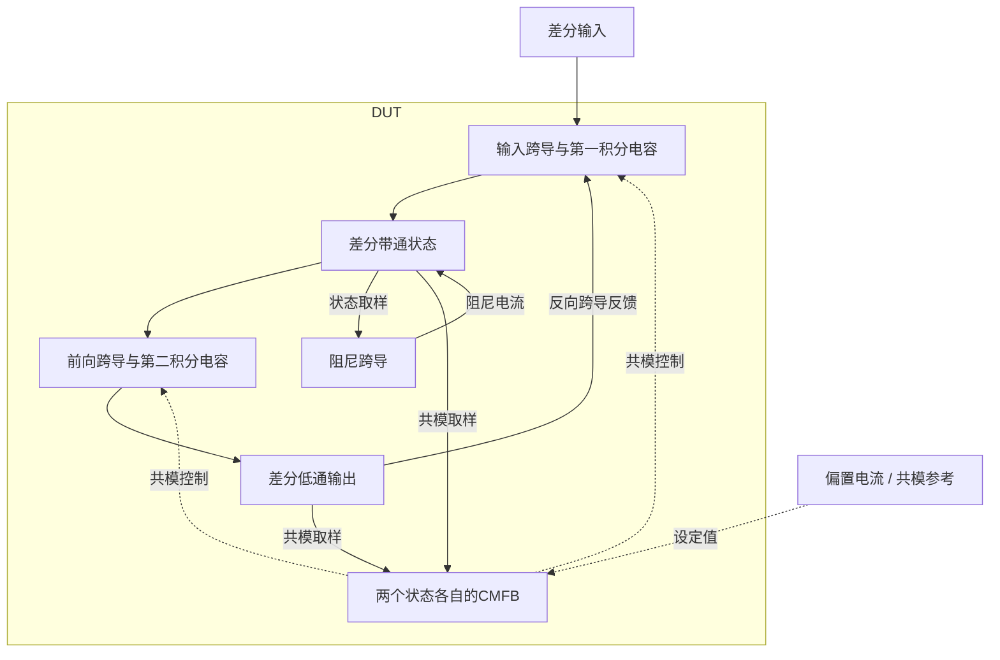

# 26 · 全差分OTA-C双二阶：带通状态、共模反馈与线性度

本模块用跨导单元和电容实现二阶低通与带通滤波，差分状态节点由独立共模反馈保持偏置。相比电阻有源滤波器，极点由跨导与电容共同决定，可通过偏置调节，但跨导非线性、噪声和共模稳定性需要一起控制。芯片中可用于接收机基带、抗混叠滤波和模拟信号调理。

状态：**SMIC18MMRF / TT / 1.8 V / 27°C，全部对应 nominal 原始指标通过**。只宣称原理图级 nominal；未执行其他PVT、失配或版图验证。审查PDF已逐页检查中文、图表和网表可读性。

[审查 PDF](../evidence/26-ota-c-biquad/review.pdf) · [精确电路](../evidence/26-ota-c-biquad/circuit.scs) · [验收合同](../evidence/26-ota-c-biquad/contract.json) · [实测结果](../evidence/26-ota-c-biquad/latest_results.json)

当前报告：**8页正文＋6页完整电路图，共14页**。下文历史交付记录中的页数对应当时的正文版本。

<!-- REPORT-MARKDOWN -->
## 可编辑报告与系统结构

[完整报告MD](../evidence/26-ota-c-biquad/review_report.md) · [对应PDF](../evidence/26-ota-c-biquad/review.pdf) · [Mermaid源文件](../evidence/26-ota-c-biquad/system_block_diagram.mmd) · [框图SVG](../evidence/26-ota-c-biquad/markdown_assets/system-block.svg)

差模二阶环路和两路共模反馈分别标明；不是简单串联两个独立低通。

实线为信号或能量通路，虚线为时钟、控制或偏置。

<!-- END-REPORT-MARKDOWN -->

## 标称验收

SMIC18MMRF TT、1.8V、27°C，共享20µA参考；四个状态节点各250fF外部负载。AC、噪声、三组幅度/频率THD及共模阶跃全部完成。**26项标量门槛和原16组检查达到原要求，无需放宽**。[完整结果](../evidence/26-ota-c-biquad/latest_results.json)保留原/10%/15%门槛。

|指标|实测|原要求|
|---|---:|---|
|拟合中心频率/MHz|1.924718015|1.8–2.2|
|Q|0.690320881|0.65–0.75|
|低通通带/dB|-0.561335801|-1–1|
|拟合RMS/dB|0.001787339|≤0.5|
|20MHz衰减/dB|40.617166|≥35|
|BP峰频/MHz|1.927524913|1.7–2.3|
|BP峰增益/dB|-6.405610|-8–-5|
|BP拒斥1k/200k/20MHz/dB|23.752573 / 15.741482 / 17.108039|≥18 / 15 / 15|
|DC共模误差/mV|1.825059|≤10|
|供电功耗/µW|393.439730|≤500|
|1k–4MHz输出噪声/µVrms|295.662285|≤500|
|200kHz/0.6Vpp THD及增益|-54.502179dB / 0.934349|≤-45 / ≥0.85|
|200kHz/0.9Vpp THD及增益|-44.445111dB / 0.929247|≤-30 / ≥0.8|
|2MHz/0.9Vpp LP THD及增益|-59.896197dB / 0.626376|≤-45 / ≥0.5|
|2MHz/0.9Vpp BP THD及增益|-52.783333dB / 0.483615|≤-45 / ≥0.3|
|共模初始/晚期误差/mV|2.072877 / 1.729431|均≤10|
|共模建立/ns|68.102584|≤1000|

## 拓扑、gm/ID和实际工作点

两独立尾电流源驱动每个跨导的两个输入支路，19.1kΩ源间退化改善线性度；交叉阻尼支路源间8kΩ且无PMOS负载。输入跨导和反馈跨导在带通节点叠加，第三个NMOS阻尼支路也消耗电流，因此两组PMOS负载分别m1.5，每节点两只各约30µA，匹配三组约20µA下拉。低通电流匹配为常规1:1。C1两只8pF，C2两只4pF。

[初始尺寸](../evidence/26-ota-c-biquad/sizing.json)：n18偏置20.66/1µm、gm/ID18、20µA；输入27.78/0.36µm、22、20µA；p18负载41.58/1µm、14、20µA；CM输入6.82/0.36µm、20、10µA；CM负载20.78/1µm、14、10µA。使用常规n18/p18真实工艺模型，未对原LVT作别名映射。

两路CMFB分别用两只1MΩ电阻求节点均值，CM尾管m0.5、每侧10µA，5kΩ源间退化和0.3pF补偿。输入体效应保留。实际输入管ID19.864550µA、gm/ID22.3164、gmb106.229µS，|VDS|−|VDSAT|=0.466511V；偏置实际gm/ID18.0314、BP负载14.0476，区别于初算假设。[结果工作点](../evidence/26-ota-c-biquad/latest_results.json)包含原始gm、gmb、VGS、VDS、VDSAT。

共5个子电路定义，42定义实例160端子；展开复用后51个叶级实例。原题允许理想正值R/C，DUT无行为放大器或受控源。

## 测量定义和精度

[合同](../evidence/26-ota-c-biquad/contract.json)固定AC1k–100MHz，≤8MHz逆功率多项式二阶拟合。20MHz/200kHz按原检查器选择最近频点，最终20MHz实际取19.952623MHz；BP峰值从离散网格查找。噪声取差分输出密度平方，在1k–4MHz积分后开方。

THD每组30µs，取最后2周期，插值256点，合成2–5次谐波；输出峰值除以差分输入峰值计算增益。共模参考在5–5.05µs从0.85升至0.95V，最后一次超出固定±10mV带相对5.05µs计时；初始4.85µs及晚期≥12µs分别检查，两路共同取最差。

[数值计划](../evidence/26-ota-c-biquad/numerical_plan.json)先冻结容差，再将maxstep2→1ns、reltol1e-6→1e-7、AC100→200点/dec、噪声80→160点/dec。[28项确认](../evidence/26-ota-c-biquad/numerical_confirmation.json)通过；拟合f0差约1.965Hz，BP离散峰频差22.064kHz<30kHz，最大THD差0.044244dB<0.05dB，噪声差0.012286µV<1µV。

[独立审计](../evidence/26-ota-c-biquad/verification_audit.json)使用原Gauss消元拟合、直接复数DFT、共模扫描和独立PSD积分重算28指标；只在内存将预期点集投影至六组TT，原16检查函数和门槛保持不变且全部通过。12次基线/精算均0错误、0警告，源文件/模型/LUT/输入快照哈希核对通过。[测量复核](../evidence/26-ota-c-biquad/measurement-review.md)和[独立明细](../evidence/26-ota-c-biquad/independent_measurement_details.json)可追溯。

14页报告含8页正文、6页完整图纸，已实际逐页查看并检查[完整总图](../evidence/26-ota-c-biquad/schematic/full.pdf)。去除子电路框内重复名称后复看第9、10页及总图；其余12页渲染哈希与已查看版本相同。电路SHA-256：ca1d973f73e9bc1899742bfe7698bdb9dfd31c3b23f2dd842da9dc403d49a82d。

既有Bridge Python从工程根目录依次运行scripts/case26_ota_c.py、confirm26.py、schematic26.py、audit26.py、review26.py。未执行其余24个AC/噪声PVT点和2个动态压力点、失配、调谐范围、版图及PEX；共模阶跃通过不冒充独立环路相位裕量。既有PDK、Bridge、Spectre和原LUT未改。

[完整 LUT 查询](../evidence/26-ota-c-biquad/sizing.json)

## 复现与证据

[完整电路总图 SVG](../evidence/26-ota-c-biquad/schematic/full.svg) · [总图 PDF](../evidence/26-ota-c-biquad/schematic/full.pdf) · [6页电路分图](../evidence/26-ota-c-biquad/schematic/sheets.pdf) · [引脚与层次连接映射](../evidence/26-ota-c-biquad/schematic/connectivity.json) · [图纸审计](../evidence/26-ota-c-biquad/schematic_audit.json)

- [Spectre 运行记录](https://github.com/SannBunnSyoSeTsu/smic18-benchmark-reproduction/blob/6ae3e1434914297c4ed12b93cb8d6a297ef8339a/runs/26/20260928T181533966305Z_ac/run.json) · 原始输出（本地归档，未随仓库分发）
- [Spectre 运行记录](https://github.com/SannBunnSyoSeTsu/smic18-benchmark-reproduction/blob/6ae3e1434914297c4ed12b93cb8d6a297ef8339a/runs/26/20260928T181534633008Z_noise/run.json) · 原始输出（本地归档，未随仓库分发）
- [Spectre 运行记录](https://github.com/SannBunnSyoSeTsu/smic18-benchmark-reproduction/blob/6ae3e1434914297c4ed12b93cb8d6a297ef8339a/runs/26/20260928T181535297678Z_thd/run.json) · 原始输出（本地归档，未随仓库分发）
- [Spectre 运行记录](https://github.com/SannBunnSyoSeTsu/smic18-benchmark-reproduction/blob/6ae3e1434914297c4ed12b93cb8d6a297ef8339a/runs/26/20260928T181538051207Z_thd2/run.json) · 原始输出（本地归档，未随仓库分发）
- [Spectre 运行记录](https://github.com/SannBunnSyoSeTsu/smic18-benchmark-reproduction/blob/6ae3e1434914297c4ed12b93cb8d6a297ef8339a/runs/26/20260928T181541028707Z_thd_f0/run.json) · 原始输出（本地归档，未随仓库分发）
- [Spectre 运行记录](https://github.com/SannBunnSyoSeTsu/smic18-benchmark-reproduction/blob/6ae3e1434914297c4ed12b93cb8d6a297ef8339a/runs/26/20260928T181544167057Z_cmstep/run.json) · 原始输出（本地归档，未随仓库分发）
- [工程脚本](https://github.com/SannBunnSyoSeTsu/smic18-benchmark-reproduction/tree/6ae3e1434914297c4ed12b93cb8d6a297ef8339a/scripts) · [项目状态](https://github.com/SannBunnSyoSeTsu/smic18-benchmark-reproduction/blob/6ae3e1434914297c4ed12b93cb8d6a297ef8339a/status.json)

原Sky130案例保持原样；本页是目标工艺实测的新记录。模型文件留在既有本地PDK目录，没有上传或修改。
