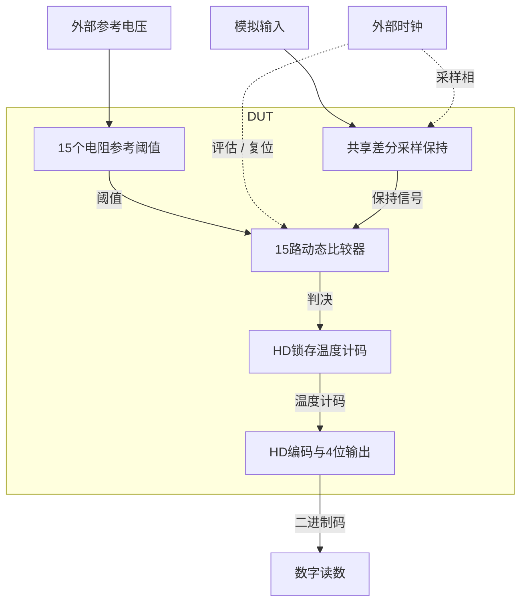

# 27 · 4位差分Flash ADC：采样保持、比较器阵列与HD编码

本模块在采样结束时并行比较差分输入与15个参考阈值，把温度计码编码为四位二进制。共享差分保持电容隔离转换期间的输入变化，动态比较器减少静态偏置电流，HD锁存与异或树保存和编码判决；代价是比较器、参考负载、采样电容与回踢随位数增长。芯片中可用于高速低位数ADC和流水线子ADC。

状态：**SMIC18MMRF / TT / 1.8 V / 27°C，全部对应 nominal 原始指标通过**。只宣称原理图级 nominal；未执行其他PVT、失配或版图验证。审查PDF已逐页检查中文、图表和网表可读性。

[审查 PDF](../evidence/27-flash-adc4bit/review.pdf) · [精确电路](../evidence/27-flash-adc4bit/circuit.scs) · [验收合同](../evidence/27-flash-adc4bit/contract.json) · [实测结果](../evidence/27-flash-adc4bit/latest_results.json)

当前报告：**9页正文＋16页完整电路图，共25页**。下文历史交付记录中的页数对应当时的正文版本。

<!-- REPORT-MARKDOWN -->
## 可编辑报告与系统结构

[完整报告MD](../evidence/27-flash-adc4bit/review_report.md) · [对应PDF](../evidence/27-flash-adc4bit/review.pdf) · [Mermaid源文件](../evidence/27-flash-adc4bit/system_block_diagram.mmd) · [框图SVG](../evidence/27-flash-adc4bit/markdown_assets/system-block.svg)

比较器、锁存和编码均在DUT；输入、参考和时钟属于固定测试端口。

实线为信号或能量通路，虚线为时钟、控制或偏置。

<!-- END-REPORT-MARKDOWN -->

## 标称复现结果

50MS/s、TT/1.8V/27°C，全部原始指标通过。16码中心零错误；90点线性度斜坡覆盖全码、15个相邻转换且单调。INL=0.0843373494LSB，DNL=0.156626506LSB；SNDR=26.277333dB，SFDR=29.5313668dB，VDD+VREFP功耗=2.42198826mW。

## 结构与可迁移经验

共享20pF/侧保持电容、200kΩ混合电阻、16×100Ω参考梯、15个StrongARM和SR，以及原厂HD异或树。比较器按目标工艺gm/ID角色初算；采样PMOS总宽超过模型单管范围时拆成m=4等效并联，维持总宽且消除尺寸越界。异步SR在比较器复位时保存判决。

## 验证与范围

完整原始刺激、50Ω时钟、10fF/位负载和边沿后9ns判码保持。动态矩形FFT保留原题第1–15点口径（Nyquist未计入原题）；供电能量包含VDD和VREFP，时钟另列，理想输入驱动未纳入5mW上限。不是噪声、失配、亚稳态统计、PVT或PEX签核。

maxstep100→50ps、reltol1e−5→1e−6确认全部码序不变；独立原分析函数完成15项数值交叉核对和6项电气检查。源材料、模型、LUT和HD哈希核对通过，完整图纸16页。

## 可编辑报告与证据

[报告Markdown](../evidence/27-flash-adc4bit/review_report.md)由与Matplotlib PDF相同的文本和表格保存，并非PDF编译输入；[独立测量说明](../evidence/27-flash-adc4bit/measurement-review.md)、[验收合同](../evidence/27-flash-adc4bit/contract.json)、[数值确认](../evidence/27-flash-adc4bit/numerical_confirmation.json)、[代码/频谱记录](../evidence/27-flash-adc4bit/conversion_records.json)、[完整生成脚本](../evidence/27-flash-adc4bit/implementation)均保留。

电路SHA-256：`3b70836f6c1c5d9bd5affd551b9be5fa04763a168d4a5a936beba835fb24c620`。

[完整 LUT 查询](../evidence/27-flash-adc4bit/sizing.json)

[HD 单元来源与哈希](../evidence/27-flash-adc4bit/hd_cells_manifest.json)

## 复现与证据

[完整电路总图 SVG](../evidence/27-flash-adc4bit/schematic/full.svg) · [总图 PDF](../evidence/27-flash-adc4bit/schematic/full.pdf) · [16页电路分图](../evidence/27-flash-adc4bit/schematic/sheets.pdf) · [引脚与层次连接映射](../evidence/27-flash-adc4bit/schematic/connectivity.json) · [图纸审计](../evidence/27-flash-adc4bit/schematic_audit.json)

- [Spectre 运行记录](https://github.com/SannBunnSyoSeTsu/smic18-benchmark-reproduction/blob/6ae3e1434914297c4ed12b93cb8d6a297ef8339a/runs/27/20260929T030037242752Z_transfer/run.json) · 原始输出（本地归档，未随仓库分发）
- [Spectre 运行记录](https://github.com/SannBunnSyoSeTsu/smic18-benchmark-reproduction/blob/6ae3e1434914297c4ed12b93cb8d6a297ef8339a/runs/27/20260929T030155717833Z_linearity/run.json) · 原始输出（本地归档，未随仓库分发）
- [Spectre 运行记录](https://github.com/SannBunnSyoSeTsu/smic18-benchmark-reproduction/blob/6ae3e1434914297c4ed12b93cb8d6a297ef8339a/runs/27/20260929T030610778996Z_dynamic/run.json) · 原始输出（本地归档，未随仓库分发）
- [工程脚本](https://github.com/SannBunnSyoSeTsu/smic18-benchmark-reproduction/tree/6ae3e1434914297c4ed12b93cb8d6a297ef8339a/scripts) · [项目状态](https://github.com/SannBunnSyoSeTsu/smic18-benchmark-reproduction/blob/6ae3e1434914297c4ed12b93cb8d6a297ef8339a/status.json)

原Sky130案例保持原样；本页是目标工艺实测的新记录。模型文件留在既有本地PDK目录，没有上传或修改。
