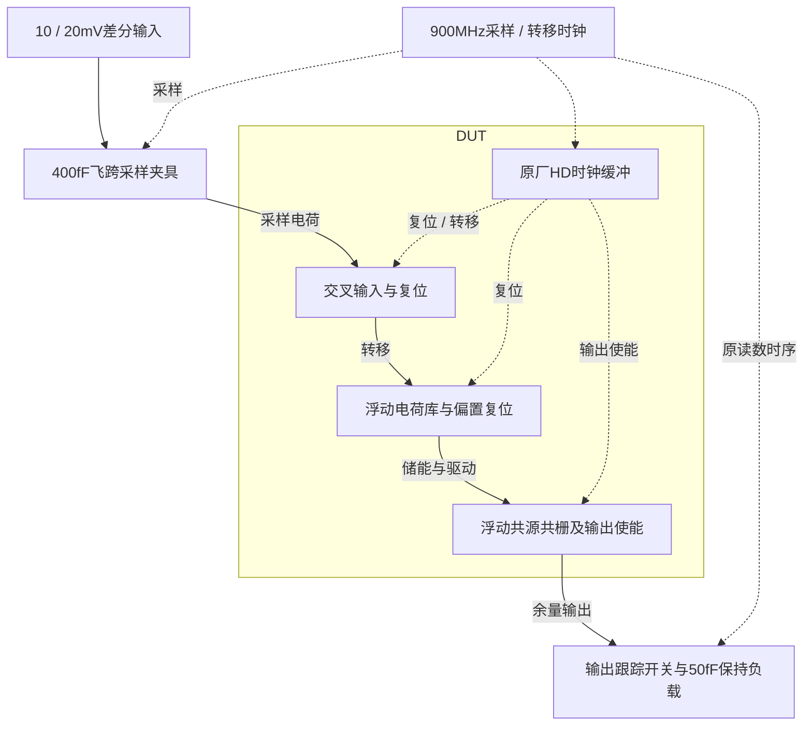

# 28 · 浮动电荷转移余量放大器：储能、转移与保持

本模块在两相时钟下利用浮动电荷库和交叉输入支路放大采样余量，再由外部保持电容锁存输出。电荷转移结构避免连续时间高增益运放的静态功耗，但增益、共模、储能电容和保持时刻的建立误差需要共同权衡。芯片中可用于高速流水线ADC余量放大，本次验证900MS/s下两种固定输入幅度的标称行为。

状态：**SMIC18MMRF / TT / 1.8 V / 27°C，全部对应 nominal 指标在15%放宽条件内通过；原门槛差异见正文**。只宣称原理图级 nominal；未执行其他PVT、失配或版图验证。审查PDF已逐页检查中文、图表和网表可读性。

[审查 PDF](../evidence/28-fct-amplifier/review.pdf) · [精确电路](../evidence/28-fct-amplifier/circuit.scs) · [验收合同](../evidence/28-fct-amplifier/contract.json) · [实测结果](../evidence/28-fct-amplifier/latest_results.json)

当前报告：**7页正文＋13页完整电路图，共20页**。下文历史交付记录中的页数对应当时的正文版本。

<!-- REPORT-MARKDOWN -->
## 可编辑报告与系统结构

[完整报告MD](../evidence/28-fct-amplifier/review_report.md) · [对应PDF](../evidence/28-fct-amplifier/review.pdf) · [Mermaid源文件](../evidence/28-fct-amplifier/system_block_diagram.mmd) · [框图SVG](../evidence/28-fct-amplifier/markdown_assets/system-block.svg)

FCT仅为余量放大子模块；外部飞跨/保持网络按原测试保留，不代表已完成整条流水线ADC。

实线为信号或能量通路，虚线为时钟、控制或偏置。

<!-- END-REPORT-MARKDOWN -->

## 结果与边界

TT/1.8V/27°C，达到既定15%档，原指标和10%档未通过。10mV/20mV两组增益分别4.7967384/4.8123107V/V，保持变化1.6312723%/1.6234656%，SFDR分别87.8797127/84.9966246dB。最坏净供电功耗4.74820843mW。

增益低于原5.5和10%档4.95下限，达到15%档4.675下限；保持变化高于原1.5%，低于10%档1.65%。未更改原400fF飞跨电容、50fF负载、900MHz时序、64周期预热、32点样本或功率窗口。原夹具双反相缓冲固定用BUFHDV16映射，未声称跨工艺延迟完全一致。

## 实现与验证

原生gm/ID初算偏置、输入与开关角色；主输入缩放0.3、输出N/P缩放2.3/1.23、输出使能缩放0.6、主储能4pF。DUT时钟为未改尺寸HDV12。1.25→0.625ps、全局reltol1e-08→1e-09、vabstol1e-08→1e-08V确认通过，包括原预定SFDR差≤0.5dB。独立插值、五端口能量积分和原直接DFT/评分函数交叉核对通过，原指标失败项原样记录。

早期SFDR未收敛、严格容差触发理想开关恢复次数上限的失败均留在[numerical_stages](../evidence/28-fct-amplifier/numerical_stages)。最终增加两项求解恢复次数上限到10000，两次均保持10nV绝对电压容差并减半步长、收紧相对容差；1nV试跑在读数窗口前因求解代价过高停止。强制在原读数时刻输出并保留全部自适应点，没有改变电路、夹具、minstep或验收阈值。浮空节点、LTE临时放宽和恢复告警随原始日志保留。

只完成nominal，未覆盖其余PVT、噪声、失配、PEX。[可编辑报告](../evidence/28-fct-amplifier/review_report.md)、[独立复核](../evidence/28-fct-amplifier/measurement-review.md)、[样本与功率分项](../evidence/28-fct-amplifier/sample_records.json)、[数值确认](../evidence/28-fct-amplifier/numerical_confirmation.json)、[完整图纸](../evidence/28-fct-amplifier/schematic/sheets.pdf)、[实现脚本](../evidence/28-fct-amplifier/implementation)均保留。

电路SHA-256：`efce96d95dcf0ca96cfdd534ea6f4dbd8a564de41e7c74c7f7d0d093a5a24988`。

[完整 LUT 查询](../evidence/28-fct-amplifier/sizing.json)

[HD 单元来源与哈希](../evidence/28-fct-amplifier/hd_cells_manifest.json)

## 复现与证据

[完整电路总图 SVG](../evidence/28-fct-amplifier/schematic/full.svg) · [总图 PDF](../evidence/28-fct-amplifier/schematic/full.pdf) · [13页电路分图](../evidence/28-fct-amplifier/schematic/sheets.pdf) · [引脚与层次连接映射](../evidence/28-fct-amplifier/schematic/connectivity.json) · [图纸审计](../evidence/28-fct-amplifier/schematic_audit.json)

- [Spectre 运行记录](https://github.com/SannBunnSyoSeTsu/smic18-benchmark-reproduction/blob/6ae3e1434914297c4ed12b93cb8d6a297ef8339a/runs/28/20260929T052500800082Z_precision_refined_10mv/run.json) · 原始输出（本地归档，未随仓库分发）
- [Spectre 运行记录](https://github.com/SannBunnSyoSeTsu/smic18-benchmark-reproduction/blob/6ae3e1434914297c4ed12b93cb8d6a297ef8339a/runs/28/20260929T052500800011Z_precision_refined_20mv/run.json) · 原始输出（本地归档，未随仓库分发）
- [工程脚本](https://github.com/SannBunnSyoSeTsu/smic18-benchmark-reproduction/tree/6ae3e1434914297c4ed12b93cb8d6a297ef8339a/scripts) · [项目状态](https://github.com/SannBunnSyoSeTsu/smic18-benchmark-reproduction/blob/6ae3e1434914297c4ed12b93cb8d6a297ef8339a/status.json)

原Sky130案例保持原样；本页是目标工艺实测的新记录。模型文件留在既有本地PDK目录，没有上传或修改。
