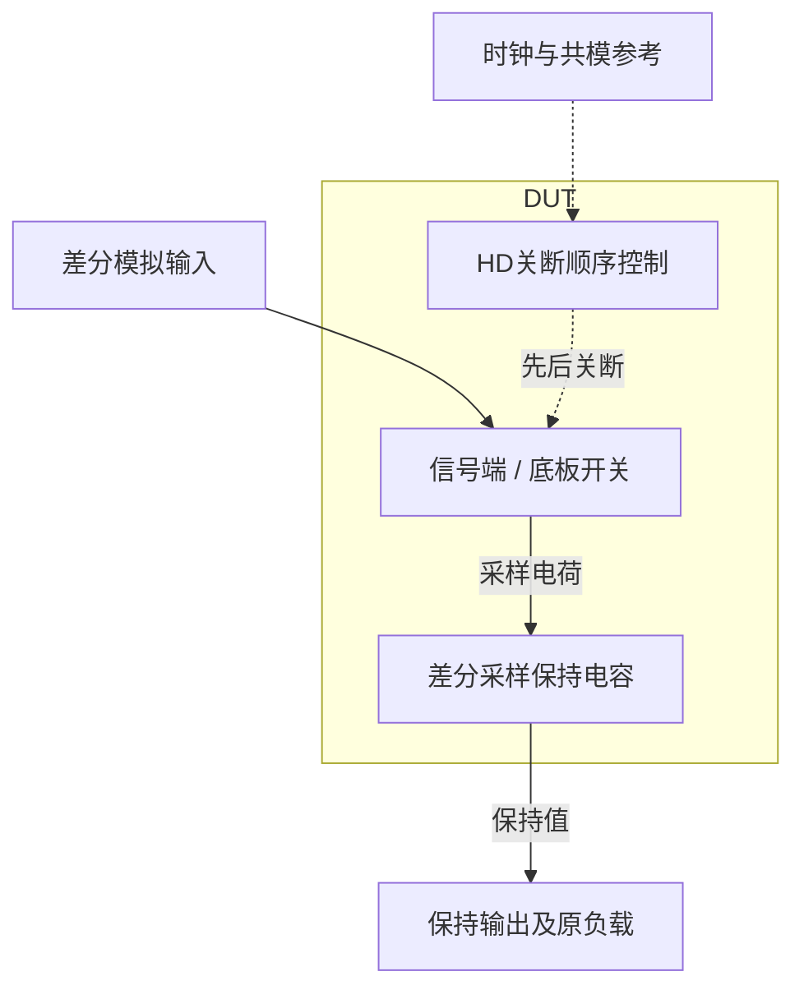

# 31 · 差分底板采样：关断顺序、电荷注入与采样频谱

本模块在时钟控制下采集并保持差分模拟电压，将连续时间输入转换为离散样本。底板采样通过安排电容两端开关的关断顺序，降低信号相关电荷注入对采样值的影响；相比简单单开关采样，它需要更细致的时序控制。芯片中常作为ADC前端、开关电容滤波器和余量放大级的采样网络。

状态：**SMIC18MMRF / TT / 1.8 V / 27°C，全部对应 nominal 原始指标通过**。只宣称原理图级 nominal；未执行其他PVT、失配或版图验证。审查PDF已逐页检查中文、图表和网表可读性。

[审查 PDF](../evidence/31-bottom-plate/review.pdf) · [精确电路](../evidence/31-bottom-plate/circuit.scs) · [验收合同](../evidence/31-bottom-plate/contract.json) · [实测结果](../evidence/31-bottom-plate/latest_results.json)

当前报告：**6页正文＋2页完整电路图，共8页**。下文历史交付记录中的页数对应当时的正文版本。

<!-- REPORT-MARKDOWN -->
## 可编辑报告与系统结构

[完整报告MD](../evidence/31-bottom-plate/review_report.md) · [对应PDF](../evidence/31-bottom-plate/review.pdf) · [Mermaid源文件](../evidence/31-bottom-plate/system_block_diagram.mmd) · [框图SVG](../evidence/31-bottom-plate/markdown_assets/system-block.svg)

图表示采样和底板关断时序，后级量化器不在本例范围。

实线为信号或能量通路，虚线为时钟、控制或偏置。

<!-- END-REPORT-MARKDOWN -->

## 实现与测量结果

SMIC18MMRF tt、1.8 V、27°C；100 MHz外部时钟、50 ps源边沿、50 Ω源阻抗，输入共模0.9 V。本次覆盖原题全部nominal功能维度，全部原门槛通过，无需10%或15%放宽。其余八组FFT PVT、ss/ff保持测试、随机失配和PEX未执行。

| 指标 | 最终实测 | 原门槛 |
|---|---:|---:|
| +0.8 V采集误差 | 3.863402 mV | ≤5 mV |
| −0.8 V采集误差 | 3.863402 mV | ≤5 mV |
| 保持前正样本误差 | 3.857158 mV | ≤5 mV |
| 输入反转后的保持端点变化 | 0.221541 µV | ≤5 mV |
| 下一次负样本误差 | 3.837278 mV | ≤5 mV |
| 80点相干采样SFDR | 105.933582 dB | ≥80 dB |
| 差分基波增益误差 | 0.482813631% | ≤0.5% |
| 存储电荷共模偏移 | 18.402642 mV | ≤25 mV |
| 全部五个外部源功耗 | 303.454205 µW | ≤600 µW |

增益误差离原门槛较近，因此进行了相同电路、相同容差下最大时间步5→2.5 ps的针对性复核。增益误差变化仅2.33093e−8个百分点，SFDR变化0.00062913 dB，总功耗变化0.00094927 µW。最终交付细步长结果，不以不同尺寸或更有利刺激代替精度对照。

## 拓扑与尺寸

每侧1 pF电容连接输入采样节点vsp/vsn和共模侧vtopp/vtopn。主输入开关MIP/MIN为n18 W/L=10.18/0.18 µm；共模开关MCP/MCN为1.28/0.18 µm；MTS为15.28/0.18 µm，在跟踪期间连接两共模端。存储量是电容两端之差，不能只读对地输出。

三个自举驱动分别跟随VINP、VINN、VCM，各有1 pF飞跨电容。基本n18单位2.54/0.18 µm、p18单位7.40/0.18 µm。MPRE、MGTRK、MPVIN、MCASC及新增MPRGUARD采用n18单位m=2；其余模拟管m=1。所有模拟尺寸来自既有LUT，目标gm/ID=8、VDS=0.9 V、VSB=0；输入、共模、自举、共模板连接角色的LUT参考电流分别为400、50、100、600 µA。实际开关时变工作，LUT电流只是初始选点，不是固定偏置电流。

时钟通过INHDV4→INHDV4产生early，再经INHDV4→INHDV8形成late，lateb对地20 fF；每个自举内部另有两只INHDV4。共10个原厂HD反相器、20只HD MOS，加32只模拟MOS，总52只MOS。n/p井端始终按原厂接口连接；MLIM/MBPP的体端跟随CBT，物理实现需要相应独立井。DUT没有理想电阻、内部源或行为元件。

共模侧由early控制，信号侧由late控制；实测栅源波形证明共模侧先下降，随后信号侧关闭。底板采样把主要关断动作放在固定共模电位，自举使输入开关过驱动随信号的变化减小。两种措施分别处理注入的信号相关性和导通非线性，仍需检查建立误差和馈通。

## 三次架构结果及自举保护

初始互补传输门实现的SFDR只有56.7456 dB，增益误差0.563185%，未通过。采集和保持成功并不能推出动态采样频谱合格。

沿用参考自举思路后，SFDR达到97.0926 dB、增益误差0.471965%，但进一步检查发现预充管MPRE原本直接连接CLK与VG。在CLK已下降而VG仍被自举抬高的短时间内，MPRE的|VGS|达到2.89273 V。电气评分通过不代表这个版本可以交付；这两组未保护运行已标记`not_deliverable_voltage_guard`，保留原电气数值和波形。

最终MPRE的源端改接PRE，新增MPRGUARD连接VG与PRE，栅接VDD，使预充路径受到级联隔离。最大栅至通道端差降至1.941092 V，最大漏源差为1.942443 V；四个测试副本共208条器件记录覆盖全部模拟管和HD MOS，分别检查|VGS|、|VGD|及|VDS|。最大栅端差来自输入反转时H.MIN的VGD，最大漏源差来自H.XBN.MCASC，不能只检查自举驱动自身。

1.98 V取原任务最高供电1.8×1.10，作为额外、不放宽的工程筛查线；它不是已查明的工艺氧化层寿命额定值，不是全PVT可靠性签核。自举VG对地接近3 V并非独立判据，应读取具体器件两端差。也没有把n18/p18模拟器可以计算高电压等同于器件长期允许。

## 严格保留的测量口径

接口为`bottom_plate_sampler vinp vinn clk vcm vdd vss vsp vsn vtopp vtopn`。差分存储量为`(vsp−vtopp)−(vsn−vtopn)`，共模为`0.5×[(vsp−vtopp)+(vsn−vtopn)]`。冻结的上游`stored`和`analyze_fft`函数直接用于实际Spectre向量，没有执行它的PVT调度。

双极性采集用两个独立副本，固定±0.8 V差分输入，在29 ns读数。保持测试先采+0.8 V，8.0–8.1 ns把输入反转至−0.8 V；7.8、11.5和19.5 ns的存储值依次为0.796142842、0.796142621和−0.796162722 V。保持指标是前两次端点差，下一拍独立判断负输入误差。反转瞬间约70 µV的电容馈通完整显示在PDF，未把它隐藏成只有端点的平直保持曲线。

时钟保留原SPICE脉冲语义：延迟2 ns、上升50 ps、高电平平台5 ns、下降50 ps、周期10 ns。平台宽度和边沿分开设置，不能把平台5 ns擅自改成含边沿5 ns。

正弦每侧0.4 V峰值、5 MHz，差分1.6 Vpp；采样时刻`(9+10×cycle) ns`，cycle=8…87，共80个held样本、4个输入周期。DFT基波bin4，杂散只搜索bin1…39并排除bin4；没有窗函数，不包含DC或Nyquist。SFDR为基波与最大杂散幅度比的20log10，增益误差按基波DFT模长/(80×0.4)归一。存储共模对80个样本取绝对最大。

该频谱是确定性失真结果。热噪声、SNDR、THD和ENOB并非原评分项，本次没有从105.93 dB SFDR推算ENOB。

## 能耗边界

功耗积分窗80–880 ns，为完整800 ns；每个源先积分`−Vsource×Isource`并求时间平均，再取非负，最后求和。不能只记VDD、不能用瞬时正功率积分替代平均后钳位，也不能把源之间的返能抵消隐藏起来。

| 供能源 | 平均非负功耗/µW |
|---|---:|
| VDD | 243.185470 |
| VCM | 21.305285 |
| VINP | 19.073975 |
| VINN | 19.073974 |
| 时钟源，50 Ω之前 | 0.815501 |
| 总计 | 303.454205 |

对应100 MHz平均约3.03454 pJ/样本。输入、共模和时钟供能占总功耗约19.9%，如果只测VDD会漏掉约60.27 µW。此功耗已含50 Ω驱动电阻的源端代价；负载是本题电容网络，没有追加未定义外部缓冲器。

## 数值警告与复现

初次更严格容差的自举运行在约2.00057 ns发生收敛失败，保留日志；最终采用reltol=2e−6、iabstol=1e−12 A、vabstol=1e−9 V、conservative，最大步2.5 ps。Spectre在部分器件内部源节点仍报告SPECTRE-16780局部LTE放宽；同电路缩步对照确认关键指标稳定，不等同于没有警告。

最终运行：`runs/31/20260922T093029941807Z_acquisition_hold`和`runs/31/20260922T093040811547Z_fft`。工程脚本为`scripts/case31_bottom_plate.py`，用既有Bridge venv Python执行并带`--maxstep-ps 2.5`；PDF由`scripts/review_pdf.py 31`生成，共六页。`numerical_confirmation.json`保存同电路对照，`initial_bootstrap_voltage_diagnostic.json`保存撤回版本的端电压，最终`latest_results.json`保留完整208条器件检查及全部采样向量。

原任务instruction、reference、正式verify.py及benches均冻结在本模块`source/`。LUT、HD、模型和每次输入依赖保留SHA-256；模型留在本地原目录。没有改变原库、PDK或既有验证环境。

[完整 LUT 查询](../evidence/31-bottom-plate/sizing.json)

[HD 单元来源与哈希](../evidence/31-bottom-plate/hd_cells_manifest.json)

## 复现与证据

[完整电路总图 SVG](../evidence/31-bottom-plate/schematic/full.svg) · [总图 PDF](../evidence/31-bottom-plate/schematic/full.pdf) · [2页电路分图](../evidence/31-bottom-plate/schematic/sheets.pdf) · [引脚与层次连接映射](../evidence/31-bottom-plate/schematic/connectivity.json) · [图纸审计](../evidence/31-bottom-plate/schematic_audit.json)

- [Spectre 运行记录](https://github.com/SannBunnSyoSeTsu/smic18-benchmark-reproduction/blob/6ae3e1434914297c4ed12b93cb8d6a297ef8339a/runs/31/20260922T093029941807Z_acquisition_hold/run.json) · 原始输出（本地归档，未随仓库分发）
- [Spectre 运行记录](https://github.com/SannBunnSyoSeTsu/smic18-benchmark-reproduction/blob/6ae3e1434914297c4ed12b93cb8d6a297ef8339a/runs/31/20260922T093040811547Z_fft/run.json) · 原始输出（本地归档，未随仓库分发）
- [工程脚本](https://github.com/SannBunnSyoSeTsu/smic18-benchmark-reproduction/tree/6ae3e1434914297c4ed12b93cb8d6a297ef8339a/scripts) · [项目状态](https://github.com/SannBunnSyoSeTsu/smic18-benchmark-reproduction/blob/6ae3e1434914297c4ed12b93cb8d6a297ef8339a/status.json)

原Sky130案例保持原样；本页是目标工艺实测的新记录。模型文件留在既有本地PDK目录，没有上传或修改。
