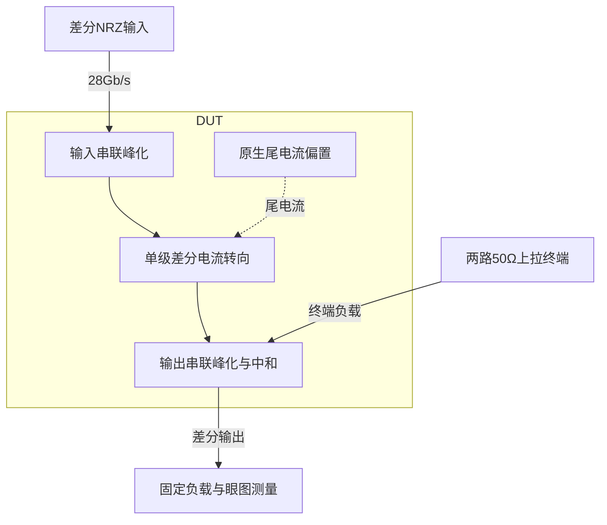

# 32 · 28Gb/s CML发送器：串联峰化、绝对传播延迟与完整眼图验收

本模块把差分NRZ输入转换为高速电流转向输出，驱动两路接至电源的50Ω终端。单级CML差分对减少级联传播延迟，输入和输出串联电感补偿电容负载，交叉电容减轻栅漏反馈；代价是持续偏置功耗、较大的电流镜及电感面积和损耗。芯片中可用于高速串行发送器的末级驱动，本次验证28Gb/s固定负载下的标称眼图与抖动，不包含信道均衡或物理互连。

状态：**SMIC18MMRF / TT / 1.8 V / 27°C，全部对应 nominal 指标在10%放宽条件内通过；原门槛差异见正文**。只宣称原理图级 nominal；未执行其他PVT、失配或版图验证。审查PDF已逐页检查中文、图表和网表可读性。

[审查 PDF](../evidence/32-cml-tx/review.pdf) · [精确电路](../evidence/32-cml-tx/circuit.scs) · [验收合同](../evidence/32-cml-tx/contract.json) · [实测结果](../evidence/32-cml-tx/latest_results.json)

当前报告：**10页正文＋1页完整电路图，共11页**。下文历史交付记录中的页数对应当时的正文版本。

<!-- REPORT-MARKDOWN -->
## 可编辑报告与系统结构

[完整报告MD](../evidence/32-cml-tx/review_report.md) · [对应PDF](../evidence/32-cml-tx/review.pdf) · [Mermaid源文件](../evidence/32-cml-tx/system_block_diagram.mmd) · [框图SVG](../evidence/32-cml-tx/markdown_assets/system-block.svg)

只覆盖发送末级与原固定负载；没有SERDES协议逻辑、均衡器或物理信道模型。

实线为信号或能量通路，虚线为时钟、控制或偏置。

<!-- END-REPORT-MARKDOWN -->

## 结果与范围

SMIC18MMRF TT、1.8V、27°C，外部100uA参考，输入共模1.17V。完整执行静态、AC、原PRBS7及200mVpp低摆幅四组测试。29个标量边界在10%范围内完成，只有带宽和低摆幅输出未达原门槛。原23组验收函数逐项执行，保留这两组原失败；功能、符号、计数、有限值和输出轨均保持原要求。

|测量|最终值|原门槛|10%边界|
|---|---:|---:|---:|
|静态差分摆幅|409.700132mVpp|400–900mV|360–990mV|
|100MHz源端差分增益|1.370592477V/V|1.3–4|1.17–4.4|
|-3dB带宽|20.026673589GHz|≥22GHz|≥19.8GHz|
|1–14GHz群延迟变化|2.832706345ps|≤8ps|≤8.8ps|
|100MHz–22GHz峰化|0dB|≤1.5dB|≤2.327854dB|
|PRBS眼高|338.949473mV|≥320mV|≥288mV|
|最坏20–80%上/下沿|9.792846/9.793200ps|各≤15ps|各≤16.5ps|
|过冲/欠冲最大比例|0.4676634%|≤12%|≤13.2%|
|动态共模偏移|0.841884mV|≤50mV|≤55mV|
|确定性抖动峰峰值|0.260573312ps|≤5ps|≤5.5ps|
|确定性抖动RMS|0.125149436ps|≤1.5ps|≤1.65ps|
|DCD|0.003856518ps|≤2ps|≤2.2ps|
|原样点平均功耗|33.856399mW|≤45mW|≤49.5mW|
|时间加权平均功耗|33.859339mW|≤45mW|≤49.5mW|
|低摆幅输出|228.107321mV|≥250mV|≥225mV|
|低摆幅最坏上/下沿|7.742050/7.742701ps|各≤17ps|各≤18.7ps|

完整29边界包含上述范围的上下限、共模距VDD、静态失调/电流平衡、静态/动态轨范围，见[原合同](../evidence/32-cml-tx/contract.json)及[最终结果](../evidence/32-cml-tx/latest_results.json)。dB峰化边界按线性幅度比放宽，不直接给dB数值乘1.1。动态轨为1.22869948–1.43549168V，严格位于固定0.2–1.82V区间。

仅执行TT标称，原题另外两个配对点ss/1.62V/-40°C及ff/1.98V/125°C未执行。未进行失配、随机噪声、信道、封装、ESD、布局、PEX或实物验证；这些确定性抖动结果不等于随机总抖动或误码率签核。

## 电路与gm/ID取舍

DUT有四只原生n18、两只15fF交叉电容和四只200pH串联电感，共10个实例28个端子。源题明确允许正值理想R/C/L；没有行为源、理想开关、内部理想电流源或重复50Ω终端。

- MREF：W/L=39.76/0.36um，m=1，外部100uA；MTAIL同单位尺寸，m=200，目标20mA。
- MPAIRP/N：单位W/L=0.64/0.18um，各m=100，目标每支10mA，跨接输出漏端使整体正向。
- LIP/LIN分别串接dinp→gip、dinn→gin；LP/LN分别串接dp→voutp、dn→voutn；均200pH。
- CNEUTP接dp–gip，CNEUTN接dn–gin，各15fF。所有MOS体端接vss。

使用既有LUT按单位100uA选择尺寸：输入L0.18um、VDS0.9V、gm/ID=3；参考L0.36um、VDS0.45V、gm/ID=18。[选型记录](../evidence/32-cml-tx/sizing.json)保存原表和SHA-256。低输入gm/ID在此通过增加电流、减小栅电容获得速度；较高尾源gm/ID降低所需过驱动。仅靠提高跨导不能绕开50Ω源阻抗与器件电容形成的输入极点。

实际零输入尾电流18.707372mA、每支9.353682mA、输入gm/ID=3.097063；+150mV差分时尾电流18.713310mA，两支11.405165/7.308138mA。实际电流低于20mA初值，未在报告中把目标电流当成测量值。尾节点约0.207V、参考电压0.488546V，体效应及镜管VDS差异已由实际OP反映。四只MOS有正VDS–VDSAT余量。

静态输出共模1.332166766V，两个符号±204.850066mV差分；两符号共模差、零输入失调和电流不平衡在完全对称模型中为0，不代表失配下也为0。

## 激励与负载原样保留

每腿输入50Ω源阻抗和30fF焊盘电容、输出50Ω到VDD和100fF到地。静态台直接设置输入引脚为共模1.17V加差分±150mV/0，与原静态台一致；动态与AC保留全部源阻抗和电容。

AC为10MHz–50GHz、每十倍频50点，两路0.5V反相信号构成源端1V差分。100MHz增益为参考；带宽采用原算法首个-3dB交越的线性频率/幅度插值，未改变为对数插值。输出负载以及输入50Ω/30fF网络均计入增益。

PRBS7保留原PWL全文与位序列：28Gb/s、127位两周期、总254位、停止9071.4286ps；源20–80%边沿5ps对应全坡约8.333ps。仅第二周期127UI之后统计。原始数据以17位有效数字转交冻结的原分析器，所有边界与规则保持。

低摆幅台保持原200mVpp差分、12UI交替码、前4UI预热和428.5714ps停止。既没有增大输入，也没有删掉输入阻抗、焊盘或输出负载来改善结果。

## 小群延迟变化不保证符号采样正确

早期8mA/gmID8候选带宽仅8.654GHz、群延迟变化11.911ps。16mA/gmID4降低栅负担后带宽10.726GHz；增加输出240pH仅提升至12.879GHz。加入输入300pH时带宽23.593GHz达到原值，群延迟变化也通过，但绝对传播偏移约19ps，已经超过半UI=17.857ps。

原分析器在每个理论边沿±0.9UI内选择最近的过零交越；当延迟超过半UI时，交替码可能匹配相邻边沿，导致错误的延迟补偿中心。该候选PRBS边沿计数为0、低摆幅8个符号全部错。加大中和至100fF仍有PRBS32个符号错误和低摆幅8错。两个方案即使AC带宽通过也不能验收，失败快照完整保存在[迭代记录](../evidence/32-cml-tx/iteration_history.json)。

最终采用20mA/gmID3、15fF中和和两端各200pH，把PRBS平均传播偏移降至16.371671ps、低摆幅降至16.271085ps。仍使用原检查器，PRBS127样点无错、63跳变全部唯一匹配、31升32降完整；低摆幅8样点无错、4升4降完整。代价是原22GHz带宽和250mV低摆幅输出各需10%放宽。没有修改采样算法去掩盖原功能失败。

PRBS眼高取min(ones)−max(zeros)，采样时刻为(n+0.5)UI+平均过零偏移。PRBS边沿20–80%阈值由独立静态电平确定；低摆幅阈值按其中心样点高/低平均电平确定，保留两种原分析器各自规则。

## 相位单位与功耗均值的两个审查要点

原ac_analysis.py按度解释输入相位，而原SPICE台输出ph()。迁移用Spectre复数输出计算物理相位，直接按−dφ/dω得到群延迟，并显式导出DEGREES列给未改动原分析器；两种算法一致为2.832706345ps变化。误把弧度当度会得到0.049440052ps，独立审计将它仅列为错误单位诊断，绝不用于评分。

原PRBS功耗用自适应采样点的算术平均，保留该指标33.856399mW；另外插入精确窗口边界并按真实时间梯形积分，得到33.859339mW，两项都要求通过功耗门槛。包含外部100uA参考与输出终端的VDD功耗，按原题定义不计输入信号源。独立结果、采样点与交越误差见[独立测量明细](../evidence/32-cml-tx/independent_measurement_details.json)。

## 数值复核与完整交付

两个瞬态从0.2ps/1e-6收紧到0.1ps/1e-7，均gear2only。预先规定眼高/低摆幅差≤0.5mV、抖动/DCD/最坏边沿差≤0.05ps、时间加权功耗差≤0.05mW，并保持功能和等级。最终眼高差48.269uV、低摆幅差30.078uV、最大边沿时间差0.001781ps、功耗差5.254nW，全部满足。

[数值计划](../evidence/32-cml-tx/numerical_plan.json)、[基线](../evidence/32-cml-tx/numerical_baseline.json)及[最终数值确认](../evidence/32-cml-tx/numerical_confirmation.json)分别保存。四个最终运行和两组有效瞬态基线均真实完成，0错误/0警告，原模型、源资料与LUT哈希未变。

[独立审计](../evidence/32-cml-tx/verification_audit.json)从原PSF以另一套向量化交越、插值和功率算法核对37个标量，并调用原23组检查。额外要求所有交越唯一、不越出样本范围，且计数完整。10实例28端子由独立网表解析器与图纸映射核对，[完整图纸](../evidence/32-cml-tx/schematic/full.pdf)保留所有体端和参数，11页报告包含10页正文与1页完整图。

本设计使用允许的理想电感，其有限Q、金属损耗、面积及互相耦合未建模，不能将理想峰化结果直接推广到实芯片。原资料和既有PDK、Bridge、Spectre及LUT环境均不修改；仅将本次证据与知识同步到授权的SMIC18复现分区。

[完整 LUT 查询](../evidence/32-cml-tx/sizing.json)

## 复现与证据

[完整电路总图 SVG](../evidence/32-cml-tx/schematic/full.svg) · [总图 PDF](../evidence/32-cml-tx/schematic/full.pdf) · [1页电路分图](../evidence/32-cml-tx/schematic/sheets.pdf) · [引脚与层次连接映射](../evidence/32-cml-tx/schematic/connectivity.json) · [图纸审计](../evidence/32-cml-tx/schematic_audit.json)

- [Spectre 运行记录](https://github.com/SannBunnSyoSeTsu/smic18-benchmark-reproduction/blob/6ae3e1434914297c4ed12b93cb8d6a297ef8339a/runs/32/20260926T055452603702Z_static/run.json) · 原始输出（本地归档，未随仓库分发）
- [Spectre 运行记录](https://github.com/SannBunnSyoSeTsu/smic18-benchmark-reproduction/blob/6ae3e1434914297c4ed12b93cb8d6a297ef8339a/runs/32/20260926T055453225726Z_ac/run.json) · 原始输出（本地归档，未随仓库分发）
- [Spectre 运行记录](https://github.com/SannBunnSyoSeTsu/smic18-benchmark-reproduction/blob/6ae3e1434914297c4ed12b93cb8d6a297ef8339a/runs/32/20260926T055659951988Z_prbs7/run.json) · 原始输出（本地归档，未随仓库分发）
- [Spectre 运行记录](https://github.com/SannBunnSyoSeTsu/smic18-benchmark-reproduction/blob/6ae3e1434914297c4ed12b93cb8d6a297ef8339a/runs/32/20260926T055704923326Z_sensitivity/run.json) · 原始输出（本地归档，未随仓库分发）
- [工程脚本](https://github.com/SannBunnSyoSeTsu/smic18-benchmark-reproduction/tree/6ae3e1434914297c4ed12b93cb8d6a297ef8339a/scripts) · [项目状态](https://github.com/SannBunnSyoSeTsu/smic18-benchmark-reproduction/blob/6ae3e1434914297c4ed12b93cb8d6a297ef8339a/status.json)

原Sky130案例保持原样；本页是目标工艺实测的新记录。模型文件留在既有本地PDK目录，没有上传或修改。
