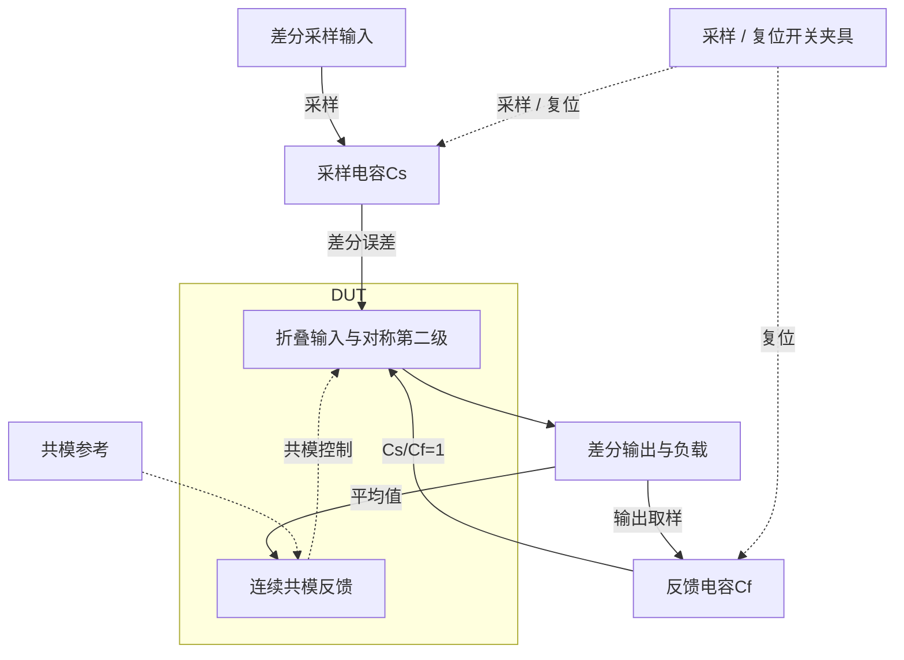

# 33 · 采样反馈OTA：电容闭环、双向建立、开环压缩摆幅与共模恢复

本模块在电容采样反馈网络中建立差分输出电压，信号增益由Cs/Cf设定。折叠输入级和对称第二级提供高直流增益，Miller补偿稳定差模环路，连续共模反馈把两路输出平均值控制在vocm附近。它能在较短时间内驱动采样电容，但需要权衡放大器噪声、输出摆幅、功耗和共模恢复。芯片中可用于流水线或逐次逼近ADC的前端缓冲、开关电容增益级和采样信号通路。

状态：**SMIC18MMRF / TT / 1.8 V / 27°C，全部对应 nominal 指标在10%放宽条件内通过；原门槛差异见正文**。只宣称原理图级 nominal；未执行其他PVT、失配或版图验证。审查PDF已逐页检查中文、图表和网表可读性。

[审查 PDF](../evidence/33-sampling-ota-gain1/review.pdf) · [精确电路](../evidence/33-sampling-ota-gain1/circuit.scs) · [验收合同](../evidence/33-sampling-ota-gain1/contract.json) · [实测结果](../evidence/33-sampling-ota-gain1/latest_results.json)

当前报告：**8页正文＋4页完整电路图，共12页**。下文历史交付记录中的页数对应当时的正文版本。

<!-- REPORT-MARKDOWN -->
## 可编辑报告与系统结构

[完整报告MD](../evidence/33-sampling-ota-gain1/review_report.md) · [对应PDF](../evidence/33-sampling-ota-gain1/review.pdf) · [Mermaid源文件](../evidence/33-sampling-ota-gain1/system_block_diagram.mmd) · [框图SVG](../evidence/33-sampling-ota-gain1/markdown_assets/system-block.svg)

电容网络与时序是外部闭环夹具，核心DUT为全差分OTA；还保留原报告中的其他独立测量维度。

实线为信号或能量通路，虚线为时钟、控制或偏置。

<!-- END-REPORT-MARKDOWN -->

## 本次结论与范围

在SMIC18MMRF TT、1.8V、27°C、IREF=50uA、VOCM=0.9V下，14项适用标称检查在10%放宽内完成。只有开环3dB压缩差分摆幅需要放宽：原值≥1.8V，实测1.699152937V，比原下限低5.60%；10%下限为1.62V。其他适用指标达到原门槛。

|指标|实测|原要求|
|---|---:|---:|
|返回比相位裕量|75.518708°|≥60°|
|环路UGB（表征）|66.413967MHz|原题无单独UGB门槛|
|零差分共模误差|3.638235mV|≤25mV|
|总DC功耗，含参考和CMFB|3.630798mW|≤5mW|
|原rise / fall建立|20.861216 / 22.062722ns|各≤40ns|
|原rise / fall的40ns误差|0.00403970% / 0.000039254%|各≤0.1%|
|高台 / 低台静态误差|0.00143024% / 0.000000361%|各≤0.01%|
|差分输出噪声，10Hz–10GHz|178.130295uVrms|≤300uVrms|
|共模扰动最大偏移|10.005584mV|≤150mV|
|释放20ns / 100ns残差|0.131592 / 0.000365636mV|≤50 / 20mV|

仅复现匹配的确定性nominal：未执行原30点矩阵的另外29点、两个非nominal共模扰动点或20次局部失配。匹配模型的CMRR/PSRR不能替代这些未执行的失配要求。[完整原合同](../evidence/33-sampling-ota-gain1/contract.json)和[实测结果](../evidence/33-sampling-ota-gain1/latest_results.json)明确保留该范围。

## 复用拓扑后必须重新验证测试网络

本项以工程35项的折叠输入、对称共源第二级和连续CMFB结构为起点。每个器件角色重新查询SMIC18 gm/ID表，单位宽度与表哈希一致；输入支路目标100uA，折叠源150uA，差额支路50uA，输出700uA，CMFB输入支路50uA。每侧Miller串联400Ω/2pF，共模检测为100kΩ并联100fF。原题允许理想R/C，DUT内没有独立源、受控源或行为器件。

第35项的历史通过不能直接计入本项。这里的Cs=Cf=1pF、CL=1pF，闭环是实际电容网络；环路等效负载每端为CL+Cs·Cf/(Cs+Cf)=1.5pF，返回比T=0.5A。实际求得一次下降零dB交越、之后无回穿。所有30只MOS的标称静态余量为正；动态性能仍以本题新仿真为准。

gm/ID只是初始选型。输入管实际体效应、镜电压差和共模反馈电流使OP偏离理想比例。例如输入实际98.7687uA、gm/ID=18.2121；输出实际732.059uA、gm/ID=5.9058；CMFB感测支路47.4725uA。全部器件OP和偏置节点均在结果中，完整尺寸在[选型记录](../evidence/33-sampling-ota-gain1/sizing.json)。

## 保留双向建立的原语义

原rise是差分输出从0走向−0.9V，原fall是回到0V。两外部输入源在25ns开始由0.9/0.9V变为0.45/1.35V，50ps边沿、80ns平台；后沿开始于105.05ns，而原判据时间原点仍是105ns。复现保持这个细节，没有为了得到更短建立时间修改原点。

用原0.9mV容差带，分别在25–104ns与105–170ns寻找最后容差交越，并要求窗口末端仍在带内。动态输出读65/145ns，静态读104/169ns，所有误差都除以0.9V。瞬时电容馈通造成原rise开始时约+0.189V、原fall开始时约−1.091V的短尖峰；原文件的导数极值受馈通影响，不解释为放大器本体压摆率。

差分阶跃期间最大输出共模误差45.590mV作为表征保存。原25mV指标针对零差分OP，那里实测3.638mV；不能把前者也说成满足25mV。

## 开环3dB摆幅不能用闭环命令范围替代

输入差分从−20uV至20uV，按原0.5uV步长共81点。对差分输出曲线求局部DC斜率，在峰值增益下降3dB的两个位置插值得到输出−0.849576469V和+0.849576468V，跨度1.699152937V。大输入时输出可到更宽范围，但已明显压缩，不能当作本题摆幅。

0.25uV、161点的诊断给出1.712869565V，与原网格差13.7166mV；符合事先0.05V比较界限，原/10%/15%判定全部不变。最终评分继续使用原81点，没有换成更有利的加密值。[数值复核](../evidence/33-sampling-ota-gain1/numerical_confirmation.json)保存两个运行和网格细节。

## 噪声与CMFB的测量对象

噪声量是完整电容反馈闭环下的差分输出噪声。对10Hz–10GHz输出谱幅度平方做线性频率梯形积分，得到178.130295uVrms；区间幂律PSD积分为178.115972uVrms，相差0.00804%。没有改用输入折算噪声或缩短积分带宽。

共模测试同时在每个输出吸收50uA，20ns平台、100ps边沿，另放一个未扰动相同DUT作参考。最大偏移在20–45ns取绝对差；脉冲40.2ns结束，20ns和100ns残差分别在60.2/140.2ns读取。两个串联零伏源只为保存真实扰动电流，电流幅度由原始波形独立确认。偏移基准是未扰动实例，而不是用VOCM把静态偏差混进恢复量。

## 匹配抑制是诊断，不是失配结果

保持原CMRR/PSRR分子A/(1+0.5A)，10Hz约6.02056dB；分母来自三个闭环扰动：输入共模、正电源、负电源。负电源激励时VSS绝对AC=+1、VDD相对VSS的AC=−1，使绝对VDD保持不动。

对称模型得到的差分馈通量约1e−14至1e−12V/V，受数值抵消限制。它们只作为匹配诊断保存，不能证明原20次局部失配样本的CMRR≥60dB和双轨PSRR≥70dB。失配样本计数明确为0。

## 测试台迁移与证据

初版出现两个明确接口问题：Spectre拒绝AC起止频率均为10Hz，改为求10Hz和不计分的11Hz；isource:p不是该电流源的可保存端口，改用串联零伏源测电流。失败运行和原因在[迭代记录](../evidence/33-sampling-ota-gain1/iteration_history.json)保留。最终六组及加密扫点均0错误、0警告；Bridge元数据的license error字符串误报以实际日志和完整PSF交叉确认。

独立审计重算25个测量量，并调用冻结的原nominal_functional及limit_check，expected=1明确表示本次nominal范围。40实例/140端子的四页晶体管图全部核对；PDF含8页正文与4页完整图纸。[测量复核](../evidence/33-sampling-ota-gain1/measurement-review.md)、[独立审计](../evidence/33-sampling-ota-gain1/verification_audit.json)、[完整总图](../evidence/33-sampling-ota-gain1/schematic/full.pdf)和[图纸端子映射](../evidence/33-sampling-ota-gain1/schematic/connectivity.json)随条目归档。

未执行全PVT、失配、电容误差、布局、PEX或开关采样器件非理想。原Sky130资料及既有PDK、Bridge、Spectre、LUT环境保持原样。

[完整 LUT 查询](../evidence/33-sampling-ota-gain1/sizing.json)

## 复现与证据

[完整电路总图 SVG](../evidence/33-sampling-ota-gain1/schematic/full.svg) · [总图 PDF](../evidence/33-sampling-ota-gain1/schematic/full.pdf) · [4页电路分图](../evidence/33-sampling-ota-gain1/schematic/sheets.pdf) · [引脚与层次连接映射](../evidence/33-sampling-ota-gain1/schematic/connectivity.json) · [图纸审计](../evidence/33-sampling-ota-gain1/schematic_audit.json)

- [Spectre 运行记录](https://github.com/SannBunnSyoSeTsu/smic18-benchmark-reproduction/blob/6ae3e1434914297c4ed12b93cb8d6a297ef8339a/runs/33/20260926T045001411009Z_loop/run.json) · 原始输出（本地归档，未随仓库分发）
- [Spectre 运行记录](https://github.com/SannBunnSyoSeTsu/smic18-benchmark-reproduction/blob/6ae3e1434914297c4ed12b93cb8d6a297ef8339a/runs/33/20260926T045002085901Z_settling/run.json) · 原始输出（本地归档，未随仓库分发）
- [Spectre 运行记录](https://github.com/SannBunnSyoSeTsu/smic18-benchmark-reproduction/blob/6ae3e1434914297c4ed12b93cb8d6a297ef8339a/runs/33/20260926T045003802136Z_noise/run.json) · 原始输出（本地归档，未随仓库分发）
- [Spectre 运行记录](https://github.com/SannBunnSyoSeTsu/smic18-benchmark-reproduction/blob/6ae3e1434914297c4ed12b93cb8d6a297ef8339a/runs/33/20260926T045004453597Z_ranges/run.json) · 原始输出（本地归档，未随仓库分发）
- [Spectre 运行记录](https://github.com/SannBunnSyoSeTsu/smic18-benchmark-reproduction/blob/6ae3e1434914297c4ed12b93cb8d6a297ef8339a/runs/33/20260926T045126176631Z_cmfb/run.json) · 原始输出（本地归档，未随仓库分发）
- [Spectre 运行记录](https://github.com/SannBunnSyoSeTsu/smic18-benchmark-reproduction/blob/6ae3e1434914297c4ed12b93cb8d6a297ef8339a/runs/33/20260926T045127516384Z_rejection/run.json) · 原始输出（本地归档，未随仓库分发）
- [工程脚本](https://github.com/SannBunnSyoSeTsu/smic18-benchmark-reproduction/tree/6ae3e1434914297c4ed12b93cb8d6a297ef8339a/scripts) · [项目状态](https://github.com/SannBunnSyoSeTsu/smic18-benchmark-reproduction/blob/6ae3e1434914297c4ed12b93cb8d6a297ef8339a/status.json)

原Sky130案例保持原样；本页是目标工艺实测的新记录。模型文件留在既有本地PDK目录，没有上传或修改。
