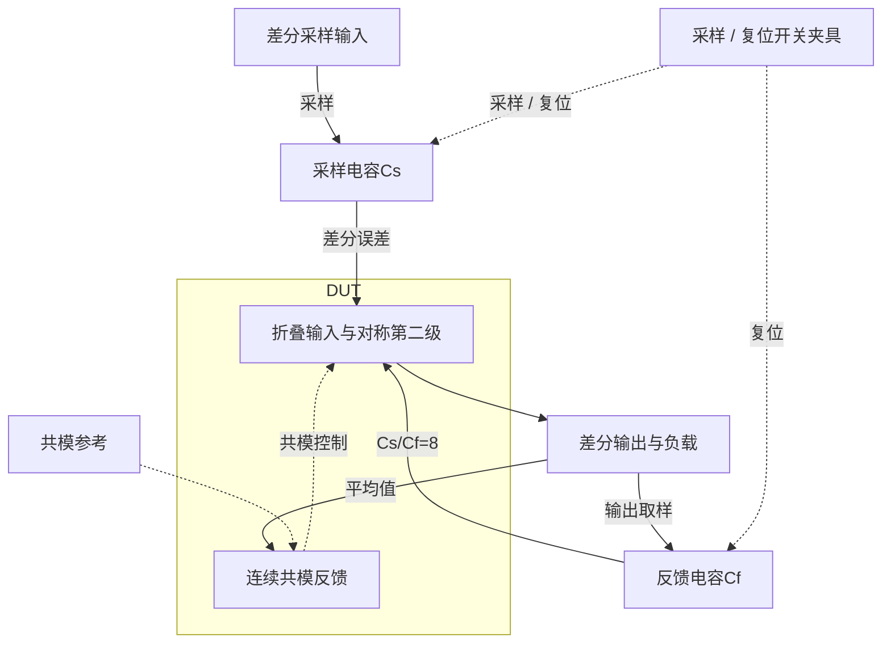

# 34 · 增益8采样反馈OTA：低反馈系数、gm/ID与补偿零点的速度权衡

本模块在采样电容与反馈电容比为8的闭环中建立差分输出，用于快速电压放大。折叠输入级提供增益和输入跨导，对称第二级驱动负载，Miller补偿与连续共模反馈分别控制差模稳定性和输出平均电压。增益8使反馈系数降至1/9，需要更大的跨导来维持建立速度，代价是电流、噪声与补偿设计更受约束。芯片中可用于流水线ADC余量放大、开关电容增益级和高速采样信号通路。

状态：**SMIC18MMRF / TT / 1.8 V / 27°C，全部对应 nominal 指标在10%放宽条件内通过；原门槛差异见正文**。只宣称原理图级 nominal；未执行其他PVT、失配或版图验证。审查PDF已逐页检查中文、图表和网表可读性。

[审查 PDF](../evidence/34-sampling-ota-gain8/review.pdf) · [精确电路](../evidence/34-sampling-ota-gain8/circuit.scs) · [验收合同](../evidence/34-sampling-ota-gain8/contract.json) · [实测结果](../evidence/34-sampling-ota-gain8/latest_results.json)

当前报告：**8页正文＋4页完整电路图，共12页**。下文历史交付记录中的页数对应当时的正文版本。

<!-- REPORT-MARKDOWN -->
## 可编辑报告与系统结构

[完整报告MD](../evidence/34-sampling-ota-gain8/review_report.md) · [对应PDF](../evidence/34-sampling-ota-gain8/review.pdf) · [Mermaid源文件](../evidence/34-sampling-ota-gain8/system_block_diagram.mmd) · [框图SVG](../evidence/34-sampling-ota-gain8/markdown_assets/system-block.svg)

电容网络与时序是外部闭环夹具，核心DUT为全差分OTA；还保留原报告中的其他独立测量维度。

实线为信号或能量通路，虚线为时钟、控制或偏置。

<!-- END-REPORT-MARKDOWN -->

## 本次结论与范围

在SMIC18MMRF TT、1.8V、27°C、IREF=50uA、VOCM=0.9V下，14项适用标称检查在10%放宽内完成。只有开环3dB压缩差分摆幅需要放宽：原值≥1.8V，实测1.657101361V，比原下限低7.94%；10%下限为1.62V。其余适用指标达到原门槛。

|指标|实测|原要求|
|---|---:|---:|
|返回比相位裕量|63.643323°|≥60°|
|环路UGB（表征）|121.770212MHz|原题无独立UGB门槛|
|零差分共模误差|22.383823mV|≤25mV|
|总DC功耗，含参考和CMFB|5.522229mW|≤10mW|
|原rise / fall建立|6.084337 / 6.113534ns|各≤10ns|
|原rise / fall的10ns误差|0.262547% / 0.326388%|各≤1%|
|高台 / 低台静态误差|0.0114792% / 3.58551e−9%|各≤1%|
|差分输出噪声，10Hz–10GHz|619.355963uVrms|≤1000uVrms|
|共模扰动最大偏移|12.821988mV|≤100mV|
|释放20ns / 100ns残差|0.0134373 / 0.00122922mV|≤5 / 1mV|

仅完成匹配的确定性nominal；未执行原30点PVT矩阵的另外29点、另外两点共模扰动或20次局部失配。原验收器的nominal_functional通过，但原摆幅门槛保留失败记录；迁移10%判据通过。[原合同](../evidence/34-sampling-ota-gain8/contract.json)、[实测结果](../evidence/34-sampling-ota-gain8/latest_results.json)与[独立复核](../evidence/34-sampling-ota-gain8/verification_audit.json)分别记录要求、数值和验证范围。

## 电容信号增益8与环路反馈系数1/9

本项采用折叠输入、对称共源第二级、Miller补偿和连续CMFB。信号输入电容Cs=1pF、反馈电容Cf=125fF、每端CL=250fF，信号增益幅度Cs/Cf=8；环路反馈系数是Cf/(Cs+Cf)=1/9，不能把它误写为1/8。环路台的每端等效负载为CL+Cs·Cf/(Cs+Cf)=0.361111pF，返回比T=A/9。实际建立台保留完整Cs/Cf/CL和1GH直流偏置电感。

以工程35项的结构为初值，所有模拟器件角色重新查询既有SMIC18 gm/ID表。输入目标从100uA提高到600uA，gm/ID从18降至10；单位n18尺寸1.94um/1um、m=60。折叠PMOS目标650uA、单位9.5um/1um、m=65。输出支路目标700uA，共模输入支路目标50uA。对于相同600uA目标，较低gm/ID所需宽度较小；最终输入总宽度116.4um仍大于35项的102.6um，不能把这次调整概括为绝对寄生电容下降。

这些是初算目标，不是实际支路电流。输入实际585.800364uA、折叠源665.291023uA，二者相差79.490659uA；实际折叠下拉支路79.488867uA，微小差异包含模型其他端子电流。输出实际约733.260uA。CMFB检测和参考支路分别约38.94992/59.05622uA，有限增益和偏置不对称留下22.383823mV零差分共模误差，距25mV上限仅约2.616mV。没有用理想共模源消除这项误差。

所有30只MOS的标称静态|VDS|−|VDSAT|为正；完整实际OP、体端和尺寸保存在[结果](../evidence/34-sampling-ota-gain8/latest_results.json)、[选型](../evidence/34-sampling-ota-gain8/sizing.json)与[总图](../evidence/34-sampling-ota-gain8/schematic/full.pdf)。静态余量不意味着整个大信号过程始终饱和。原题允许理想R/C，DUT没有独立源、受控源或行为器件。

## 一次明确失败后的补偿调整

每侧Miller电容0.64pF、串联电阻400Ω的首版，相位裕量只有49.551°，低于原60°及15%放宽后的51°，因此不能接受；即使双向建立约9.59/9.70ns已满足10ns，也不能忽略环路指标。

保持电流与补偿电容，只把串联电阻提高至1kΩ，相位裕量达到63.643323°，双向建立缩短至6.084337/6.113534ns。代价是输出积分噪声由592.888增加到619.355963uVrms，仍小于1mVrms。最终仅有一次下降零dB交越，之后无回穿。每侧共模取样仍为100kΩ并联100fF，级联偏置电阻为28kΩ/40kΩ。失败候选与最终结果均保存在[迭代记录](../evidence/34-sampling-ota-gain8/iteration_history.json)，没有更改性能门槛或模型。

## 双向建立保留原始时间语义

两外部源在25ns从0.9/0.9V变为0.95625/0.84375V，输入差分0.1125V经电容网络得到+0.9V目标。边沿50ps、平台40ns、周期100ns，仿真至105ns。原rise表示0→+0.9V，原fall表示回到0V。

按原验收器，建立时间原点为25/65ns；物理后沿实际从65.05ns开始，但没有修改计分原点。分别在25–64ns、65–105ns求最后一次离开9mV误差带的交越，并要求窗口末端留在带内。动态读35/75ns，静态读64/104ns，误差均除以固定0.9V。原误差容限均为1%，没有沿用33项较慢增益1电路的其他容限。

电容馈通影响边沿导数，因此导数峰值只作为原算法表征，不解释为纯放大器固有压摆率。阶跃中最大共模误差56.239825mV另行保存，未满足25mV；原25mV判据只用于零差分OP。

## 开环压缩摆幅与网格诊断

原输入差分−20至20uV、步长0.5uV，共81点。对输出差分曲线求局部斜率，找峰值增益下降3dB的两个位置并插值，得到输出约±0.828550681V，跨度1.657101361V。不能拿更大输入下已明显压缩的输出极值代替这项定义。

额外0.25uV、161点诊断得到1.660197205V，与原评分网格差3.095844mV，低于事先0.05V数值比较界限，原/10%/15%分级不变。最终仍使用原81点结果，详见[数值复核](../evidence/34-sampling-ota-gain8/numerical_confirmation.json)。

## 噪声、共模扰动与抑制的不同测量对象

完整电容反馈闭环下，差分输出噪声谱幅度平方在10Hz–10GHz做线性频率梯形积分，721点得到619.355963uVrms；区间幂律PSD积分619.302702uVrms，相对差0.00860%。没有改成输入折算噪声或缩短积分频带。

共模扰动在每个输出同时吸收50uA，100ps边沿、20ns平台，另一个未扰动相同DUT提供参考。峰值在20–45ns计算，脉冲结束于40.2ns，残差在60.2/140.2ns读取。零伏串联探针保存实际扰动电流。恢复量取扰动与参考轨迹之差，零差分静态偏差独立计分。

匹配抑制诊断沿用原分子A/(1+A/9)，10Hz约19.08465dB。输入共模、正电源、负电源分别激励；负电源激励采用VSS绝对AC=+1、VDD相对VSS AC=−1，令绝对VDD不动。对称模型的极小差分泄漏受浮点抵消限制，不能证明原20次局部失配中的CMRR≥50dB或双轨PSRR≥60dB。失配样本数明确为0。

## 完整证据与局限

独立审计重算25项测量，调用冻结的原nominal_functional与limit_check；expected=1明确限定本次单点范围。六组最终仿真及加密摆幅仿真均0错误、0警告。Bridge的license error元数据误报由真实日志及完整PSF交叉识别，原元数据保留。

40个器件实例、140个端子的四页晶体管图与网表逐项核对；报告含8页正文和4页图纸。[测量复核](../evidence/34-sampling-ota-gain8/measurement-review.md)、[连接映射](../evidence/34-sampling-ota-gain8/schematic/connectivity.json)、原始运行/输入/模型哈希及生成脚本随条目归档。未执行全PVT、失配、电容误差、布局、PEX或实际开关采样器件的非理想。原Sky130档案、既有PDK、Bridge、Spectre与LUT环境保持原样。

[完整 LUT 查询](../evidence/34-sampling-ota-gain8/sizing.json)

## 复现与证据

[完整电路总图 SVG](../evidence/34-sampling-ota-gain8/schematic/full.svg) · [总图 PDF](../evidence/34-sampling-ota-gain8/schematic/full.pdf) · [4页电路分图](../evidence/34-sampling-ota-gain8/schematic/sheets.pdf) · [引脚与层次连接映射](../evidence/34-sampling-ota-gain8/schematic/connectivity.json) · [图纸审计](../evidence/34-sampling-ota-gain8/schematic_audit.json)

- [Spectre 运行记录](https://github.com/SannBunnSyoSeTsu/smic18-benchmark-reproduction/blob/6ae3e1434914297c4ed12b93cb8d6a297ef8339a/runs/34/20260926T051410229625Z_loop/run.json) · 原始输出（本地归档，未随仓库分发）
- [Spectre 运行记录](https://github.com/SannBunnSyoSeTsu/smic18-benchmark-reproduction/blob/6ae3e1434914297c4ed12b93cb8d6a297ef8339a/runs/34/20260926T051253347871Z_settling/run.json) · 原始输出（本地归档，未随仓库分发）
- [Spectre 运行记录](https://github.com/SannBunnSyoSeTsu/smic18-benchmark-reproduction/blob/6ae3e1434914297c4ed12b93cb8d6a297ef8339a/runs/34/20260926T051254766475Z_noise/run.json) · 原始输出（本地归档，未随仓库分发）
- [Spectre 运行记录](https://github.com/SannBunnSyoSeTsu/smic18-benchmark-reproduction/blob/6ae3e1434914297c4ed12b93cb8d6a297ef8339a/runs/34/20260926T051255397974Z_ranges/run.json) · 原始输出（本地归档，未随仓库分发）
- [Spectre 运行记录](https://github.com/SannBunnSyoSeTsu/smic18-benchmark-reproduction/blob/6ae3e1434914297c4ed12b93cb8d6a297ef8339a/runs/34/20260926T051255993686Z_cmfb/run.json) · 原始输出（本地归档，未随仓库分发）
- [Spectre 运行记录](https://github.com/SannBunnSyoSeTsu/smic18-benchmark-reproduction/blob/6ae3e1434914297c4ed12b93cb8d6a297ef8339a/runs/34/20260926T051258060672Z_rejection/run.json) · 原始输出（本地归档，未随仓库分发）
- [工程脚本](https://github.com/SannBunnSyoSeTsu/smic18-benchmark-reproduction/tree/6ae3e1434914297c4ed12b93cb8d6a297ef8339a/scripts) · [项目状态](https://github.com/SannBunnSyoSeTsu/smic18-benchmark-reproduction/blob/6ae3e1434914297c4ed12b93cb8d6a297ef8339a/status.json)

原Sky130案例保持原样；本页是目标工艺实测的新记录。模型文件留在既有本地PDK目录，没有上传或修改。
