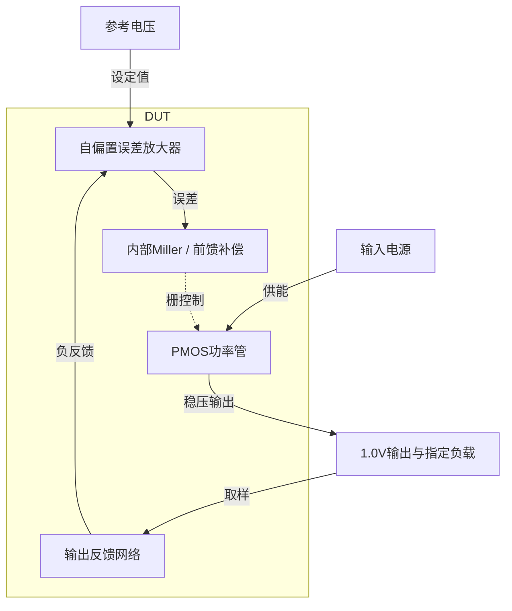

# 38 · 无外部电容LDO：内部补偿、负载恢复与供电抑制

本模块通过PMOS功率管将输入电源稳压至1.0V，反馈分压器把输出与0.4V参考比较。自偏置误差放大器和内部Miller、前馈及输出电容承担环路补偿，无需外部输出电容；代价是接近1nF的内部理想电容预算、静态电流与瞬态恢复需要共同权衡。芯片中可用作片上局部稳压电源，本次验证TT下两档供电的负载调节、供电抑制及动态响应。

状态：**SMIC18MMRF / TT / 1.8 V / 27°C，全部对应 nominal 原始指标通过**。只宣称原理图级 nominal；未执行其他PVT、失配或版图验证。审查PDF已逐页检查中文、图表和网表可读性。

[审查 PDF](../evidence/38-capless-ldo/review.pdf) · [精确电路](../evidence/38-capless-ldo/circuit.scs) · [验收合同](../evidence/38-capless-ldo/contract.json) · [实测结果](../evidence/38-capless-ldo/latest_results.json)

当前报告：**7页正文＋3页完整电路图，共10页**。下文历史交付记录中的页数对应当时的正文版本。

<!-- REPORT-MARKDOWN -->
## 可编辑报告与系统结构

[完整报告MD](../evidence/38-capless-ldo/review_report.md) · [对应PDF](../evidence/38-capless-ldo/review.pdf) · [Mermaid源文件](../evidence/38-capless-ldo/system_block_diagram.mmd) · [框图SVG](../evidence/38-capless-ldo/markdown_assets/system-block.svg)

反馈、补偿和功率管构成同一稳压环路；参考与负载按本题合同保留。

实线为信号或能量通路，虚线为时钟、控制或偏置。

<!-- END-REPORT-MARKDOWN -->

## 完整标称结果

SMIC18MMRF TT、27°C，VREF固定0.4V。保留原题1.5V及1.8V两种功能供电，DC负载0–20mA、双向负载阶跃、重载PSR，以及1.8V启动。全部16项适用原门槛通过，无需放宽。外部输出电容为零，内部4个电容合计977pF，低于固定1nF预算。

|指标|1.5V供电|1.8V供电|原门槛|
|---|---:|---:|---|
|最大DC误差/mV|4.944897|5.114850|≤30，中心1V固定|
|空载IQ/µA|88.214397|93.868231|≤100|
|20mA、1kHz PSR/dB|63.083475|65.129399|≥30 / ≥35|
|20mA、100kHz PSR/dB|29.182903|29.747297|≥20|
|20mA、1MHz PSR/dB|14.442847|14.954456|≥10|
|负载上升最低输出/V|0.944554376|0.946956491|≥0.85|
|负载下降最高输出/V|1.072300513|1.069102965|≤1.15|
|最大阶跃偏移/mV|72.300513|69.102965|≤150|
|最大尾窗误差/mV|2.556295|2.626774|≤30|
|启动峰值/V|未规定|1.049246774|≤1.05|
|启动尾窗误差/mV|未规定|2.625166|≤20|

启动峰值距原上限仅0.753226mV，不能据此宣称具有PVT或失配裕量。[完整结果](../evidence/38-capless-ldo/latest_results.json)保存每个窗口、原/10%/15%边界；[合同](../evidence/38-capless-ldo/contract.json)保留固定参考和电容预算。其余28个DC/负载阶跃、8个PSR及3个启动角点未执行。

## 电路、尺寸和实际工作点

电路包含14只原生n18/p18、6只题目允许的理想电阻及4只内部理想电容，共24实例76端子。RSTART=1MΩ为β倍增偏置提供启动路径；NMOS的1:4比例及Rs=12.3kΩ建立电流，PMOS镜产生尾偏置。隔离体PMOS输入的体端分别接共用tail源节点。两路电流镜和K=3.5输出支路驱动PMOS功率管，30kΩ/20kΩ分压将1V反馈为0.4V。

[gm/ID尺寸依据](../evidence/38-capless-ldo/sizing.json)直接来自既有SMIC18实测LUT，未改动原表：

- NMOS偏置单位0.98/1µm，gm/ID10、5µA；PMOS偏置10.40/1µm，gm/ID14、5µA。
- PMOS输入单位4.08/0.36µm，gm/ID18、2.5µA。
- NMOS镜1.10/1µm、PMOS镜5.20/1µm，均以gm/ID14、2.5µA初选，输出镜倍率3.5。
- PMOS功率管单位15.66/0.36µm，gm/ID10、50µA，倍率400，总宽6264µm。

减少Rs后，最终实际尾电流约11.00µA，并非初选5µA；输入两支路约5.50µA，gm/ID约14.23。1.8V/20mA时，功率管电流20.020mA、gm/ID10.13；输出镜支路约19.72–19.73µA。报告列出全部14只MOS的实际OP，使初选与实际偏置分开可审查。

内部CM=3pF串联RZ=2.2kΩ补偿，CF=10pF跨越上反馈电阻；输出直接电容C2=270pF，另一支路由150Ω与C1=694pF串联。合计3+10+270+694=977pF。理想R/C为原题允许器件；其面积、工艺容差和版图寄生没有建模。大功率管及内部储能电容会有明显面积代价，尚无版图面积结果。

## 保留失败候选与测量定义

[迭代记录](../evidence/38-capless-ldo/iteration_history.json)保留五个设计候选及最终数值确认：

|候选|Rs/kΩ|CF/C2/C1，pF|1.5V PSR@1MHz/dB|启动峰值/V|结果|
|---|---:|---|---:|---:|---|
|1|20|4/120/850|8.179|1.066897|未通过15%|
|2|15|4/270/700|10.105|1.056419|15%|
|3|15|10/270/694|12.853|1.054625|10%|
|4|13|10/270/694|13.992|1.050607|10%|
|5|12.3|10/270/694|14.443|1.049246|原门槛|

增加直接输出电容和前馈改善高频PSR与阶跃；降低Rs提高控制电流以抑制启动过冲。代价是1.8V空载IQ由首版约57.37µA增加到93.87µA，距离100µA原上限约6.13µA。

DC在0–20mA扫描，最终步长0.1mA，共201点。IQ为无外部负载时|I(VIN)|，包含内部约20µA分压电流；原题不计理想VREF供电，本实现VREF仅接MOS栅，DC电流为0。PSR使用闭环20mA负载，VIN注入AC1V，按−20log10|VOUT|，100Hz–10MHz保留全范围及三个评分点。

负载20–21µs由0.5mA升至20mA，60–61µs降回0.5mA。20–41µs及60–81µs窗口以固定1V判定±150mV；41–60µs及81–100µs尾窗判定±30mV。边界使用插值纳入，未以各次稳态电平重新居中。

启动VIN在100µs内从0升到1.8V，VREF保持0.4V，负载为2kΩ，仿真400µs。峰值取全程最大值，稳定误差使用200–400µs，未改用恒流启动负载。峰值约发生在59µs、VIN约1.06V时。原题无独立内部环路断点，PM和UGB不是验收项；此处仅报告实际测得的外部动态结果。

## 数值确认、独立审查与复现

[数值计划](../evidence/38-capless-ldo/numerical_plan.json)在复算前冻结。7个基线和7个最终运行均0错误/0警告。DC步长0.2→0.1mA、AC40→160点/dec、阶跃maxstep20→10ns、启动200→100ns、reltol1e-6→1e-7，电路和夹具保持一致。[38项对照](../evidence/38-capless-ldo/numerical_confirmation.json)全部通过：最大窗口电压变化8.833µV，小于200µV固定界限；启动峰值差1.056µV；PSR最大差0.000491dB，小于0.01dB；DC与IQ为零差异。原等级保持通过。

[独立审计](../evidence/38-capless-ldo/verification_audit.json)重算40个标量，使用独立边界查找、插值及复数功率形式计算PSR；独立静态累加内部电容预算，并核对功率管极性与所有器件合法性。调用上游8组检查函数时，仅将预期点明确投影至TT27°C的两供电及一次启动，原门槛和原文件不变。审查细节见[测量复核](../evidence/38-capless-ldo/measurement-review.md)与[独立明细](../evidence/38-capless-ldo/independent_measurement_details.json)。

10页报告包含7页正文和3页完整图纸，每页与总图均已实际查看。独立连接解析覆盖24实例76端子，反馈、体端和全部内部补偿完整。[完整图纸](../evidence/38-capless-ldo/schematic/full.pdf)及[sizing](../evidence/38-capless-ldo/sizing.json)与最终电路同一哈希：44f175530b8c48e901aa078ddc595bec1cefd3f2487f5ea63e9d71566ec7d2d5。

工程根目录使用既有Bridge Python依次运行scripts/case38_capless_ldo.py、confirm38.py、schematic38.py、audit38.py、review38.py。重生成PDF后必须重新实际逐页审查。原始输入、运行快照、源资料和工具版本均冻结；PDK、Bridge、Spectre、原LUT及上游知识未修改。失配、噪声、布局、PEX以及完整PVT仍未验证。

[完整 LUT 查询](../evidence/38-capless-ldo/sizing.json)

## 复现与证据

[完整电路总图 SVG](../evidence/38-capless-ldo/schematic/full.svg) · [总图 PDF](../evidence/38-capless-ldo/schematic/full.pdf) · [3页电路分图](../evidence/38-capless-ldo/schematic/sheets.pdf) · [引脚与层次连接映射](../evidence/38-capless-ldo/schematic/connectivity.json) · [图纸审计](../evidence/38-capless-ldo/schematic_audit.json)

- [Spectre 运行记录](https://github.com/SannBunnSyoSeTsu/smic18-benchmark-reproduction/blob/6ae3e1434914297c4ed12b93cb8d6a297ef8339a/runs/38/20260928T174319536028Z_dc1.5/run.json) · 原始输出（本地归档，未随仓库分发）
- [Spectre 运行记录](https://github.com/SannBunnSyoSeTsu/smic18-benchmark-reproduction/blob/6ae3e1434914297c4ed12b93cb8d6a297ef8339a/runs/38/20260928T174320704183Z_psr1.5/run.json) · 原始输出（本地归档，未随仓库分发）
- [Spectre 运行记录](https://github.com/SannBunnSyoSeTsu/smic18-benchmark-reproduction/blob/6ae3e1434914297c4ed12b93cb8d6a297ef8339a/runs/38/20260928T174321383239Z_step1.5/run.json) · 原始输出（本地归档，未随仓库分发）
- [Spectre 运行记录](https://github.com/SannBunnSyoSeTsu/smic18-benchmark-reproduction/blob/6ae3e1434914297c4ed12b93cb8d6a297ef8339a/runs/38/20260928T174324393652Z_dc1.8/run.json) · 原始输出（本地归档，未随仓库分发）
- [Spectre 运行记录](https://github.com/SannBunnSyoSeTsu/smic18-benchmark-reproduction/blob/6ae3e1434914297c4ed12b93cb8d6a297ef8339a/runs/38/20260928T174325026641Z_psr1.8/run.json) · 原始输出（本地归档，未随仓库分发）
- [Spectre 运行记录](https://github.com/SannBunnSyoSeTsu/smic18-benchmark-reproduction/blob/6ae3e1434914297c4ed12b93cb8d6a297ef8339a/runs/38/20260928T174325664480Z_step1.8/run.json) · 原始输出（本地归档，未随仓库分发）
- [Spectre 运行记录](https://github.com/SannBunnSyoSeTsu/smic18-benchmark-reproduction/blob/6ae3e1434914297c4ed12b93cb8d6a297ef8339a/runs/38/20260928T174328676140Z_start/run.json) · 原始输出（本地归档，未随仓库分发）
- [工程脚本](https://github.com/SannBunnSyoSeTsu/smic18-benchmark-reproduction/tree/6ae3e1434914297c4ed12b93cb8d6a297ef8339a/scripts) · [项目状态](https://github.com/SannBunnSyoSeTsu/smic18-benchmark-reproduction/blob/6ae3e1434914297c4ed12b93cb8d6a297ef8339a/status.json)

原Sky130案例保持原样；本页是目标工艺实测的新记录。模型文件留在既有本地PDK目录，没有上传或修改。
