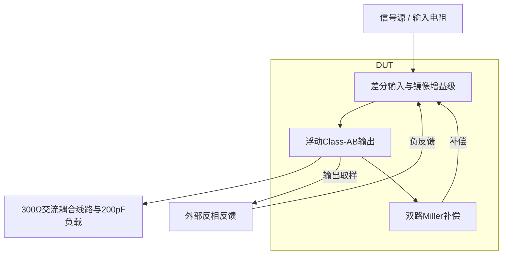

# 39 · 低功耗线驱动：浮动Class-AB、重负载驱动与完整失真口径

本模块用反相闭环把电压信号送到300Ω交流耦合线路，并驱动200pF输出电容。输入差分对和电流镜提供增益，浮动Class-AB偏置让互补输出管以较低静态电流提供毫安级动态电流；双路Miller补偿控制重负载下的稳定性。代价是复制偏置、输出级非线性及带宽需要共同权衡。芯片中可用于音频或低频通信线驱动，以及需要低待机功耗的模拟输出接口。

状态：**SMIC18MMRF / TT / 1.8 V / 27°C，全部对应 nominal 原始指标通过**。只宣称原理图级 nominal；未执行其他PVT、失配或版图验证。审查PDF已逐页检查中文、图表和网表可读性。

[审查 PDF](../evidence/39-line-driver/review.pdf) · [精确电路](../evidence/39-line-driver/circuit.scs) · [验收合同](../evidence/39-line-driver/contract.json) · [实测结果](../evidence/39-line-driver/latest_results.json)

当前报告：**8页正文＋3页完整电路图，共11页**。下文历史交付记录中的页数对应当时的正文版本。

<!-- REPORT-MARKDOWN -->
## 可编辑报告与系统结构

[完整报告MD](../evidence/39-line-driver/review_report.md) · [对应PDF](../evidence/39-line-driver/review.pdf) · [Mermaid源文件](../evidence/39-line-driver/system_block_diagram.mmd) · [框图SVG](../evidence/39-line-driver/markdown_assets/system-block.svg)

框图显示反相闭环、功率输出和外部线路边界；不引入未实现的收发协议。

实线为信号或能量通路，虚线为时钟、控制或偏置。

<!-- END-REPORT-MARKDOWN -->

## 本次结论

SMIC18MMRF TT、1.8V、27°C下，10项适用标称指标全部达到原门槛，无需放宽。外部唯一偏置为50uA；两只10kΩ电阻构成以0.9V为参考的反相−1闭环，输出连接1uF耦合电容、300Ω线路和200pF对地负载。

|指标|实测|原要求|
|---|---:|---:|
|10Hz返回比增益|72.512717dB|≥40dB|
|环路UGB|0.592917MHz|≥0.5MHz|
|相位裕量|84.769971°|≥60°|
|静态输出偏差|2.821331mV|≤20mV|
|静态VDD功耗|355.813589uW|≤400uW|
|20kHz输出基波|0.598105050Vpk|≥0.55Vpk|
|2–9次谐波THD|0.323122988%|≤3%|
|正弦峰值VDD电流|2.223546306mA|≥2mA|
|峰值/静态电流比|11.248540|≥10|
|连续跟踪命令跨度|1.600000Vpp|≥1.5Vpp，固定20mV误差带|

本次范围仅为匹配nominal，原45点矩阵的另外44点没有执行。原检查函数仍带有pvt名称，但独立审计明确以expected=1调用，不能据此宣称全PVT通过。[合同](../evidence/39-line-driver/contract.json)、[实测结果](../evidence/39-line-driver/latest_results.json)和[独立复核](../evidence/39-line-driver/verification_audit.json)共同限定该范围。

## 低静态电流与毫安级动态驱动

NMOS差分输入对和电流镜产生两路输出栅控制，互补浮动Class-AB管连接gp/gn。每个复制偏置堆叠的上管与对应浮动控制管匹配电流密度，下管与输出管共享单位几何，设置初始静态电流目标。所有NMOS体端接vss、PMOS体端接vdd，真实源体偏置在模型中保留。

七个器件角色重新查询现有SMIC18 gm/ID LUT：L=1um的输入管目标gm/ID=18，偏置管14；L=0.36um的浮动控制管14，输出管22。输出单位宽度n18为6.94um、p18为26.92um，各m=14，总宽97.16/376.88um。较高输出gm/ID有利于低静态电流下的跨导，但需要较宽器件，也增加栅电容。全部尺寸及表哈希见[选型记录](../evidence/39-line-driver/sizing.json)。

初算尾电流20uA、输出70uA；实际尾电流19.749590uA，输出NMOS/PMOS分别87.170179/87.311281uA。实际总静态电流197.674216uA，包含外部50uA参考、两组AB复制偏置和全部内部电流镜，因此静态功耗为355.813589uW。不能用初始目标或输出单支路电流代替总供电电流。

全部静态|VDS|−|VDSAT|为正；高gm/ID输出及复制下管的部分region=3表示弱反型区，不等于没有电流。报告保留22只MOS的实际ID、gm/ID和端压。全部27个器件实例、98个端子在[完整总图](../evidence/39-line-driver/schematic/full.pdf)及[连接映射](../evidence/39-line-driver/schematic/connectivity.json)中可追溯。DUT只使用n18/p18和正值理想R/C，符合原题迁移后的器件范围。

## 带宽失败后的补偿取舍

首版每侧12pF/1kΩ串联Miller补偿，UGB只有0.305379MHz，低于原0.5MHz和15%下限0.425MHz；相位裕量88.133°很高也不能补偿带宽失败。保持偏置及输出尺寸，把每侧电容改为6pF，UGB升至0.592917MHz，相位裕量降至84.770°，两项同时达到原值。gp与gn之间的2MΩ电阻保留。

断环测量沿用原串联VTEST：DC为0，AC为1V，返回比T=−V(vout)/V(fbv)。两只10kΩ、耦合电容、线路及200pF均在台内。频扫1Hz–1GHz，每十倍频60点，只有一次下降零dB交越，之后没有回穿。不能用另一负载下的开环增益替代该返回比。[迭代记录](../evidence/39-line-driver/iteration_history.json)保存失败候选。

## 谐波和峰值电流保持原窗口

输入为0.9V偏置、0.6Vpk、20kHz正弦，运行400us。舍弃前四周期，在200–400us后四周期上按原算法插值2048个均匀点，末端不重复；分别投影1–9次余弦/正弦分量，THD=100·sqrt(sum(A2²…A9²))/A1。独立复核调用冻结的原harmonic_fit，同时用含DC及1–9次谐波的最小二乘拟合比较，没有把单周期fourier结果或更高次谐波混入原评分。

峰值VDD电流直接取200–400us内全部自适应波形点，并包含边界插值，不能改用2048个谐波样点来寻找峰值。分母是同一PVT下静态总供电电流197.674216uA，峰值为2.223546306mA，动态/静态比11.248540。线路电流与VDD电流是不同测量对象，后者含所有内部偏置和输出驱动。

1uF耦合电容的充电和线路直流偏置保持真实轨迹。没有延后原评分窗、去除充电项或把线路替换成轻载。

## 连续跟踪范围不是带载直流摆幅

原DC输入0.1–1.7V、步长2mV，共801点，命令输出为1.8−输入。在0.9V附近向两侧检查连续满足固定20mV误差带的区间；遇到坏点必须中断，不能跨过不连续死区。原算法使用离散合格端点，不做越界外推。

本候选全部801点合格，命令范围0.1–1.7V，跨度1.6Vpp，最大误差3.182339mV。DC时1uF耦合电容开路，所以该结果不是在300Ω直流负载下维持1.6Vpp的证明；动态驱动能力由单独的正弦测试证明。

## 真实收敛失败及等效修正

第一次100ns/1e-6基线通过，但50ns/1e-7复核在2.5609us发生SPECTRE-16927：最小时间步下Newton多次不收敛，日志指出理想零伏VSS支路电流异常。Bridge把这次错误分类为license error，真实日志却确实有1个错误，不能视作普通字符串误报。

修正只把理想零伏源两端合并到地，消除冗余支路未知量。DUT、激励、线路、200pF负载和所有原测量窗口均不变；重新运行三组测试台。修正前后基线基波仅差约2nV、THD差约0.0000038个百分点，符合电气等效预期。没有调整PDK、加入虚构cmin或放宽验收条件。

随后固定比较界限为THD差≤0.005个百分点、基波差≤0.1mV、峰值电流差≤1uA，且验收等级不变。100ns/1e-6与50ns/1e-7对比实际差分别0.000043234个百分点、5.843982uV、0.026340uA，全部通过。最终采用更严瞬态数据。[数值复核](../evidence/39-line-driver/numerical_confirmation.json)及原失败运行均保留。

## 交付证据与未执行范围

三组最终仿真及有效数值基线均0错误、0警告。独立审计比较14个测量量、调用原8组标称检查、验证完整负载和刺激、核对源资料/模型/LUT及每次运行输入快照的哈希。[测量复核表](../evidence/39-line-driver/measurement-review.md)与11页审查PDF包含实际波形、完整三页晶体管图和迭代原因。

未执行另外44个PVT点、失配、无源容差、物理电容面积、布局/PEX、短路保护或寿命验证。原Sky130档案与既有PDK、Bridge、Spectre、LUT环境保持原样；本次只更新已授权的SMIC18复现知识分区。

[完整 LUT 查询](../evidence/39-line-driver/sizing.json)

## 复现与证据

[完整电路总图 SVG](../evidence/39-line-driver/schematic/full.svg) · [总图 PDF](../evidence/39-line-driver/schematic/full.pdf) · [3页电路分图](../evidence/39-line-driver/schematic/sheets.pdf) · [引脚与层次连接映射](../evidence/39-line-driver/schematic/connectivity.json) · [图纸审计](../evidence/39-line-driver/schematic_audit.json)

- [Spectre 运行记录](https://github.com/SannBunnSyoSeTsu/smic18-benchmark-reproduction/blob/6ae3e1434914297c4ed12b93cb8d6a297ef8339a/runs/39/20260926T053218781021Z_loop/run.json) · 原始输出（本地归档，未随仓库分发）
- [Spectre 运行记录](https://github.com/SannBunnSyoSeTsu/smic18-benchmark-reproduction/blob/6ae3e1434914297c4ed12b93cb8d6a297ef8339a/runs/39/20260926T053219419035Z_swing/run.json) · 原始输出（本地归档，未随仓库分发）
- [Spectre 运行记录](https://github.com/SannBunnSyoSeTsu/smic18-benchmark-reproduction/blob/6ae3e1434914297c4ed12b93cb8d6a297ef8339a/runs/39/20260926T053257519087Z_thd/run.json) · 原始输出（本地归档，未随仓库分发）
- [工程脚本](https://github.com/SannBunnSyoSeTsu/smic18-benchmark-reproduction/tree/6ae3e1434914297c4ed12b93cb8d6a297ef8339a/scripts) · [项目状态](https://github.com/SannBunnSyoSeTsu/smic18-benchmark-reproduction/blob/6ae3e1434914297c4ed12b93cb8d6a297ef8339a/status.json)

原Sky130案例保持原样；本页是目标工艺实测的新记录。模型文件留在既有本地PDK目录，没有上传或修改。
