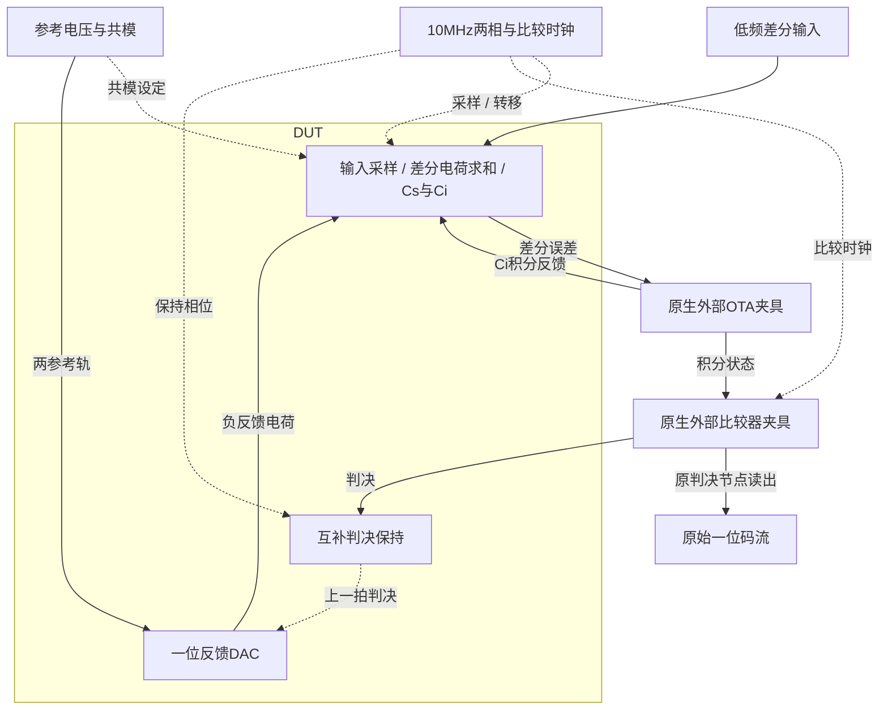

# 40 · 一阶Delta-Sigma ADC：电荷积分与一位噪声整形

本模块通过开关电容积分器与一位反馈DAC，把低频差分输入编码为高采样率的一位码流。闭环积分将量化误差向高频整形，配合过采样可改善带内信噪失真比；代价是带宽、时钟、积分器建立和后续数字滤波。芯片中可用于低带宽传感器与音频采集，本次验证模拟调制器而未实现数字抽取滤波器。

状态：**SMIC18MMRF / TT / 1.8 V / 27°C，全部对应 nominal 原始指标通过**。只宣称原理图级 nominal；未执行其他PVT、失配或版图验证。审查PDF已逐页检查中文、图表和网表可读性。

[审查 PDF](../evidence/40-delta-sigma/review.pdf) · [精确电路](../evidence/40-delta-sigma/circuit.scs) · [验收合同](../evidence/40-delta-sigma/contract.json) · [实测结果](../evidence/40-delta-sigma/latest_results.json)

当前报告：**7页正文＋11页完整电路图，共18页**。下文历史交付记录中的页数对应当时的正文版本。

<!-- REPORT-MARKDOWN -->
## 可编辑报告与系统结构

[完整报告MD](../evidence/40-delta-sigma/review_report.md) · [对应PDF](../evidence/40-delta-sigma/review.pdf) · [Mermaid源文件](../evidence/40-delta-sigma/system_block_diagram.mmd) · [框图SVG](../evidence/40-delta-sigma/markdown_assets/system-block.svg)

OTA与比较器按原题归为明确迁移的外部晶体管夹具；本次只实现模拟调制器，没有数字抽取滤波器。

实线为信号或能量通路，虚线为时钟、控制或偏置。

<!-- END-REPORT-MARKDOWN -->

## 标称结果

TT/1.8V/27°C、10MHz、N512、OSR32，三组原指标通过。主/较小正/较小反极性SNDR为44.1005132/41.7458687/43.963071dB。最坏原算术电流功耗1.75966373mW，真实时间加权VDD功耗1.59932432mW，均低于2mW。

## 结构与边界

Cs200fF、Ci450fF、判决保持300fF，互补开关控制一位DAC及电荷转移。外部OTA与StrongARM夹具以原生gm/ID尺寸明确迁移，随后固定，拓扑与50uA参考比例保留；不声称原Sky130晶体管动态原样一致。

原提取器在Spectre恰好导出0/58us时可能外推58.02us后夹到终点；合同明确只取实际记录内580点20ns..57.92us，再取最后512点6.82..57.92us。原analyze()未改，原9组电气不等式全部复核。原自适应点电流算术均值与物理时间加权能量均明确列出，理想外部时钟/输入/参考能量未计入原上限。

## 验证与证据

频谱横轴采用log频率，保留原512点矩形窗FFT和全部评分频点；图中20dB/dec虚线是任意竖直偏移的一阶NTF低频渐近参照，不是对确定性码流的斜率拟合。分辨率19.53125kHz，未据此宣称随机噪声PSD验证通过。

1→0.5ns、全局reltol1e-5→1e-6，最终码流一致，全部预设精度检查通过。42项独立数值复核，完整图纸11页。未作PVT、噪声、失配、PEX或数字抽取验证。

[报告Markdown](../evidence/40-delta-sigma/review_report.md)、[独立测量](../evidence/40-delta-sigma/measurement-review.md)、[合同](../evidence/40-delta-sigma/contract.json)、[数值确认](../evidence/40-delta-sigma/numerical_confirmation.json)、[码流/频谱](../evidence/40-delta-sigma/conversion_records.json)、[完整生成脚本](../evidence/40-delta-sigma/implementation)均保留。PDF由Matplotlib生成，Markdown不是其编译输入。

电路SHA-256：`86767b3e18b29812fe33bfdfa9971c67dff4512ca22bafaa31356676d058bbf4`。

[完整 LUT 查询](../evidence/40-delta-sigma/sizing.json)

## 复现与证据

[完整电路总图 SVG](../evidence/40-delta-sigma/schematic/full.svg) · [总图 PDF](../evidence/40-delta-sigma/schematic/full.pdf) · [11页电路分图](../evidence/40-delta-sigma/schematic/sheets.pdf) · [引脚与层次连接映射](../evidence/40-delta-sigma/schematic/connectivity.json) · [图纸审计](../evidence/40-delta-sigma/schematic_audit.json)

- [Spectre 运行记录](https://github.com/SannBunnSyoSeTsu/smic18-benchmark-reproduction/blob/6ae3e1434914297c4ed12b93cb8d6a297ef8339a/runs/40/20260929T035610029934Z_nominal/run.json) · 原始输出（本地归档，未随仓库分发）
- [Spectre 运行记录](https://github.com/SannBunnSyoSeTsu/smic18-benchmark-reproduction/blob/6ae3e1434914297c4ed12b93cb8d6a297ef8339a/runs/40/20260929T035825582019Z_mid_pos/run.json) · 原始输出（本地归档，未随仓库分发）
- [Spectre 运行记录](https://github.com/SannBunnSyoSeTsu/smic18-benchmark-reproduction/blob/6ae3e1434914297c4ed12b93cb8d6a297ef8339a/runs/40/20260929T040035071823Z_mid_inv/run.json) · 原始输出（本地归档，未随仓库分发）
- [工程脚本](https://github.com/SannBunnSyoSeTsu/smic18-benchmark-reproduction/tree/6ae3e1434914297c4ed12b93cb8d6a297ef8339a/scripts) · [项目状态](https://github.com/SannBunnSyoSeTsu/smic18-benchmark-reproduction/blob/6ae3e1434914297c4ed12b93cb8d6a297ef8339a/status.json)

原Sky130案例保持原样；本页是目标工艺实测的新记录。模型文件留在既有本地PDK目录，没有上传或修改。
