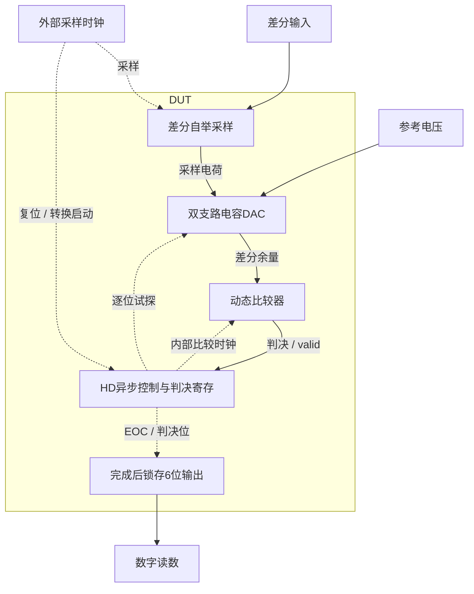

# 42 · 6位异步SAR ADC：采样、CDAC与逐位握手

本模块以差分自举采样、电容DAC和动态比较器完成六位逐次逼近转换。异步HD控制器依次保存判决，转换结束再更新输出；自举采样改善宽输入摆幅下的导通能力，代价是额外存储电容、开关应力和时序约束。芯片中可用于中低分辨率高速采集与混合信号接口，噪声、匹配和参考驱动仍需单独验证。

状态：**SMIC18MMRF / TT / 1.8 V / 27°C，全部对应 nominal 原始指标通过**。只宣称原理图级 nominal；未执行其他PVT、失配或版图验证。审查PDF已逐页检查中文、图表和网表可读性。

[审查 PDF](../evidence/42-sar-adc6bit/review.pdf) · [精确电路](../evidence/42-sar-adc6bit/circuit.scs) · [验收合同](../evidence/42-sar-adc6bit/contract.json) · [实测结果](../evidence/42-sar-adc6bit/latest_results.json)

当前报告：**7页正文＋17页完整电路图，共24页**。下文历史交付记录中的页数对应当时的正文版本。

<!-- REPORT-MARKDOWN -->
## 可编辑报告与系统结构

[完整报告MD](../evidence/42-sar-adc6bit/review_report.md) · [对应PDF](../evidence/42-sar-adc6bit/review.pdf) · [Mermaid源文件](../evidence/42-sar-adc6bit/system_block_diagram.mmd) · [框图SVG](../evidence/42-sar-adc6bit/markdown_assets/system-block.svg)

CDAC、比较器及异步握手均为实际DUT；内部比较时钟由有效判决推进，不能画成外部理想逐位控制。

实线为信号或能量通路，虚线为时钟、控制或偏置。

<!-- END-REPORT-MARKDOWN -->

## 结果与范围

TT/1.8V/27°C、100MS/s，全部原始标称指标通过。两种完整64码次序及采样后诱骗输入检查零错误；SNDR=38.2985769dB，归一化ENOB=6.1731513bit，最坏单记录六源净供电功率=1.70966708mW。

归一化ENOB是有限相干码序按原公式换算的确定性指标，超过标称位数不代表额外信息位或含噪声的实际精度。原四分段均值功率与额外最坏分段上限均通过。 未作噪声、失配、PEX、亚稳态统计或可靠性签核。

## 结构与验证

gm/ID初算原生采样、动态比较器与CDAC开关；二进制电容、10fF顶板dummy、10fF异步返回延迟。数字逻辑全部使用未改尺寸的原厂HD单元。1.5pF自举采样与缩小比较器减少回踢；保护拓扑不等于可靠性已签核。

50Ω时钟、10fF/位负载、原采样时刻和能量窗口不变；六个独立源均计入功耗。50→25ps、全局reltol1e-5→1e-6精算全部码一致。原解码器、递归FFT和四项电气检查独立复核通过，完整图纸17页。

## 证据

[可编辑报告](../evidence/42-sar-adc6bit/review_report.md)、[独立测量](../evidence/42-sar-adc6bit/measurement-review.md)、[码流与谱功率](../evidence/42-sar-adc6bit/conversion_records.json)、[数值确认](../evidence/42-sar-adc6bit/numerical_confirmation.json)、[完整图纸](../evidence/42-sar-adc6bit/schematic/sheets.pdf)、[生成脚本](../evidence/42-sar-adc6bit/implementation)均保留。PDF由Matplotlib生成，Markdown不是其编译输入。

电路SHA-256：`4aaf6d34c8b340befe6ed823cd465696013bfeb81a7958240afa39fd1c254f39`。

[完整 LUT 查询](../evidence/42-sar-adc6bit/sizing.json)

[HD 单元来源与哈希](../evidence/42-sar-adc6bit/hd_cells_manifest.json)

## 复现与证据

[完整电路总图 SVG](../evidence/42-sar-adc6bit/schematic/full.svg) · [总图 PDF](../evidence/42-sar-adc6bit/schematic/full.pdf) · [17页电路分图](../evidence/42-sar-adc6bit/schematic/sheets.pdf) · [引脚与层次连接映射](../evidence/42-sar-adc6bit/schematic/connectivity.json) · [图纸审计](../evidence/42-sar-adc6bit/schematic_audit.json)

- [Spectre 运行记录](https://github.com/SannBunnSyoSeTsu/smic18-benchmark-reproduction/blob/6ae3e1434914297c4ed12b93cb8d6a297ef8339a/runs/42/20260929T035544754760Z_transfer0/run.json) · 原始输出（本地归档，未随仓库分发）
- [Spectre 运行记录](https://github.com/SannBunnSyoSeTsu/smic18-benchmark-reproduction/blob/6ae3e1434914297c4ed12b93cb8d6a297ef8339a/runs/42/20260929T035544755077Z_transfer1/run.json) · 原始输出（本地归档，未随仓库分发）
- [Spectre 运行记录](https://github.com/SannBunnSyoSeTsu/smic18-benchmark-reproduction/blob/6ae3e1434914297c4ed12b93cb8d6a297ef8339a/runs/42/20260929T035544755378Z_transfer2/run.json) · 原始输出（本地归档，未随仓库分发）
- [Spectre 运行记录](https://github.com/SannBunnSyoSeTsu/smic18-benchmark-reproduction/blob/6ae3e1434914297c4ed12b93cb8d6a297ef8339a/runs/42/20260929T035544755666Z_transfer3/run.json) · 原始输出（本地归档，未随仓库分发）
- [Spectre 运行记录](https://github.com/SannBunnSyoSeTsu/smic18-benchmark-reproduction/blob/6ae3e1434914297c4ed12b93cb8d6a297ef8339a/runs/42/20260929T040645562754Z_transfer_alt0/run.json) · 原始输出（本地归档，未随仓库分发）
- [Spectre 运行记录](https://github.com/SannBunnSyoSeTsu/smic18-benchmark-reproduction/blob/6ae3e1434914297c4ed12b93cb8d6a297ef8339a/runs/42/20260929T040646785524Z_transfer_alt1/run.json) · 原始输出（本地归档，未随仓库分发）
- [Spectre 运行记录](https://github.com/SannBunnSyoSeTsu/smic18-benchmark-reproduction/blob/6ae3e1434914297c4ed12b93cb8d6a297ef8339a/runs/42/20260929T040647086806Z_transfer_alt2/run.json) · 原始输出（本地归档，未随仓库分发）
- [Spectre 运行记录](https://github.com/SannBunnSyoSeTsu/smic18-benchmark-reproduction/blob/6ae3e1434914297c4ed12b93cb8d6a297ef8339a/runs/42/20260929T040648382966Z_transfer_alt3/run.json) · 原始输出（本地归档，未随仓库分发）
- [Spectre 运行记录](https://github.com/SannBunnSyoSeTsu/smic18-benchmark-reproduction/blob/6ae3e1434914297c4ed12b93cb8d6a297ef8339a/runs/42/20260929T041747087507Z_dynamic0/run.json) · 原始输出（本地归档，未随仓库分发）
- [Spectre 运行记录](https://github.com/SannBunnSyoSeTsu/smic18-benchmark-reproduction/blob/6ae3e1434914297c4ed12b93cb8d6a297ef8339a/runs/42/20260929T041747222335Z_dynamic1/run.json) · 原始输出（本地归档，未随仓库分发）
- [Spectre 运行记录](https://github.com/SannBunnSyoSeTsu/smic18-benchmark-reproduction/blob/6ae3e1434914297c4ed12b93cb8d6a297ef8339a/runs/42/20260929T041750767193Z_dynamic2/run.json) · 原始输出（本地归档，未随仓库分发）
- [Spectre 运行记录](https://github.com/SannBunnSyoSeTsu/smic18-benchmark-reproduction/blob/6ae3e1434914297c4ed12b93cb8d6a297ef8339a/runs/42/20260929T041754461984Z_dynamic3/run.json) · 原始输出（本地归档，未随仓库分发）
- [工程脚本](https://github.com/SannBunnSyoSeTsu/smic18-benchmark-reproduction/tree/6ae3e1434914297c4ed12b93cb8d6a297ef8339a/scripts) · [项目状态](https://github.com/SannBunnSyoSeTsu/smic18-benchmark-reproduction/blob/6ae3e1434914297c4ed12b93cb8d6a297ef8339a/status.json)

原Sky130案例保持原样；本页是目标工艺实测的新记录。模型文件留在既有本地PDK目录，没有上传或修改。
