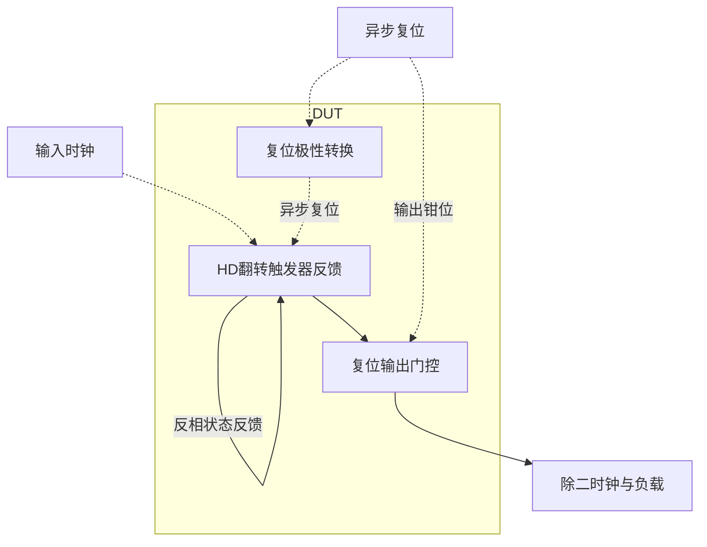

# 45 · HD 二分频：复位状态与输出占空比联合约束

本模块把输入时钟频率除以二，并通过异步复位建立确定的初始状态。触发器反馈实现逐沿翻转，专用复位路径保证复位和释放时序；HD标准单元提供可复用的逻辑实现。芯片中常用于时钟分配、计数器和PLL反馈分频链；本模块只提供除二功能，不单独构成完整PLL。

状态：**SMIC18MMRF / TT / 1.8 V / 27°C，全部对应 nominal 原始指标通过**。只宣称原理图级 nominal；未执行其他PVT、失配或版图验证。审查PDF已逐页检查中文、图表和网表可读性。

[审查 PDF](../evidence/45-divider/review.pdf) · [精确电路](../evidence/45-divider/circuit.scs) · [验收合同](../evidence/45-divider/contract.json) · [实测结果](../evidence/45-divider/latest_results.json)

当前报告：**4页正文＋1页完整电路图，共5页**。下文历史交付记录中的页数对应当时的正文版本。

<!-- REPORT-MARKDOWN -->
## 可编辑报告与系统结构

[完整报告MD](../evidence/45-divider/review_report.md) · [对应PDF](../evidence/45-divider/review.pdf) · [Mermaid源文件](../evidence/45-divider/system_block_diagram.mmd) · [框图SVG](../evidence/45-divider/markdown_assets/system-block.svg)

对应原厂DRNQN触发器及输出NOR门；不包含完整计数器或PLL。

实线为信号或能量通路，虚线为时钟、控制或偏置。

<!-- END-REPORT-MARKDOWN -->

## 实现与实测

DRNQNHDV1 的D接QN形成T触发器；INHDV2把高有效reset转为FF的低有效RDN；NOR2HDV16用QN和reset生成clkout。内部状态被真正复位，外部门仅增加快速输出拉低路径。所有HD单元的晶体管尺寸保持原厂CDL。

实测：原1 GHz输入下输出500.031 MHz；高占空比49.9376%–49.9471%；最大时钟延迟304.49 ps；复位延迟26.78 ps。复位保持与异步释放保持分别约8.99/7.66 mV，下一有效沿后输出1.792 V；原100 ps复位、400 ps延迟和49%–51%占空比均通过。

## 失败迭代带来的认识

FF V1 + NOR V4 的占空比48.391%，FF V4 + NOR V8仍只有48.507%，均超出15%放宽后的误差窗口。最终FF V1 + NOR V16合格，代价是时钟延迟增加但仍低于400 ps。驱动档位同时改变负载和上/下沿传播差，不能以“所有门加大”代替波形检查。

只有输出钳位而没有清除内部FF状态，会破坏释放后的语义。本方案同时使用内部异步复位和输出快速路径，并保留1.85–2.04 ns、2.05–2.20 ns及2.70 ns的分段验收。

此模块是纯数字标准单元实现，不重设计其内部MOS；模拟模块仍按gm/ID LUT要求执行。

[HD 单元来源与哈希](../evidence/45-divider/hd_cells_manifest.json)

## 复现与证据

[完整电路总图 SVG](../evidence/45-divider/schematic/full.svg) · [总图 PDF](../evidence/45-divider/schematic/full.pdf) · [1页电路分图](../evidence/45-divider/schematic/sheets.pdf) · [引脚与层次连接映射](../evidence/45-divider/schematic/connectivity.json) · [图纸审计](../evidence/45-divider/schematic_audit.json)

- [Spectre 运行记录](https://github.com/SannBunnSyoSeTsu/smic18-benchmark-reproduction/blob/6ae3e1434914297c4ed12b93cb8d6a297ef8339a/runs/45/20260922T055442345725Z_divide/run.json) · 原始输出（本地归档，未随仓库分发）
- [Spectre 运行记录](https://github.com/SannBunnSyoSeTsu/smic18-benchmark-reproduction/blob/6ae3e1434914297c4ed12b93cb8d6a297ef8339a/runs/45/20260922T055443514982Z_reset/run.json) · 原始输出（本地归档，未随仓库分发）
- [工程脚本](https://github.com/SannBunnSyoSeTsu/smic18-benchmark-reproduction/tree/6ae3e1434914297c4ed12b93cb8d6a297ef8339a/scripts) · [项目状态](https://github.com/SannBunnSyoSeTsu/smic18-benchmark-reproduction/blob/6ae3e1434914297c4ed12b93cb8d6a297ef8339a/status.json)

原Sky130案例保持原样；本页是目标工艺实测的新记录。模型文件留在既有本地PDK目录，没有上传或修改。
