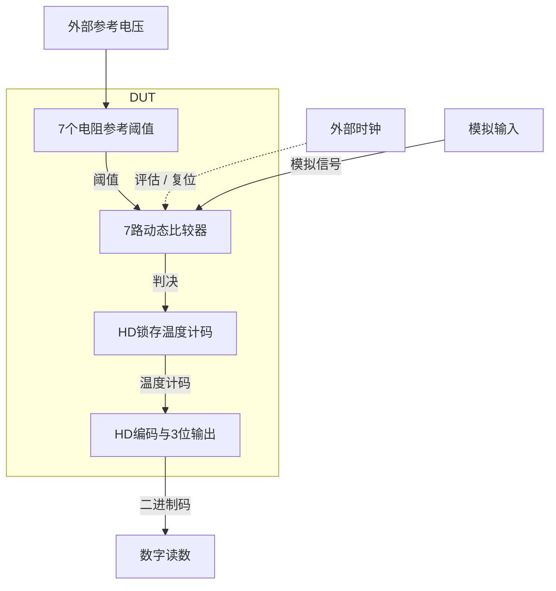

# 46 · 3位Flash ADC：比较器阵列、HD编码与完整动态验收

本模块并行比较输入与七个电阻梯形阈值，以StrongARM动态比较器作出判决，用HD锁存器保存温度计码并编码为三位二进制。相比逐次逼近转换，Flash结构在一次时钟内完成并行判决，代价是比较器数量、参考负载和输入回踢随位数增加。芯片中可用于高速低分辨率ADC、流水线子ADC和快速幅度检测。

状态：**SMIC18MMRF / TT / 1.8 V / 27°C，全部对应 nominal 原始指标通过**。只宣称原理图级 nominal；未执行其他PVT、失配或版图验证。审查PDF已逐页检查中文、图表和网表可读性。

[审查 PDF](../evidence/46-flash-adc3bit/review.pdf) · [精确电路](../evidence/46-flash-adc3bit/circuit.scs) · [验收合同](../evidence/46-flash-adc3bit/contract.json) · [实测结果](../evidence/46-flash-adc3bit/latest_results.json)

当前报告：**7页正文＋6页完整电路图，共13页**。下文历史交付记录中的页数对应当时的正文版本。

<!-- REPORT-MARKDOWN -->
## 可编辑报告与系统结构

[完整报告MD](../evidence/46-flash-adc3bit/review_report.md) · [对应PDF](../evidence/46-flash-adc3bit/review.pdf) · [Mermaid源文件](../evidence/46-flash-adc3bit/system_block_diagram.mmd) · [框图SVG](../evidence/46-flash-adc3bit/markdown_assets/system-block.svg)

比较器、锁存和编码均在DUT；输入、参考和时钟属于固定测试端口。

实线为信号或能量通路，虚线为时钟、控制或偏置。

<!-- END-REPORT-MARKDOWN -->

## 标称结果

SMIC18MMRF TT、1.8V、27°C，50MHz时钟、50Ω源阻抗，三输出各15fF；0.6/1.4V参考。完整静态斜坡、跳码序列和两组16点正弦记录均完成。**12个数值门槛、固定逻辑要求及原13组检查全部达到原要求，无需放宽**。[完整结果](../evidence/46-flash-adc3bit/latest_results.json)保留原/10%/15%边界。

|指标|实测|原门槛|
|---|---:|---:|
|时钟至输出/ns|0.690803994|≤9.5，固定|
|核心及参考功率/µW|326.612235|≤1000|
|正向时钟供能/µW|43.632819|≤250|
|时钟峰值电流/mA|3.698857|诊断值|
|DNL/INL/绝对误差/LSB|0.10 / 0.09 / 0.19|分别≤0.3|
|静态码数/阈值数|8 / 7|8 / 7，且单调|
|跳码/缺失/迟到/无效/稳定窗违例|全部0|固定0|
|3.125MHz SNDR/SFDR/dB|20.012331 / 26.537022|≥17 / ≥21|
|21.875MHz SNDR/SFDR/dB|22.415352 / 28.053529|≥17 / ≥21|
|低频/高频归一ENOB/bit|3.124254 / 3.558232|≥2.5|

归一ENOB保留原16码确定性算法与满量程校正，**大于3不代表实际物理分辨率超过3位**。未加入噪声、随机失配和时钟抖动，不作统计精度结论。

## 核心电路和尺寸

每路11MOS比较器包括输入NMOS对、时钟尾管、交叉再生NMOS/PMOS及四只预充PMOS。两原厂NAND构成SR保持，复位期间维持前次判决；12个HD门将温度计码转为三位，其中6反相器、5个二输入NAND及1个四输入NAND。使用INHDV1、NAND2HDV1、NAND4HDV1，原CDL引脚、模型和内部尺寸哈希不变。

[gm/ID初算](../evidence/46-flash-adc3bit/sizing.json)均L0.18µm：输入n18 W9.02µm、gm/ID14、100µA；尾n18 W8.14µm、8、300µA；再生n18 W4.06µm、10、100µA；再生和预充p18 W6.12µm、10、50µA。它们是初始电流密度选点，实际强臂工作包含复位、放电、正反馈再生，不能用静态饱和gm/ID替代动态验收。

电阻梯为8×500Ω，七阈值各0.3pF；这些为原题允许的理想无源，DUT内部无行为比较器或理想数字函数。三个子电路定义共54实例259端子；复用展开77模拟MOS、26HD和15个R/C，共118个叶级实例，HD内部MOS另见原厂网表。

## 静态和动态口径

[合同](../evidence/46-flash-adc3bit/contract.json)固定斜坡100–2100ns从0.55升至1.45V，在110–2090ns每20ns执行一次，共100次；边沿+19ns判码。阈值按相邻转换输入中点求得0.694、0.784、0.883、0.982、1.081、1.189、1.288V。DNL/INL继承离散斜坡分辨率，未冒充连续阈值精度。

跳码序列为0,7,3,5,1,6,2,4,7,0,4,2,6,1,5,3,7,0,2,5,0,7,1,6,3,4，评分25周期。检查每位所有中点交叉、应变而未变以及迟到跳变；最迟交叉为0.690804ns。每周期9.5–19ns整个窗口必须保持正确有效电平，低≤0.36V、高≥1.44V，逻辑正确性和稳定窗不放宽。

正弦低/高频为3.125/21.875MHz，相位212°/279.25°，偏置1V、峰值0.39V；首转换边沿50ns，再以20ns间距取得16码。原压力PVT明确投影到本次TT1.8V27°C，保留频率、相位、码流和原检查定义，但不声称原动态压力角通过。两组分别出现7种码不等于静态缺码，完整8码由独立斜坡试验确认。

SNDR分母为DFT中非DC、非基波功率总和，SFDR取最大杂散。原满量程校正为`SNDRnorm = SNDR + 10log10((16*8/4)^2 / Psignal)`，`ENOB=(SNDRnorm-1.76)/6.02`。短记录与特定相位可能得到>3值，不可解释为超过3位的真实ADC有效精度。

核心/参考功率为100–500ns内`mean(-1.8*I(VDD)-1.4*I(VREFP)-0.6*I(VREFN))`；外部时钟单独只积正向供能，不用返回能量抵扣。输入理想源驱动功耗、实际时钟发生器损耗不在原核心指标中。[最终记录](../evidence/46-flash-adc3bit/conversion_records.json)及[基线记录](../evidence/46-flash-adc3bit/baseline_conversion_records.json)保存码流、阈值、交叉延迟和频谱功率。

## 精度确认与审查

[数值计划](../evidence/46-flash-adc3bit/numerical_plan.json)先固定容差；maxstep0.1→0.05ns、reltol1e-6→1e-7，[29项确认](../evidence/46-flash-adc3bit/numerical_confirmation.json)全通过，所有转换码一致，最大核心/参考功率差2.328429nW<2µW。8次运行实际0错误，但各有2或5条SPECTRE-16780 LTE警告，精算仍保留这些警告，未把结果稳定写成零警告。

[独立审计](../evidence/46-flash-adc3bit/verification_audit.json)将实际Spectre波形送入未改动的原Python分析器，重算静态、跳变、稳定窗、供电/参考和正向时钟功率、递归DFT，共29指标一致；原13组函数在显式四记录TT投影下全部通过。源任务、HD、PDK、LUT、运行输入哈希不变。[测量复核](../evidence/46-flash-adc3bit/measurement-review.md)与[独立明细](../evidence/46-flash-adc3bit/independent_measurement_details.json)完整保留。

13页PDF含7页正文、6页完整图纸，全部实际查看并检查[总图](../evidence/46-flash-adc3bit/schematic/full.pdf)。锁存器阵列改为三列，消除相邻输出/输入网络标签拥挤和边缘截断；复看最终第10页及总图，其余12页与已查看版本的渲染哈希一致。电路SHA-256：932079bd1b52f635b8632deb2e396f31044070eec8bb522322982af2f83ff7bd。

既有Bridge Python从工程根目录依次运行scripts/case46_flash_adc.py、confirm46.py、schematic46.py、audit46.py、review46.py；重生成后须重新实际查看。未做其他PVT、随机失配、噪声/抖动、统计亚稳态、输入驱动阻抗扫描、布局和PEX。原环境与长期AGENTS不改。

[完整 LUT 查询](../evidence/46-flash-adc3bit/sizing.json)

[HD 单元来源与哈希](../evidence/46-flash-adc3bit/hd_cells_manifest.json)

## 复现与证据

[完整电路总图 SVG](../evidence/46-flash-adc3bit/schematic/full.svg) · [总图 PDF](../evidence/46-flash-adc3bit/schematic/full.pdf) · [6页电路分图](../evidence/46-flash-adc3bit/schematic/sheets.pdf) · [引脚与层次连接映射](../evidence/46-flash-adc3bit/schematic/connectivity.json) · [图纸审计](../evidence/46-flash-adc3bit/schematic_audit.json)

- [Spectre 运行记录](https://github.com/SannBunnSyoSeTsu/smic18-benchmark-reproduction/blob/6ae3e1434914297c4ed12b93cb8d6a297ef8339a/runs/46/20260928T180852276960Z_transition/run.json) · 原始输出（本地归档，未随仓库分发）
- [Spectre 运行记录](https://github.com/SannBunnSyoSeTsu/smic18-benchmark-reproduction/blob/6ae3e1434914297c4ed12b93cb8d6a297ef8339a/runs/46/20260928T180930749182Z_ramp/run.json) · 原始输出（本地归档，未随仓库分发）
- [Spectre 运行记录](https://github.com/SannBunnSyoSeTsu/smic18-benchmark-reproduction/blob/6ae3e1434914297c4ed12b93cb8d6a297ef8339a/runs/46/20260928T181118452556Z_sine_low/run.json) · 原始输出（本地归档，未随仓库分发）
- [Spectre 运行记录](https://github.com/SannBunnSyoSeTsu/smic18-benchmark-reproduction/blob/6ae3e1434914297c4ed12b93cb8d6a297ef8339a/runs/46/20260928T181141726685Z_sine_high/run.json) · 原始输出（本地归档，未随仓库分发）
- [工程脚本](https://github.com/SannBunnSyoSeTsu/smic18-benchmark-reproduction/tree/6ae3e1434914297c4ed12b93cb8d6a297ef8339a/scripts) · [项目状态](https://github.com/SannBunnSyoSeTsu/smic18-benchmark-reproduction/blob/6ae3e1434914297c4ed12b93cb8d6a297ef8339a/status.json)

原Sky130案例保持原样；本页是目标工艺实测的新记录。模型文件留在既有本地PDK目录，没有上传或修改。
