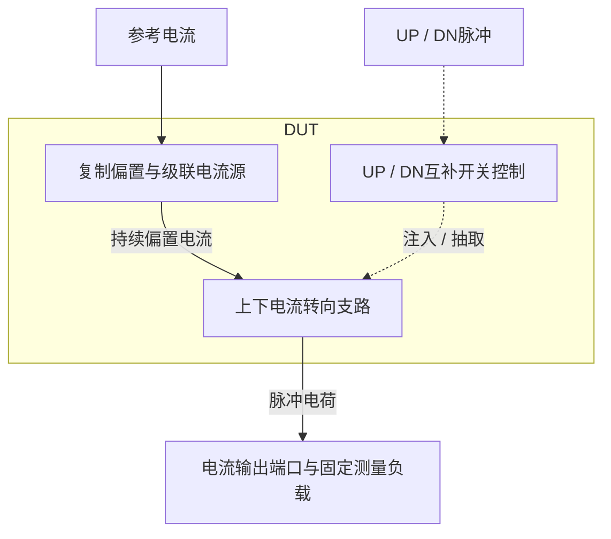

# 47 · PLL电荷泵：复制偏置、电流转向与脉冲电荷精度

本模块把UP和DN数字脉冲转换成向环路滤波器注入或抽取的电流，使脉冲宽度对应电荷量。相比直接启停电流源，电流转向结构让偏置支路持续工作，可减小重启延迟；级联管和复制偏置改善输出电压变化下的电流匹配，代价是静态功耗与电压余量。芯片中主要用于电荷泵PLL，将鉴相器的相位误差信号转换为振荡器控制电压的变化。

状态：**SMIC18MMRF / TT / 1.8 V / 27°C，全部对应 nominal 原始指标通过**。只宣称原理图级 nominal；未执行其他PVT、失配或版图验证。审查PDF已逐页检查中文、图表和网表可读性。

[审查 PDF](../evidence/47-charge-pump/review.pdf) · [精确电路](../evidence/47-charge-pump/circuit.scs) · [验收合同](../evidence/47-charge-pump/contract.json) · [实测结果](../evidence/47-charge-pump/latest_results.json)

当前报告：**5页正文＋3页完整电路图，共8页**。下文历史交付记录中的页数对应当时的正文版本。

<!-- REPORT-MARKDOWN -->
## 可编辑报告与系统结构

[完整报告MD](../evidence/47-charge-pump/review_report.md) · [对应PDF](../evidence/47-charge-pump/review.pdf) · [Mermaid源文件](../evidence/47-charge-pump/system_block_diagram.mmd) · [框图SVG](../evidence/47-charge-pump/markdown_assets/system-block.svg)

本例只有电荷泵；鉴相器、环路滤波器和VCO未作为已实现的PLL系统画入。

实线为信号或能量通路，虚线为时钟、控制或偏置。

<!-- END-REPORT-MARKDOWN -->

## 结构、尺寸与偏置

保持参考电路的级联电流源、复制偏置和电流转向思路。唯一外部模拟参考为25 µA；NMOS镜单位W14.44/L4 µm，目标12.5 µA、gm/ID=12，参考m=2，DN主镜m=4。PMOS镜单位W29/L4 µm，目标5 µA、gm/ID=12；复制支路m=2.5，UP主镜m=10。级联单位n18为8.32/1 µm、p18为39.10/1 µm，目标12.5 µA、gm/ID=16；实际主支路各m=4，复制支路m=1。

NMOS/PMOS级联偏置二极管为2.04/4和10.68/4 µm，目标12.5 µA、gm/ID=4.5。模拟DN/UP转向开关分别1.28/0.18和3.70/0.18 µm，以gm/ID=8、50 µA查表起步，实际在线性区工作。dummy节点wu使用1.46/1 µm NMOS二极管，wd使用2.64/1 µm NMOS源跟随负载。

数字反相使用未改尺寸的INHDV8、INHDV2、INHDV4；没有把参考中的自定义数字反相器直接迁移为手工尺寸。偏置三节点各1 pF，参考0.8 pF，dummy各0.4 pF，转向公共节点各30 fF。DUT仅PDK MOS及正值电容，没有内部理想电阻或激励源。

## 完整nominal结果

TT/1.8 V/27°C，DC扫描0.30–1.35 V共43点，四个UP/DN控制状态分别测量；合规区0.45–1.15 V包含29点。UP电流49.33524–49.33897 µA，DN49.31328–49.32955 µA，最大绝对误差1.37344%，远小于原5%。UP/DN平坦度分别0.007555%/0.032996%，原限制1%。原规定三点的最大匹配误差0.051377%，全29点最坏值相同，原限制2%。

两路低时最大输出漏电1.1945 pA，两路高时最大净电流25.6877 nA，分别低于1 nA和1 µA。只有nominal确定性模型，不能将这些数值当成实际芯片随机匹配或高温漏电结论。

输出钳位0.9 V，控制沿200 ps；UP/DN的10 ns电荷494.679/493.570 fC，按同支路DC电流归一误差0.26346%/0.05924%。1 ns电荷50.1926/49.5772 fC，按各自Q10/10归一误差1.46490%/0.44621%，原限制25%。同时导通的净电荷1.09829 fC，原限制20 fC。最坏开启173.027 ps、关断13.249 ps，原限制500/50 ps。VDD平均功耗284.727 µW，包含参考及全部持续偏置，原限制500 µW。首版全部原nominal通过，无需放宽或额外调参。

## 匹配好不代表绝对电流无误差

NMOS参考VDS约0.5335 V，输出主镜约0.255 V，漏压差造成约1.37%的绝对电流偏低。PMOS复制支路由对应NMOS镜供电，其主镜VSD0.2366 V与UP输出主镜0.2371 V接近，使UP和DN共享大部分绝对偏差。因此本例两路相互匹配显著优于各自对理想50 µA的精度；两项必须分别验收。

在全部29个合规输出点，UP主镜/级联最小饱和余量92.10/241.30 mV，DN主镜/级联105.06/58.16 mV。最紧处是0.45 V输出的DN级联。它足以支持当前nominal，不足以推断PVT余量。转向开关的线性区是正常用途，不应拿相同饱和判据排除它们。

## 快速切换来自持续偏置与节点稳定

关闭输出时主电流被送入dummy负载，没有切断主镜偏置。UP公共节点nc在关断/导通分别约1.031/1.021 V；DN的nd约0.764/0.820 V。dummy电位越接近实际输出路径对应电位，切换时需要搬运的节点电荷越小，但门的延迟、寄生注入和路径不对称仍使短脉冲电荷偏离理想值。静态电流匹配不能替代脉冲验收。

开启时间从200 ps输入上升的开始算至平台90%的首次交越；关断时间从输入下降的结束算至平台5%，并将负延迟截到0。DN的约0.79 ps为2 ps样点间插值，并非亚皮秒数值分辨率。最坏UP13.25 ps离50 ps门槛有明显余量。电荷积分包含前后回稳窗口，而非只对脉冲高电平时间积分。

微小净电荷不表示瞬时无尖峰：重叠窗内电流约−67.85至+50.34 µA，绝对电流积分16.354 fC，而正负相抵后的净电荷绝对值为1.098 fC。原验收采用后者；没有把绝对电流积分冒充既定门槛，也没有隐藏全脉冲波形中最低约−111.97 µA的注入尖峰。首次90%交越时间不是持续建立时间，接入真实PLL滤波器后仍应按其杂散要求检查这些瞬态。

原功耗口径为0–220 ns的−VDD×I(VDD)平均；固定0.9 V的外部输出源也与电路交换电荷，该指标不是整套PLL功耗。未运行其他26个DC PVT点、两组ss/ff瞬态、20个tt_mm固定种子或版图。最终两次运行日志没有警告；5页PDF提供全部指标门槛、结构与尺寸、DC曲线、工作区余量、瞬态与边沿细节及精确网表。

[完整 LUT 查询](../evidence/47-charge-pump/sizing.json)

[HD 单元来源与哈希](../evidence/47-charge-pump/hd_cells_manifest.json)

## 复现与证据

[完整电路总图 SVG](../evidence/47-charge-pump/schematic/full.svg) · [总图 PDF](../evidence/47-charge-pump/schematic/full.pdf) · [3页电路分图](../evidence/47-charge-pump/schematic/sheets.pdf) · [引脚与层次连接映射](../evidence/47-charge-pump/schematic/connectivity.json) · [图纸审计](../evidence/47-charge-pump/schematic_audit.json)

- [Spectre 运行记录](https://github.com/SannBunnSyoSeTsu/smic18-benchmark-reproduction/blob/6ae3e1434914297c4ed12b93cb8d6a297ef8339a/runs/47/20260922T085304148574Z_dc/run.json) · 原始输出（本地归档，未随仓库分发）
- [Spectre 运行记录](https://github.com/SannBunnSyoSeTsu/smic18-benchmark-reproduction/blob/6ae3e1434914297c4ed12b93cb8d6a297ef8339a/runs/47/20260922T085304377636Z_pulse/run.json) · 原始输出（本地归档，未随仓库分发）
- [工程脚本](https://github.com/SannBunnSyoSeTsu/smic18-benchmark-reproduction/tree/6ae3e1434914297c4ed12b93cb8d6a297ef8339a/scripts) · [项目状态](https://github.com/SannBunnSyoSeTsu/smic18-benchmark-reproduction/blob/6ae3e1434914297c4ed12b93cb8d6a297ef8339a/status.json)

原Sky130案例保持原样；本页是目标工艺实测的新记录。模型文件留在既有本地PDK目录，没有上传或修改。
