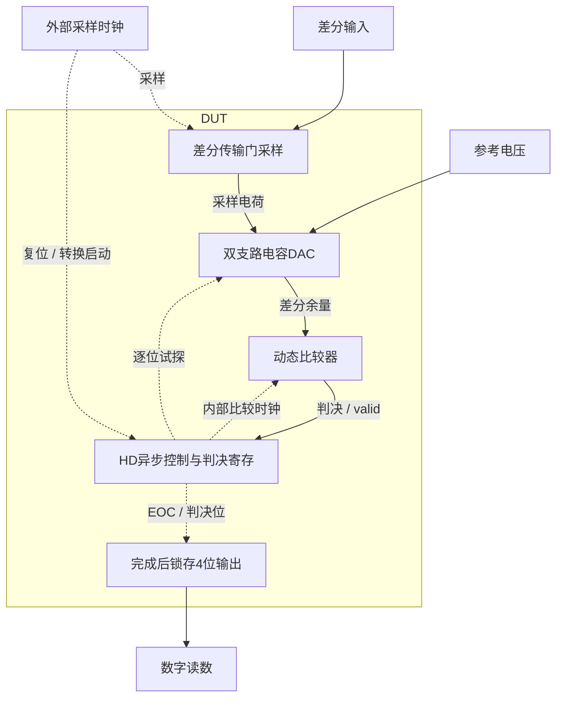

# 48 · 4位异步SAR ADC：采样保持与完成时序

本模块通过差分采样、电容DAC逐位试探和单个动态比较器，把输入电压量化为四位数字码。异步控制器在每次判决有效后推进下一位，并在转换完成时寄存输出；相对Flash结构，它减少并行比较器数量，代价是串行建立时间、电容匹配与采样回踢需要共同控制。芯片中可用于低位数数据采集、传感器接口和子ADC。

状态：**SMIC18MMRF / TT / 1.8 V / 27°C，全部对应 nominal 原始指标通过**。只宣称原理图级 nominal；未执行其他PVT、失配或版图验证。审查PDF已逐页检查中文、图表和网表可读性。

[审查 PDF](../evidence/48-sar-adc4bit/review.pdf) · [精确电路](../evidence/48-sar-adc4bit/circuit.scs) · [验收合同](../evidence/48-sar-adc4bit/contract.json) · [实测结果](../evidence/48-sar-adc4bit/latest_results.json)

当前报告：**7页正文＋13页完整电路图，共20页**。下文历史交付记录中的页数对应当时的正文版本。

<!-- REPORT-MARKDOWN -->
## 可编辑报告与系统结构

[完整报告MD](../evidence/48-sar-adc4bit/review_report.md) · [对应PDF](../evidence/48-sar-adc4bit/review.pdf) · [Mermaid源文件](../evidence/48-sar-adc4bit/system_block_diagram.mmd) · [框图SVG](../evidence/48-sar-adc4bit/markdown_assets/system-block.svg)

CDAC、比较器及异步握手均为实际DUT；内部比较时钟由有效判决推进，不能画成外部理想逐位控制。

实线为信号或能量通路，虚线为时钟、控制或偏置。

<!-- END-REPORT-MARKDOWN -->

## 结果与范围

TT/1.8V/27°C、100MS/s，全部原始标称指标通过。两种完整16码次序及采样后诱骗输入检查零错误；SNDR=27.5514728dB，归一化ENOB=4.31724865bit，最坏单记录六源净供电功率=1.03295465mW。

归一化ENOB是有限相干码序按原公式换算的确定性指标，超过标称位数不代表额外信息位或含噪声的实际精度。仅保留原TT两种动态频率/相位，未执行SS/FF。 未作噪声、失配、PEX、亚稳态统计或可靠性签核。

## 结构与验证

gm/ID初算原生采样、动态比较器与CDAC开关；二进制电容、10fF顶板dummy、70fF异步返回延迟。数字逻辑全部使用未改尺寸的原厂HD单元。互补传输门采样，VALID推进逐位判决，EOC寄存完整输出码。

50Ω时钟、10fF/位负载、原采样时刻和能量窗口不变；六个独立源均计入功耗。50→25ps、全局reltol1e-5→1e-6精算全部码一致。原解码器、递归FFT和四项电气检查独立复核通过，完整图纸13页。

## 证据

[可编辑报告](../evidence/48-sar-adc4bit/review_report.md)、[独立测量](../evidence/48-sar-adc4bit/measurement-review.md)、[码流与谱功率](../evidence/48-sar-adc4bit/conversion_records.json)、[数值确认](../evidence/48-sar-adc4bit/numerical_confirmation.json)、[完整图纸](../evidence/48-sar-adc4bit/schematic/sheets.pdf)、[生成脚本](../evidence/48-sar-adc4bit/implementation)均保留。PDF由Matplotlib生成，Markdown不是其编译输入。

电路SHA-256：`a87f8ceb7193b5c69bc95a629ca3d628484b30cb708e843db74e2d94b0687f8d`。

[完整 LUT 查询](../evidence/48-sar-adc4bit/sizing.json)

[HD 单元来源与哈希](../evidence/48-sar-adc4bit/hd_cells_manifest.json)

## 复现与证据

[完整电路总图 SVG](../evidence/48-sar-adc4bit/schematic/full.svg) · [总图 PDF](../evidence/48-sar-adc4bit/schematic/full.pdf) · [13页电路分图](../evidence/48-sar-adc4bit/schematic/sheets.pdf) · [引脚与层次连接映射](../evidence/48-sar-adc4bit/schematic/connectivity.json) · [图纸审计](../evidence/48-sar-adc4bit/schematic_audit.json)

- [Spectre 运行记录](https://github.com/SannBunnSyoSeTsu/smic18-benchmark-reproduction/blob/6ae3e1434914297c4ed12b93cb8d6a297ef8339a/runs/48/20260929T032014979173Z_transfer/run.json) · 原始输出（本地归档，未随仓库分发）
- [Spectre 运行记录](https://github.com/SannBunnSyoSeTsu/smic18-benchmark-reproduction/blob/6ae3e1434914297c4ed12b93cb8d6a297ef8339a/runs/48/20260929T032557465554Z_transfer_alt/run.json) · 原始输出（本地归档，未随仓库分发）
- [Spectre 运行记录](https://github.com/SannBunnSyoSeTsu/smic18-benchmark-reproduction/blob/6ae3e1434914297c4ed12b93cb8d6a297ef8339a/runs/48/20260929T033140508050Z_dynamic/run.json) · 原始输出（本地归档，未随仓库分发）
- [Spectre 运行记录](https://github.com/SannBunnSyoSeTsu/smic18-benchmark-reproduction/blob/6ae3e1434914297c4ed12b93cb8d6a297ef8339a/runs/48/20260929T034301146847Z_dynamic_alt/run.json) · 原始输出（本地归档，未随仓库分发）
- [工程脚本](https://github.com/SannBunnSyoSeTsu/smic18-benchmark-reproduction/tree/6ae3e1434914297c4ed12b93cb8d6a297ef8339a/scripts) · [项目状态](https://github.com/SannBunnSyoSeTsu/smic18-benchmark-reproduction/blob/6ae3e1434914297c4ed12b93cb8d6a297ef8339a/status.json)

原Sky130案例保持原样；本页是目标工艺实测的新记录。模型文件留在既有本地PDK目录，没有上传或修改。
