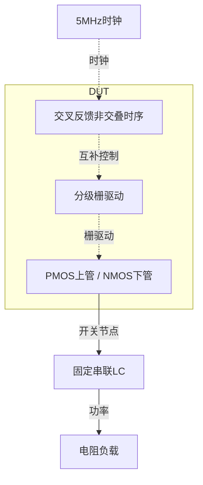
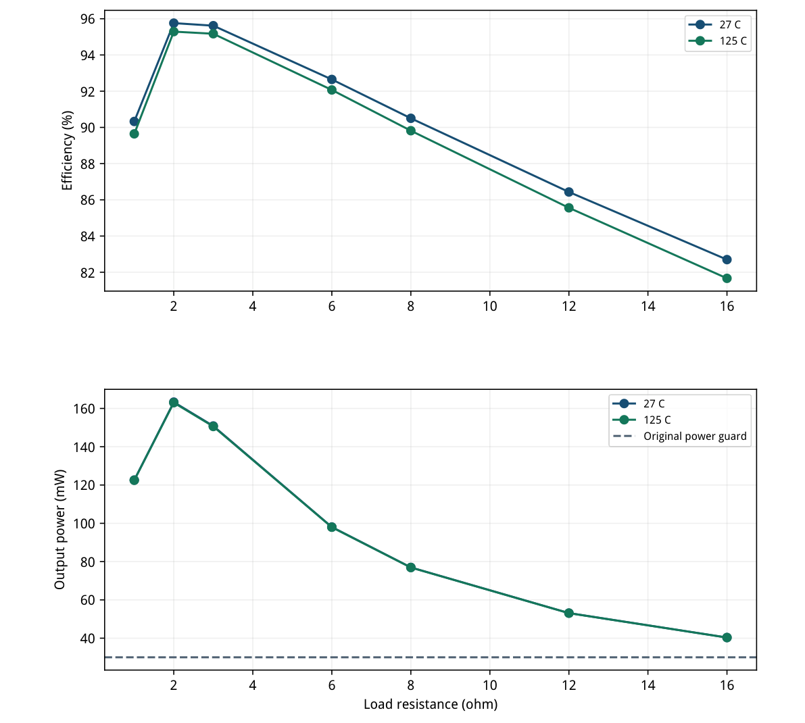
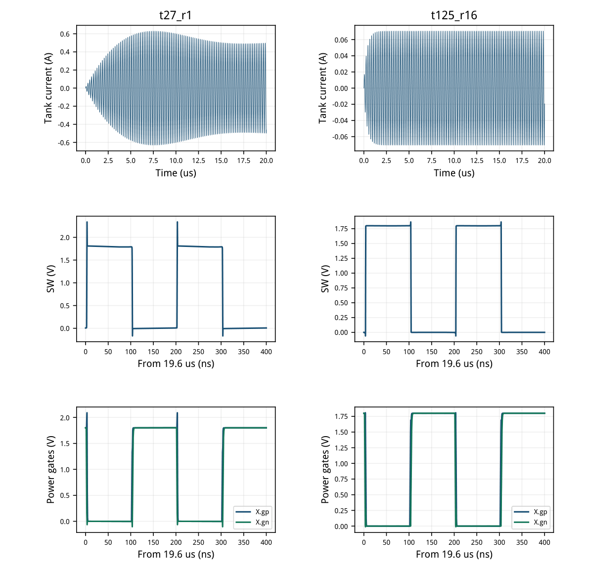
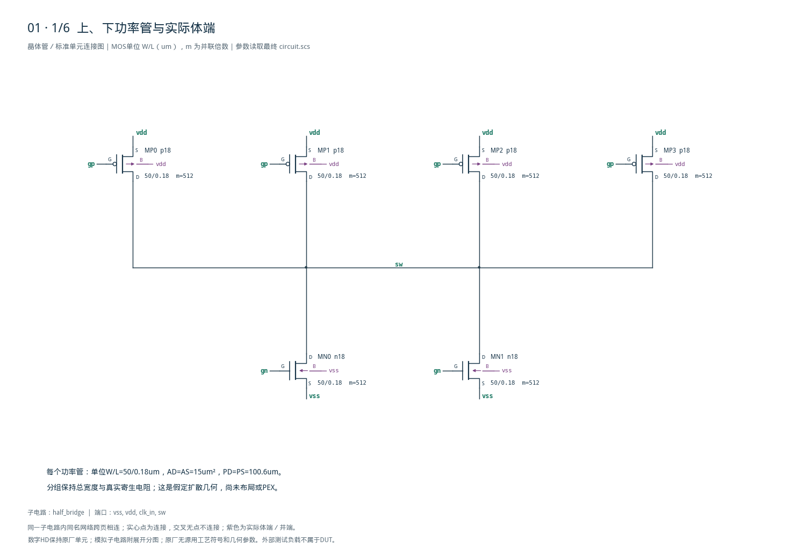
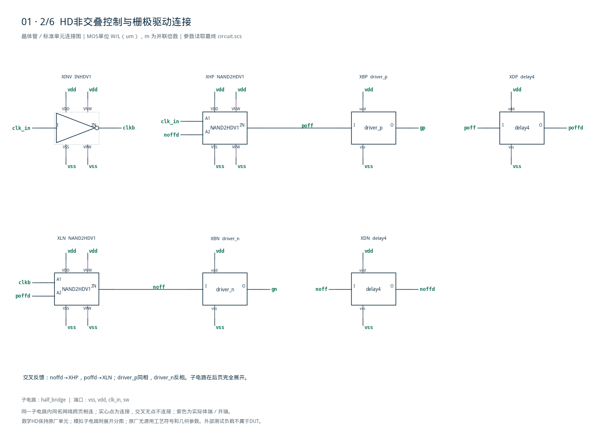
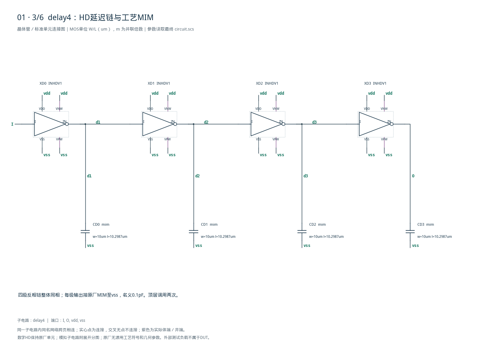
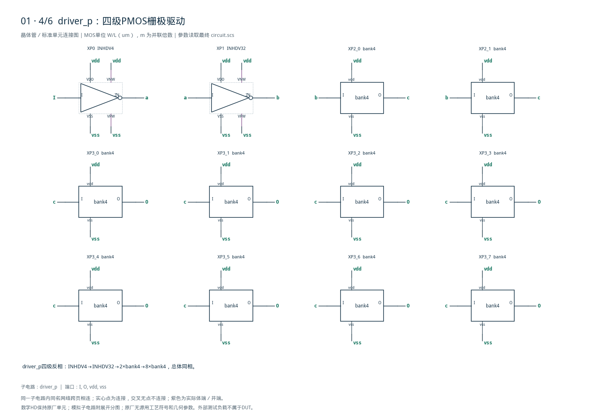
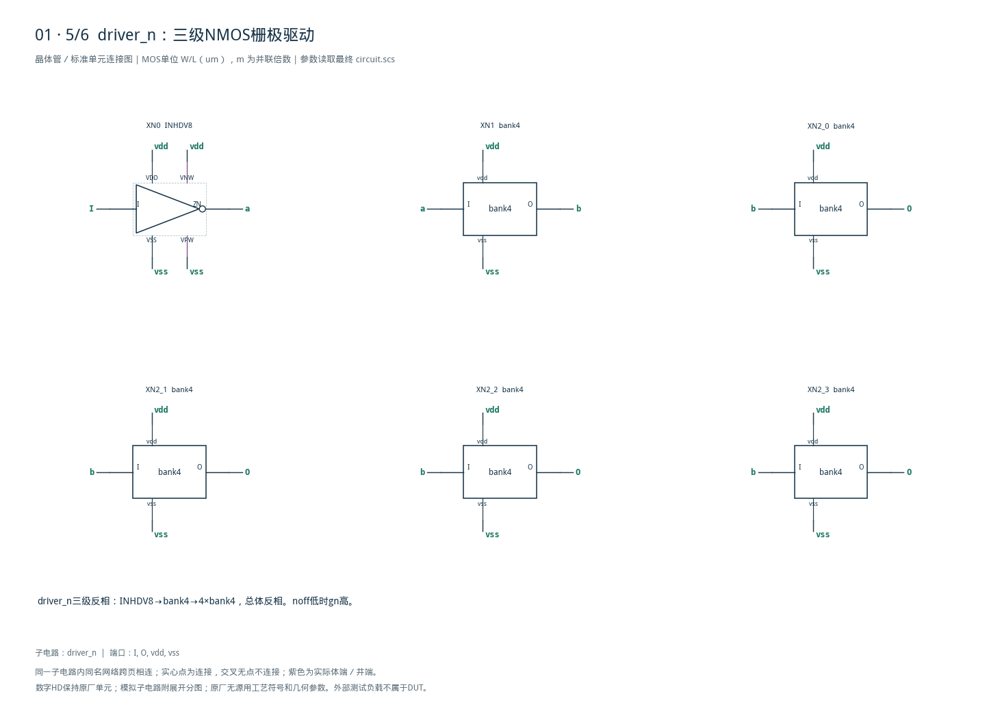
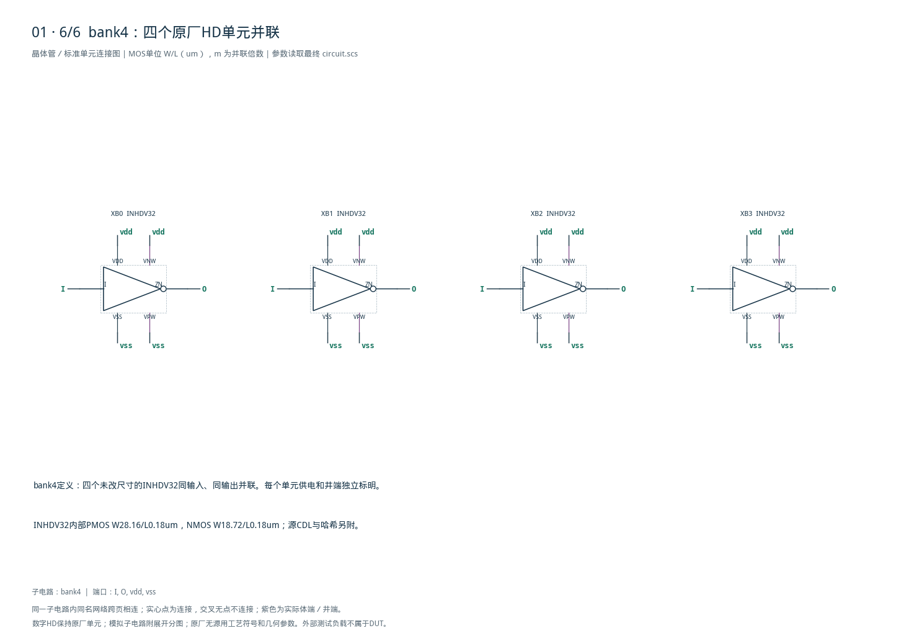

# 01 · Class-D半桥功率级审查

[审查 PDF](review.pdf) · [实测结果](latest_results.json) · [验收合同](contract.json) · [最终网表](circuit.scs)

## 验收结果

本模块把5MHz时钟变为1.8V半桥开关波形，经外部串联LC向电阻负载传输功率。PMOS上管与NMOS下管交替导通，利用低导通电阻减小传输损耗；交叉反馈延迟链控制换向，分级驱动器充放大功率管栅极。代价是较大的器件面积、栅极动态功耗与换向损耗。芯片中可用于谐振功率驱动和开关输出级；本例只验证固定时钟与指定负载，不包含音频调制或闭环失真指标。

结论：10%放宽范围内完成，逐项保留原门槛比较。

SMIC18MMRF TT / 1.8V；保留原27°C和125°C两个效率分组，每温度7种负载，共14点。时钟5MHz、2ns边沿、50Ω源阻抗；外部3uH与345pF串联LC保持原值。

| 验收量 | 实测 | 原门槛 | 10% | 15% | 单位 |
| --- | --- | --- | --- | --- | --- |
| 27°C峰值效率 | 95.759682 | &gt;95 | &gt;85.5 | &gt;80.75 | % |
| 27°C最低效率 | 82.698836 | &gt;85 | &gt;76.5 | &gt;72.25 | % |
| 125°C峰值效率 | 95.290394 | &gt;90 | &gt;81 | &gt;76.5 | % |
| 125°C最低效率 | 81.664420 | &gt;80 | &gt;72 | &gt;68 | % |
| 所有点最小输出功率 | 40.320567 | &gt;30 | &gt;30 | &gt;30 | mW |

效率下限按线性比例放宽，所有比较仍为严格大于。输出功率&gt;30mW是防止无功率输出的功能检查，本项保持原值，未随效率一起放宽；效率≤100%及正有限功率也不放宽。

输入功率覆盖半桥、全部HD逻辑和栅驱动器，以及50Ω之前的时钟源。对原18–20us窗口做时间加权积分，不用非均匀样点的算术平均，也不减掉驱动功耗或LC储能变化。

本报告为固定时钟的原理图级功率验证；未执行其他工艺角、失配、音频调制、失真、版图或PEX，也不构成瞬态过压寿命签核。

<!-- SYSTEM-BLOCK-DIAGRAM -->
## 系统框图

本例是固定时钟驱动的功率级，LC和电阻是外部负载；没有实现音频调制器。

实线表示信号或能量通路，虚线表示时钟、控制或偏置。DUT框外为外部端口或测试夹具；精确端子连接见后附基本电路图。



[独立Mermaid源文件](system_block_diagram.mmd) · [框图SVG](markdown_assets/system-block.svg)
<!-- END-SYSTEM-BLOCK-DIAGRAM -->

## 功率管、gm/ID初值与物理寄生

目标工艺实际W50um、L0.18um表征，驱动点取完整1.8V端点。

| 角色 | 模型 | gm/ID (1/V) | 表征ID (mA) | Cgg/fF |
| --- | --- | --- | --- | --- |
| PMOS上管 | p18 | 1.018930 | 12.754428 | 90.653 |
| NMOS下管 | n18 | 0.876988 | 28.791463 | 94.254 |

表征条件TT/27°C、VDS=1.8V、VSB=0V，扫描VGS至1.8V。表征ID用于单位宽度选择，不是半桥的直流偏置；功率管导通时主要处于低VDS区，不能把饱和LUT的gm/ID当作开关损耗模型。最终功率仍由动态Spectre验证。

| 参数 | 上管p18 | 下管n18 |
| --- | --- | --- |
| 单位W/L | 50/0.18um | 50/0.18um |
| 并联组与每组m | 4组×512 | 2组×512 |
| 总W | 102400um | 51200um |
| 每单位AD=AS / PD=PS | 15um² / 100.6um | 15um² / 100.6um |

每单位扩散延伸取0.3um，并显式填写面积和周长。首轮单个PMOS m=2048使单实例源漏寄生电阻低于Spectre默认minr，被CMI-2318删除；最终拆为四组m=512保留原寄生，未改minr或PDK电阻参数。

n18补充LUT的gm/ID下限最初截掉VGS=1.8V端点；用同一次原始扫描重新提取到gm/ID≥0.5，保留实际端点，没有外推。两份W50um专用表仅写入本工程，既有gmoverid表保持不变。

加宽会减小导通电阻，同时增加栅极、结电容和栅驱动负担。总宽度与大并联倍数不等于已完成合理布局；扩散共享、金属损耗和封装仍待验证。

## 完整14点功率与效率

负载、温度和积分窗保留原题；m0–m13逐项对应原验收器。

| 温度/°C | RL/Ω | Pout/mW | PVDD/mW | Pclk/uW | Pin/mW | η/% |
| --- | --- | --- | --- | --- | --- | --- |
| 27 | 1 | 122.596955 | 135.722758 | 0.013997 | 135.722772 | 90.328951 |
| 27 | 2 | 163.315740 | 170.547482 | 0.013997 | 170.547496 | 95.759682 |
| 27 | 3 | 150.847100 | 157.758741 | 0.013997 | 157.758755 | 95.618845 |
| 27 | 6 | 98.070600 | 105.851649 | 0.013997 | 105.851663 | 92.649087 |
| 27 | 8 | 76.971860 | 85.048876 | 0.013997 | 85.048890 | 90.503074 |
| 27 | 12 | 53.106950 | 61.442845 | 0.013997 | 61.442859 | 86.433071 |
| 27 | 16 | 40.339454 | 48.778731 | 0.013997 | 48.778745 | 82.698836 |
| 125 | 1 | 122.492231 | 136.642070 | 0.014524 | 136.642084 | 89.644586 |
| 125 | 2 | 163.007739 | 171.064174 | 0.014524 | 171.064188 | 95.290394 |
| 125 | 3 | 150.583803 | 158.222174 | 0.014524 | 158.222188 | 95.172368 |
| 125 | 6 | 97.959644 | 106.398693 | 0.014524 | 106.398707 | 92.068453 |
| 125 | 8 | 76.903469 | 85.621508 | 0.014524 | 85.621523 | 89.817918 |
| 125 | 12 | 53.074309 | 62.032432 | 0.014524 | 62.032447 | 85.558949 |
| 125 | 16 | 40.320567 | 49.373467 | 0.014524 | 49.373481 | 81.664420 |

Pin = |1.8×mean(I\_VDD)| + |mean(VSS×I\_VSS)| + |mean(VCLK×I\_VCLK)|。电流方向沿Spectre电压源正端；先积分带符号功率再取绝对值。VSS为理想零伏，仍保留该项。

Pout = |mean(V\_RLnode×I\_VMEAS\_RL)|。零伏电流感测源与RL串联；独立用mean(V\_RL²/RL)核对输出实功率。所有源电流按同一个18–20us窗口计算。

## 负载依赖与效率代价

曲线由实测14点组成；不把峰值效率推广至全部负载。

低阻负载中的较大谐振电流提高导通与换向损耗；高阻负载输出功率下降时，逻辑和栅驱动动态损耗占比增加。原题在两个温度都同时约束峰值与最低效率，单个漂亮峰值不足以通过。

驱动器各级仅并联完整原厂HD单元，没有改动单元内部W/L或体端。非交叠时序、缓冲扇出与总栅电容需要共同权衡。



[查看矢量图](markdown_assets/figure-04-01.svg)

## 建立、换向与栅极波形

原DC初始解和20us运行；图中节点取真实PSF，不以逻辑理想波形代替。

14点测量窗内SW范围总包络-0.169439至2.340004V。谐振电流在换向时给节点寄生充放电，可产生轨外尖峰；效率指标已计入其能量代价。没有把这些尖峰裁去或用理想钳位消除。

原合同不设专门的死区时间或端压寿命评分；本报告不由效率通过推断无直通电流或可靠性通过。实际版图与寿命评估还需检查全部器件端间应力。



[查看矢量图](markdown_assets/figure-05-01.svg)

## 固定积分窗与LC储能

保留原18–20us合同，同时记录窗口两端谐振器的能量。

| 温度°C / RLΩ | E(18us) / nJ | E(20us) / nJ | ΔE/Δt / mW |
| --- | --- | --- | --- |
| 27 / 1 | 360.191934 | 370.231444 | 5.019755 |
| 27 / 3 | 143.195948 | 143.215339 | 0.009696 |
| 27 / 16 | 5.640270 | 5.640270 | -0.000000 |
| 125 / 1 | 359.951995 | 369.902061 | 4.975033 |
| 125 / 3 | 142.969076 | 142.988274 | 0.009599 |
| 125 / 16 | 5.638666 | 5.638666 | -0.000000 |

E = 0.5×L×I² + 0.5×C×(V\_lc\_node-V\_rl\_node)²。电感、电容和VMEAS\_RL严格串联，故采用感测源电流计算电感储能。能量差只是解释固定窗状态的诊断量，没有从Pin中扣除。

5MHz下固定LC的电抗并非精确抵消，低阻负载还具有较高Q。20us时的轨迹不应自动视为所有负载都达到严格周期稳态；本次完整执行原测试窗，另列储能变化，避免把有限窗比值当作任意长时间的稳态效率。

先对电压与电流分别插值到18us和20us，再逐段梯形积分瞬时功率。全部窗口自适应样点保留，未抽稀开关边沿，未改用等间隔粗采样或算术均值。

初版请求L1:p在此Spectre电感上无对应输出，被日志明确拒绝。修正为拓扑上严格相同的串联感测电流，最终台已移除无效save项；首轮错误日志完整归档。

## 数值收敛与独立验收

全部14点最终采用0.25ns/1e-7；六个代表点与0.5ns/1e-6比较。

| 复核点 | Δη / 百分点 | ΔPin / mW | ΔPout / mW |
| --- | --- | --- | --- |
| t27_r1 | 0.0325126 | 0.12383 | 0.155941 |
| t27_r3 | 0.000960208 | 0.081031 | 0.0759668 |
| t27_r16 | 0.00311801 | 0.00126487 | 0.000474855 |
| t125_r1 | 0.0316654 | 0.122975 | 0.153469 |
| t125_r3 | 0.000783656 | 0.0799212 | 0.0748236 |
| t125_r16 | 0.00290768 | 0.00122136 | 0.000438174 |

固定界限：效率差≤0.1个百分点，Pin/Pout差各≤0.2mW，且验收等级不变。首轮1ns/1e-5与0.5ns/1e-6对比失败，最大功率差约0.679mW；未放宽收敛界限，改为全14点0.25ns/1e-7，六点与中间精度再比较。

SPECTRE-16780表示换向附近局部截断误差容差暂时放宽，日志原样保留。两温度各选1/3/16Ω检查换向、近峰值和低功率区。其余八点采用相同最终精度；最终无CMI寄生删除、尺寸越界或无效save警告。

独立审计对14组原始PSF以逐段标量积分重算7类测量，共98项核对。将独立值组成原m0–m13，再送入未改动的原验收器main()和sanity\_error()；保持严格比较与全点集合。

Bridge元数据中license error来自旧字符串分类器；实际Spectre日志均正常完成且0错误，许可、原始波形及所有模型哈希另行核对。没有据此忽略真实CMI或ERROR信息。

## 精确顶层与HD驱动层次

所有本地子电路在后附六页图纸逐一定义展开。

bank4由四个原厂INHDV32并联组成。driver\_p：INHDV4→INHDV32→2×bank4→8×bank4，为四级同相链；driver\_n：INHDV8→bank4→4×bank4，为三级反相链。NAND交叉反馈和四级MIM负载延迟形成先关后开的逻辑时序。

delay4含四个INHDV1，每级输出接0.1pF工艺MIM，顶层调用两次。所有HD VNW接vdd、VPW接vss；内部晶体管和模型名与原厂CDL一致。DUT无理想R/C/L、内部独立源或行为器件。

共43个子电路定义实例、194个定义端子逐一核对；并联层次展开后的所有路径也独立检查。相同定义绘制一次，重复调用和每一端口映射均保留。静态图纸审计不是版图LVS。

DUT SHA-256：f59766bd4f72b90770dbac469f74a2494226731a573c3ce0e1a89f6b76d8f3b9

## 迭代、复现入口与适用边界

报告、图纸、测量和知识库共享同一最终电路哈希。

首轮未拆组PMOS在27°C的1/3/16Ω效率为90.208/95.648/82.718%，但出现CMI-2318，未用于验收。拆组后全14点电气通过，第一次六点数值对照仍失败；最终全14点进一步收紧精度。所有失败与中间结果分别保留。

复现（工作工程根目录，既有Bridge Python）： python scripts/case01\_classd.py python scripts/confirm01.py python scripts/schematic01.py python scripts/audit01.py python scripts/review01.py 每次重新生成报告，都须重新逐页目检并核对总图后才能交付。

证据入口： latest\_results.json：14点功率、原/放宽门槛和最终运行路径 numerical\_confirmation.json：6点收敛对照及基线/最终分组 verification\_audit.json：98项测量、原验收器与模型/HD/LUT哈希 schematic/connectivity.json：全部器件端子和层次映射 iteration\_history.json：未采用版本及其真实错误原因 implementation/：本次生成及审查脚本快照

测量包含功率级和驱动功耗，却不包含外部理想LC的损耗、实际PCB或封装损耗。固定5MHz、1.8V、指定14点的结果不能替代音频系统、PWM调制、全PVT或不同谐振网络验证。

原Sky130资料与既有PDK、Bridge、Spectre及LUT环境保持原样。本次更新写入SMIC18复现分区，并保留已交付模块的证据哈希。

## 完整网表与电路图

[Spectre 网表](circuit.scs) · [全部分图 PDF](schematic/sheets.pdf) · [电路总图](schematic/full.svg) · [端子连接](schematic/connectivity.json)

<details>
<summary>展开完整 Spectre 网表</summary>

```spectre
// Full native power devices and parameter-free exact HD hierarchy.
simulator lang=spectre
subckt bank4 (I O vdd vss)
XB0 (I O vdd vss vdd vss) INHDV32
XB1 (I O vdd vss vdd vss) INHDV32
XB2 (I O vdd vss vdd vss) INHDV32
XB3 (I O vdd vss vdd vss) INHDV32
ends bank4

subckt delay4 (I O vdd vss)
XD0 (I d1 vdd vss vdd vss) INHDV1
CD0 (d1 vss) mim w=10u l=10.29866117u
XD1 (d1 d2 vdd vss vdd vss) INHDV1
CD1 (d2 vss) mim w=10u l=10.29866117u
XD2 (d2 d3 vdd vss vdd vss) INHDV1
CD2 (d3 vss) mim w=10u l=10.29866117u
XD3 (d3 O vdd vss vdd vss) INHDV1
CD3 (O vss) mim w=10u l=10.29866117u
ends delay4

subckt driver_p (I O vdd vss)
XP0 (I a vdd vss vdd vss) INHDV4
XP1 (a b vdd vss vdd vss) INHDV32
XP2_0 (b c vdd vss) bank4
XP2_1 (b c vdd vss) bank4
XP3_0 (c O vdd vss) bank4
XP3_1 (c O vdd vss) bank4
XP3_2 (c O vdd vss) bank4
XP3_3 (c O vdd vss) bank4
XP3_4 (c O vdd vss) bank4
XP3_5 (c O vdd vss) bank4
XP3_6 (c O vdd vss) bank4
XP3_7 (c O vdd vss) bank4
ends driver_p

subckt driver_n (I O vdd vss)
XN0 (I a vdd vss vdd vss) INHDV8
XN1 (a b vdd vss) bank4
XN2_0 (b O vdd vss) bank4
XN2_1 (b O vdd vss) bank4
XN2_2 (b O vdd vss) bank4
XN2_3 (b O vdd vss) bank4
ends driver_n

subckt half_bridge (vss vdd clk_in sw)
MP0 (sw gp vdd vdd) p18 w=50u l=.18u m=512 ad=15p as=15p pd=100.6u ps=100.6u
MP1 (sw gp vdd vdd) p18 w=50u l=.18u m=512 ad=15p as=15p pd=100.6u ps=100.6u
MP2 (sw gp vdd vdd) p18 w=50u l=.18u m=512 ad=15p as=15p pd=100.6u ps=100.6u
MP3 (sw gp vdd vdd) p18 w=50u l=.18u m=512 ad=15p as=15p pd=100.6u ps=100.6u
MN0 (sw gn vss vss) n18 w=50u l=.18u m=512 ad=15p as=15p pd=100.6u ps=100.6u
MN1 (sw gn vss vss) n18 w=50u l=.18u m=512 ad=15p as=15p pd=100.6u ps=100.6u
XINV (clk_in clkb vdd vss vdd vss) INHDV1
XHP (clk_in noffd poff vdd vss vdd vss) NAND2HDV1
XLN (clkb poffd noff vdd vss vdd vss) NAND2HDV1
XDP (poff poffd vdd vss) delay4
XDN (noff noffd vdd vss) delay4
XBP (poff gp vdd vss) driver_p
XBN (noff gn vdd vss) driver_n
ends half_bridge
```

</details>













## 报告来源

正文与表格整理自已交付的矢量 PDF，图表单独提取；本文件是后续整理的 Markdown，不是原 PDF 的编译输入。原 PDF、网表及测量数据保持原值。
