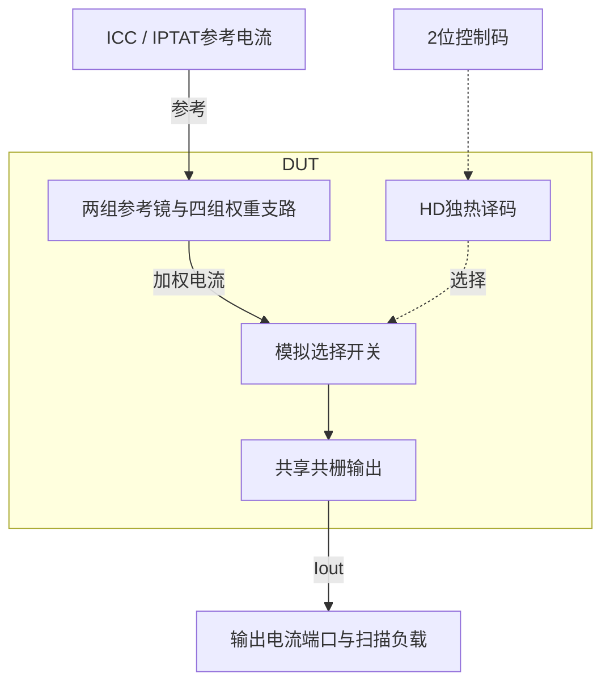
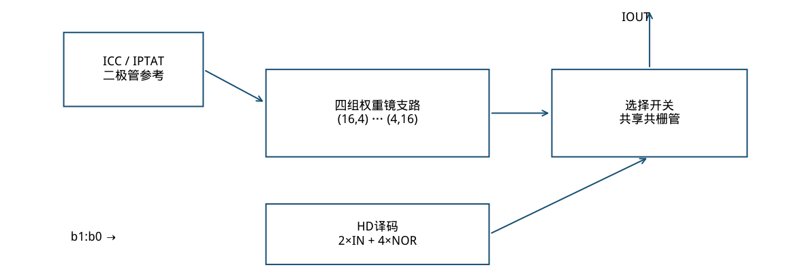
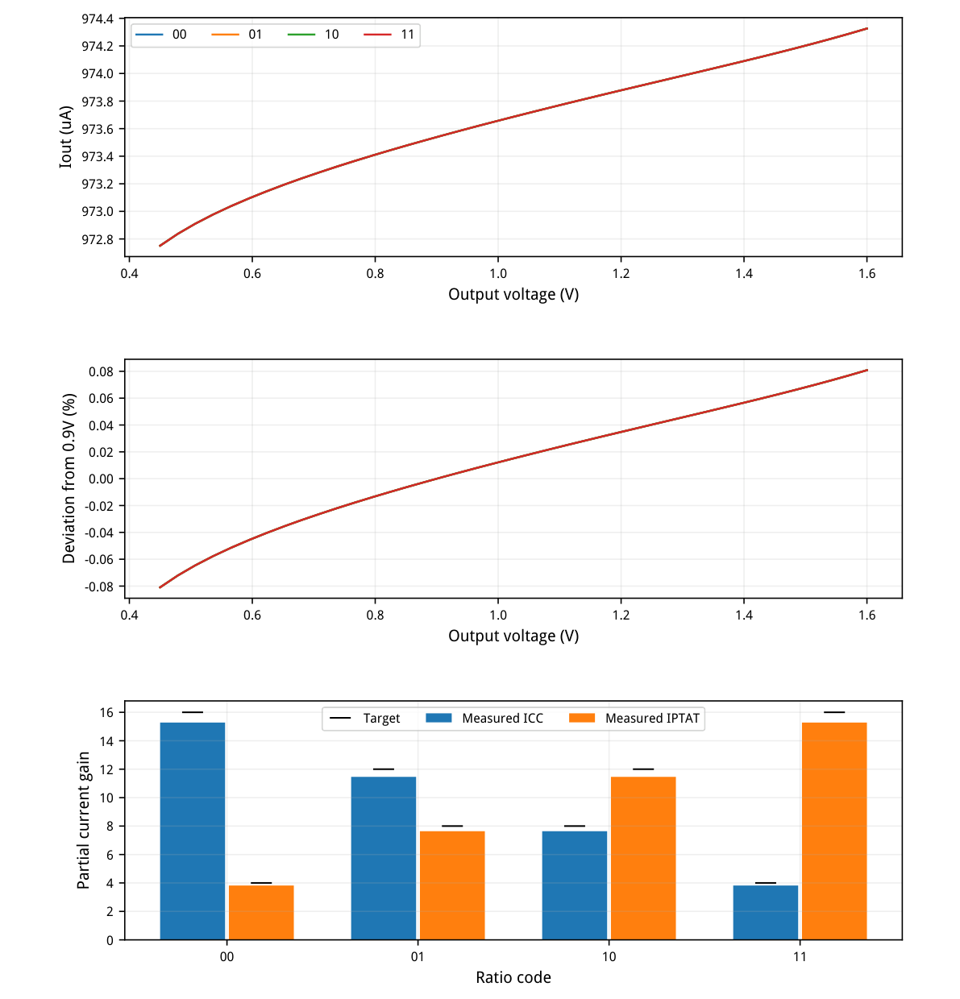
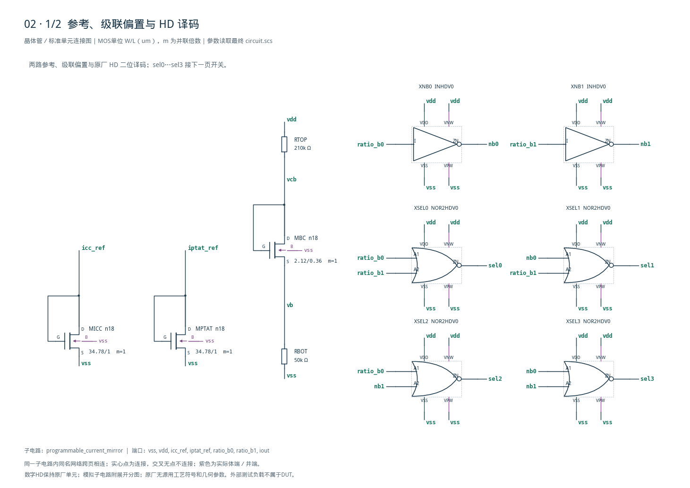
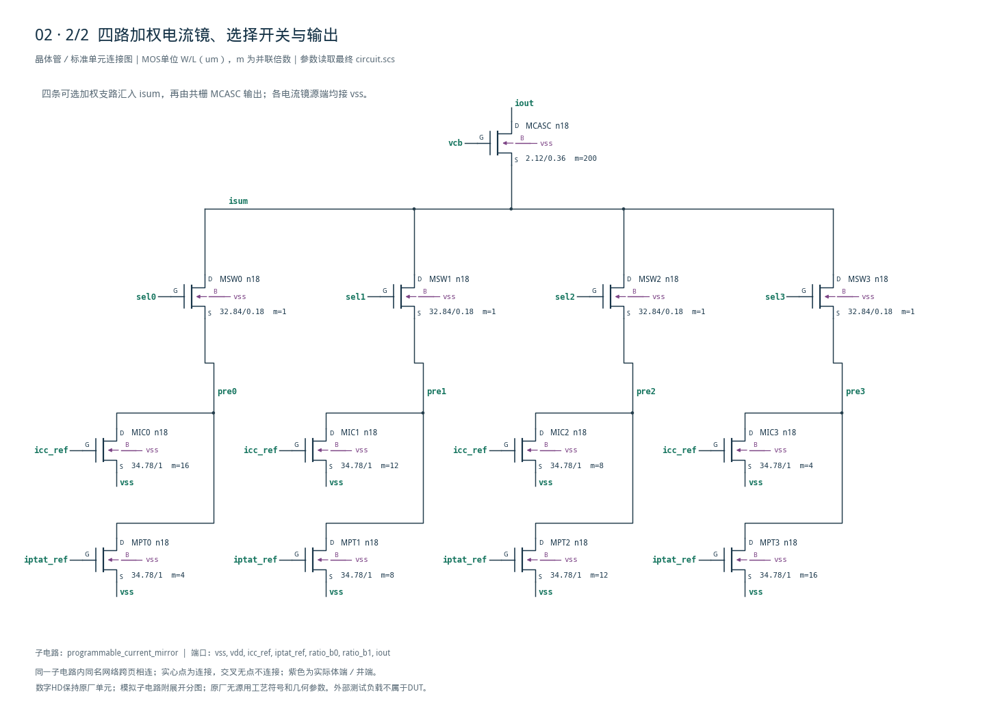

# 02 · 可编程电流镜审查报告

[审查 PDF](review.pdf) · [实测结果](latest_results.json) · [验收合同](contract.json) · [最终网表](circuit.scs)

## 验收结果

本模块把两路参考电流按数字码选择的权重相加，生成可编程偏置电流。相比固定比例电流镜，它可调节两路参考的贡献，并用共栅级降低输出电压对电流的影响。芯片中常用于偏置分配、温度补偿权重调整和校准；本次只验证给定参考电流的nominal行为。

结论：四个控制码、参考扰动及完整输出范围均通过原nominal指标。条件：SMIC18MMRF / tt / 1.8 V / 27°C；ICC、IPTAT各50 uA；输出电压名义0.9 V。代码改变两个参考的贡献比例，名义总目标始终为1 mA。

| 最坏指标 | 实测 | 原门槛 | 10%边界 | 15%边界 | 单位 |
| --- | --- | --- | --- | --- | --- |
| 输出电流误差 | 2.6461 | ≤8.000 | ≤8.800 | ≤9.200 | % |
| 独立权重误差 | 4.4974 | ≤10.000 | ≤11.000 | ≤11.500 | % |
| 贡献比例误差 | 0.0058 | ≤10.000 | ≤11.000 | ≤11.500 | % |
| 参考扰动耦合 | 0.0000 | ≤25.000 | ≤27.500 | ≤28.750 | mV |
| 切码参考偏移 | 0.0000 | ≤50.000 | ≤55.000 | ≤57.500 | mV |
| 辅助VDD电流 | 4.8147 | ≤100.000 | ≤110.000 | ≤115.000 | uA |
| 数字引脚电流 | 0.0000 | ≤1.000 | ≤1.100 | ≤1.150 | uA |
| 输出全范围变化 | 0.0809 | ≤3.000 | ≤3.300 | ≤3.450 | % |
| 最小输出电阻 | 815.3336 | ≥100.000 | ≥90.000 | ≥85.000 | kΩ |

| 控制码 | 目标ACC/APTAT | Iout/uA | ACC实测 | APTAT实测 |
| --- | --- | --- | --- | --- |
| 00 | 16 / 4 | 973.539 | 15.2804 | 3.8203 |
| 01 | 12 / 8 | 973.539 | 11.4606 | 7.6405 |
| 10 | 8 / 12 | 973.539 | 7.6405 | 11.4606 |
| 11 | 4 / 16 | 973.539 | 3.8203 | 15.2804 |

两参考引脚在名义及±5 uA独立扰动下均为0.47885–0.49117 V，满足0.20–1.10 V；所有输出电流均为正。隔离/数字电流的零值是本次模型和数值精度下的结果，不表示真实器件不存在漏电。

辅助VDD电流已扣除两个强制参考电流；输出由外部电压源供电，不计入DUT辅助支路。

<!-- SYSTEM-BLOCK-DIAGRAM -->
## 系统框图

译码只控制模拟电流支路；电流端口的外部电压源属于测量夹具。

实线表示信号或能量通路，虚线表示时钟、控制或偏置。DUT框外为外部端口或测试夹具；精确端子连接见后附基本电路图。



[独立Mermaid源文件](system_block_diagram.mmd) · [框图SVG](markdown_assets/system-block.svg)
<!-- END-SYSTEM-BLOCK-DIAGRAM -->

## 结构、gm/ID与实际工作点

电流镜使用相同W/L单元复制；译码只用未修改的HD标准单元。

| 角色 | 模型 | L/um | 单位W/um | m | LUT gm/ID |
| --- | --- | --- | --- | --- | --- |
| 参考与各镜单元 | n18 | 1.00 | 34.78 | 1 / 4 / 8 / 12 / 16 | 16 |
| 输出共栅单元 | n18 | 0.36 | 2.12 | 200 | 18 |
| 共栅偏置复制 | n18 | 0.36 | 2.12 | 1 | 18 |
| 模拟选择开关 | n18 | 0.18 | 32.84 | 1 | 8（初值） |

偏置支路：VDD经210 kΩ到共栅栅压，二极管n18下端经50 kΩ到VSS；实测偏置电流4.815 uA。共栅与偏置管使用同一2.12/0.36 um单元，输出m=200。所有单实例宽度均在PDK的100 um上限内。

| 00码实际OP | I/uA | gm/ID | VDS/V | VDSAT/V | region |
| --- | --- | --- | --- | --- | --- |
| 参考 | 50.000 | 16.24 | 0.4852 | 0.1023 | 2 |
| ICC权重16 | 778.831 | 16.21 | 0.2183 | 0.1023 | 2 |
| 共栅 | 973.539 | 18.41 | 0.6590 | 0.0830 | 2 |
| 选择开关 | 973.538 | 0.54 | 0.0227 | 0.4723 | 1 |

模拟开关有意工作在线性区，实测Ron约23.36 Ω；不能要求它保持饱和。gm/ID用于给出初始宽度，实际导通压降与完整外部合同共同确认尺寸。



[查看矢量图](markdown_assets/figure-02-01.svg)

## 全范围电流与独立权重

每码41个均匀电压点，含0.45 V与1.60 V；权重使用±5 uA中心差分。

四条名义电流曲线几乎重合，这是相同单元复制与互补总权重20的结果。输出电阻按0.895/0.905 V中心差分，不以全范围斜率替代局部输出电阻。



[查看矢量图](markdown_assets/figure-03-01.svg)

## 精确连接与复现路径

内核没有独立源、受控源或理想开关；HD内部器件尺寸保留原库。

早期宽度直接乘权重的版本曾触发CMI-2441尺寸越界，已撤回。最终采用同尺寸单元的m复制，日志无该警告。gm/ID文件哈希、HD原CDL哈希、完整单元网表、测试台与模型哈希均随运行保存。

复现：/home/IC/CodeX/virtuoso-bridge-lite/.venv/bin/python scripts/case02\_mirror.py生成PDF：同一Python运行 scripts/review\_pdf.py 2运行：runs/02/20260922T062026366425Z\_mirror

范围：SMIC18 tt / 27°C / 1.8 V。保留四码、参考独立扰动、参考端口约束和输出电压范围；没有复现原任务另外两个配对PVT点，也没有验证切码瞬态、噪声、失配或版图。

原任务：sky130-programmable-icc-iptat-current-mirror-pvt

## 完整网表与电路图

[Spectre 网表](circuit.scs) · [全部分图 PDF](schematic/sheets.pdf) · [电路总图](schematic/full.svg) · [端子连接](schematic/connectivity.json)

<details>
<summary>展开完整 Spectre 网表</summary>

```spectre
// Analog devices from target SMIC18 gm/ID LUT; exact HD decode cells.
simulator lang=spectre
subckt programmable_current_mirror (vss vdd icc_ref iptat_ref ratio_b0 ratio_b1 iout)
MICC (icc_ref icc_ref vss vss) n18 w=34.78u l=1u
MPTAT (iptat_ref iptat_ref vss vss) n18 w=34.78u l=1u
XNB0 (ratio_b0 nb0 vdd vss vdd vss) INHDV0
XNB1 (ratio_b1 nb1 vdd vss vdd vss) INHDV0
XSEL0 (ratio_b0 ratio_b1 sel0 vdd vss vdd vss) NOR2HDV0
MIC0 (pre0 icc_ref vss vss) n18 w=34.780000u l=1u m=16
MPT0 (pre0 iptat_ref vss vss) n18 w=34.780000u l=1u m=4
MSW0 (isum sel0 pre0 vss) n18 w=32.84u l=.18u
XSEL1 (nb0 ratio_b1 sel1 vdd vss vdd vss) NOR2HDV0
MIC1 (pre1 icc_ref vss vss) n18 w=34.780000u l=1u m=12
MPT1 (pre1 iptat_ref vss vss) n18 w=34.780000u l=1u m=8
MSW1 (isum sel1 pre1 vss) n18 w=32.84u l=.18u
XSEL2 (ratio_b0 nb1 sel2 vdd vss vdd vss) NOR2HDV0
MIC2 (pre2 icc_ref vss vss) n18 w=34.780000u l=1u m=8
MPT2 (pre2 iptat_ref vss vss) n18 w=34.780000u l=1u m=12
MSW2 (isum sel2 pre2 vss) n18 w=32.84u l=.18u
XSEL3 (nb0 nb1 sel3 vdd vss vdd vss) NOR2HDV0
MIC3 (pre3 icc_ref vss vss) n18 w=34.780000u l=1u m=4
MPT3 (pre3 iptat_ref vss vss) n18 w=34.780000u l=1u m=16
MSW3 (isum sel3 pre3 vss) n18 w=32.84u l=.18u
MCASC (iout vcb isum vss) n18 w=2.12u l=.36u m=200
MBC (vcb vcb vb vss) n18 w=2.12u l=.36u
RTOP (vdd vcb) resistor r=210000
RBOT (vb vss) resistor r=50000
ends programmable_current_mirror
```

</details>





## 报告来源

正文与表格整理自已交付的矢量 PDF，图表单独提取；本文件是后续整理的 Markdown，不是原 PDF 的编译输入。原 PDF、网表及测量数据保持原值。
