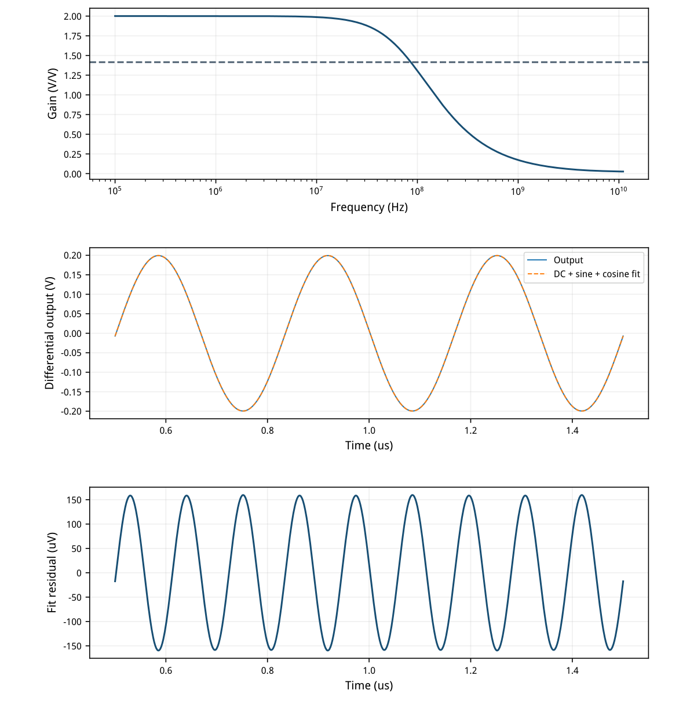
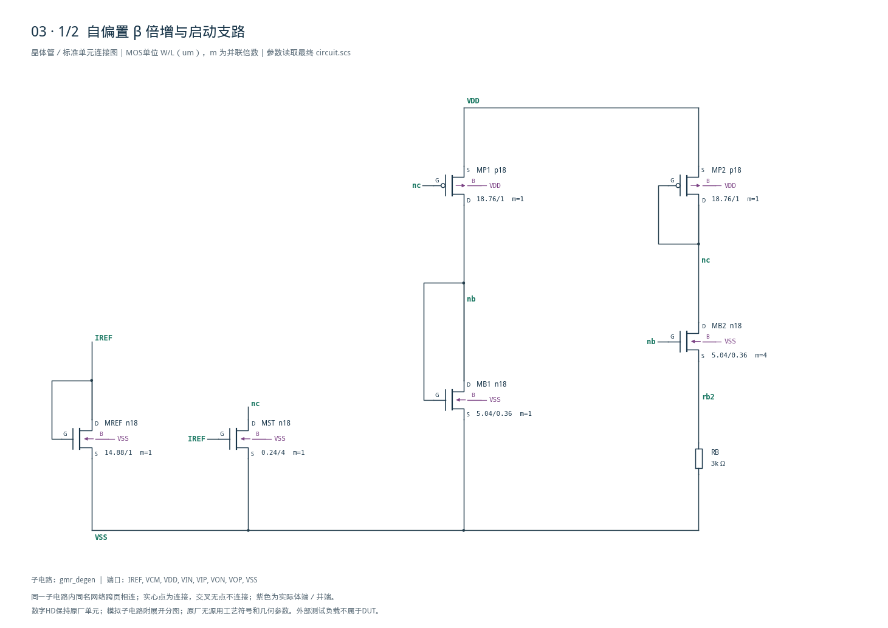
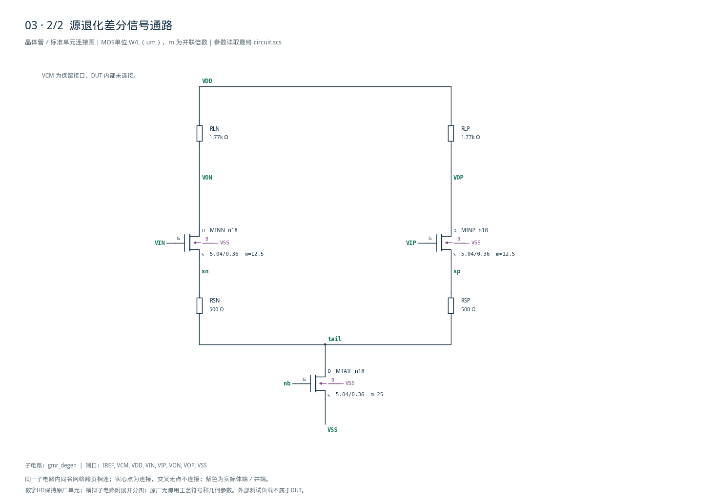

# 03 · 自偏置退化 GM-R 审查

[审查 PDF](review.pdf) · [实测结果](latest_results.json) · [验收合同](contract.json) · [最终网表](circuit.scs)

## 验收结果

本模块提供约两倍差分电压增益，并结合自偏置与源极退化来控制跨导和失真。相比直接固定电流偏置的差分对，β倍增环使跨导与电阻相关，源极电阻进一步削弱器件非线性的影响。芯片中可用作模拟前端或连续时间信号通路的线性增益级；跨工艺温度的稳定性仍需另行验证。

结论：独立实现的nominal原指标全部通过，无需10%–15%放宽。条件：SMIC18MMRF / tt / 1.8 V / 27°C，外部IREF50 uA，输入共模及VCM0.9 V，每端负载1 pF。DUT只含MOS及正值电阻，VCM为保留兼容端口。

| 指标 | 实测 | 原门槛 | 10%边界 | 15%边界 | 单位 |
| --- | --- | --- | --- | --- | --- |
| AC增益偏离目标2 | 0.00086 | ≤0.020 | ≤0.022 | ≤0.023 | V/V |
| 上端−3dB带宽 | 86.06379 | ≥60.000 | ≥54.000 | ≥51.000 | MHz |
| 全端口静态功耗 | 1.07930 | ≤1.500 | ≤1.650 | ≤1.725 | mW |
| 3MHz SDR | 61.98173 | ≥60.000 | ≥59.085 | ≥58.588 | dB |
| 基波增益偏离目标2 | 0.00497 | ≤0.100 | ≤0.110 | ≤0.115 | V/V |

实际AC差分增益=2.0008587 V/V，拟合基波增益=1.9950292 V/V。正弦差分峰值固定100 mV，未减小激励来换取更高SDR。残差RMS为112.292 uV。

电源功耗沿用原定义：VDD、VCM、VIN和VIP端口DC功率绝对值相加。IREF由VDD提供，已经包含；不能借用共模或信号端口供电来隐藏功耗。

与第04项的区别：本例尾电流来自内部β倍增自偏置，IREF主要终止在参考二极管并控制弱启动下拉；第04项直接从IREF镜像尾电流。两个模块各有独立网表、运行、合同和证据。

本题原目标为15个工艺温度点，当前只完成指定nominal点。未运行其余14点、供电变化、失配或寄生提取；也未额外宣称冷启动斜坡通过。

## 自偏置连接与gm/ID工作点

输入与主偏置使用同一n18单元，按并联倍数扩展电流。

| 角色 | 模型 | 单位W/L(um) | m | 目标gm/ID |
| --- | --- | --- | --- | --- |
| MB1/MB2/TAIL/IN± | n18 | 5.04/0.36 | 1/4/25/12.5 | 16.00 |
| MP1/MP2 | p18 | 18.76/1 | 1 | 10.00 |
| MREF | n18 | 14.88/1 | 1 | 12.00 |
| MST | n18 | 0.24/4 | 1 | 8.56 |

| 实际器件 | \|I\|/uA | gm/ID | \|VDS\|−\|VDSAT\|/mV |
| --- | --- | --- | --- |
| MINP | 252.971 | 16.119 | 947.2 |
| MTAIL | 505.942 | 15.420 | 77.6 |
| MB1 | 22.068 | 15.527 | 419.8 |
| MB2 | 21.230 | 21.042 | 1063.4 |
| MP1 | 22.068 | 9.576 | 1097.0 |
| MP2 | 21.602 | 9.607 | 427.8 |
| MST | 0.372 | 8.591 | 990.5 |

输入gm=4.078 mS、gmb=1.000 mS。忽略有限ro时，退化跨导近似gm/[1+(gm+gmb)RS]，体效应不可省略。尾源0.1794 V、饱和余量77.6 mV，是后续跨角落设计需关注的低余量节点。

MB2的gm/ID约21，进入弱反型区；其VDS仍远大于VDSAT。不能把β倍增所有器件都视作强反型平方律器件。


[查看矢量图](markdown_assets/figure-02-01.svg)

## 差分频响与拟合失真

SDR只针对指定确定性正弦响应，不等同于含随机噪声的SNR。

拟合窗口0.5–1.5 us，等间隔1 ns，共1001点。先以DC、sin、cos三个基函数作最小二乘，再用基波功率除残差均方；保留原信号峰值、频率及外部1 pF负载。

带宽以1 MHz实测增益的1/√2为门槛；AC扫描100 kHz–11 GHz，包含原10 GHz检查点。



[查看矢量图](markdown_assets/figure-03-01.svg)

## 精确网表、迭代与复现

自偏置改变偏置生成方式，不能自动证明跨PVT恒定增益。

初版RL=1900 Ω时AC增益2.14485、基波增益2.13841，超出合同；保持偏置与RS，仅将RL改为1770 Ω，得到2.00086和1.99503，带宽80.25→86.06 MHz。SDR保持约61.98 dB。

主管22.07 uA并不直接保证每个尾源单元也流22.07 uA：二者VDS为0.522和0.179 V，尾电流实际505.94 uA。保留镜像误差和尾源余量，比只记并联倍数更有用。启动支路0.372 uA持续导通，包含在功耗中。

复现：/home/IC/CodeX/virtuoso-bridge-lite/.venv/bin/python  scripts/case03\_selfbiased\_gmr.py PDF：同一Python运行 scripts/review\_pdf.py 3

最终运行：runs/03/20260922T073138775167Z\_gmr每次运行保留精确网表、LUT查询与模型哈希；当前无模型尺寸越界。

原任务：sky130-gmr-degen-amp-constant-gm-pvt。输入/负载/功耗/SDR定义与原nominal合同一致；结构是本次目标工艺实现，不冒充原参考电路的逐管尺寸迁移。

## 完整网表与电路图

[Spectre 网表](circuit.scs) · [全部分图 PDF](schematic/sheets.pdf) · [电路总图](schematic/full.svg) · [端子连接](schematic/connectivity.json)

<details>
<summary>展开完整 Spectre 网表</summary>

```spectre
// Beta-biased source-degenerated GM-R; VCM is a compatibility port.
simulator lang=spectre
subckt gmr_degen (IREF VCM VDD VIN VIP VON VOP VSS)
MREF (IREF IREF VSS VSS) n18 w=14.88u l=1u
MST (nc IREF VSS VSS) n18 w=0.24u l=4u
MB1 (nb nb VSS VSS) n18 w=5.04u l=.36u
MB2 (nc nb rb2 VSS) n18 w=5.04u l=.36u m=4
RB (rb2 VSS) resistor r=3000
MP1 (nb nc VDD VDD) p18 w=18.76u l=1u
MP2 (nc nc VDD VDD) p18 w=18.76u l=1u
MTAIL (tail nb VSS VSS) n18 w=5.04u l=.36u m=25
MINN (VON VIN sn VSS) n18 w=5.04u l=.36u m=12.5
MINP (VOP VIP sp VSS) n18 w=5.04u l=.36u m=12.5
RSN (sn tail) resistor r=500
RSP (sp tail) resistor r=500
RLN (VDD VON) resistor r=1770
RLP (VDD VOP) resistor r=1770
ends gmr_degen
```

</details>





## 报告来源

正文与表格整理自已交付的矢量 PDF，图表单独提取；本文件是后续整理的 Markdown，不是原 PDF 的编译输入。原 PDF、网表及测量数据保持原值。
