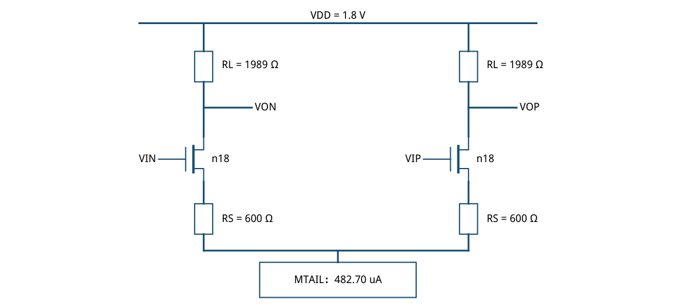
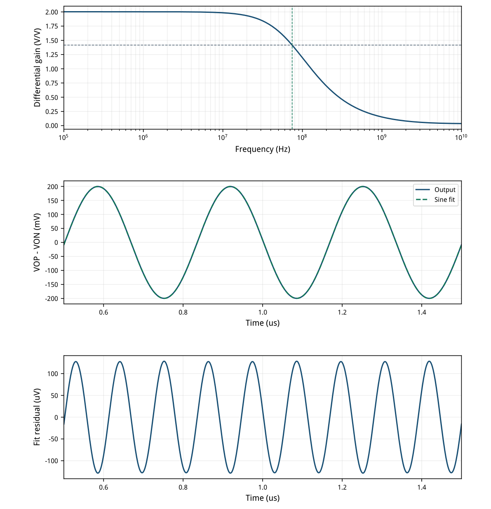
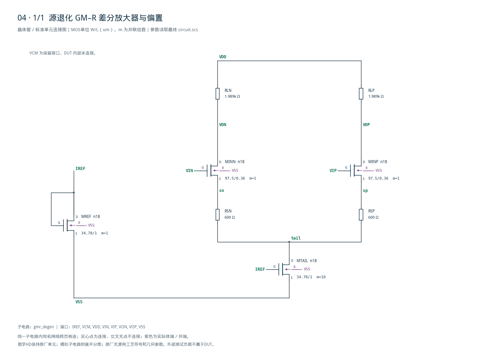

# 04 · GM-R 放大器审查报告

[审查 PDF](review.pdf) · [实测结果](latest_results.json) · [验收合同](contract.json) · [最终网表](circuit.scs)

## 验收结果

本模块把差分电压放大为差分电压，利用源极电阻退化改善线性度并设定跨导。相比未退化差分对，它降低跨导非线性和对晶体管参数的敏感度，代价是增益与电压余量。芯片中常用作模拟前端、ADC前置放大和连续时间滤波器的增益级。

结论：全部 nominal 原始指标通过；无需10%–15%放宽。2026-09-22条件：SMIC18MMRF / tt / 1.8 V / 27°C；输入共模0.9 V；每个输出各接1 pF；外部参考50 uA。源极退化差分对加电阻负载，核心只使用MOS与正值电阻。

| 指标 | 实测 | 原门槛 | 10%边界 | 15%边界 | 单位 |
| --- | --- | --- | --- | --- | --- |
| AC增益偏离2 | 0.0027 | ≤0.0200 | ≤0.0220 | ≤0.0230 | V/V |
| 上端−3dB带宽 | 74.2695 | ≥70.0000 | ≥63.0000 | ≥59.5000 | MHz |
| 总功耗（含参考） | 0.9589 | ≤1.2000 | ≤1.3200 | ≤1.3800 | mW |
| 3MHz SDR | 63.8824 | ≥60.0000 | ≥59.0849 | ≥58.5884 | dB |
| 基波增益偏离2 | 0.0026 | ≤0.1000 | ≤0.1100 | ≤0.1150 | V/V |

AC差分增益@1 MHz = 2.002687 V/V；3 MHz正弦基波增益 = 1.997394 V/V。输入为100 mV差分峰值，不能通过减小振幅改善SDR。增益容差围绕目标2扩大，目标值保持2。

MREF二极管连接，从IREF生成尾管栅压；图中省略体端与参考支路，精确端序见文末完整网表。VCM端口保留，DUT内部不使用。



[查看矢量图](markdown_assets/figure-01-01.svg)

## gm/ID尺寸与体效应

LUT给出初值，实际工作点决定退化跨导和余量。

| n18器件 | L/um | W/um | gm/ID | 目标I/uA | LUT VDS/V |
| --- | --- | --- | --- | --- | --- |
| MINN/MINP | 0.36 | 97.50 | 18.0 | 250.0 | 0.90 |
| MTAIL | 1.00 | 34.78 ×10 | 16.0 | 500.0 | 0.20 |
| MREF | 1.00 | 34.78 | 16.0 | 50.0 | 0.20 |

| 实际器件 | I/uA | gm/ID | VDS/V | VDSAT/V | 余量/V |
| --- | --- | --- | --- | --- | --- |
| MINP | 241.351 | 18.308 | 0.9914 | 0.0838 | 0.9076 |
| MTAIL | 482.702 | 16.145 | 0.1837 | 0.1023 | 0.0814 |

输入管gm=4.419 mS、gmb=1.073 mS，体效应占gm约24%。带退化且忽略ro时，gm\_eff≈gm/[1+(gm+gmb)RS]；不能只用gm/(1+gm·RS)。负载与输出电容构成主极点，增大RL提高增益，同时压低带宽。

输入管实际源压0.3285 V，LUT采用零体偏置；尾节点0.1837 V，尾管VDS−VDSAT约81 mV。输入实际gm/ID=18.31，尾管16.14。记录体偏置与有限ro的误差，避免把LUT查询值直接当成完整电路工作点。

尾管由10个W=34.78 um、L=1 um的参考单元并联，避免超过PDK的单实例W≤100 um范围。实际尾电流482.70 uA，输出共模1.3200 V。旧版W=347.8 um单管结果已撤回；最终运行没有模型尺寸越界警告。

所有LUT文件路径、SHA-256、目标点和单元并联信息保存在sizing.json。模型范围检查已成为后续每次运行的门槛；本结果不外推到PVT。

## 频响、正弦与残差证据

SDR按上游正弦拟合定义；1001个等间隔采样点，0.5–1.5 us。

SDR=10log10[(a²+b²)/2 / mean(residual²)]；拟合含DC、sin与cos项。残差RMS=90.329 uV。此值是指定振幅/频率下的失真比，不包含随机噪声，也不等同于噪声动态范围。



[查看矢量图](markdown_assets/figure-03-01.svg)

## 精确电路、迭代与复现

宽度和电阻均来自最终通过的输入快照；没有修改PDK或Bridge。

| RL/Ω | 1MHz增益 | 带宽/MHz | SDR/dB | 结果 |
| --- | --- | --- | --- | --- |
| 1900 | 1.91094 | 77.713 | 63.660 | 尺寸越界撤回 |
| 1989 | 1.99884 | 74.271 | 63.651 | 尺寸越界撤回 |
| 1989 | 2.00269 | 74.270 | 63.882 | 并联管通过 |

功耗按VDD、VCM、VIN、VIP四个DC端口的|V·I|求和，参考电流取自VDD。AC差分激励1 V；瞬态每侧50 mV、反相3 MHz；CL每侧1 pF。先修正RL，再将尾管改为范围内的并联单元完成最终验证。

复现：/home/IC/CodeX/virtuoso-bridge-lite/.venv/bin/python scripts/case04\_gmr.py生成PDF：同一Python运行 scripts/review\_pdf.py 4运行：runs/04/20260922T062025898382Z\_gmr

原任务：sky130-gmr-degenerated-diff-amp-gain2-bw70m-power1p2mw-sdr60。原始5个工艺角在本次任务中缩为SMIC18 tt。没有执行额外温度、供电、失配或版图寄生验证。

PSF解析说明：既有解析器把PROP的units元数据当作额外信号；工程读取器仅过滤该元数据，校验真实曲线长度、有限值及时间递增。输入/输出/时间列已与原始标量记录逐点核对。

## 完整网表与电路图

[Spectre 网表](circuit.scs) · [全部分图 PDF](schematic/sheets.pdf) · [电路总图](schematic/full.svg) · [端子连接](schematic/connectivity.json)

<details>
<summary>展开完整 Spectre 网表</summary>

```spectre
// SMIC18 source-degenerated differential amplifier. VCM port is unused.
simulator lang=spectre
subckt gmr_degen (IREF VCM VDD VIN VIP VON VOP VSS)
MREF (IREF IREF VSS VSS) n18 w=34.7800u l=1u
MTAIL (tail IREF VSS VSS) n18 w=34.7800u l=1u m=10
MINN (VON VIN sn VSS) n18 w=97.5000u l=.36u
MINP (VOP VIP sp VSS) n18 w=97.5000u l=.36u
RSN (sn tail) resistor r=600
RSP (sp tail) resistor r=600
RLN (VDD VON) resistor r=1989
RLP (VDD VOP) resistor r=1989
ends gmr_degen
```

</details>



## 报告来源

正文与表格整理自已交付的矢量 PDF，图表单独提取；本文件是后续整理的 Markdown，不是原 PDF 的编译输入。原 PDF、网表及测量数据保持原值。
