# 05-bootstrap-driver 审查报告

PDF由Python/Matplotlib排版生成。此Markdown从同一报告文本、表格和网表保存，便于编辑；它不是PDF编译输入。完整生成脚本随implementation目录保存。

<!-- SYSTEM-BLOCK-DIAGRAM -->
## 系统框图

驱动器是DUT；功率MOS、负载、封装寄生和指定外部自举电容按原夹具单列。

实线表示信号或能量通路，虚线表示时钟、控制或偏置。DUT框外为外部端口或测试夹具；精确端子连接见后附基本电路图。

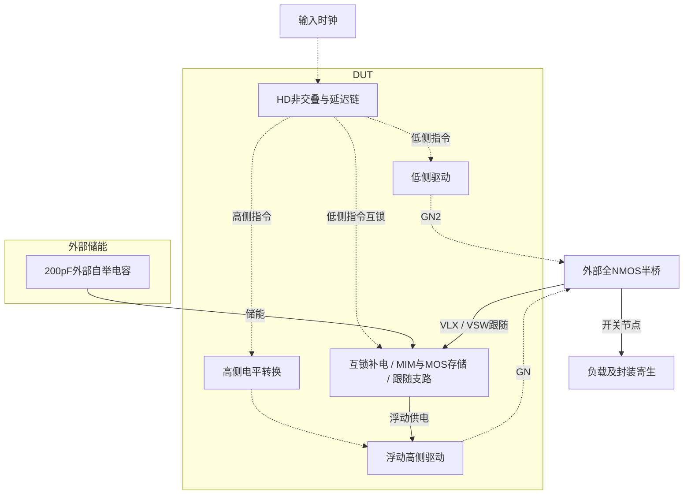
```mermaid
flowchart TB
    subgraph DUT["DUT"]
        direction TB
        NON["HD非交叠与延迟链"]
        LS["低侧驱动"]
        LVL["高侧电平转换"]
        HS["浮动高侧驱动"]
        BST["互锁补电 / MIM与MOS存储 / 跟随支路"]
    end
    CLK["输入时钟"]
    BR["外部全NMOS半桥"]
    LOAD["负载及封装寄生"]
    subgraph AUX["外部储能"]
        CAP["200pF外部自举电容"]
    end
    CLK -.-> NON
    NON -.->|"低侧指令"| LS
    NON -.->|"高侧指令"| LVL
    LVL -.-> HS
    LS -.->|"GN2"| BR
    HS -.->|"GN"| BR
    BR -->|"开关节点"| LOAD
    NON -.->|"低侧指令互锁"| BST
    BST -->|"浮动供电"| HS
    CAP -->|"储能"| BST
    BR -->|"VLX / VSW跟随"| BST
```

[独立Mermaid源文件](system_block_diagram.mmd) · [框图SVG](markdown_assets/system-block.svg)
<!-- END-SYSTEM-BLOCK-DIAGRAM -->

## 05 | 全NMOS半桥自举驱动

本模块为外部全NMOS半桥产生交替的低侧驱动和浮动高侧驱动。自举存储使高侧栅极随开关节点抬升，非交叠控制避免两管同时导通，互锁补电与跟随支路控制寄生电感下的过冲；代价是存储面积、动态功耗、短脉冲驱动能力和器件电压限制需要共同权衡。芯片中可用于低压半桥开关控制，本次只验证指定外部功率管与负载的标称开环行为。

结论：TT / 1.8V / 27°C，20/50/80ns三种脉宽达到预定10%档。

平均高侧VGS低于原1.65V下限，80ns输入组的HL死区略小于原3ns，均满足10%档。峰值、电流、非交叠、原生3.3V器件节点筛查及面积上限不放宽。

| 指标 | 实测三组范围/最坏 | 原指标 | 10% | 15% |
| --- | --- | --- | --- | --- |
| 平均VGS/V | 1.498472–1.567368 | 1.65–1.85 | 1.485–2.035 | 1.4025–2.1275 |
| 死区/ns | 2.996785–4.363517 | 3–7 | 2.7–7.7 | 2.55–8.05 |
| 最大功耗/mW | 3.090269 | <3.5 | <3.85 | <4.025 |
| 高侧VGS峰值/V | 1.705964 | <2.15 | 同左 | 同左 |
| 高侧电流峰值/A | 0.613884 | <0.8 | 同左 | 同左 |
| VBST−VLX峰值/V | 1.812604 | <2.15 | 同左 | 同左 |
| 低侧栅峰值/V | 1.801420 | <2.15 | 同左 | 同左 |
| VBST对地峰值/V | 3.569765 | 原<5.65；本次<3.63 | 同左 | 同左 |

DUT展开WLm面积33470.813096um²≤35000um²，外接自举电容200pF≤100nF。额外3.63V绝对节点筛查保留，并非完整器件端电压或寿命签核。

## gm/ID初算、存储面积与实际器件

数字单元保持原厂HD；模拟MOS/MIM使用原生SMIC18模型。

| 角色 | 模型 | 初算总W/L um | gm/ID | 初算Id/uA |
| --- | --- | --- | --- | --- |
| hv_n | n33 | 1.08/0.36 | 10.0 | 10 |
| hv_p | p33 | 0.4/0.36 | 10.0 | 1 |
| charge_n | n33 | 1538.42/0.36 | 5.0 | 50000 |
| charge_p | p33 | 5535.1/0.36 | 5.0 | 50000 |
| reset_n | n18 | 2713.16/0.18 | 8.0 | 100000 |

实际补电PMOS为初算0.1倍，NMOS跟随为0.4倍，底板复位为0.07倍；新增PMOS跟随支路为强PMOS初算2倍。每指宽度不超过90um，通过m实现总宽。gm/ID仅作初始电流密度选择，不代表动态工作点恒定。

片上自举存储为30×30um原生MIM及80×9.6um、m=34的n18 MOS电容。MOS电容D/S/B接VLX、G接VBST，保留原生C-V非线性；此处按面积和储能需求选几何，不作放大器gm/ID解释。

两条八级HD延时链各级MIM几何10×11um。主驱动四级并联数1/1/2/8，完整原厂INHDV16/32；补电与复位小缓冲使用INHDV1/4/16/32。独立面积展开计入所有重复层次、HD内部MOS、MOS电容及MIM，排除题目固定的外接功率管。

## 三种脉宽的实际换向波形

最终精算0.60–0.70us；分别显示高侧VGS、低侧栅极与开关节点。

三种输入脉宽的换向波形。输入高电平对应低侧命令，所以20ns输入组的高侧导通时间较长；波形没有更改原控制极性。

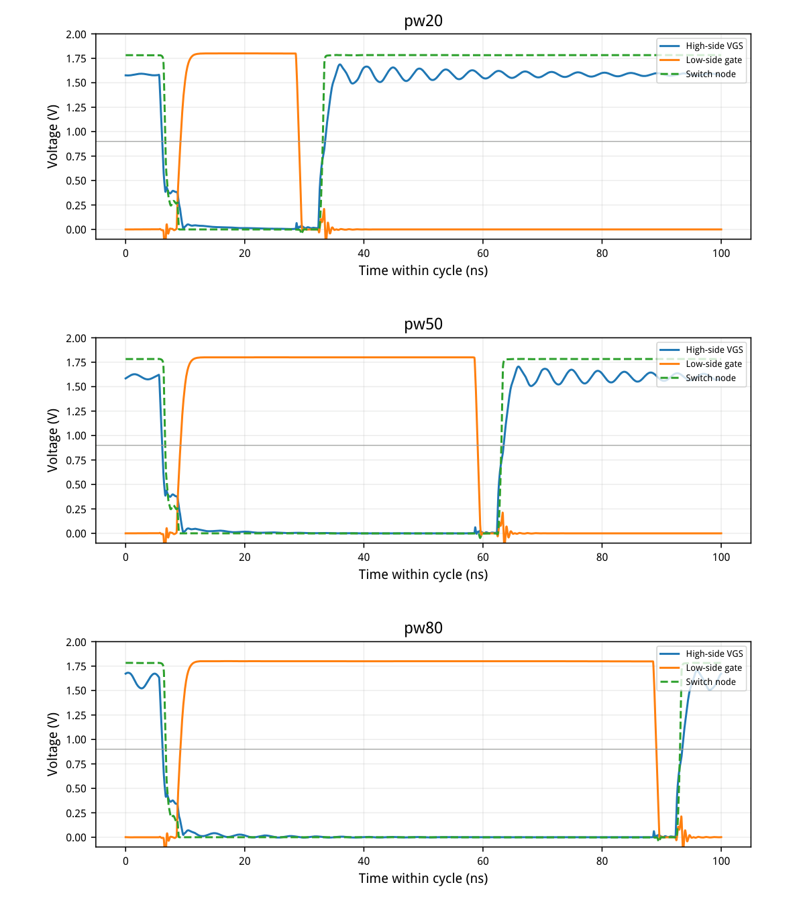

[查看矢量图](markdown_assets/figure-03-01.svg)

原死区判定取固定窗口内第2次下降与第2次上升跨越0.9V；同时确认每侧各5次升/降沿且全部非交叠。

## 补电互锁、跟随支路与固定夹具

保留原负载、外部功率管、封装与两条自举连线寄生。

交叉反馈延时链产生非交叠命令。浮动高侧缓冲由VBST/VLX供电；补电PMOS经独立高压电平转换与浮动HD缓冲驱动，只在低侧命令有效时补电。底板复位也由该命令控制，替换原电平下降反馈路径。

新增p33跟随管D接VSW、G接VSS、S/B接VLX，在高共模阶段帮助VLX跟随开关节点，降低两条2nH连线造成的共模过冲；它不改变外部寄生参数。MOS电容抑制自举两端的差模振铃。

输入周期100ns、边沿3ns、源电阻50Ω、脉宽20/50/80ns。两只外部功率NMOS均W=50um、m=450，迁移为原生n18最小L=0.18um；高侧体端保留连接外接自举电容底端，低侧体接0，负载3.6Ω。

DUT正/负供电各0.3nH+3mΩ；外接200pF自举电容每根连线各2nH+5mΩ。原功耗=|1.8×平均I(VDDDUT)|，窗口0.5–1us，包含自举补电；外部功率级VHS支路另测，不计入DUT功耗。

VGS平均值按VSW>0.9V的时间掩码积分；所有峰值也在原0.5–1us窗口读取。原TT中的80/125°C及FS/SF不在本次nominal范围。

## 数值确认、独立检查与限制

未改模型；保留原始MD、生成脚本与每次Spectre运行快照。

maxstep100→50ps，全局reltol1e-5→1e-6，conservative实际相对容差1e-6→1e-7；保留traponly。36项预声明误差界限全部通过，三种脉宽均维持10%档。原日志中的trapezoidal-ringing notices保留，峰值和时序的精算差异按计划逐项约束。

| 输入脉宽 | 平均VGS/V | DUT功耗/mW | HL/ns | LH/ns |
| --- | --- | --- | --- | --- |
| pw20 | 1.5648550 | 3.0519550 | 3.0714739 | 4.3635168 |
| pw50 | 1.5673684 | 3.0881669 | 3.0742191 | 4.3374907 |
| pw80 | 1.4984721 | 3.0902689 | 2.9967849 | 4.3352656 |

独立积分、峰值搜索、第2下降/第2上升边沿及WLm层次展开共37项交叉核对通过。原8项电气界限中6项通过；平均VGS下限及最短死区的原指标失败如实保留。

完整电路图15页，69个定义实例、320个端子。复现入口：case05_bootstrap_driver.py → confirm05.py → schematic05.py → audit05.py → review05.py。静态图纸连接审查不等同于版图LVS或隔离阱验证。

没有进行全端子应力、可靠性寿命、PVT、失配或PEX签核。电路SHA-256：
51ae51fce4ab67a9ce5b7e74e61e746bf6f22c7480f2c2802fef5c3ee071cd12

## 完整网表与电路图

[Spectre 网表](circuit.scs) · [全部分图 PDF](schematic/sheets.pdf) · [电路总图](schematic/full.svg) · [端子连接](schematic/connectivity.json)

<details>
<summary>展开完整 Spectre 网表</summary>

```spectre
simulator lang=spectre
subckt inv (in out vdd vss)
XG (in out vdd vss vdd vss) INHDV1
ends inv
subckt nand (a b q vdd vss)
XG (a b q vdd vss vdd vss) NAND2HDV1
ends nand
subckt delay_chain (in out vdd vss)
XD0 (in d0 vdd vss vdd vss) INHDV1
CD0 (d0 vss) mim w=10u l=11u
XD1 (d0 d1 vdd vss vdd vss) INHDV1
CD1 (d1 vss) mim w=10u l=11u
XD2 (d1 d2 vdd vss vdd vss) INHDV1
CD2 (d2 vss) mim w=10u l=11u
XD3 (d2 d3 vdd vss vdd vss) INHDV1
CD3 (d3 vss) mim w=10u l=11u
XD4 (d3 d4 vdd vss vdd vss) INHDV1
CD4 (d4 vss) mim w=10u l=11u
XD5 (d4 d5 vdd vss vdd vss) INHDV1
CD5 (d5 vss) mim w=10u l=11u
XD6 (d5 d6 vdd vss vdd vss) INHDV1
CD6 (d6 vss) mim w=10u l=11u
XD7 (d6 out vdd vss vdd vss) INHDV1
CD7 (out vss) mim w=10u l=11u
ends delay_chain
subckt non_overlap (clk p1 p2 vdd vss)
XI5 (net03 p2 vdd vss) inv
XI0 (clk net5 vdd vss) inv
XI3 (p1 clk net4 vdd vss) nand
XI1 (net5 net03 net6 vdd vss) nand
XI4 (net4 net03 vdd vss) delay_chain
XI2 (net6 p1 vdd vss) delay_chain
ends non_overlap
subckt buffer (in out vdd vss)
XB0_0 (in b0 vdd vss vdd vss) INHDV16
XB1_0 (b0 b1 vdd vss vdd vss) INHDV32
XB2_0 (b1 b2 vdd vss vdd vss) INHDV32
XB2_1 (b1 b2 vdd vss vdd vss) INHDV32
XB3_0 (b2 out vdd vss vdd vss) INHDV32
XB3_1 (b2 out vdd vss vdd vss) INHDV32
XB3_2 (b2 out vdd vss vdd vss) INHDV32
XB3_3 (b2 out vdd vss vdd vss) INHDV32
XB3_4 (b2 out vdd vss vdd vss) INHDV32
XB3_5 (b2 out vdd vss vdd vss) INHDV32
XB3_6 (b2 out vdd vss vdd vss) INHDV32
XB3_7 (b2 out vdd vss vdd vss) INHDV32
ends buffer
subckt buffers (in out vdd vss)
XB0_0 (in b0 vdd vss vdd vss) INHDV1
XB1_0 (b0 b1 vdd vss vdd vss) INHDV4
XB2_0 (b1 b2 vdd vss vdd vss) INHDV16
XB3_0 (b2 out vdd vss vdd vss) INHDV32
XB3_1 (b2 out vdd vss vdd vss) INHDV32
ends buffers
subckt lvl3 (in out vdd1 vdd2 vss)
Mlvl3_PM3 (out net14 vdd2 vdd2) p33 w=0.4u l=0.36u m=1
Mlvl3_PM1 (net3 net14 vdd2 vdd2) p33 w=0.4u l=0.36u m=1
Mlvl3_PM0 (net14 net3 vdd2 vdd2) p33 w=0.4u l=0.36u m=1
XCOREINV (in net1 vdd1 vss vdd1 vss) INHDV1
Mlvl3_NM3 (out net14 vss vss) n33 w=1.08u l=0.36u m=1
Mlvl3_NM2 (net14 in vss vss) n33 w=4.32u l=0.36u m=1
Mlvl3_NM1 (net3 net1 vss vss) n33 w=4.32u l=0.36u m=1
ends lvl3
subckt bootstrap_driver (GN GN2 IN VBST VDD VLX VSS VSW)
XLVL3 (p1_int P1UP VDD VBST VSS) lvl3
XINV34 (net03 net016 VBST VLX) inv
XINV31 (net028 net02 VDD VSS) inv
XINV17 (net08 p1_int VDD VSS) inv
XBUFF12 (net028 GN2 VDD VSS) buffer
XBUFF11 (net016 GN VBST VLX) buffer
Mbootstrap_driver_NM1 (VLX net16 VSS VSS) n18 w=63.30706667u l=0.18u m=3
Mbootstrap_driver_NM5 (net03 P1UP VLX VLX) n33 w=1.08u l=0.36u m=1
Mbootstrap_driver_NM2 (VSW GN VLX VSS) n33 w=87.90971429u l=0.36u m=7
Mbootstrap_driver_PM5 (net03 P1UP VBST VBST) p33 w=0.4u l=0.36u m=1
Mbootstrap_driver_PM2 (VDD charge_gate VBST VBST) p33 w=79.07285714u l=0.36u m=7
CBST (VBST VLX) mim w=30u l=30u m=1
MBSTCAP (VLX VBST VLX VLX) n18 w=80u l=9.6u m=34
MTRACKP (VSW VSS VLX VLX) p33 w=89.27580645u l=0.36u m=124
XNON (IN net08 net028 VDD VSS) non_overlap
XBUFF7 (net028 net16 VDD VSS) buffers
XCHARGE_LS (net02 CHUP VDD VBST VSS) lvl3
MCHN (charge_inv CHUP VLX VLX) n33 w=1.08u l=0.36u m=1
MCHP (charge_inv CHUP VBST VBST) p33 w=0.4u l=0.36u m=1
XINVCH (charge_inv charge_noninv VBST VLX) inv
XBUFFCH (charge_noninv charge_gate VBST VLX) buffers
ends bootstrap_driver
```

</details>

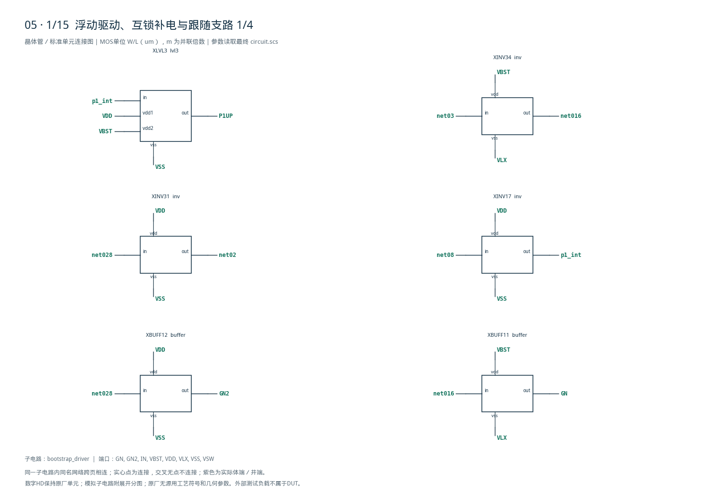

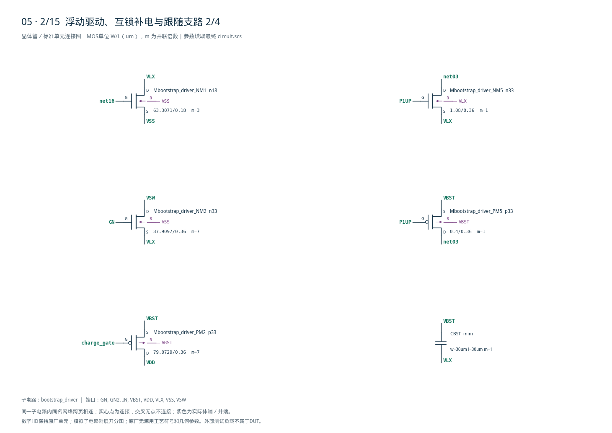

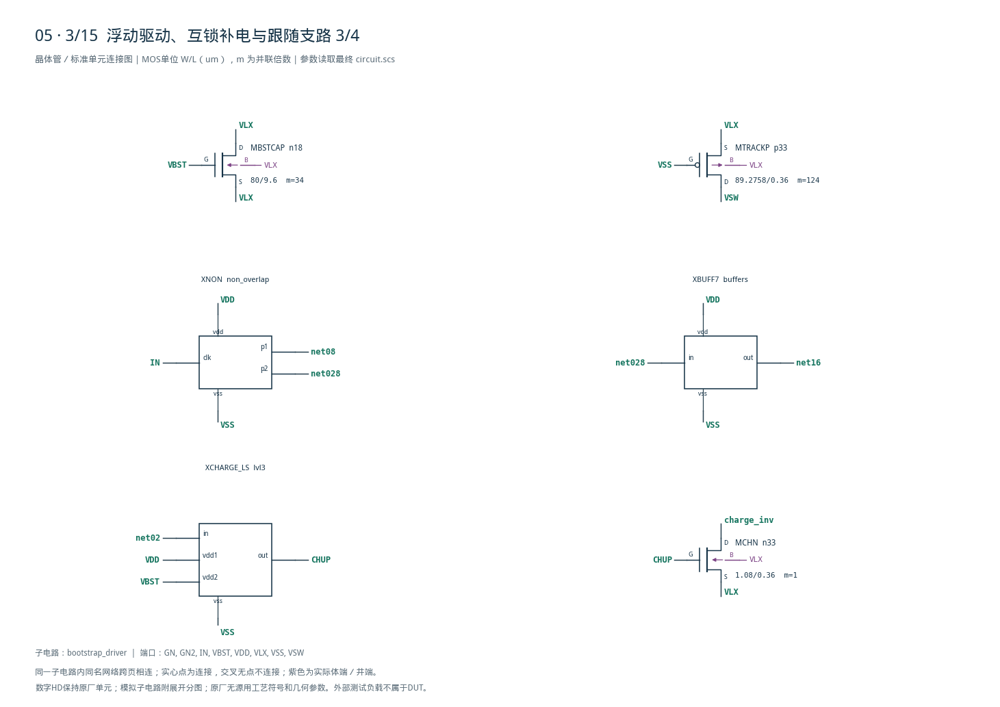

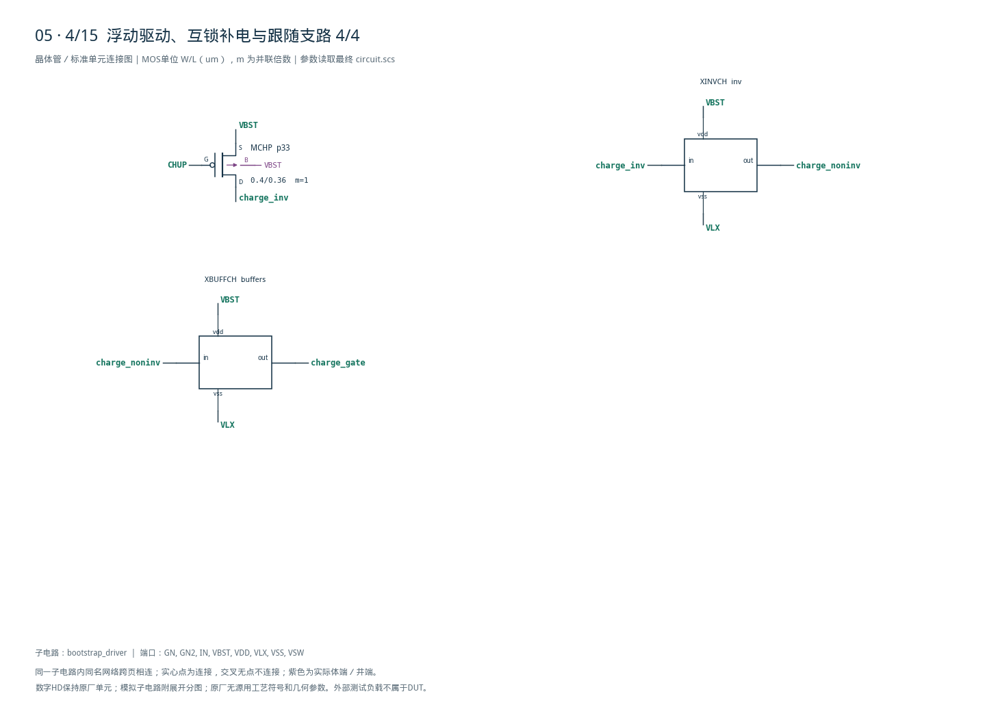

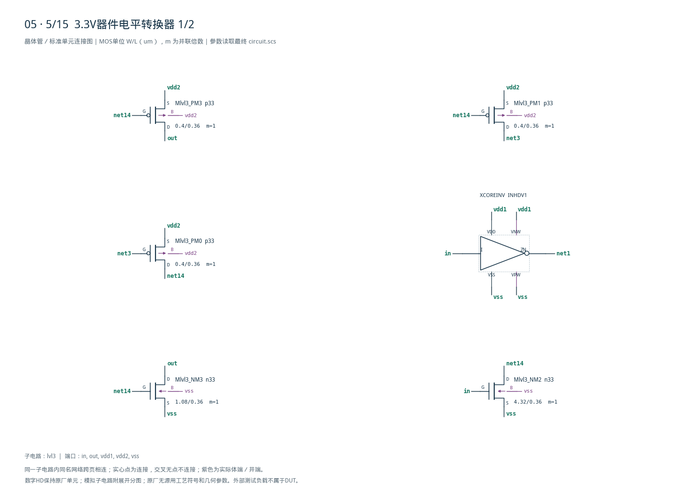

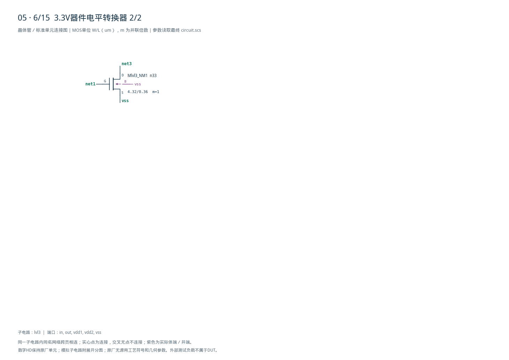

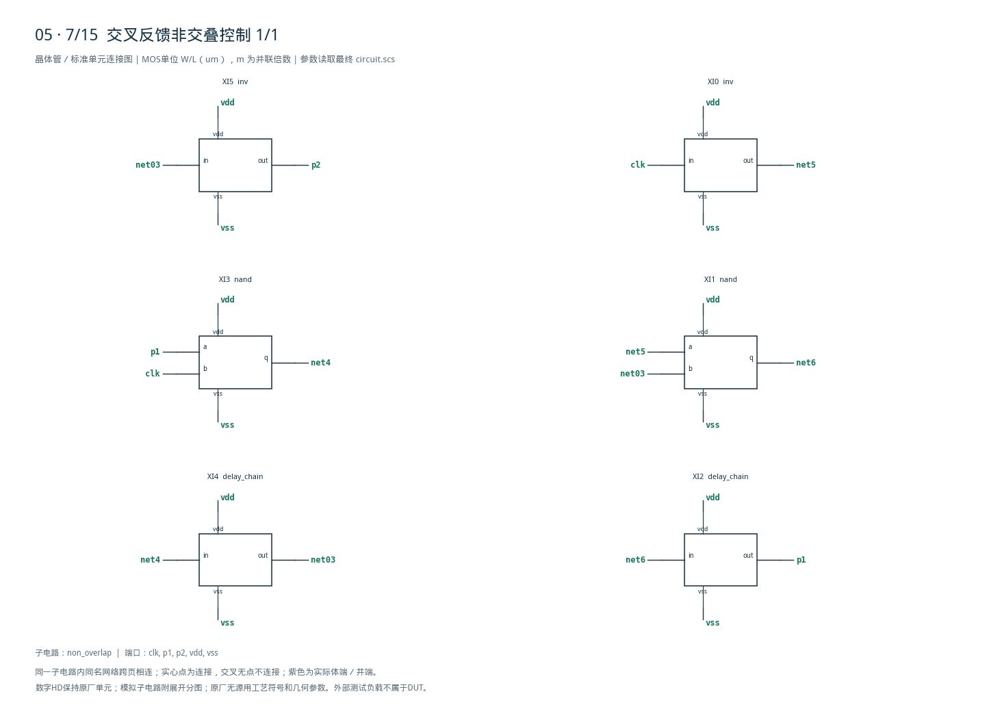


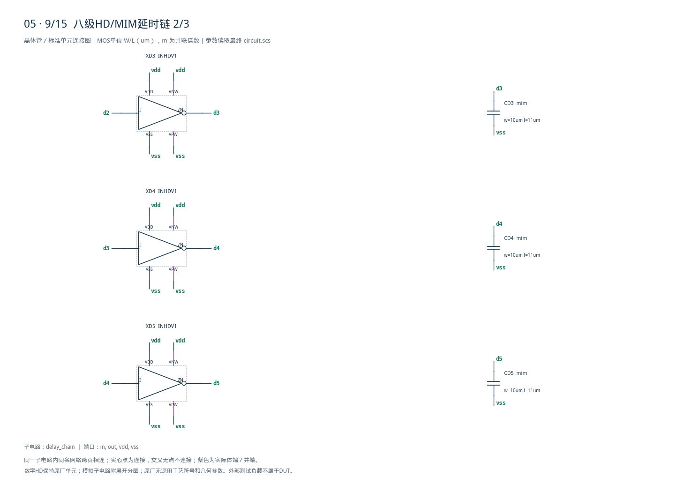

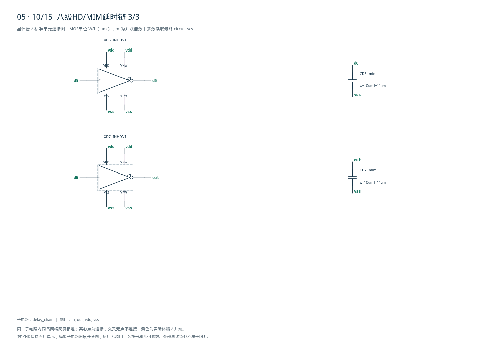

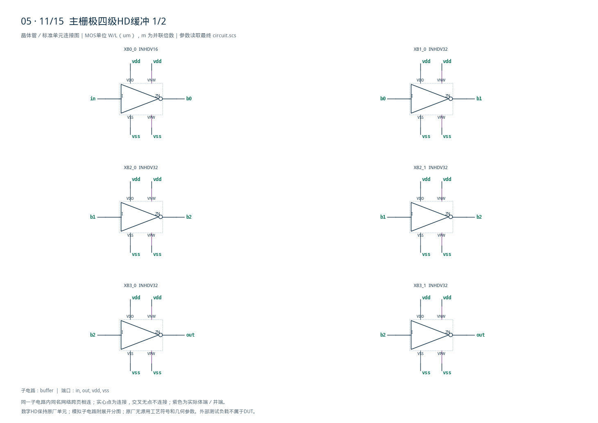


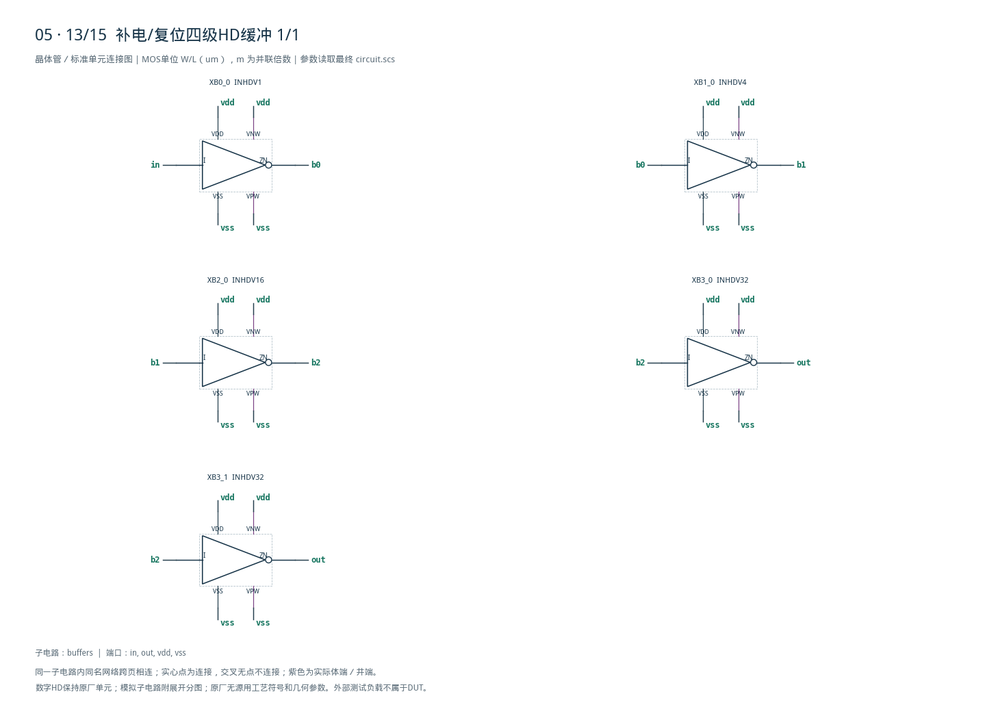

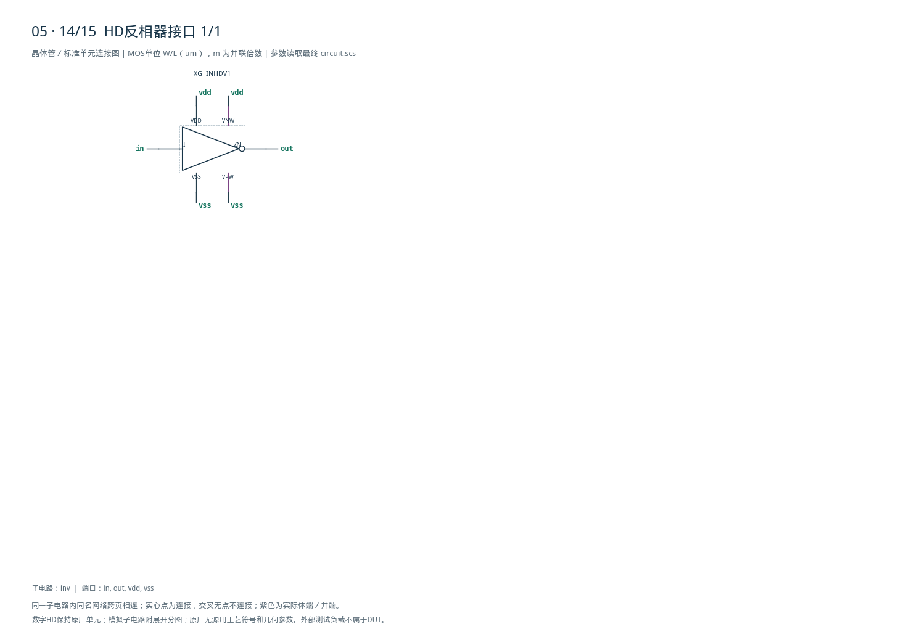

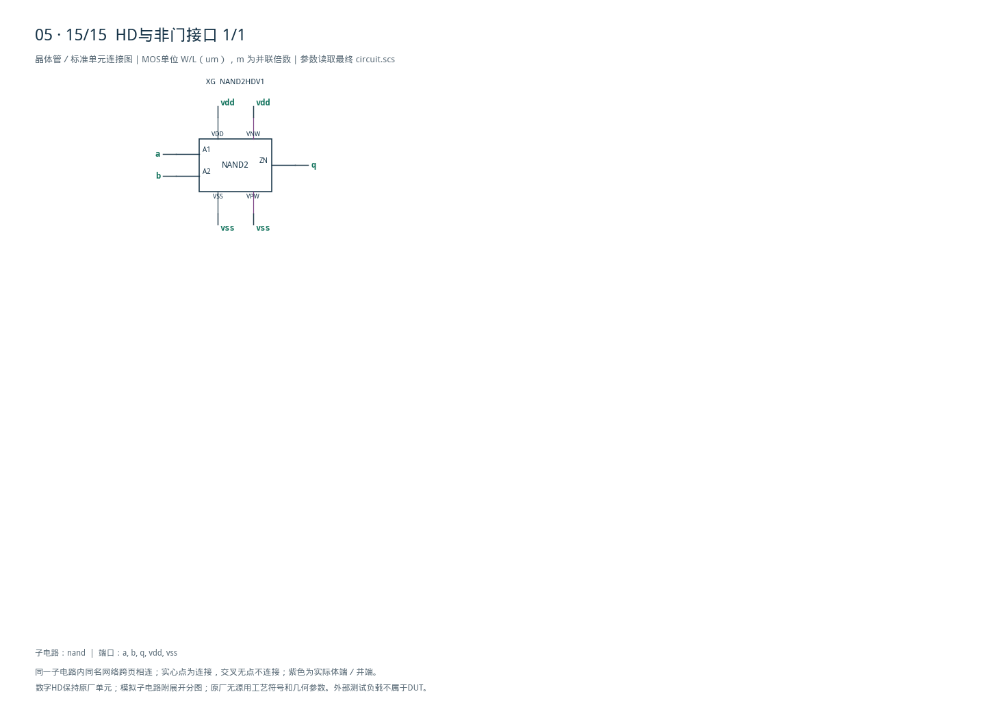
