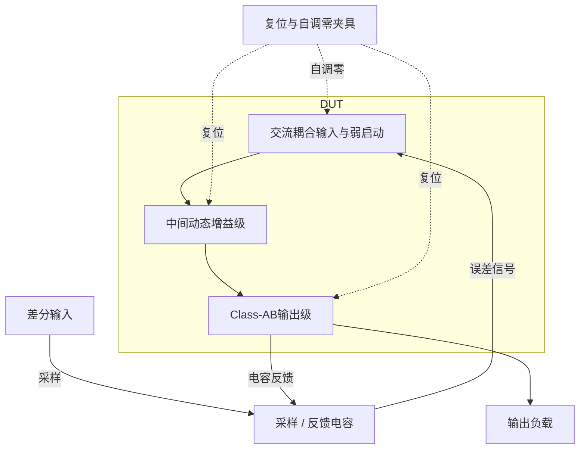
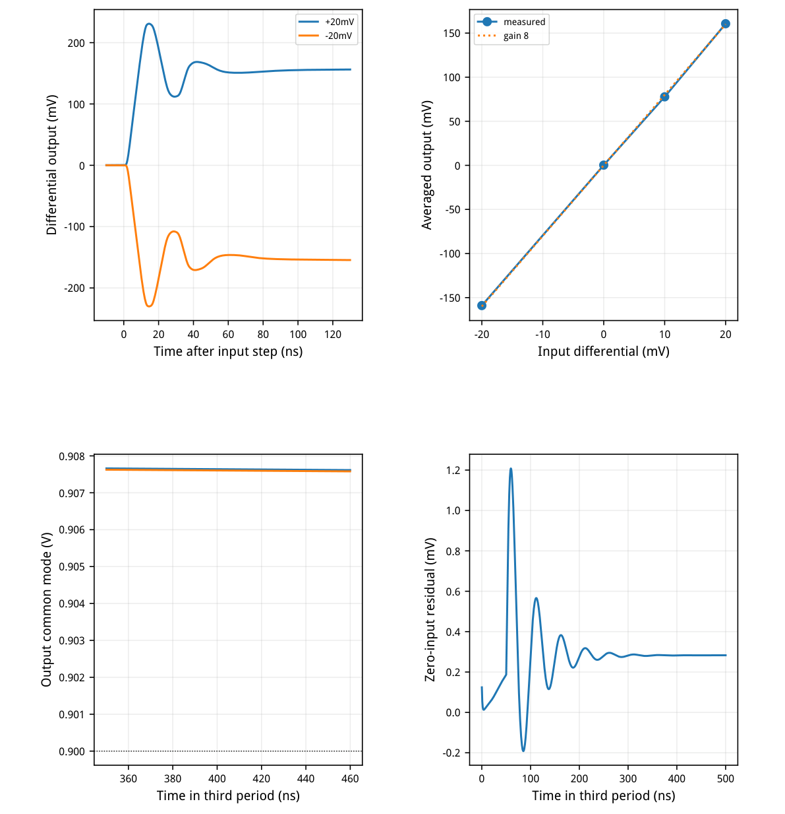
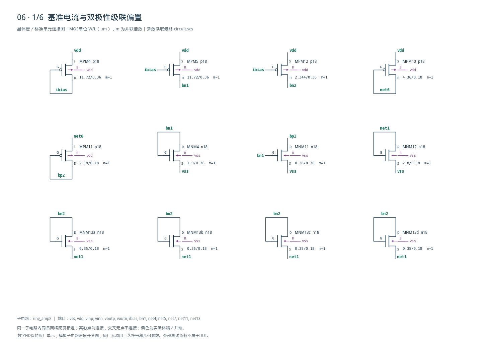
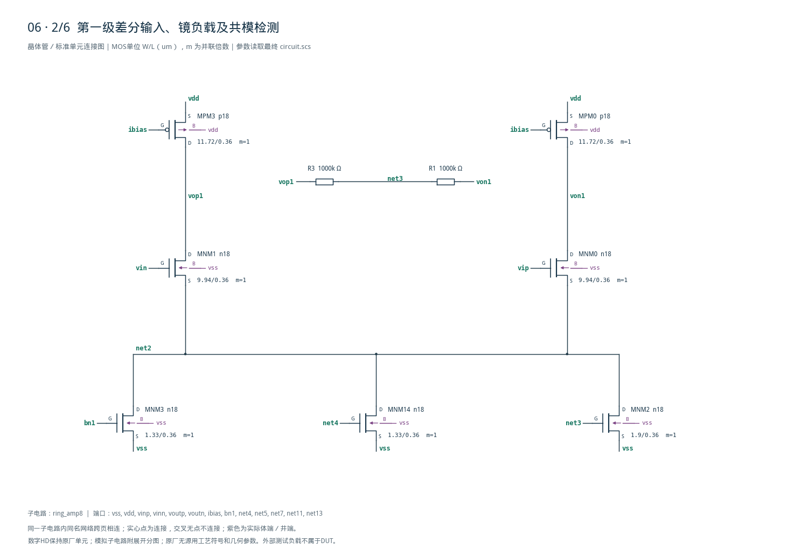
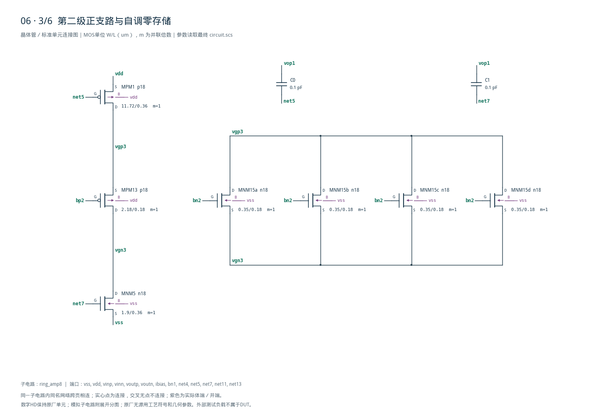
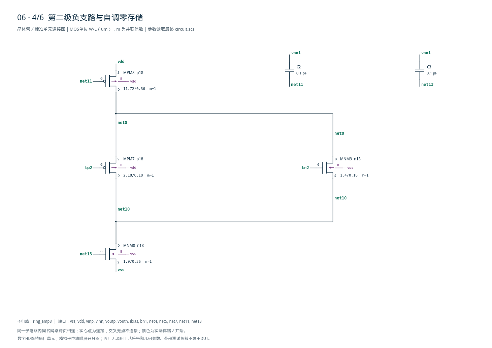
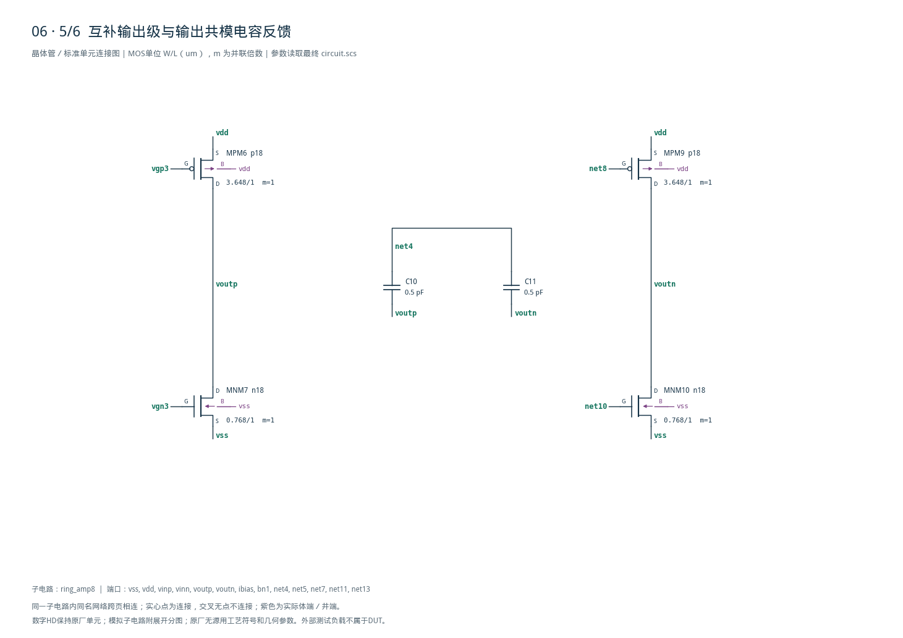
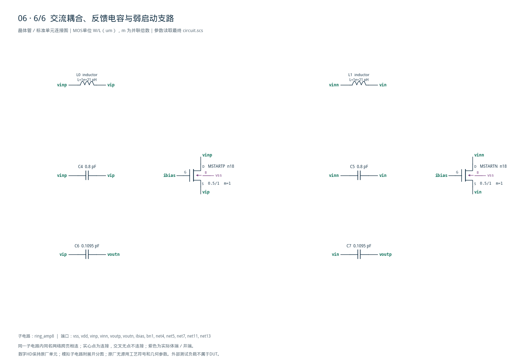

# 06-ring-amplifier 审查报告

PDF由Python/Matplotlib排版生成。此Markdown从同一报告文本、表格和网表保存，便于编辑；它不是PDF编译输入。完整生成脚本随implementation目录保存。

<!-- SYSTEM-BLOCK-DIAGRAM -->
## 系统框图

图中保留外部开关电容闭环和复位边界；三级信号路径对应DUT，目标闭环增益约8。

实线表示信号或能量通路，虚线表示时钟、控制或偏置。DUT框外为外部端口或测试夹具；精确端子连接见后附基本电路图。



[独立Mermaid源文件](system_block_diagram.mmd) · [框图SVG](markdown_assets/system-block.svg)
<!-- END-SYSTEM-BLOCK-DIAGRAM -->

## 06 | 三级环形放大器审查

本模块利用三级动态放大路径和电容反馈，把采样差分输入放大约八倍。自调零阶段保存级间偏置，放大阶段的Class-AB输出级提供瞬态电流，弱启动支路帮助交流耦合输入从零状态建立偏置；代价是时钟复位、偏置记忆、非线性建立与电容比例需要共同设计。芯片中可用于开关电容增益级和流水线ADC余量放大。

结论：TT / 1.8V / 27°C，四个输入记录及全部原始标称指标通过。

标称电源1.8V、外部25uA偏置、每侧10pF负载；评分取第三周期。下表均为最终精算值，功能与数值复核记录随报告保存。

| 指标 | 精算值 | 原门槛 |
| --- | --- | --- |
| 正区间增益 | 8.2933074 | 7.2–8.8 |
| 双极性增益 | 7.9926371 | 7.2–8.8 |
| 零输入残差/mV | 0.2827414 | ≤5 |
| 最坏静态误差/% | 0.6153639 | ≤1 |
| 最坏共模误差/mV | 7.629151 | ≤50 |
| 最坏功耗/uW | 296.9661 | ≤400 |
| 最坏建立时间/ns | 35.22819 | ≤50 |
| 最坏纹波/mV | 0.4336084 | ≤5 |

外部25uA偏置电流下，每侧输出固定10pF。输入+20、+10、0、−20mV均单独仿真；增益同时检查正区间斜率与双极性斜率，不能以单个输出幅值替代。

本次全部原门槛已通过，10%/15%放宽未用于结论。其他PVT、随机失配、器件噪声和PEX未验证。

## gm/ID角色与自调零结构

电路由输入级、带偏置记忆的第二级和互补输出级构成。

| 角色 | 模型 | 单元W/L um | gm/ID初算 | I初算/uA |
| --- | --- | --- | --- | --- |
| input | n18 | 9.94/0.36 | 18 | 25 |
| nbias | n18 | 1.9/0.36 | 10 | 25 |
| pbias | p18 | 11.72/0.36 | 12 | 25 |
| ncas | n18 | 1.4/0.18 | 16 | 10 |
| pcas | p18 | 2.18/0.18 | 16 | 5 |
| nout | n18 | 0.64/1 | 8 | 5 |
| pout | p18 | 3.04/1 | 8 | 5 |
| startup | n18 | 0.5/1 | 8 | 3.94627 |

gm/ID LUT提供器件角色的起点，各实例的镜像倍率、输出驱动倍率和长度记录于sizing.json。输入及负载采用0.36um，级联电平转换采用0.18um，输出与启动采用1um；第二级正负支路的级联尺寸匹配，避免不必要的静态不对称。

输入耦合电容800fF，输出反馈电容109.5fF，级间自调零存储100fF，输出共模检测电容每只500fF。有限级增益、输出动态和记忆节点共同影响实际闭环斜率，不能直接把800/109.5当实测增益。

表中宽度是gm/ID角色单元，并非所有实例最终宽度；例如输出倍率1.2、尾支路倍率0.7。最终几何和体端应以附后完整网表、图纸与instance_roles映射为准。

## 四点传输与双极性建立

所有曲线来自最后一次精算；固定第三周期评分。

双极性建立、完整四点传输、共模恢复与零输入残差。



[查看矢量图](markdown_assets/figure-03-01.svg)

建立时间以进入并保持在固定±160mV目标的±10%带内为准；不是以最终实测输出重新定义目标。

## 零状态启动与固定测量

保留原采样复位外部网络；新增启动器件全部属于DUT。

Spectre沿用skipdc=yes，从零状态起算；保留原1fF数值节点并联电容。输入含1GH直流通路时，零状态下的交流耦合节点不能自动取得足够偏置，初版第一级截止。两只0.5/1um NMOS以ibias为门极，将输入源连接到耦合节点，帮助其充电；输入节点升高后，导通自然减弱。

上述弱启动是实际晶体管电路，不是初值或隐藏刺激。第二级采用匹配的级联尺寸；输出管倍率1.2，反馈电容109.5fF。在未改变25uA参考、10pF负载和复位周期的条件下完成建立与功耗折中。

周期500ns，前50ns复位，输入边沿20ps。七只外部复位继电器Ron=100Ω、Roff=1TΩ，控制差分阈值0.25±0.1V，控制负端接0.5V；模型显式hysteresis=0.1V，过渡宽度1uV。第三周期1.05us施加输入，输出均值及纹波窗1.4–1.45us，供电均值窗1.2–1.45us。

静态误差取两极性相对于±160mV的最大比例误差；共模取两输出均值相对0.9V误差；纹波为窗内相对自身平均差分输出的最大偏差；功耗为|1.8×平均I(VDD)|。外部偏置、时钟与复位源能量未纳入原VDD指标。

理想R/C/L为原题允许抽象；1GH电感用作直流偏置路径，不能按真实片上电感面积理解。完整电路图为原理图连通性审查，不是物理实现或版图LVS。

## 精度、审计与保留的源文件

数值计划在精算之前固定；独立计算使用原始外部端口轨迹。

maxstep0.25→0.125ns，reltol1e−6→1e−7；17项差异界限全部通过，结论维持原始指标通过。独立审计以显式边界插值、逐段梯形积分和最后带内交叉重算，17项数值核对及7组原始门槛均通过。

基线与精算共8次仿真实际0错误；所有日志警告保留于审计。模型尺寸合法，源资料、模型与LUT哈希核对一致。完整6页图纸覆盖50个定义实例、172个端子。

case06_ring_amp.py → confirm06.py → schematic06.py → audit06.py → review06.py。原始源码、网表快照、精算计划、测量说明、PDF、review_report.md和knowledge.md均保存。PDF使用Python/Matplotlib排版，Markdown与同一正文同步保存，便于后续编辑。

范围仅原理图级TT、1.8V、27°C和原四点功能矩阵。未验证额外PVT、失配、输入噪声、真实电感/电容寄生、长时间偏置漂移及版图。运行和报告重新生成后，需再次逐页实际检查。

电路SHA-256：
96db77eac120380432cda805f3bfadaea45f6e649c99cefedde1bc0a7fa674a1

## 完整网表与电路图

[Spectre 网表](circuit.scs) · [全部分图 PDF](schematic/sheets.pdf) · [电路总图](schematic/full.svg) · [端子连接](schematic/connectivity.json)

<details>
<summary>展开完整 Spectre 网表</summary>

```spectre
simulator lang=spectre
subckt ring_amp8 (vss vdd vinp vinn voutp voutn ibias bn1 net4 net5 net7 net11 net13)
L0 (vinp vip) inductor l=1G
L1 (vinn vin) inductor l=1G
C11 (net4 voutn) capacitor c=500f
C10 (net4 voutp) capacitor c=500f
C7 (vin voutp) capacitor c=109.5f
C6 (vip voutn) capacitor c=109.5f
C5 (vinn vin) capacitor c=800f
C4 (vinp vip) capacitor c=800f
C3 (von1 net13) capacitor c=100f
C2 (von1 net11) capacitor c=100f
C1 (vop1 net7) capacitor c=100f
C0 (vop1 net5) capacitor c=100f
MNM14 (net2 net4 vss vss) n18 w=1.33u l=0.36u
MNM13a (bn2 bn2 net1 vss) n18 w=0.35u l=0.18u
MNM13b (bn2 bn2 net1 vss) n18 w=0.35u l=0.18u
MNM13c (bn2 bn2 net1 vss) n18 w=0.35u l=0.18u
MNM13d (bn2 bn2 net1 vss) n18 w=0.35u l=0.18u
MNM12 (net1 net1 vss vss) n18 w=2.8u l=0.18u
MNM11 (bp2 bn1 vss vss) n18 w=0.38u l=0.36u
MNM10 (voutn net10 vss vss) n18 w=0.768u l=1u
MNM9 (net8 bn2 net10 vss) n18 w=1.4u l=0.18u
MNM8 (net10 net13 vss vss) n18 w=1.9u l=0.36u
MNM7 (voutp vgn3 vss vss) n18 w=0.768u l=1u
MNM5 (vgn3 net7 vss vss) n18 w=1.9u l=0.36u
MNM4 (bn1 bn1 vss vss) n18 w=1.9u l=0.36u
MNM15a (vgp3 bn2 vgn3 vss) n18 w=0.35u l=0.18u
MNM15b (vgp3 bn2 vgn3 vss) n18 w=0.35u l=0.18u
MNM15c (vgp3 bn2 vgn3 vss) n18 w=0.35u l=0.18u
MNM15d (vgp3 bn2 vgn3 vss) n18 w=0.35u l=0.18u
MNM3 (net2 bn1 vss vss) n18 w=1.33u l=0.36u
MNM2 (net2 net3 vss vss) n18 w=1.9u l=0.36u
MNM1 (vop1 vin net2 vss) n18 w=9.94u l=0.36u
MNM0 (von1 vip net2 vss) n18 w=9.94u l=0.36u
MPM12 (bn2 ibias vdd vdd) p18 w=2.344u l=0.36u
MPM11 (bp2 bp2 net6 vdd) p18 w=2.18u l=0.18u
MPM10 (net6 net6 vdd vdd) p18 w=4.36u l=0.18u
MPM9 (voutn net8 vdd vdd) p18 w=3.648u l=1u
MPM8 (net8 net11 vdd vdd) p18 w=11.72u l=0.36u
MPM7 (net10 bp2 net8 vdd) p18 w=2.18u l=0.18u
MPM6 (voutp vgp3 vdd vdd) p18 w=3.648u l=1u
MPM13 (vgn3 bp2 vgp3 vdd) p18 w=2.18u l=0.18u
MPM1 (vgp3 net5 vdd vdd) p18 w=11.72u l=0.36u
MPM5 (bn1 ibias vdd vdd) p18 w=11.72u l=0.36u
MPM4 (ibias ibias vdd vdd) p18 w=11.72u l=0.36u
MPM0 (von1 ibias vdd vdd) p18 w=11.72u l=0.36u
MPM3 (vop1 ibias vdd vdd) p18 w=11.72u l=0.36u
R3 (net3 vop1) resistor r=1Meg
R1 (von1 net3) resistor r=1Meg
MSTARTP (vinp ibias vip vss) n18 w=.5u l=1u
MSTARTN (vinn ibias vin vss) n18 w=.5u l=1u
ends ring_amp8
```

</details>












