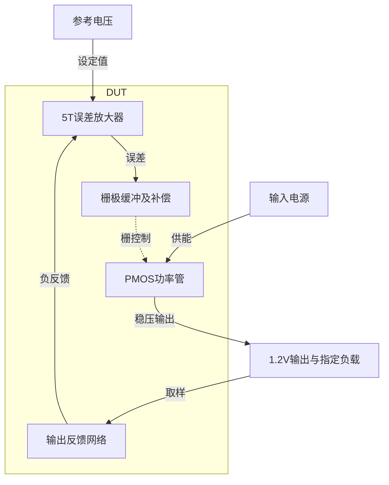
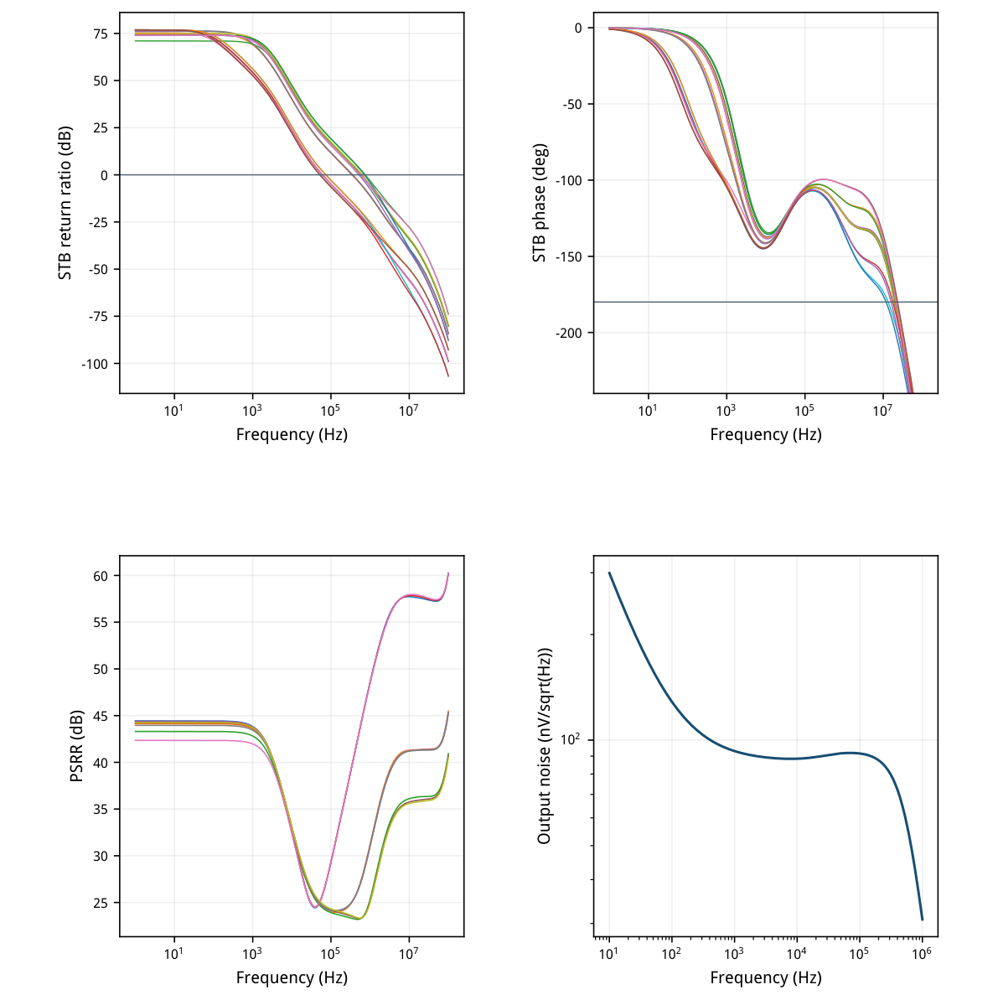
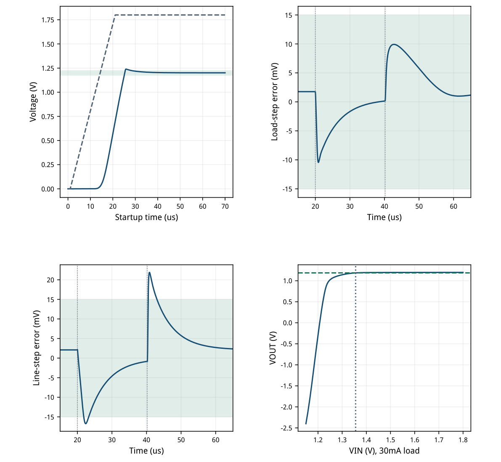
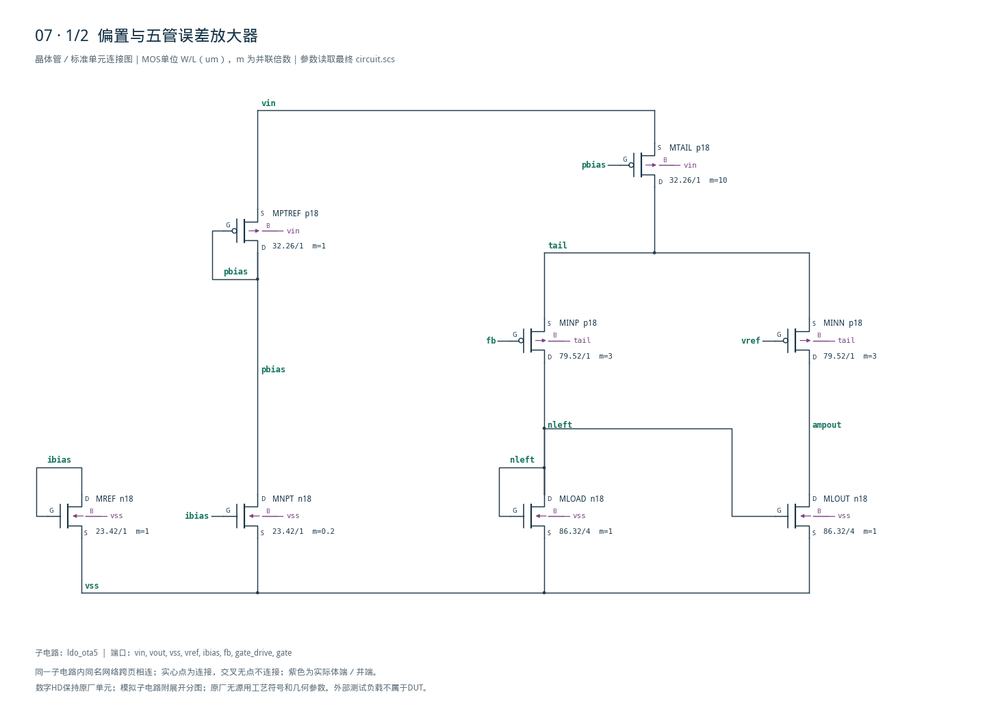
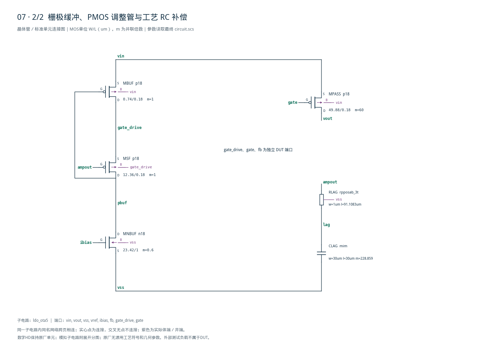

# 07 · PMOS LDO 稳压器审查

[审查 PDF](review.pdf) · [实测结果](latest_results.json) · [验收合同](contract.json) · [最终网表](circuit.scs)

## 验收结果

本模块通过误差放大器控制PMOS功率管，将变化的输入电源稳压为1.2 V输出。相比直接驱动功率管栅极的基础5T OTA结构，栅极缓冲和频率补偿可改善大栅电容下的稳定性，但会增加静态电流、面积与启动设计约束。芯片中常用于给模拟前端、基准和其他低噪声电路提供局部稳压电源。

结论：全部nominal检查在15%退化范围通过；独立真实环路PM决定最终等级。

条件：SMIC18MMRF tt / 27°C；VREF=0.8 V、IBIAS=50 uA来自VIN；目标1.2 V，外部300 kΩ/600 kΩ分压，标称1 uF+50 mΩ。保留9个供电/负载点、17个输出网络环路点和原瞬态。

| 指标 | 实测 | 原门槛 | 10%边界 | 15%边界 | 单位 |
| --- | --- | --- | --- | --- | --- |
| 最大DC误差 | 2.9577 | ≤20 | ≤22 | ≤23 | mV |
| 最大静态电流 | 197.97 | ≤200 | ≤220 | ≤230 | uA |
| 最小静态电流 | 194.1 | ≥0 | ≥0 | ≥0 | uA |
| 源算法最小1Hz增益 | 71.04 | ≥40 | ≥39.085 | ≥38.588 | dB |
| 源算法最小UGB | 51.795 | ≥50 | ≥45 | ≥42.5 | kHz |
| 源算法最小PM | 54.137 | ≥60 | ≥54 | ≥51 | deg |
| PSRR @100Hz | 42.354 | ≥40 | ≥39.085 | ≥38.588 | dB |
| PSRR @1kHz | 41.973 | ≥40 | ≥39.085 | ≥38.588 | dB |
| PSRR @100kHz | 23.922 | ≥20 | ≥19.085 | ≥18.588 | dB |
| PSRR @1MHz | 25.002 | ≥10 | ≥9.0849 | ≥8.5884 | dB |
| 30mA压差 | 167.59 | ≤250 | ≤275 | ≤287.5 | mV |
| 10Hz–1MHz输出噪声 | 66.672 | ≤150 | ≤165 | ≤172.5 | uVrms |
| 启动持续90%时间 | 24.21 | ≤30 | ≤33 | ≤34.5 | us |
| 斜坡后±2%建立 | 7.395 | ≤10 | ≤11 | ≤11.5 | us |
| 启动过冲 | 39.489 | ≤50 | ≤55 | ≤57.5 | mV |
| 负载跳变峰值误差 | 10.45 | ≤20 | ≤22 | ≤23 | mV |
| 电源跳变峰值误差 | 21.9 | ≤20 | ≤22 | ≤23 | mV |
| 负载±15mV建立 | 0 | ≤5 | ≤5.5 | ≤5.75 | us |
| 电源±15mV建立 | 3.28 | ≤5 | ≤5.5 | ≤5.75 | us |
| 独立STB最小PM | 53.861 | ≥60 | ≥54 | ≥51 | deg |
| 独立STB最小UGB | 51.808 | ≥50 | ≥45 | ≥42.5 | kHz |

原电压比PM54.137°和电源跳变21.900 mV可满足10%边界；真实STB PM53.861°低于10%边界54°，但高于15%边界51°。据此标为complete\_15pct，不将电压比结果替代真实稳定性。

未验证其他工艺/温度、30次失配、SS125输出网络瞬态、版图或可靠性；最小负载为1 mA，本报告不宣称空载稳定。额外17个FVF局部环路PM最小59.047°。

<!-- SYSTEM-BLOCK-DIAGRAM -->
## 系统框图

反馈、补偿和功率管构成同一稳压环路；参考与负载按本题合同保留。

实线表示信号或能量通路，虚线表示时钟、控制或偏置。DUT框外为外部端口或测试夹具；精确端子连接见后附基本电路图。



[独立Mermaid源文件](system_block_diagram.mmd) · [框图SVG](markdown_assets/system-block.svg)
<!-- END-SYSTEM-BLOCK-DIAGRAM -->

## 五管误差放大器、缓冲和片内补偿

保持五管OTA功能级；总DUT为12只MOS、1个工艺电阻和1组工艺MIM电容。

| 角色 | 模型 | 单位W/L um 与m | LUT gm/ID | 初选电流 |
| --- | --- | --- | --- | --- |
| 输入对 | p18 | 79.52/1 ×3 | 18 | 50 uA/支 |
| NMOS镜负载 | n18 | 86.32/4 ×1 | 14 | 50 uA/支 |
| N偏置单位 | n18 | 23.42/1 | 14 | 50 uA |
| P尾源单位 | p18 | 32.26/1 | 16 | 10 uA |
| MSF | p18 | 12.36/0.18 | 16 | 30 uA |
| MBUF | p18 | 0.74/0.18 | 4 | 30 uA |
| MPASS单位 | p18 | 49.88/0.18 ×60 | 6 | 1 mA/单位 |

PMOS输入对避免NMOS输入级在低栅压时失去漏端余量。输入对共用独立井并接tail，MSF体接自身源极gate\_drive；其余PMOS体接VIN。FVF的pbuf控制MBUF上拉，降低大功率管栅极的等效驱动阻抗。

串联RC从ampout返回VSS，DC时电容开路保留增益；高频时约30 kΩ限制误差级增益，配合200 pF把过渡区放到主交越以下。标称1/(2πRC)约26.5 kHz；真实极点还包括OTA输出电阻与寄生。

MIM采用30×30 um单位、m=228.859，约0.206 mm²电容有效面积；rpposab\_3t为W1/L91.1083 um。这是稳定性与面积的明确代价。m含0.2/0.6模拟缩放，并非已完成版图阵列；所有MOS单位W≤86.32 um。


[查看矢量图](markdown_assets/figure-02-01.svg)

## 工作点、完整供电与负载矩阵

9个点均在同一TT/27°C；Iq=abs(I(VIN))−ILOAD，包含外部50 uA参考和分压支路。

| VIN/V | IL/mA | VOUT/V | Iq/uA | 100Hz | 1kHz | 100kHz | 1MHz |
| --- | --- | --- | --- | --- | --- | --- | --- |
| 1.62 | 1 | 1.200679 | 194.096 | 44.44 | 43.84 | 29.33 | 48.64 |
| 1.62 | 10 | 1.199904 | 194.116 | 44.14 | 43.57 | 23.99 | 31.28 |
| 1.62 | 30 | 1.199275 | 194.128 | 43.31 | 42.82 | 23.92 | 25.35 |
| 1.80 | 1 | 1.201765 | 196.082 | 44.22 | 43.66 | 29.34 | 48.54 |
| 1.80 | 10 | 1.200996 | 196.101 | 44.40 | 43.82 | 24.15 | 31.10 |
| 1.80 | 30 | 1.200415 | 196.111 | 44.30 | 43.73 | 24.20 | 25.11 |
| 1.98 | 1 | 1.202958 | 197.938 | 42.35 | 41.97 | 29.36 | 48.51 |
| 1.98 | 10 | 1.202098 | 197.956 | 43.96 | 43.44 | 24.21 | 31.03 |
| 1.98 | 30 | 1.201508 | 197.966 | 44.26 | 43.71 | 24.32 | 25.00 |

右侧四列为PSRR/dB。全矩阵最小PSRR仍满足原40/40/20/10 dB；最差DC误差2.958 mV。噪声另在1.8 V、10 mA积分，不把各工况PSRR当成噪声测量。

| 器件 | 中心Id/uA | 中心gm/ID | 中心余量/mV | 1.62V/30mA余量 |
| --- | --- | --- | --- | --- |
| MINP | 51.78 | 17.901 | 687.91 | 687.33 |
| MLOUT | 52.04 | 13.825 | 545.81 | 262.09 |
| MTAIL | 103.8 | 15.991 | 409.86 | 231.96 |
| MSF | 30.56 | 15.607 | 256.06 | 144.57 |
| MBUF | 30.56 | 3.653 | 195.10 | 301.89 |
| MPASS | 1e+04 | 14.496 | 479.79 | 228.72 |

表中余量=abs(VDS)−abs(VDSAT)。保存的1.62V/1mA、1.62V/30mA、1.8V/10mA三个OP中12只MOS均为正；最小68.65 mV。功率管gm/ID随负载显著变化，不能把初始LUT点6误写成全负载实测值。

沿用既有LUT与第12项n18 L4补表；所有查询、VDS、Wref和SHA保留。LUT给初宽，实际端压与体连接由最终OP确认。原厂模型、Bridge和已有LUT目录均未修改。

## 17个输出网络点与独立稳定性

Lij为3供电×3负载、1uF/50mΩ；Eijk为1.8V、C/ESR/负载的完整8个极端组合。

| 点 | VIN | IL/mA | C/uF ESR/mΩ | 源PM | STB PM | STB/kHz | FVF PM |
| --- | --- | --- | --- | --- | --- | --- | --- |
| L00 | 1.62 | 1 | 1/50 | 66.10 | 66.09 | 59.86 | 59.05 |
| L01 | 1.62 | 10 | 1/50 | 72.18 | 72.03 | 345.54 | 63.76 |
| L02 | 1.62 | 30 | 1/50 | 65.84 | 65.57 | 588.23 | 67.97 |
| L10 | 1.80 | 1 | 1/50 | 66.34 | 66.33 | 60.43 | 59.08 |
| L11 | 1.80 | 10 | 1/50 | 71.94 | 71.79 | 353.85 | 63.84 |
| L12 | 1.80 | 30 | 1/50 | 65.21 | 64.94 | 610.98 | 67.93 |
| L20 | 1.98 | 1 | 1/50 | 66.79 | 66.78 | 59.79 | 59.06 |
| L21 | 1.98 | 10 | 1/50 | 71.89 | 71.75 | 358.16 | 63.89 |
| L22 | 1.98 | 30 | 1/50 | 64.90 | 64.63 | 623.44 | 67.87 |
| E000 | 1.80 | 1 | 0.8/20 | 68.29 | 68.28 | 73.49 | 59.08 |
| E001 | 1.80 | 30 | 0.8/20 | 54.14 | 53.86 | 716.89 | 67.88 |
| E010 | 1.80 | 1 | 0.8/100 | 69.99 | 69.98 | 73.53 | 59.09 |
| E011 | 1.80 | 30 | 0.8/100 | 69.41 | 69.07 | 751.50 | 68.01 |
| E100 | 1.80 | 1 | 1.2/20 | 63.22 | 63.21 | 51.81 | 59.08 |
| E101 | 1.80 | 30 | 1.2/20 | 62.69 | 62.46 | 521.12 | 67.88 |
| E110 | 1.80 | 1 | 1.2/100 | 65.02 | 65.01 | 51.84 | 59.09 |
| E111 | 1.80 | 30 | 1.2/100 | 79.46 | 79.17 | 554.98 | 68.00 |

每个主STB均从1 Hz扫到100 MHz，恰有一次下降0 dB交越，此后无回穿。局部FVF从1 Hz扫到1 GHz，探针在pbuf→MBUF栅、主反馈保持闭合；17点全部一次交越，PM最小59.047°，额外工程下限45°。

源算法为−V(gate\_drive)/V(gate)，独立STB在两端间放iprobe。功率管反向电容和节点加载会使简单电压比偏离真实返回比，因此两种定义均保留。本例不只依据原算法的54.137°判定完成等级。

仅TT矩阵；原PVT×输出网络交互中的非nominal行未运行，不能用这些17点代替全签核。

## 主环路频响、供电抑制与输出噪声

全部曲线来自最终电路的真实PSF；固定积分带宽和输出负载。

AC每十倍频100点；原提取按log(f)插值交越，PSRR读取原指定频点。输出噪声10 Hz–1 MHz共501点，sqrt(∫en²df)=66.672 uVrms；外部反馈电阻的模型热噪声按原测试连接保留。



[查看矢量图](markdown_assets/figure-05-01.svg)

## 启动、负载/电源跳变与压差

瞬态完整70us、最大内部步2ns、保存步5ns；建立窗保持原定义，不因容差放宽而扩大。

启动VIN在1–21us升至1.8V，负载120Ω；持续90%在24.210us，斜坡后7.395us进入并保持±2%。负载1→25→1mA，电源1.98→1.62→1.98V，均200ns边沿；20–40.2us和40.2–65us分别验收。

负载建立0表示全窗已在±15mV内，并非响应瞬时完成。压差326点、步2mV，首次持续超过1.188V处线性插值：VIN≈1.355593V，压差167.593mV。

低VIN失调区的理想30mA负载会把VOUT拉成负值；没有输出钳位或欠压卸载模型。该区不作可用电压/应力保证，压差仅取持续进入阈值处。



[查看矢量图](markdown_assets/figure-06-01.svg)

## 可复用认识、精确网表与证据

最终12只MOS、原生片阻与MIM；gate\_drive和gate在DUT内保持分离。

关键失败：无缓冲候选源算法PM71.01°，但同电路真实STB最小仅27.41°，因此撤回。NMOS输入级加PMOS跟随后，重载低压可失去输入管漏端余量；最终改用PMOS输入。小功率管版本又因1uF启动充电不足失败，最终m30→60。

补偿取舍：30kΩ/200pF降低高频增益并恢复相位，但引入约0.206mm²电容面积。不得仅优化原测试的电压比PM，或把静态稳压通过当作启动通过。最终真实STB53.861°使用15%边界；所有其他门槛至多使用10%放宽。

复现：既有Bridge Python运行 scripts/case07\_ldo.py --tail-uA 100 --input-gmid 18 --mirror-L 4 --mirror-gmid 14 --pinput --fvf --pass-m 60 --lag-C-pF 200 --lag-R 30000 --full；同模块local\_fvf()生成局部诊断。PDF：scripts/review\_pdf.py 7。

最终运行：runs/07/20260922T102553666969Z\_matrix runs/07/20260922T102554556954Z\_stb\_matrix runs/07/20260922T102555553119Z\_dropout\_noise runs/07/20260922T102555785585Z\_transient runs/07/20260922T102730830668Z\_local\_fvf

原instruction/reference/正式verifier/bench冻结于source；每次运行保存inputs、模型/依赖SHA、日志与PSF。最终五次运行均无警告，geometry.json、sizing.json及verification\_audit.json记录单位几何、查表与审计。源任务：sky130-ldo-ota5-robust-pvt-mc。

## 完整网表与电路图

[Spectre 网表](circuit.scs) · [全部分图 PDF](schematic/sheets.pdf) · [电路总图](schematic/full.svg) · [端子连接](schematic/connectivity.json)

<details>
<summary>展开完整 Spectre 网表</summary>

```spectre
simulator lang=spectre
subckt ldo_ota5 (vin vout vss vref ibias fb gate_drive gate)
MINP (nleft fb tail tail) p18 w=79.52u l=1u m=3
MINN (ampout vref tail tail) p18 w=79.52u l=1u m=3
MLOAD (nleft nleft vss vss) n18 w=86.32u l=4u m=1
MLOUT (ampout nleft vss vss) n18 w=86.32u l=4u m=1
MTAIL (tail pbias vin vin) p18 w=32.26u l=1u m=10
MREF (ibias ibias vss vss) n18 w=23.42u l=1u m=1
MPASS (vout gate vin vin) p18 w=49.88u l=0.18u m=60
MPTREF (pbias pbias vin vin) p18 w=32.26u l=1u m=1
MNPT (pbias ibias vss vss) n18 w=23.42u l=1u m=0.2
MSF (pbuf ampout gate_drive gate_drive) p18 w=12.36u l=0.18u m=1
MBUF (gate_drive pbuf vin vin) p18 w=0.74u l=0.18u m=1
MNBUF (pbuf ibias vss vss) n18 w=23.42u l=1u m=0.6
RLAG (ampout lag vss) rpposab_3t w=1u l=91.1083u
CLAG (lag vss) mim w=30u l=30u m=228.859
ends ldo_ota5
```

</details>





## 报告来源

正文与表格整理自已交付的矢量 PDF，图表单独提取；本文件是后续整理的 Markdown，不是原 PDF 的编译输入。原 PDF、网表及测量数据保持原值。
