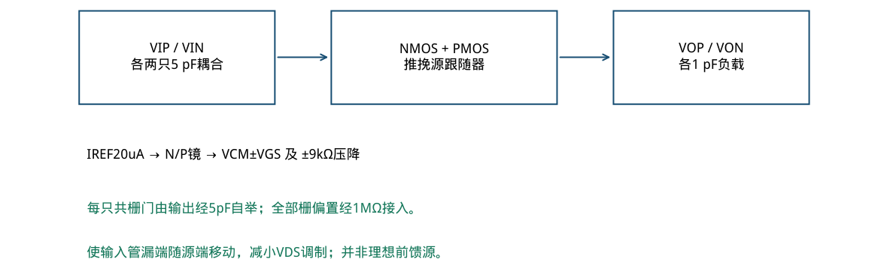
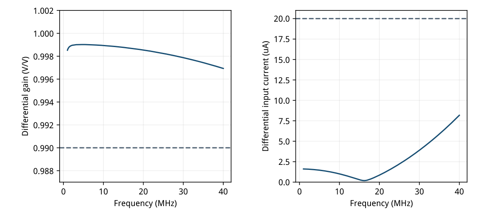
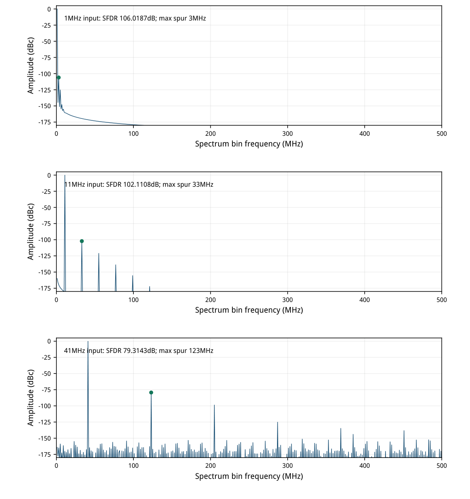
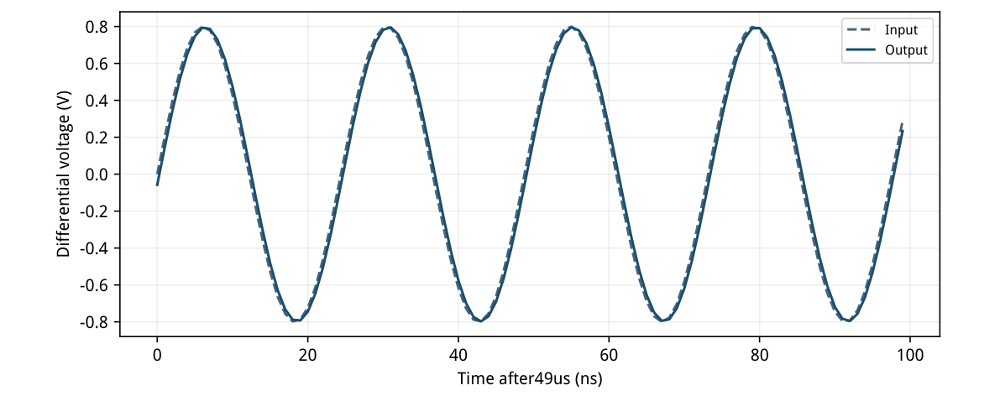
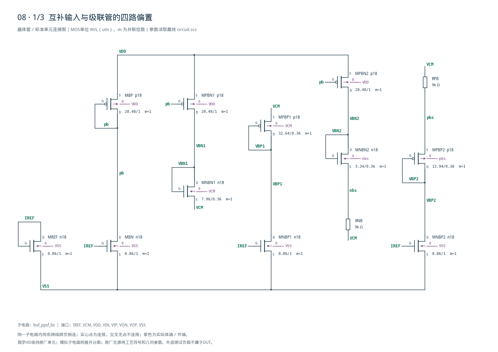
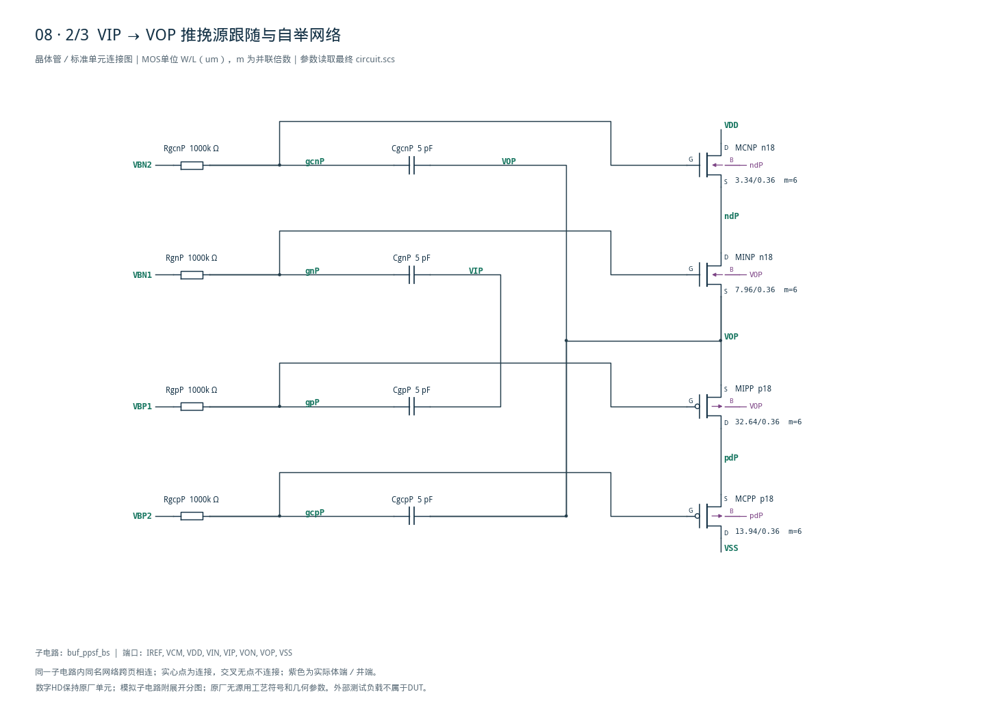
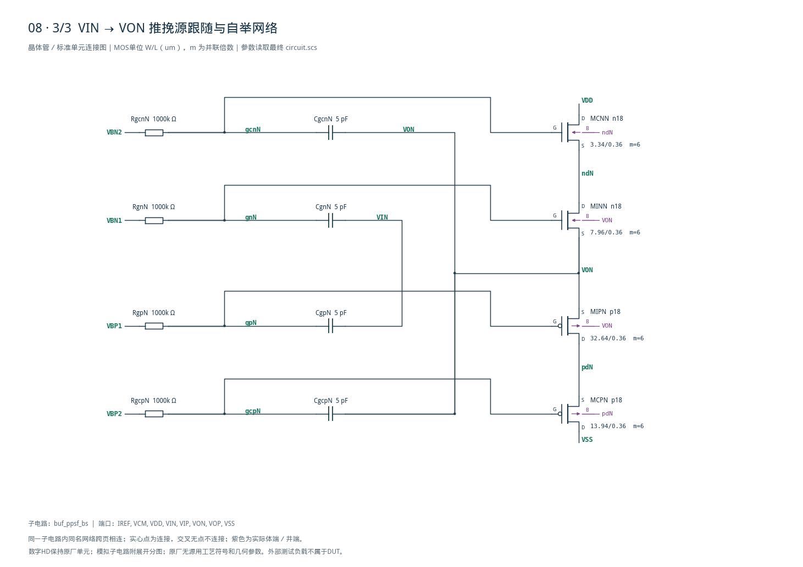

# 08 · 差分推挽源跟随缓冲器

[审查 PDF](review.pdf) · [实测结果](latest_results.json) · [验收合同](contract.json) · [最终网表](circuit.scs)

## 验收结果

本模块将差分输入电压以接近单位增益送至电容负载，隔离前级信号源与后级负载。相比基础源跟随器，互补推挽管提供双向驱动，自举共栅使输入管漏端随输出移动，可减小漏端调制并改善线性度；代价是偏置和电容网络更复杂。芯片中常用于ADC前端、采样网络驱动和模拟信号通路缓冲，本实现采用电容耦合输入。

结论：输入电流资格、全带增益、三个频点SFDR和端口功耗全部原nominal通过。

SMIC18MMRF tt / 1.8 V / 27°C；20 uA参考，VCM=0.9 V；差分峰值0.8 V、每侧1 pF负载。保留1–40 MHz AC全带及1/11/41 MHz三个大信号点；未执行其他四个工艺角。

| 指标 | 实测 | 原门槛 | 10%边界 | 15%边界 | 单位 |
| --- | --- | --- | --- | --- | --- |
| 全AC带最小增益 | 0.996933 | &gt;0.99 | &gt;0.891 | &gt;0.8415 | V/V |
| 40MHz输入差分电流 | 8.177145 | &lt;20 | &lt;20 | &lt;20 | uA |
| 全部供电端口DC功耗 | 556.8462 | &lt;1000 | &lt;1100 | &lt;1150 | uW |
| 1MHz基波增益 | 0.9985057 | &gt;0.95 | &gt;0.855 | &gt;0.8075 | V/V |
| 1MHz SFDR | 106.0187 | &gt;90 | &gt;89.085 | &gt;88.588 | dB |
| 11MHz基波增益 | 0.9988896 | &gt;0.95 | &gt;0.855 | &gt;0.8075 | V/V |
| 11MHz SFDR | 102.1108 | &gt;80 | &gt;79.085 | &gt;78.588 | dB |
| 41MHz基波增益 | 0.9967072 | &gt;0.95 | &gt;0.855 | &gt;0.8075 | V/V |
| 41MHz SFDR | 79.31427 | &gt;70 | &gt;69.085 | &gt;68.588 | dB |

输入电流是不可放宽的资格线：8.177145 uA &lt;20 uA，等效差分输入电容40.670 fF。全部信号路径为有源MOS缓冲，没有输入至输出的直接电阻导通；耦合电容并不等于有效输入电容。

SFDR沿用原全Nyquist矩形窗定义：49–50 us的1000个1 ns样点，搜索1–500 MHz全部非基波频点，包含Nyquist、排除DC。不截去高次谐波，不用总失真功率SDR替代最大杂散SFDR。

这是电容耦合交流缓冲，不能把1–40 MHz接近单位增益写成直流跟随保证。原SIN瞬态偏置为0 V，DC/AC输入偏置为0.9 V，本次精确保留这一源定义差别。

## 推挽跟随、自举共栅与复制偏置

两侧电路对称；MOS体接自身源极，所需隔离井与寄生尚未做版图验证。

| 角色 | 模型 | 单位W/L um | LUT gm/ID | 输出支路m |
| --- | --- | --- | --- | --- |
| NMOS输入跟随 | n18 | 7.96/0.36 | 18 | 6 |
| PMOS输入跟随 | p18 | 32.64/0.36 | 18 | 6 |
| NMOS自举共栅 | n18 | 3.34/0.36 | 14 | 6 |
| PMOS自举共栅 | p18 | 13.94/0.36 | 14 | 6 |
| N偏置镜 | n18 | 8.86/1 | 14 | 1 |
| P偏置镜 | p18 | 28.48/1 | 12 | 1 |

每个LUT单位选20 uA、VDS0.45 V，输入和共栅L0.36 um；偏置镜L1 um。输出级m6给每侧目标120 uA，实际113.744 uA。复制支路和信号支路漏压不同，因此不是精确理想镜比例。

源参考用低阈值Sky130器件及三级MOS复制产生共栅偏置。本实现用目标工艺n18/p18和有电流通过的9 kΩ压降产生相应余量；重新查表定尺寸，没有按工艺节点简单缩放宽度。

全DUT19只MOS、8只5 pF电容、8只1 MΩ偏置电阻和2只9 kΩ余量电阻。总耦合/自举电容40 pF；使用原任务允许的正R/C，未做工艺无源匹配或面积签核。



[查看矢量图](markdown_assets/figure-02-01.svg)

## 小信号输入负载、增益与真实工作点

40MHz资格使用|I(VIP)−I(VIN)|，AC差分幅度0.8V；不能单看某一输入引脚。

| 器件 | \|Id\| / uA | gm/ID | \|VDS\|−\|VDSAT\| / mV |
| --- | --- | --- | --- |
| MINP | 113.744 | 17.886 | 99.145 |
| MIPP | 113.744 | 18.003 | 83.051 |
| MCNP | 113.744 | 14.296 | 604.123 |
| MCPP | 113.744 | 14.369 | 603.987 |
| MREF | 20.000 | 14.010 | 393.527 |
| MBN | 20.694 | 13.909 | 1112.169 |
| MBP | 20.694 | 11.857 | 417.745 |

中心输出VOP=VON≈0.900211 V；输入跟随管NMOS/PMOS余量99.15/83.05 mV，共栅管约604 mV。源体一起移动，模型中消除输入跟随器的体效应增益损失；物理隔离井/结电容仍需未来版图实现和验证。

功耗按原定义Σ|Vport·Iport|：VDD=555.511285uW, VCM=1.334929uW, VIN=0.000000uW, VIP=0.000000uW；合计556.846214uW。即使VCM净功率很小，也保留该端口，未用隐藏偏置源供电。

AC增益@1MHz=0.9985244，与大信号基波增益0.9985057分别保存，避免同名字段覆盖。精确尺寸、实际体连接和全部19只MOS工作点均有可追踪记录。



[查看矢量图](markdown_assets/figure-03-01.svg)

## 三个频点的全Nyquist谱与交叉检查

输入差分峰值0.8V；50us总观察，最后1us保留全部1000点矩形窗。

三个最大杂散分别为3、33、123 MHz，都是第三谐波。原dynamic\_metrics逐频三角求和，与独立rFFT结果最大差小于2e−10 dB；采用相同线性插值/边缘外推规则，未改变原频谱口径。



[查看矢量图](markdown_assets/figure-04-01.svg)

## 大信号波形、测量细节与适用边界

最难的41MHz工况仍保留0.8V差分峰值和每侧1pF负载，没有减小输入幅度。

| 输入/MHz | 基波增益V/V | SFDR/dB | 最大杂散/MHz |
| --- | --- | --- | --- |
| 1 | 0.998505664 | 106.018716 | 3 |
| 11 | 0.998889609 | 102.110836 | 33 |
| 41 | 0.996707222 | 79.314270 | 123 |

原SPICE源的DC为0.9 V，但SIN(0,0.4V,f)的瞬态均值为0 V；Spectre以dc=.9、sinedc=0、ampl=.4保留。输入通过电容传入偏置过的MOS栅，不能将源DC写成全部瞬态也为0.9V。

每轮完整模拟50us，最大内部步100ps、保存1ns，reltol1e−6、vabstol1e−9、iabstol1e−14。原函数筛选49us≤t&lt;50us，再重采样至1000点；基波bins为1/11/41，非基波搜索包含bin500。四个最终运行均无警告。

40MHz输入电流相当于约40.67fF，但DUT使用40pF耦合/自举电容；小输入负载来自跟随抵消，不能因此删除电容面积。1MΩ×5pF为5us偏置时间常数，本例没有独立冷启动或直流传输门槛。

SFDR来自确定性瞬态，不含器件噪声、抖动和失配。只验证tt27；其他四角与隔离井寄生没有实测，不能把106dB SFDR当作量产精度保证。



[查看矢量图](markdown_assets/figure-05-01.svg)

## 精确电路与冻结证据

模拟有源跟随级使用gm/ID LUT；没有数字逻辑，不需要HD标准单元。

复现：既有Bridge Python运行 scripts/case08\_ppsf.py --full；PDF用 scripts/review\_pdf.py 8。最后仅将提取字段区分为AC增益/大信号增益，未改电路或重跑仿真；交叉记录保存最终提取脚本哈希。

最终运行：runs/08/20260922T103843871154Z\_ac runs/08/20260922T103844026021Z\_tran1M runs/08/20260922T103900239843Z\_tran11M runs/08/20260922T103917549506Z\_tran41M

源任务sky130-buf-ppsf-bs-gain1-sfdr90；instruction/reference/verifier/benches均冻结。inputs、原PSF、模型及LUT哈希、完整工作点和frequency\_crosscheck.json一起保存，全部源和运行快照通过审计。

## 完整网表与电路图

[Spectre 网表](circuit.scs) · [全部分图 PDF](schematic/sheets.pdf) · [电路总图](schematic/full.svg) · [端子连接](schematic/connectivity.json)

<details>
<summary>展开完整 Spectre 网表</summary>

```spectre
simulator lang=spectre
subckt buf_ppsf_bs (IREF VCM VDD VIN VIP VON VOP VSS)
MREF (IREF IREF VSS VSS) n18 w=8.86u l=1u m=1
MBN (pb IREF VSS VSS) n18 w=8.86u l=1u m=1
MBP (pb pb VDD VDD) p18 w=28.48u l=1u m=1
MPBN1 (VBN1 pb VDD VDD) p18 w=28.48u l=1u m=1
MNBN1 (VBN1 VBN1 VCM VCM) n18 w=7.96u l=0.36u m=1
MNBP1 (VBP1 IREF VSS VSS) n18 w=8.86u l=1u m=1
MPBP1 (VBP1 VBP1 VCM VCM) p18 w=32.64u l=0.36u m=1
MPBN2 (VBN2 pb VDD VDD) p18 w=28.48u l=1u m=1
MNBN2 (VBN2 VBN2 nbs nbs) n18 w=3.34u l=0.36u m=1
MNBP2 (VBP2 IREF VSS VSS) n18 w=8.86u l=1u m=1
MPBP2 (VBP2 VBP2 pbs pbs) p18 w=13.94u l=0.36u m=1
RNB (nbs VCM) resistor r=8999.999999999998
RPB (VCM pbs) resistor r=8999.999999999998
MINP (ndP gnP VOP VOP) n18 w=7.96u l=0.36u m=6
MCNP (VDD gcnP ndP ndP) n18 w=3.34u l=0.36u m=6
MIPP (pdP gpP VOP VOP) p18 w=32.64u l=0.36u m=6
MCPP (VSS gcpP pdP pdP) p18 w=13.94u l=0.36u m=6
RgnP (VBN1 gnP) resistor r=1Meg
CgnP (gnP VIP) capacitor c=5p
RgpP (VBP1 gpP) resistor r=1Meg
CgpP (gpP VIP) capacitor c=5p
RgcnP (VBN2 gcnP) resistor r=1Meg
CgcnP (gcnP VOP) capacitor c=5p
RgcpP (VBP2 gcpP) resistor r=1Meg
CgcpP (gcpP VOP) capacitor c=5p
MINN (ndN gnN VON VON) n18 w=7.96u l=0.36u m=6
MCNN (VDD gcnN ndN ndN) n18 w=3.34u l=0.36u m=6
MIPN (pdN gpN VON VON) p18 w=32.64u l=0.36u m=6
MCPN (VSS gcpN pdN pdN) p18 w=13.94u l=0.36u m=6
RgnN (VBN1 gnN) resistor r=1Meg
CgnN (gnN VIN) capacitor c=5p
RgpN (VBP1 gpN) resistor r=1Meg
CgpN (gpN VIN) capacitor c=5p
RgcnN (VBN2 gcnN) resistor r=1Meg
CgcnN (gcnN VON) capacitor c=5p
RgcpN (VBP2 gcpN) resistor r=1Meg
CgcpN (gcpN VON) capacitor c=5p
ends buf_ppsf_bs
```

</details>







## 报告来源

正文与表格整理自已交付的矢量 PDF，图表单独提取；本文件是后续整理的 Markdown，不是原 PDF 的编译输入。原 PDF、网表及测量数据保持原值。
