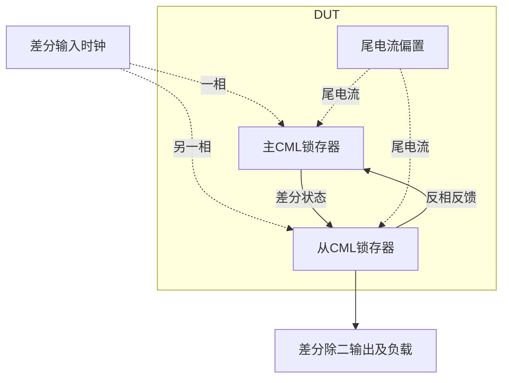
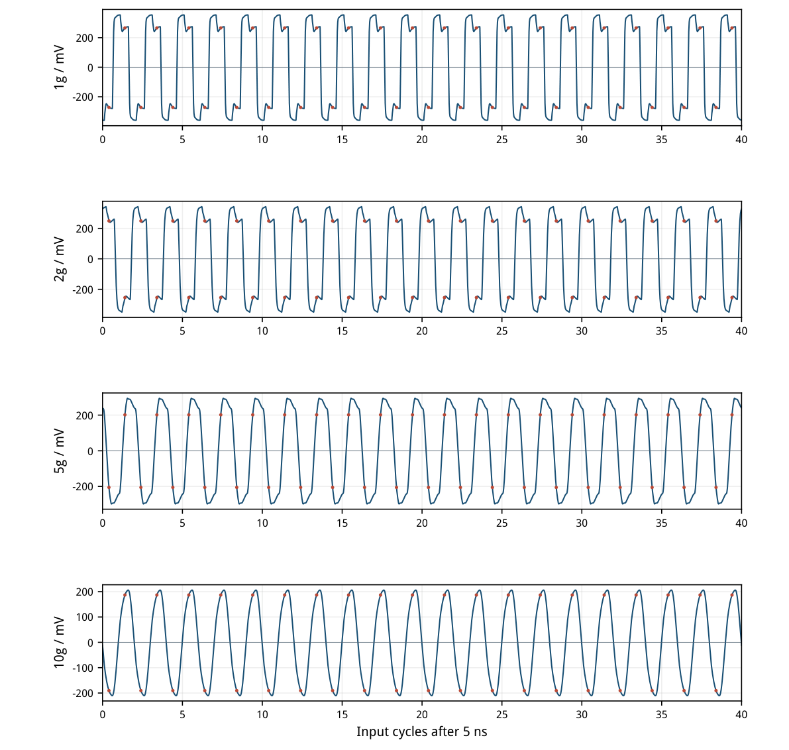
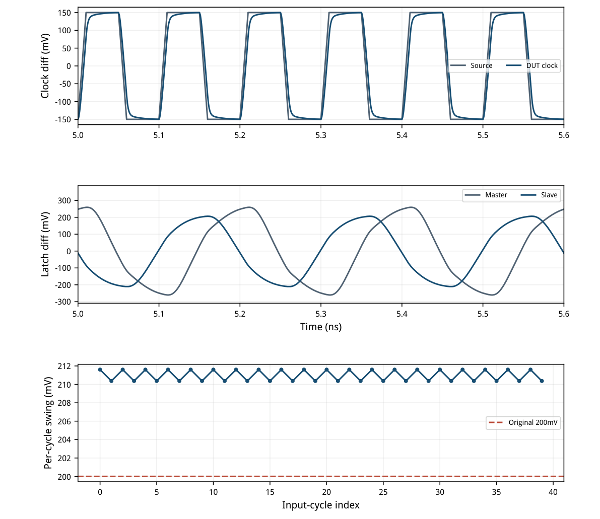
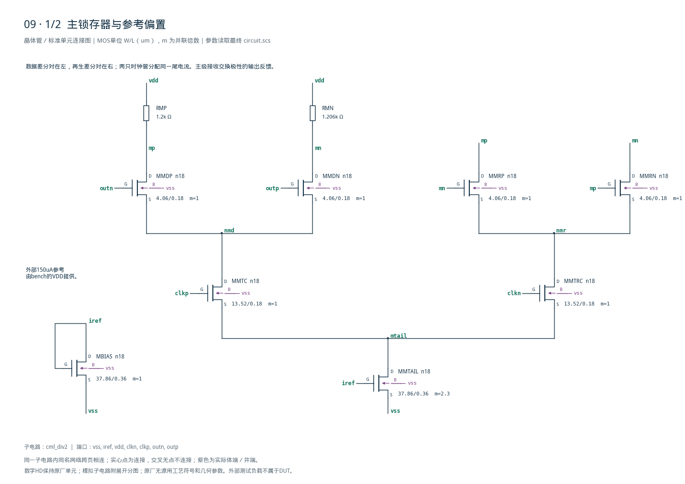
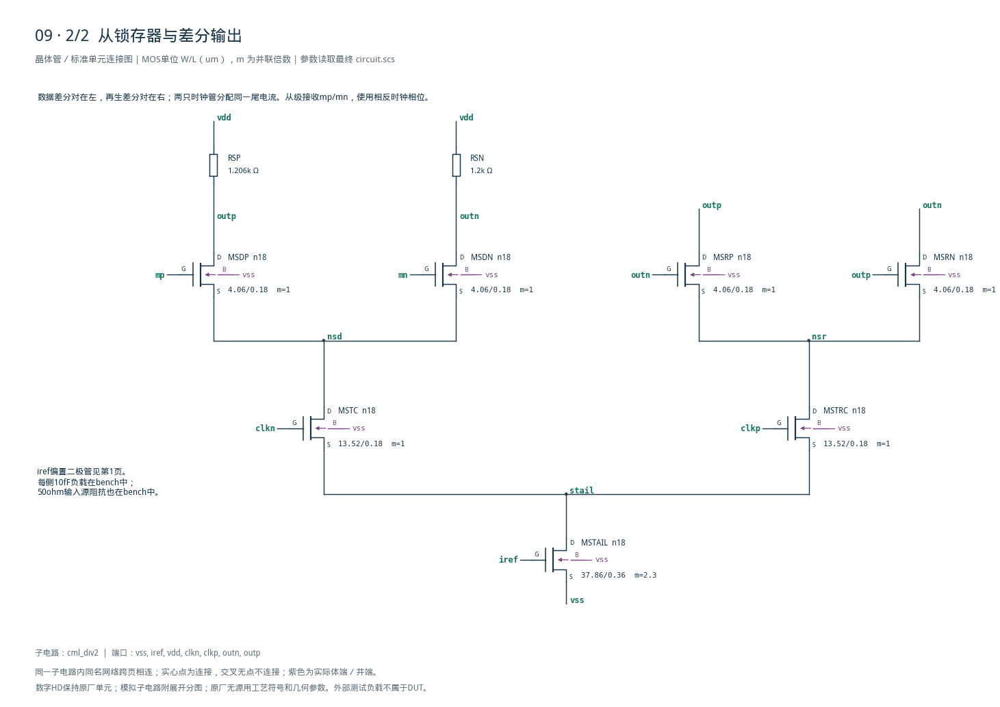

# 09 · CML二分频器审查

[审查 PDF](review.pdf) · [实测结果](latest_results.json) · [验收合同](contract.json) · [最终网表](circuit.scs)

## 验收结果

本模块把差分时钟频率除以二，用于高速时钟链和PLL反馈分频。主从CML锁存器以近似恒定尾电流在透明与保持支路之间切换，小电压摆幅减轻节点充放电负担；代价是持续静态功耗、差分输入需求及有限输出摆幅。它适合接收高速差分时钟，不能直接替代具有全摆幅输出和异步复位的普通数字触发器。

结论：四个原频点与静态功耗全部通过，无需10%或15%放宽。

SMIC18MMRF TT / 1.8V / 27°C。差分时钟源300mVpp、共模0.9V，每端50Ω源阻抗；每端输出负载10fF。外部150uA参考由VDD供给，纳入功耗。

| 指标 | 实测 | 原门槛 | 10%边界 | 15%边界 | 单位 |
| --- | --- | --- | --- | --- | --- |
| 1g 最小逐周期摆幅 | 712.887 | ≥200 | ≥180 | ≥170 | mVpp |
| 1g fIN/2分量 | 776.786 | ≥200 | ≥180 | ≥170 | mVpp |
| 1g 连续交替周期 | 40 | 40 | 40 | 40 | 周期 |
| 2g 最小逐周期摆幅 | 676.257 | ≥200 | ≥180 | ≥170 | mVpp |
| 2g fIN/2分量 | 738.823 | ≥200 | ≥180 | ≥170 | mVpp |
| 2g 连续交替周期 | 40 | 40 | 40 | 40 | 周期 |
| 5g 最小逐周期摆幅 | 536.488 | ≥200 | ≥180 | ≥170 | mVpp |
| 5g fIN/2分量 | 655.096 | ≥200 | ≥180 | ≥170 | mVpp |
| 5g 连续交替周期 | 40 | 40 | 40 | 40 | 周期 |
| 10g 最小逐周期摆幅 | 210.371 | ≥200 | ≥180 | ≥170 | mVpp |
| 10g fIN/2分量 | 430.828 | ≥200 | ≥180 | ≥170 | mVpp |
| 10g 连续交替周期 | 40 | 40 | 40 | 40 | 周期 |
| 静态总功耗 | 1.455351 | &lt;1.5 | &lt;1.65 | &lt;1.725 | mW |

10GHz最小逐周期摆幅210.371mVpp，距原200mVpp门槛约5.19%；功耗1.455351mW，比原1.5mW上限低约2.98%。两个余量均有限，不能由nominal通过推断跨工艺角通过。

频点、时钟幅值、负载、启动丢弃时间和连续40周期正确交替均保持原合同。10%/15%只放宽摆幅、目标分量幅值和功耗；功能判据从未放宽。

<!-- SYSTEM-BLOCK-DIAGRAM -->
## 系统框图

主从锁存闭环实现除二；本例没有完整PLL或额外复位控制器。

实线表示信号或能量通路，虚线表示时钟、控制或偏置。DUT框外为外部端口或测试夹具；精确端子连接见后附基本电路图。



[独立Mermaid源文件](system_block_diagram.mmd) · [框图SVG](markdown_assets/system-block.svg)
<!-- END-SYSTEM-BLOCK-DIAGRAM -->

## 锁存结构与gm/ID初始尺寸

互补时钟控制主从静态CML；每个锁存器只有一条共享尾电流。

主级在clkp相位采样交换极性的outn/outp反馈，另一相位由交叉耦合对保持；从级在clkn相位采样mp/mn。数据对和再生对通过两只时钟MOS分配尾电流，构成二分频闭环。

| 角色 | 单位W/L um | m | gm/ID | 初算I/uA | LUT fT/GHz |
| --- | --- | --- | --- | --- | --- |
| MBIAS / 两只TAIL | 37.86/0.36 | 1 / 2.3 | 16 | 150 | 3.720 |
| 四只时钟管 | 13.52/0.18 | 1 | 14 | 150 | 14.604 |
| 四只数据管 | 4.06/0.18 | 1 | 8 | 150 | 25.869 |
| 四只再生管 | 4.06/0.18 | 1 | 8 | 150 | 25.869 |

参考/尾管L0.36um、gm/ID=16，以较小过驱动保留叠层余量；时钟管L0.18um、gm/ID=14适应150mV差分峰值。数据/再生管gm/ID=8，减小输出节点的交叉耦合栅负载。LUT均为既有TT、VDS0.45V、VSB0V表。

初算每尾345uA，实际停钟工作点约329.264uA。两尾加150uA参考构成约808.53uA总VDD电流。m=2.3是原理图并联倍数，不代表已完成版图匹配。LUT的fT用于选点比较，不能代替完整分频仿真。

RMP/RSN=1200Ω，RMN/RSP=1206Ω。0.5%不对称及outp=1.0V/outn=0.8V nodeset仅选择DC初始相位，瞬态不强制节点。原合同允许DUT内有限正值理想R/C；本实现使用15只原厂n18和4只理想电阻。

时钟源、IREF和输出10fF负载均在测试台内；DUT内部没有独立源、受控源或行为模型。所有MOS体端接vss。

## 全部MOS的实际静态工作点

功耗台把clkp、clkn同时停在0.9V；此OP不是动态锁存状态。

| 器件 | \|ID\|/uA | gm/ID | VGS/V | VDS/V | VDS-VDSAT/V |
| --- | --- | --- | --- | --- | --- |
| MBIAS | 150.0000 | 16.062 | 0.5151 | 0.5151 | 0.4169 |
| MMDP | 83.0631 | 11.187 | 0.7593 | 0.7580 | 0.6302 |
| MMDN | 81.7776 | 11.268 | 0.7579 | 0.7592 | 0.6321 |
| MMTC | 164.6336 | 13.712 | 0.6213 | 0.5646 | 0.4604 |
| MMRP | 82.9797 | 11.192 | 0.7592 | 0.7581 | 0.6303 |
| MMRN | 81.9869 | 11.254 | 0.7581 | 0.7592 | 0.6321 |
| MMTRC | 164.6296 | 13.712 | 0.6213 | 0.5646 | 0.4603 |
| MMTAIL | 329.2642 | 16.082 | 0.5151 | 0.2787 | 0.1809 |
| MSDP | 81.9612 | 11.255 | 0.7581 | 0.7579 | 0.6308 |
| MSDN | 83.0442 | 11.188 | 0.7592 | 0.7594 | 0.6316 |
| MSTC | 164.6289 | 13.712 | 0.6213 | 0.5645 | 0.4603 |
| MSRP | 83.0562 | 11.187 | 0.7593 | 0.7579 | 0.6301 |
| MSRN | 81.7820 | 11.267 | 0.7579 | 0.7593 | 0.6323 |
| MSTRC | 164.6343 | 13.712 | 0.6213 | 0.5646 | 0.4604 |
| MSTAIL | 329.2642 | 16.082 | 0.5151 | 0.2787 | 0.1809 |

静态iref=0.515069V，mtail/stail约0.278747V；数据与再生公共源约0.8433V。高源电位使体效应显著，不能把零体偏置LUT的VGS直接当作电路实际VGS。

停钟时数据对与再生对同时分流，单只上层MOS约82uA，实际gm/ID约11.2；它与150uA初算gm/ID=8并不矛盾。动态时电流重新分配，最终速度由四频点的真实瞬态验收。

静态功耗=-VDD×I(VDD:p)，包括150uA参考；不把外部时钟驱动器的能量计入本题静态功耗指标。

## 四频点的全部40周期观察窗

先丢弃5ns，再按每个输入周期0.4T处的差分符号判断连续交替。

四条波形均40次有效采样、39次相邻符号交替；±10mV内的样点视为无效。完整逐周期摆幅另行检查，未以选取的局部波形或全窗峰峰值替代。

输出频率还从20次正向过零测得：0.5 / 1 / 2.5 / 5GHz。此列为实测周期结果，区别于预设的fIN/2投影目标频率。



[查看矢量图](markdown_assets/figure-04-01.svg)

## 10GHz下的动态细节与最小摆幅

最大步长及保存间隔1ps；其他三频点2ps，均严于原台要求。

10GHz源差分幅度300mVpp，DUT时钟引脚299.916mVpp。输出全窗峰峰值416.916mV，最小单输入周期峰峰值210.371mV；窗口切分使两者不同，验收严格采用后者。

fIN/2时间加权分量430.828mVpp。它是去除DC投影后的基波等效幅值，非正弦波的基波峰峰值可以大于实际全波形峰峰值；两种定义不能混用。



[查看矢量图](markdown_assets/figure-05-01.svg)

## 失败迭代与最终电流分配

保留所有真实失败结果；最终仅相对首版提高尾电流倍数。

| 尾m / R / 再生gmID | 10G最小周期 / 分量 | 交替周期 | 结论 |
| --- | --- | --- | --- |
| 2 / 1200Ω / 8 | 145.42 / 300.65mV | 40 | 摆幅失败 |
| 2.3 / 900Ω / 10 | 0.784 / 3.42mV | 1 | 振幅塌陷 |
| 2.3 / 1400Ω / 10 | 141.28 / 4.52mV | 31 | 未锁定 |
| 2.3 / 1200Ω / 8 | 210.37 / 430.83mV | 40 | 全部原门槛 |

首版已有正确二分频和足够目标分量，但最小单周期摆幅145.42mV，连15%放宽后的170mV也未达到。最终提高尾镜倍数2→2.3，保持数据/再生尺寸与1200Ω负载，补足高速摆幅，静态功耗从1.30321升至1.45535mW。

900Ω方案同时增加再生管gm/ID至10，输出塌陷；1400Ω方案全窗摆幅虽达557mV，但只有31周期交替且fIN/2分量仅4.52mV。该对比只能说明联合参数对锁存动态的影响，不能从同时改变的两项参数断言单一因果。

小RC时间常数、较大再生gm或较大输出摆幅均不是充分条件。必须同时满足采样传递、再生保持、相位关系、逐周期摆幅和目标频率分量。静态OP正常也不能证明高频功能通过。

最终余量仅限本地TT确定性原理图模型；没有执行其他工艺角、电压温度扫描、随机失配、相位噪声或PEX。

## 原始算法复核与运行证据

17项数值交叉核对；原speed\_check的四个TT频点全部通过。

把实际Spectre time/outp/outn逐行传给未修改的上游divider\_metrics和speed\_check；每频点核对全窗摆幅、最小周期摆幅、时间加权目标分量和交替周期共16项，再独立重算静态VDD功耗。模型、LUT、原题和五组最终运行输入哈希一致。

外部有限PWL源逐点实现原PULSE时序，并与解析式交叉核对。早期5GHz运行真实出现CMI-2204：浮点末点造成时间重复；已改为整数飞秒网格并重跑。该失败日志保留且不参与验收。

最终五组Spectre24.1日志均0错误/0警告。Bridge的license error字符串误报与上述真实PWL错误分别记录：最终日志许可检查成功、仿真正常结束、PSF完整，Bridge元数据未改写。

复现命令（virtuoso-bridge-lite/.venv，工程根目录）： python scripts/case09\_cml.py python scripts/schematic09.py python scripts/audit09.py python scripts/review09.py 报告重新生成后须重新目检，不自动继承本次检查结论。

五组最终运行：runs/09/20260926T033542023288Z\_10g runs/09/20260926T033543923307Z\_power runs/09/20260926T033652802398Z\_1g runs/09/20260926T033655636370Z\_2g runs/09/20260926T033657262874Z\_5g

原题工艺角ff/ss/fs/sf未计入当前nominal交付。没有修改PDK、Bridge、Spectre或原有LUT环境。

## 精确网表与完整晶体管图纸

顶层端口：vss iref vdd clkn clkp outn outp。

后附S1/S2含全部15只n18与4只电阻，共19个实例、68个端子。所有D/G/S/B和两端电阻均有连接映射、实例参数及独立核对，没有隐藏子电路。

完整总图：cases/09-cml-divider/schematic/full.svg / full.pdf 连接清单：schematic/connectivity.json 独立图纸检查：schematic\_independent\_review.json

电路SHA-256：b92dbeb47541da5d5b1137db661ae3624ef18c87bb0e152bebb98b803b9b1a55

## 完整网表与电路图

[Spectre 网表](circuit.scs) · [全部分图 PDF](schematic/sheets.pdf) · [电路总图](schematic/full.svg) · [端子连接](schematic/connectivity.json)

<details>
<summary>展开完整 Spectre 网表</summary>

```spectre
// Static master-slave CML; no ideal source inside DUT.
simulator lang=spectre
subckt cml_div2 (vss iref vdd clkn clkp outn outp)
MBIAS (iref iref vss vss) n18 w=37.86u l=0.36u
RMP (mp vdd) resistor r=1200
RMN (mn vdd) resistor r=1206
MMDP (mp outn nmd vss) n18 w=4.06u l=0.18u
MMDN (mn outp nmd vss) n18 w=4.06u l=0.18u
MMTC (nmd clkp mtail vss) n18 w=13.52u l=0.18u
MMRP (mp mn nmr vss) n18 w=4.06u l=0.18u
MMRN (mn mp nmr vss) n18 w=4.06u l=0.18u
MMTRC (nmr clkn mtail vss) n18 w=13.52u l=0.18u
MMTAIL (mtail iref vss vss) n18 w=37.86u l=0.36u m=2.3
RSP (outp vdd) resistor r=1206
RSN (outn vdd) resistor r=1200
MSDP (outp mp nsd vss) n18 w=4.06u l=0.18u
MSDN (outn mn nsd vss) n18 w=4.06u l=0.18u
MSTC (nsd clkn stail vss) n18 w=13.52u l=0.18u
MSRP (outp outn nsr vss) n18 w=4.06u l=0.18u
MSRN (outn outp nsr vss) n18 w=4.06u l=0.18u
MSTRC (nsr clkp stail vss) n18 w=13.52u l=0.18u
MSTAIL (stail iref vss vss) n18 w=37.86u l=0.36u m=2.3
ends cml_div2
```

</details>





## 报告来源

正文与表格整理自已交付的矢量 PDF，图表单独提取；本文件是后续整理的 Markdown，不是原 PDF 的编译输入。原 PDF、网表及测量数据保持原值。
