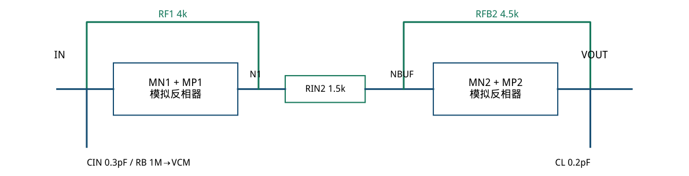
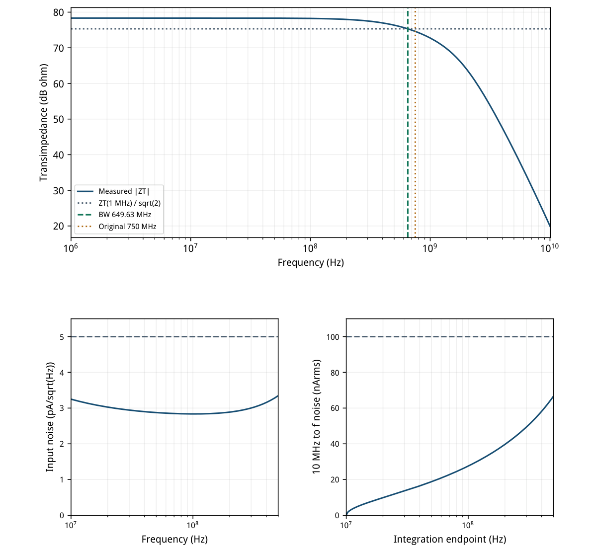
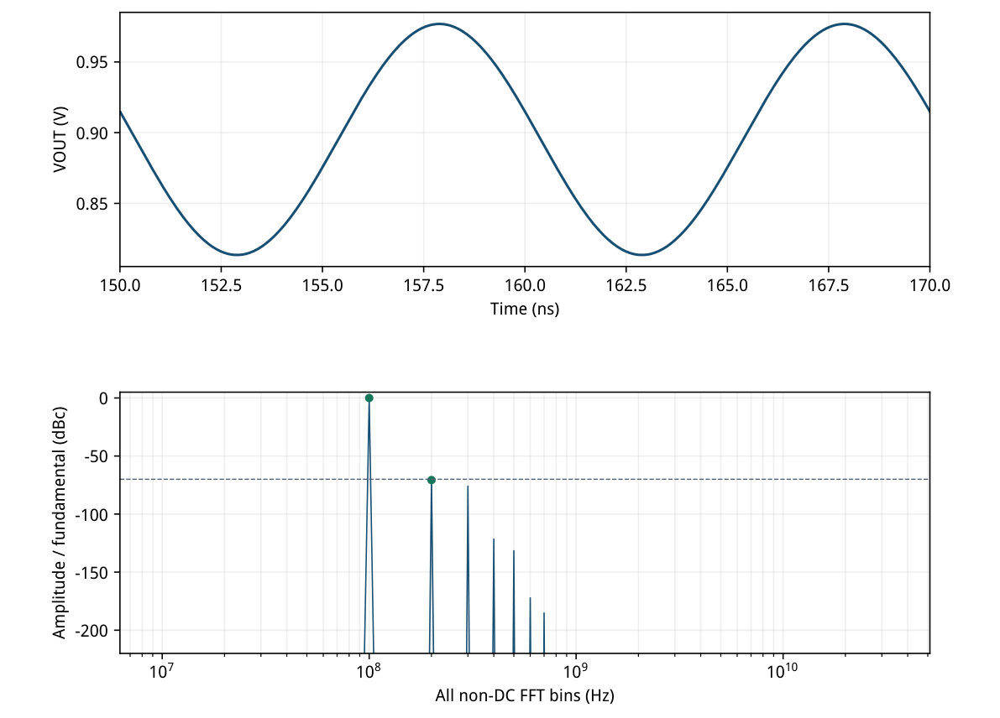
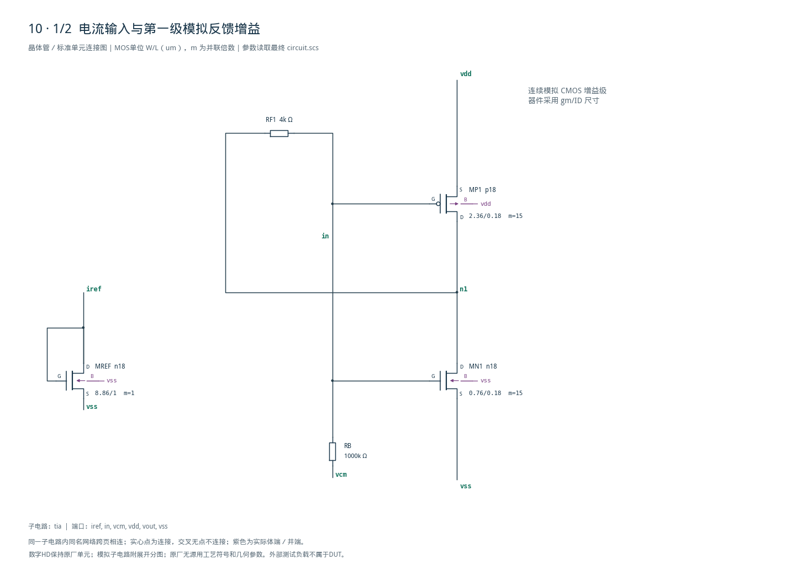
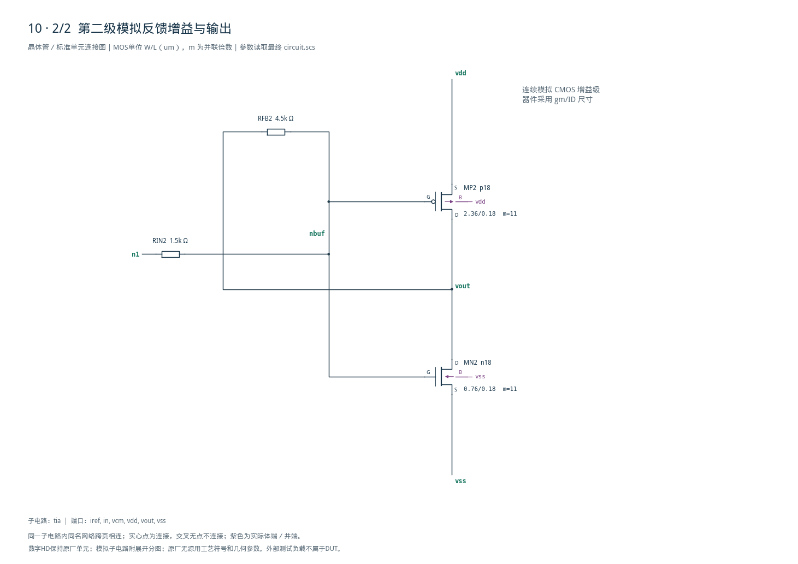

# 10 · 跨阻放大器 TIA 审查

[审查 PDF](review.pdf) · [实测结果](latest_results.json) · [验收合同](contract.json) · [最终网表](circuit.scs)

## 验收结果

本模块把输入电流转换为输出电压，便于后续电压放大或数据转换。跨阻反馈可降低输入端阻抗，并在设定电流到电压增益的同时控制带宽；相比直接用大电阻读出电流，它更有利于处理输入端电容，但需要协调噪声与稳定性。芯片中常用于光电探测、传感器电流读出和接收机模拟前端。

结论：15%放宽通过；仅带宽低于原门槛13.38%，其他6项原门槛全部通过。

条件：SMIC18MMRF / tt / 1.8 V / 27°C；IREF=20 uA，VCM=0.9 V，输入电容0.3 pF，输出负载0.2 pF。保持正式100 MHz、10 uA峰值电流激励，以及固定10–500 MHz噪声积分频带。

| 指标 | 实测 | 原门槛 | 10%边界 | 15%边界 | 单位 |
| --- | --- | --- | --- | --- | --- |
| ZT @1 MHz | 8.2637 | &gt;8.0000 | &gt;7.2000 | &gt;6.8000 | kΩ |
| 上侧−3 dB带宽 | 649.6269 | &gt;750.0000 | &gt;675.0000 | &gt;637.5000 | MHz |
| 最大输入电流噪声 | 3.3469 | &lt;5.0000 | &lt;5.5000 | &lt;5.7500 | pA/√Hz |
| 积分输入电流噪声 | 66.6648 | &lt;100.0000 | &lt;110.0000 | &lt;115.0000 | nArms |
| 大信号基波ZT | 8.1677 | &gt;8.0000 | &gt;7.2000 | &gt;6.8000 | kΩ |
| 全谱SFDR | 70.6750 | &gt;70.0000 | &gt;69.0849 | &gt;68.5884 | dBc |
| 外部端口总DC功耗 | 4.6886 | &lt;5.0000 | &lt;5.5000 | &lt;5.7500 | mW |

带宽649.6269 MHz：未达到原750 MHz或10%边界675 MHz；高于15%下界637.5 MHz约12.13 MHz。完整结果状态为complete\_15pct，不能标为原门槛全部通过。

正式大信号ZT为8.1677 kΩ，比原8 kΩ门槛高2.10%；SFDR为70.6750 dBc，最大杂散200 MHz。未用公共诊断的5 uA幅度替代正式10 uA，也未仅在指定谐波或500 MHz以内搜索杂散。

功耗为|VDD·I(VDD)|+|VCM·I(VCM)|，两项分别4.6885666 mW与4.3019 nW；20 uA参考已从VDD取电，不重复累加。SFDR按基波/杂散幅度比放宽，dB下限加20log10(0.90/0.85)。原门槛均使用严格&gt;或&lt;比较。

本报告仅覆盖一个nominal点的AC/功耗、噪声和正式SFDR三组测量；原15点PT矩阵的其余14点、失配和版图寄生均未执行。

## 模拟反相器结构、gm/ID与工作点

保留原两级电阻反馈结构；NMOS与PMOS同时导通，属于模拟增益级。

| 器件 | 模型 | L/um | 单位W/um | m | LUT gm/ID | LUT \|VDS\| |
| --- | --- | --- | --- | --- | --- | --- |
| MN1 / MN2 | n18 | 0.18 | 0.76 | 15 / 11 | 3.4 | 0.90 |
| MP1 / MP2 | p18 | 0.18 | 2.36 | 15 / 11 | 3.9 | 0.90 |
| MREF | n18 | 1.00 | 8.86 | 1 | 14.0 | 0.45 |

| 实际OP | \|ID\|/uA | gm/mS | gm/ID | gm/gds | \|VDS\|/V | 饱和余量/V |
| --- | --- | --- | --- | --- | --- | --- |
| MN1 | 1491.216 | 4.9786 | 3.339 | 24.28 | 0.8952 | 0.6269 |
| MP1 | 1491.201 | 5.7674 | 3.868 | 22.08 | 0.9048 | 0.5359 |
| MN2 | 1093.548 | 3.6510 | 3.339 | 24.28 | 0.8953 | 0.6270 |
| MP2 | 1093.558 | 4.2294 | 3.868 | 22.08 | 0.9047 | 0.5359 |
| MREF | 20.000 | 0.2802 | 14.010 | 227.93 | 0.5156 | 0.3935 |

LUT以100 uA模拟单位管起步，取n/p的gm/ID=3.4/3.9，使栅压约0.9 V。低gm/ID对应强反型与较高速度；最终第一/二级复制15/11份，目标1.5/1.1 mA。实际偏置1.4912/1.0936 mA，所有单位W≤8.86 um，均在模型范围内。

反馈电阻完成直流自偏置：IN=0.895220 V，N1=0.895201 V，VOUT=0.895258 V。MREF只以二极管连接终止20 uA端口，未镜像到两级。三份既有TT LUT只读使用；5只管均饱和，最小余量0.3935 V。DUT仅5只MOS与4只正电阻。



[查看矢量图](markdown_assets/figure-02-01.svg)

## 固定负载下的跨阻带宽与噪声

带宽参考1 MHz跨阻；应用噪声频带固定为10–500 MHz。

AC共401点，1 MHz–10.1 GHz、100点/十倍频程；按原fall=1取首个下降−3 dB交越。线性频率插值得649.6269 MHz，改用对数频率为649.5933 MHz，差0.00517%。10 GHz跨阻10.0018 Ω，因此本例不使用“≥10 GHz”下界分支。

噪声171点覆盖10–500 MHz，每点输入电流谱均低于5 pA/√Hz，最坏点为500 MHz。对谱密度平方积分再开根号：66.66484 nArms；分段幂律积分66.66503 nArms，差0.000289%。未随实际带宽改变积分终点。



[查看矢量图](markdown_assets/figure-03-01.svg)

## 正式10 uA正弦与全谱SFDR

仅移除均值与基波；所有剩余非DC FFT频点均参与最大杂散搜索。

冻结verify.py的sfdr\_metrics直接读取PSF转出的17位文本：取最后16周期，即10–170 ns；线性插值到每周期1024点，共16384点。减均值后用2|rFFT|/N，bin 16为100 MHz基波，最大其余非DC线为200 MHz；无加窗、无只看谐波的筛选。

基波81.677255 mV，最大杂散23.897372 uV，SFDR=70.675020 dBc；基波幅度除以10 uA得到8.167725 kΩ。100 MHz小信号AC跨阻8.171706 kΩ，大信号变化−0.04871%；1 MHz原跨阻为8.263725 kΩ。三者定义不可互换。

完整瞬态17409个保存点，间隔9.765625 ps，内部maxstep=5 ps。原生采样的100/200 MHz最小二乘幅度比与正式FFT相差1.3e−10 dB；交叉检查验证提取一致性，不构成步长收敛误差界限。未作额外精度扫描。

save IIN:p被Spectre忽略并产生两条警告；理想电流源仍按冻结bench的100 MHz/10 uA运行，VOUT完整。没有保存IIN电流波形，因此不声称对该波形另作实测。



[查看矢量图](markdown_assets/figure-04-01.svg)

## 原合同映射与设计权衡

同一正式刺激、负载、功率端口和观察窗口；原函数保留其nominal单点集合。

| 源测量组 | 固定条件 | 本次实现 |
| --- | --- | --- |
| AC / 功耗 | 1 MHz–10.1 GHz，dec 100；DC端口电流 | ZT=\|VOUT\|，IIN AC=1 A；首个下降−3 dB点；VDD+<br>VCM绝对功率 |
| 噪声 | 10–500 MHz，dec 100，输出VOUT | Spectre iprobe=IIN输入电流谱；全频点最大值和<br>固定频带积分 |
| 正式SFDR | 100 MHz、10 uApeak；170 ns结束 | 末16周期×1024点；全部非DC杂散；同时门控基波Z<br>T |

直接调用冻结ac\_checks、noise\_checks、sfdr\_check，传入集合{tt,27°C}，保留严格&gt; / &lt;比较；原6个分组检查中仅带宽失败。SFDR分组同时要求大信号ZT与SFDR，所以最终合计7个标量门槛。未把单点伪装成15点PT覆盖。

| 版本 | 目标电流/uA | RF1 / RIN2 / RFB2 | ZT/kΩ | BW/MHz | P/mW | 证据 |
| --- | --- | --- | --- | --- | --- | --- |
| 初版 | 900 / 800 | 5.55k / 5.5k / 13.2k | 10.1354 | 583.330 | 3.0781 | 仅AC |
| 第二版 | 1300 / 1200 | 4.7k / 4.9k / 13.2k | 9.7416 | 541.871 | 4.5096 | 仅AC |
| 完整候选 | 1500 / 1100 | 3.9k / 1.5k / 4.5k | 8.0523 | 661.355 | 4.6886 | 15%通过 |
| 最终固定 | 1500 / 1100 | 4.0k / 1.5k / 4.5k | 8.2637 | 649.627 | 4.6886 | 15%通过 |

有限环路增益使理想电阻乘积RF1·RFB2/RIN2=12 kΩ降到实测8.2637 kΩ。AC分解：带载首级ZT=3.56665 kΩ，第二级电压增益2.31694；乘积与总ZT一致。输入阻抗431.6 Ω，不能仅以RF1的数值等同输入阻抗。

增加电流的第二版同时改变了电阻与器件电容，带宽反而下降，不能归因为单独电流效应。第二级改用1.5k/4.5k，在比值3下控制NBUF时间常数；这些权衡须以完整AC、噪声与正式大信号共同验证。

完整候选的基波ZT=7.9622 kΩ，比原门槛低0.473%；最终只把RF1从3.9k改到4.0k，恢复两项ZT原门槛，带宽由661.35降至649.63 MHz，SFDR由70.874降至70.675 dBc。停止进一步优化并明确保存带宽放宽标签。

## 精确电路与可复现证据

端口顺序 IREF IN VCM VDD VOUT VSS；MOS端序D G S B，体端接对应电源。

MOS模型：SMIC\_018\_MMRF/models/spectre/ms018\_v1p7\_spe.lib，section=tt。NMOS与PMOS模拟级采用既有TT gm/ID LUT初值，LUT路径、偏置、尺寸、模型与源文件SHA-256均在case与run快照中。单位宽度合法，无新数字电路或额外DUT电容。

复现：/home/IC/CodeX/virtuoso-bridge-lite/.venv/bin/python scripts/case10\_tia.py 报告：同一Python运行 scripts/review\_pdf.py 10。当前脚本默认值已固定最终版本；历史执行脚本保留在各run的inputs中，电路与合同逐字对应。

最终正式运行：runs/10/20260922T103416916168Z\_ac runs/10/20260922T103417040905Z\_noise runs/10/20260922T103417174989Z\_sfdr

源任务：sky130-tia-zt8k-bw750m-noise5p-sfdr70-power5m-pt。instruction、reference与三份正式bench、verify.py及utils.py已冻结在cases/10-tia/source。latest\_results、numerical\_review、verification\_audit、pdf\_provenance与knowledge.md构成审查入口。

限制：仅tt/1.8 V/27°C，理想正电阻与测试电容；未验证其余PT、供电变化、额外光电二极管电容、失配、提取互连或电阻版图寄生。SFDR原门槛余量0.675 dB，不能推广为角落或硅后裕量。

精确电路SHA-256：3e96952b371aec9580fd6fc7366ff78e08bf19958c732078db5e69c9341ff565

## 完整网表与电路图

[Spectre 网表](circuit.scs) · [全部分图 PDF](schematic/sheets.pdf) · [电路总图](schematic/full.svg) · [端子连接](schematic/connectivity.json)

<details>
<summary>展开完整 Spectre 网表</summary>

```spectre
// Analog inverters in two resistor-feedback gain stages, not digital gates.
// D G S B; legal gm/ID model-unit widths, all capacitors are in the bench.
simulator lang=spectre
subckt tia (iref in vcm vdd vout vss)
MN1 (n1 in vss vss) n18 w=0.76u l=.18u m=15
MP1 (n1 in vdd vdd) p18 w=2.36u l=.18u m=15
RF1 (n1 in) resistor r=4000
RB (in vcm) resistor r=1M
MN2 (vout nbuf vss vss) n18 w=0.76u l=.18u m=11
MP2 (vout nbuf vdd vdd) p18 w=2.36u l=.18u m=11
RIN2 (n1 nbuf) resistor r=1500
RFB2 (vout nbuf) resistor r=4500
MREF (iref iref vss vss) n18 w=8.86u l=1u
ends tia
```

</details>





## 报告来源

正文与表格整理自已交付的矢量 PDF，图表单独提取；本文件是后续整理的 Markdown，不是原 PDF 的编译输入。原 PDF、网表及测量数据保持原值。
