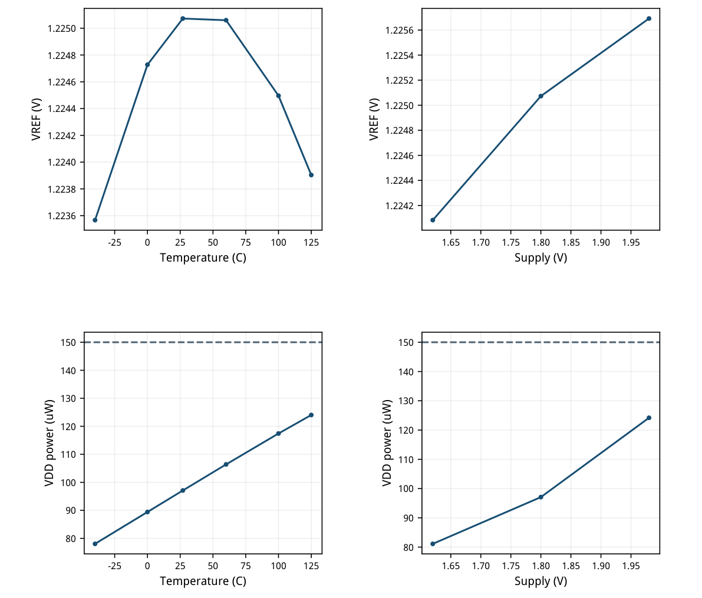
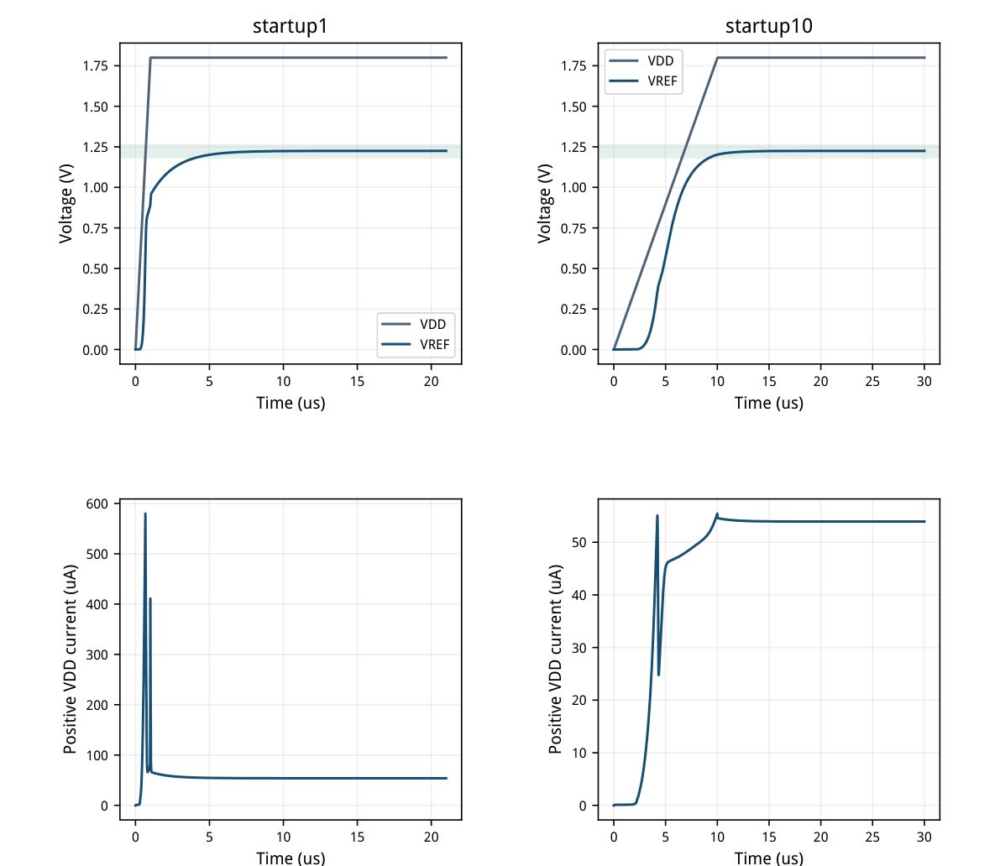
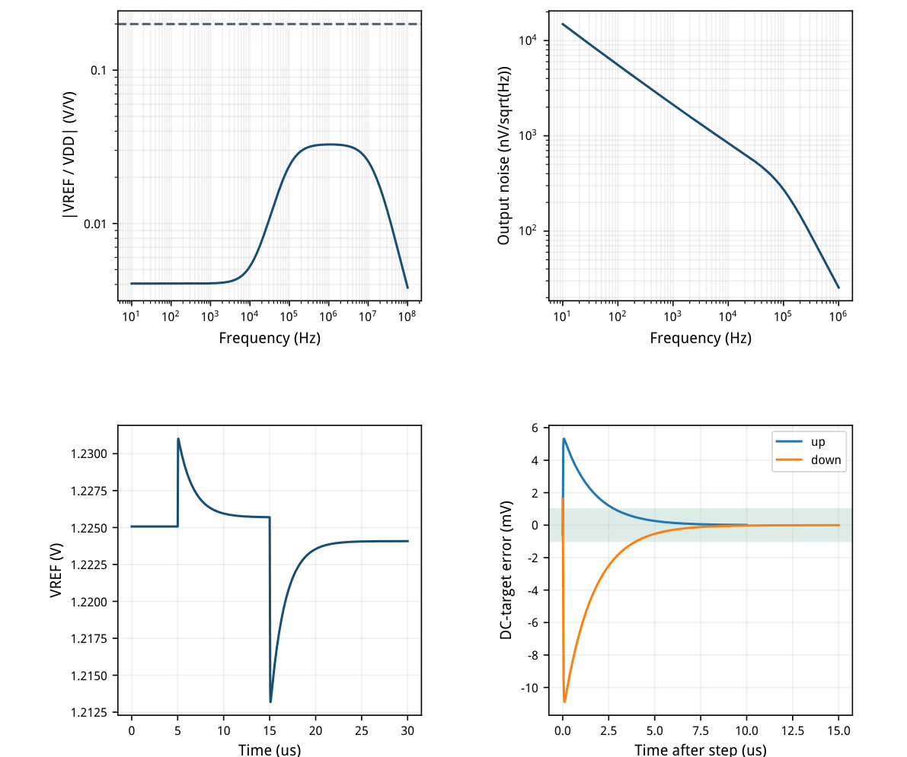
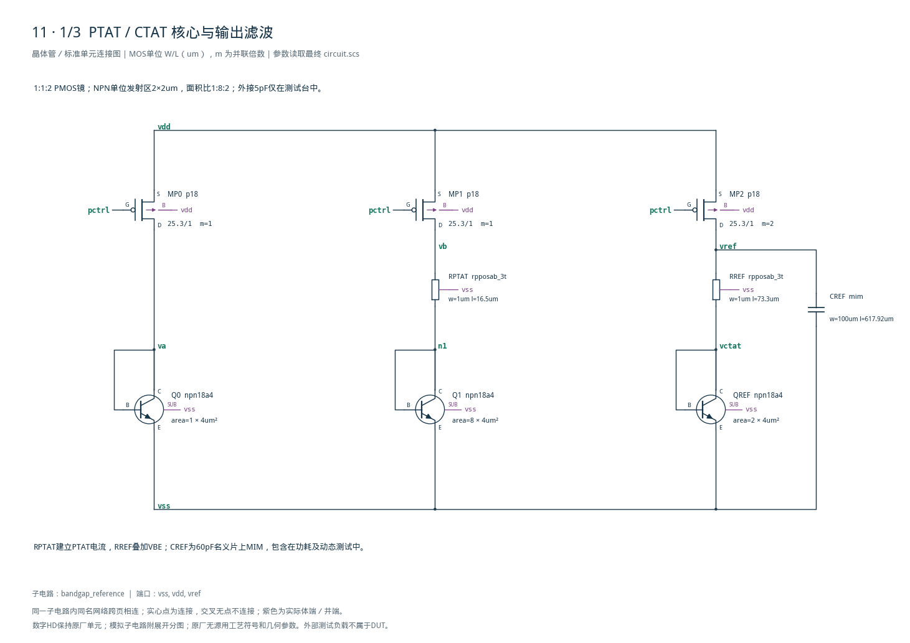
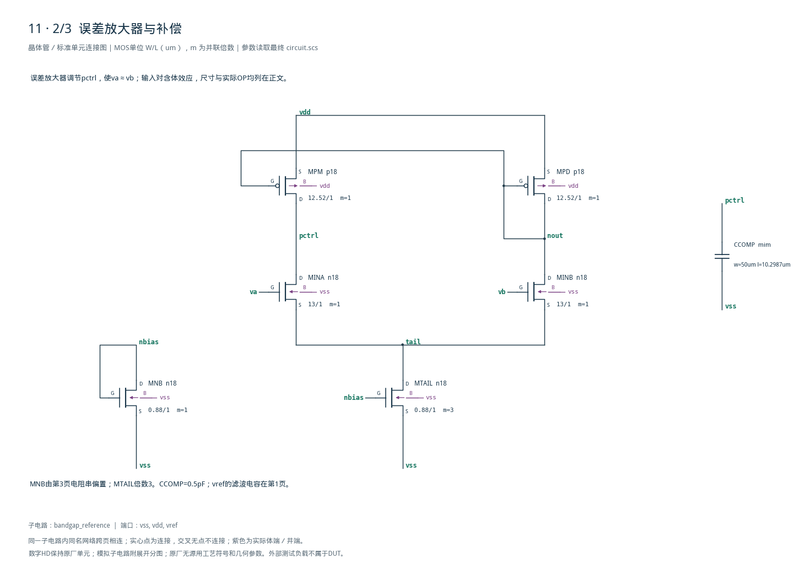
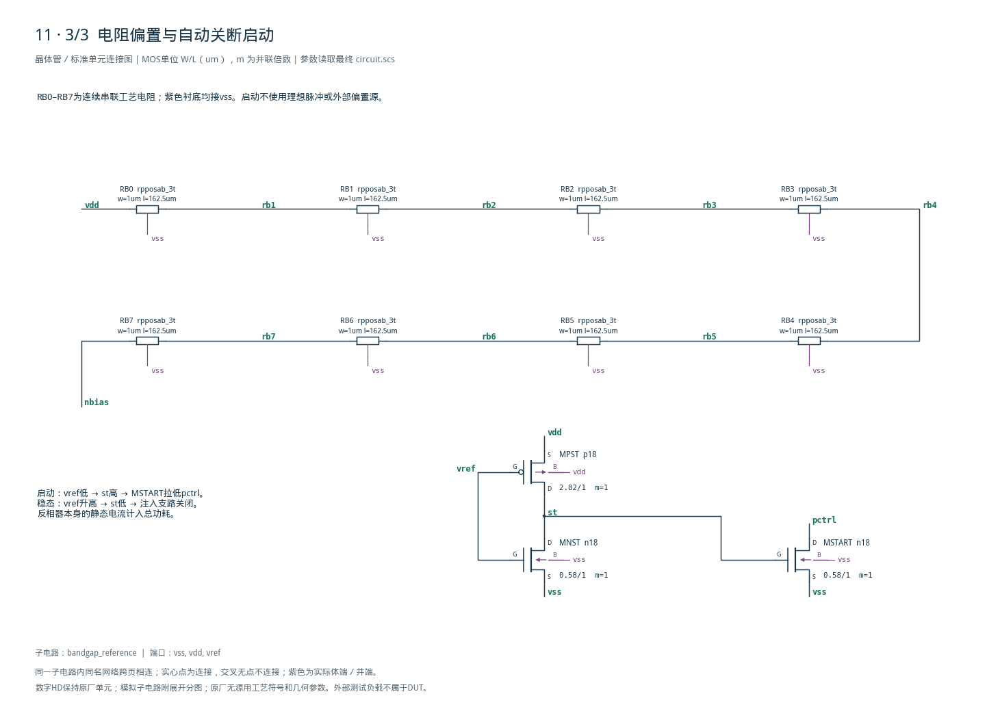

# 11 · 一阶带隙基准审查

[审查 PDF](review.pdf) · [实测结果](latest_results.json) · [验收合同](contract.json) · [最终网表](circuit.scs)

## 验收结果

本模块利用双极管VBE与不同电流密度产生的ΔVBE相加，提供约1.2V的低温漂片上基准。相比单独使用VBE或电阻分压，闭环带隙可同时降低温度与供电变化的影响，代价是偏置电流、启动电路和滤波电容面积。它适合偏置、阈值及稳压器参考；本设计为高阻核心，直接驱动ADC采样负载还需要缓冲器。

结论：适用的TT复现检查全部达到原门槛，无需10%或15%放宽。

标称：1.8 V / 27°C / 外部5 pF，VREF=1.225073 V，VDD功耗97.088 uW。TT下保留六温度点及三个电压点表征，动态测试保持27°C；不将其扩称全PVT。

| 指标 | 实测 | 原门槛 | 10%边界 | 15%边界 | 单位 |
| --- | --- | --- | --- | --- | --- |
| 基准偏离1.22V | 5.692 | ≤40 | ≤44 | ≤46 | mV |
| 表征点最大功耗 | 124.2 | ≤150 | ≤165 | ≤172.5 | uW |
| 六温度点温漂 | 7.453 | ≤50 | ≤55 | ≤57.5 | ppm/°C |
| 线性调整率 | 4.469 | ≤20 | ≤22 | ≤23 | mV/V |
| 启动窗口偏离1.22V | 5.073 | ≤40 | ≤44 | ≤46 | mV |
| 斜坡后进入电压窗 | 2.96 | ≤10 | ≤11 | ≤11.5 | us |
| 启动过冲 | 0 | ≤100 | ≤110 | ≤115 | mV |
| 启动峰值电流 | 0.58 | ≤1.5 | ≤1.65 | ≤1.725 | mA |
| 正向启动能量 | 2.327 | ≤5 | ≤5.5 | ≤5.75 | nJ |
| 最大电源耦合 | 0.03279 | ≤0.2 | ≤0.22 | ≤0.23 | V/V |
| 输出积分噪声 | 232.5 | ≤500 | ≤550 | ≤575 | uVrms |
| 供电阶跃偏移 | 10.9 | ≤100 | ≤110 | ≤115 | mV |
| 阶跃1mV建立时间 | 3.983 | ≤10 | ≤11 | ≤11.5 | us |
| 阶跃末端误差 | 0.01203 | ≤1 | ≤1 | ≤1 | mV |

电压精度以1.22V为中心，原误差±40mV；10%/15%只扩大误差到±44/46mV。启动时间从斜坡结束计起；阶跃基准取独立DC结果，固定1mV误差带不放宽。

本次为无修调、高阻带隙核心，不包含输出缓冲器。实际运行、网表快照、模型与LUT哈希、测量公式和完整晶体管图均随报告保留。

## 结构与 gm/ID 初始尺寸

一阶 VBE + K·ΔVBE；三路PMOS镜、NPN面积比、误差放大器及独立启动。

误差放大器使va≈vb，RPTAT上的电压近似ΔVBE。Q0:Q1发射区面积比1:8，PMOS支路电流比1:1:2；输出为 VBE(QREF) + IOUT·RREF。QREF面积取2，使其电流密度接近Q0。电阻比确定补偿权重，绝对电阻决定电流。

| 器件 | 模型 | W/L um | m | gm/ID | 初算I/uA |
| --- | --- | --- | --- | --- | --- |
| MP0 / MP1 / MP2 | p18 | 25.30/1 | 1 / 1 / 2 | 15 | 10 |
| MINA / MINB | n18 | 13.00/1 | 1 / 1 | 22 | 4 |
| MPD / MPM | p18 | 12.52/1 | 1 / 1 | 16 | 4 |
| MNB / MTAIL | n18 | 0.88/1 | 1 / 3 | 12 | 3 |
| MPST | p18 | 2.82/1 | 1 | 12 | 2 |
| MNST / MSTART | n18 | 0.58/1 | 1 / 1 | 12 | 2 |

| 器件 | 工艺模型 | 最终几何参数 |
| --- | --- | --- |
| Q0 / Q1 / QREF | npn18a4 | 单位2×2um；area = 1 / 8 / 2 |
| RPTAT / RREF | rpposab_3t | W=1um；L=16.5 / 73.3um |
| RB0–RB7 | rpposab_3t | 每段W=1um / L=162.5um，8段串联 |
| CREF / CCOMP | mim | 100×617.92 / 50×10.299um² |

LUT：现有gmoverid\_smic18 TT表，MOS L=1um；镜与偏置VDS=0.9V，输入对和镜负载VDS=0.45V。初算gm/ID与工作点分别记录，输入对体效应不通过改写LUT掩盖。独立技能文件未迁移，沿用已有GmIdTable接口及已验证数据。

滤波代价：CREF名义60pF，电容板面积约0.0618mm²，另有0.5pF补偿电容及5pF外部负载。模型包含工艺电阻衬底电容与MIM电压/温度系数；未进行布局、DRC或PEX。

## 标称工作点与启动关断

用真实电路OP检查电流、体效应和余量；不把所有器件强制归为同一区域编号。

| 器件 | \|ID\|/uA | gm/ID | VGS/V | VDS/V | \|VDS\|-\|VDSAT\| |
| --- | --- | --- | --- | --- | --- |
| MP0 | 10.0933 | 14.981 | -0.5196 | -1.0528 | 0.9381 |
| MP1 | 10.0933 | 14.981 | -0.5196 | -1.0528 | 0.9382 |
| MP2 | 19.8247 | 15.015 | -0.5196 | -0.5749 | 0.4603 |
| MINA | 4.30271 | 22.003 | 0.4815 | 1.0147 | 0.9504 |
| MINB | 4.30118 | 22.004 | 0.4814 | 1.0232 | 0.9589 |
| MPD | 4.30119 | 15.657 | -0.5111 | -0.5111 | 0.4021 |
| MPM | 4.30273 | 15.657 | -0.5111 | -0.5196 | 0.4106 |
| MNB | 2.93983 | 11.702 | 0.5420 | 0.5420 | 0.3952 |
| MTAIL | 8.6039 | 11.646 | 0.5420 | 0.2658 | 0.1189 |
| MPST | 2.38273 | 11.189 | -0.5749 | -1.7816 | 1.6267 |
| MNST | 2.38276 | 0.985 | 1.2251 | 0.0184 | -0.6187 |
| MSTART | 6.65586e-06 | 30.160 | 0.0184 | 1.2804 | 1.2401 |

输入对实际gm/ID约22/V，源节点约0.266V引入体效应；仍有足够VDS余量。启动检测反相器属于大信号电路，MNST在稳态低VDS，MSTART则关断，不能用放大管饱和条件误判。

| 节点 | 电压/V |
| --- | --- |
| va | 0.747214 |
| vb | 0.747172 |
| n1 | 0.692352 |
| vctat | 0.746733 |
| pctrl | 1.280446 |
| tail | 0.265758 |
| nbias | 0.541973 |
| st | 0.018372 |

启动注入关闭不代表启动检测器零功耗：MPST/MNST反相器的剩余直通电流已计入VDD总功耗。这里没有理想电流源给DUT供偏置。

ΔVBE ≈ 54.862 mV，va−vb = 41.966 μV，MSTART 稳态电流为 6.656 pA。表中电流符号沿用 Spectre：PMOS 电流为负，幅度列取绝对值。

## 温度补偿与线性调整率

TT / bjt\_tt / res\_tt / mim\_tt；温扫在1.8V，电压扫在27°C，二者不是完整笛卡尔PVT。

| 温度/°C | 输出/V | 功耗/uW |
| --- | --- | --- |
| -40 | 1.223567 | 78.041 |
| 0 | 1.224728 | 89.413 |
| 27 | 1.225073 | 97.088 |
| 60 | 1.225060 | 106.398 |
| 100 | 1.224496 | 117.428 |
| 125 | 1.223904 | 124.035 |

TC=(max-min)/(mean×165)=7.453174ppm/°C；线性调整率=(max-min)/0.36=4.468537mV/V。保留全部原定义采样点。



[查看矢量图](markdown_assets/figure-04-01.svg)

## 从零状态启动：1us 与10us供电斜坡

所有保存内部节点初始为0，skipdc=yes；无强制初始输出、无辅助时钟、无启动行为源。

| 斜坡/us | 进入/us | 后10–20us窗口/V | 过冲/mV | 峰值/mA | 能量/nJ |
| --- | --- | --- | --- | --- | --- |
| 1 | 2.960 | 1.224476–1.225072 | 0.000 | 0.5800 | 2.1233 |
| 10 | 0.000 | 1.225024–1.225073 | 0.000 | 0.0555 | 2.3269 |

过冲基准取斜坡结束20us时的输出；正向能量积分VDD·max(0,-I(VDD))，覆盖整个启动过程。最终版本无正过冲；这表示所保存2ns时间网格的测量结果。

1us斜坡最难：原3pF补偿/20pF输出电容曾过冲423mV。调整为0.5pF/60pF后保持相同斜坡、节点初始条件和观察窗，全部原门槛通过。



[查看矢量图](markdown_assets/figure-05-01.svg)

## 供电耦合、输出噪声与双向供电阶跃

AC 10Hz–100MHz；噪声10Hz–1MHz；1.8→1.98→1.62V，10ns边沿。

| 方向 | 独立DC目标/V | 峰值偏移/mV | 1mV建立/us | 末端误差/uV |
| --- | --- | --- | --- | --- |
| up | 1.225692 | 5.3328 | 2.8030 | 12.028 |
| down | 1.224083 | 10.9009 | 3.9830 | 1.117 |

最大电源传递0.032789V/V，出现在1.0715MHz；输出噪声232.493uVrms。积分使用输出谱的平方，未误用输入折算噪声。

阶跃建立时间保守取最后一次越界后的首个样点，误差带固定1mV，并检查之后持续保持。两段目标均取静态电压扫的独立结果，没有把未收敛尾值当作目标。



[查看矢量图](markdown_assets/figure-06-01.svg)

## 验收覆盖、迭代与证据复现

仅第11项；原始资料只读，所有新设计与报告在smic18\_benchmark\_repro工作工程。

| 阶段 | 实际调整 | 诊断结果 |
| --- | --- | --- |
| 首版 | RREF=70.3um；CCOMP=3pF；CREF=20pF | 1.20587V，温漂约51ppm/°C |
| 直流修正 | RREF=73.3um，电容不变 | 7.453ppm/°C；启动过冲423mV，AC峰0.438 |
| 最终版本 | CCOMP=0.5pF；CREF=60pF | 所有适用原门槛通过，保留失败运行 |

复核：冻结原instruction、reference网表、正式verifier及全部正式bench；Spectre测量与上游analyze函数按同一原始轨迹交叉核对。原verifier要求全PVT/MC，未把本次TT结果送入它并冒称完整通过。

未覆盖：其余MOS/BJT/无源工艺角；动态热低压和冷高压配对；30个固定随机种子；版图、寄生和负载驱动。TT温扫及电压扫是保留的功能表征，不是工艺角或良率签核。最终运行无Spectre警告，无模型尺寸越界。

现用Spectre24.1，原26项18.1结果未改。Bridge把日志中的license与“0 errors”误组合为license error；保留此元数据，按原日志0错误/0警告、成功许可检查和完整数据确认运行有效。没有修改Bridge或Spectre环境。

复现（先激活virtuoso-bridge-lite/.venv，在工程根目录执行）： python scripts/case11\_bandgap.py python scripts/case11\_bandgap.py --extract python scripts/schematic11.py python scripts/audit11.py python scripts/review11.py

最终五组运行：runs/11/20260926T020532404519Z\_acnoise runs/11/20260926T020533129366Z\_startup1 runs/11/20260926T020534268332Z\_step runs/11/20260926T020742387816Z\_static runs/11/20260926T020743564236Z\_startup10

验收边界预先冻结；没有改变5pF负载、供电范围、频段、温度采样点或启动窗口来制造通过。文档渲染与图纸连接审查完成后才登记正式交付。

## 精确网表与图纸对应

MOS端序D G S B；BJT端序C B E SUB；所有工艺电阻第三端均接vss。

后附S1–S3为全部27个器件的连接图：12个MOS、3个NPN定义、10个工艺电阻和2个MIM电容，共94个端子。m及area均明确标出；每个图纸端子都有可追踪的导线到正确网络标签。

完整总图：cases/11-bandgap/schematic/full.svg / full.pdf 图纸连接与参数审计：schematic/connectivity.json / schematic\_audit.json 结果与来源：latest\_results.json / verification\_audit.json / source\_provenance.json

电路SHA-256：35c5a82bce4de256e274a922797be82a4e0696d81bbd295a1da8830424083029

## 完整网表与电路图

[Spectre 网表](circuit.scs) · [全部分图 PDF](schematic/sheets.pdf) · [电路总图](schematic/full.svg) · [端子连接](schematic/connectivity.json)

<details>
<summary>展开完整 Spectre 网表</summary>

```spectre
// First-order VBE + 2*RREF/RPTAT*DeltaVBE; untrimmed high-impedance output.
simulator lang=spectre
subckt bandgap_reference (vss vdd vref)
MP0 (va pctrl vdd vdd) p18 w=25.3u l=1u
MP1 (vb pctrl vdd vdd) p18 w=25.3u l=1u
MP2 (vref pctrl vdd vdd) p18 w=25.3u l=1u m=2
Q0 (va va vss vss) npn18a4 area=1
RPTAT (vb n1 vss) rpposab_3t w=1u l=16.5u
Q1 (n1 n1 vss vss) npn18a4 area=8
RREF (vref vctat vss) rpposab_3t w=1u l=73.3u
QREF (vctat vctat vss vss) npn18a4 area=2
CREF (vref vss) mim w=100u l=617.91967u
RB0 (vdd rb1 vss) rpposab_3t w=1u l=162.5u
RB1 (rb1 rb2 vss) rpposab_3t w=1u l=162.5u
RB2 (rb2 rb3 vss) rpposab_3t w=1u l=162.5u
RB3 (rb3 rb4 vss) rpposab_3t w=1u l=162.5u
RB4 (rb4 rb5 vss) rpposab_3t w=1u l=162.5u
RB5 (rb5 rb6 vss) rpposab_3t w=1u l=162.5u
RB6 (rb6 rb7 vss) rpposab_3t w=1u l=162.5u
RB7 (rb7 nbias vss) rpposab_3t w=1u l=162.5u
MNB (nbias nbias vss vss) n18 w=0.88u l=1u
MTAIL (tail nbias vss vss) n18 w=0.88u l=1u m=3
MINA (pctrl va tail vss) n18 w=13.0u l=1u
MINB (nout vb tail vss) n18 w=13.0u l=1u
MPD (nout nout vdd vdd) p18 w=12.52u l=1u
MPM (pctrl nout vdd vdd) p18 w=12.52u l=1u
CCOMP (pctrl vss) mim w=50u l=10.298661u
MPST (st vref vdd vdd) p18 w=2.82u l=1u
MNST (st vref vss vss) n18 w=0.58u l=1u
MSTART (pctrl st vss vss) n18 w=0.58u l=1u
ends bandgap_reference
```

</details>







## 报告来源

正文与表格整理自已交付的矢量 PDF，图表单独提取；本文件是后续整理的 Markdown，不是原 PDF 的编译输入。原 PDF、网表及测量数据保持原值。
