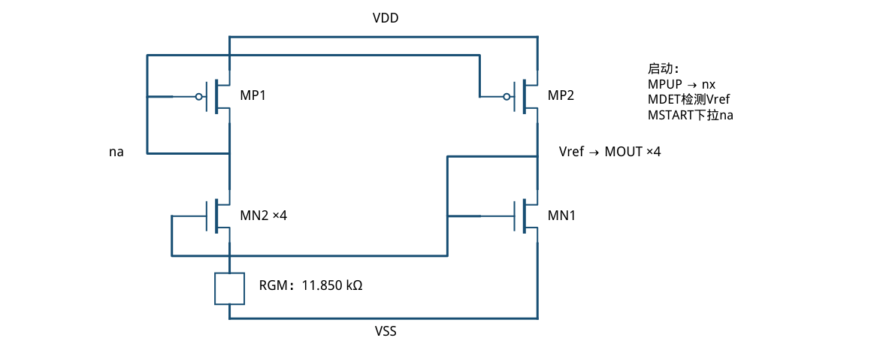
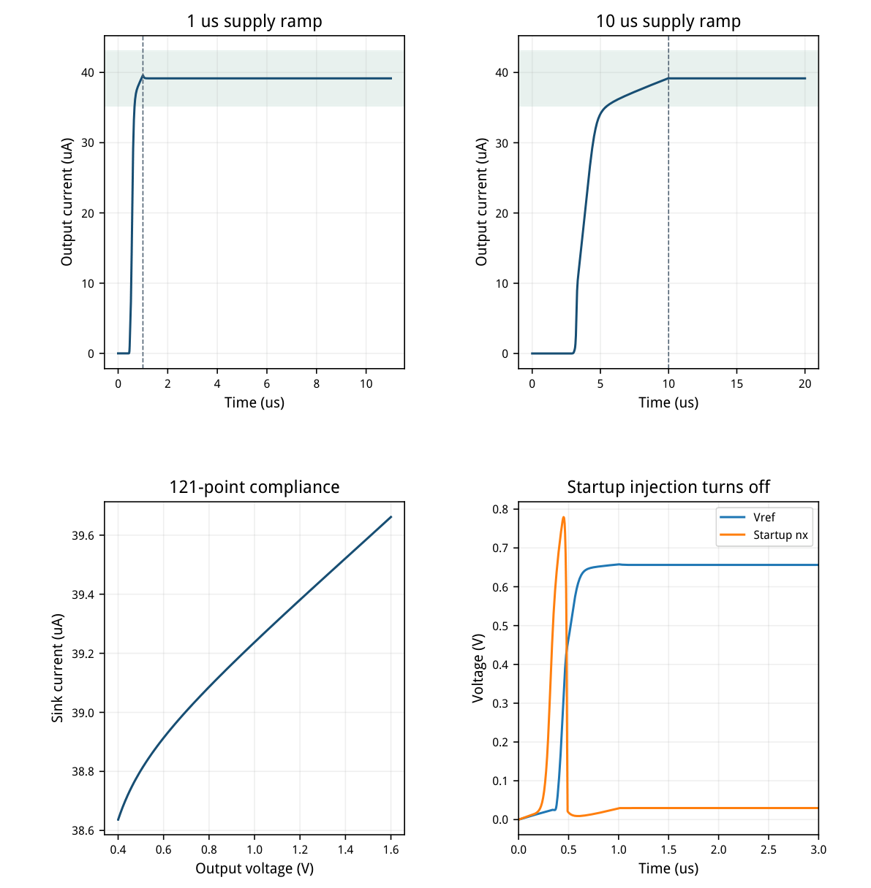
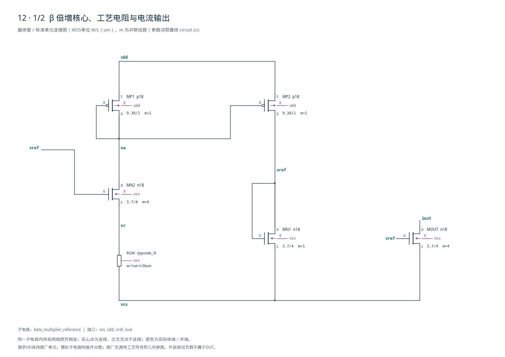
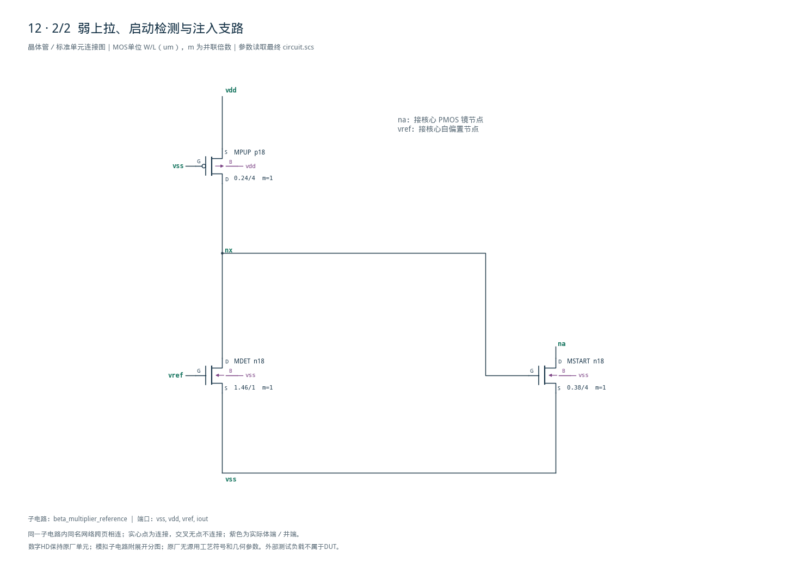

# 12 · β 倍增基准审查报告

[审查 PDF](review.pdf) · [实测结果](latest_results.json) · [验收合同](contract.json) · [最终网表](circuit.scs)

## 验收结果

本模块在没有外部偏置电流时建立内部参考电压与偏置电流，并从零供电启动。相比直接用电阻从电源取电流，β倍增环借助器件尺寸比和电阻形成自偏置，适合生成跨导相关的偏置。芯片中常作为运放、滤波器和振荡器的偏置源；它本身不是精密带隙基准。

结论：原nominal电流、端口功耗、全输出范围和两种冷启动均通过。条件：SMIC18MMRF / tt + res\_tt / 1.8 V / 27°C。无外部偏置；Iout固定0.9 V时，电流39.1631 uA，Vr ef=0.656335 V，含输出端口的总功耗75.533 uW。

| 最坏指标 | 实测 | 原门槛 | 10%边界 | 15%边界 | 单位 |
| --- | --- | --- | --- | --- | --- |
| 电流偏离40uA | 0.8369 | ≤5.000 | ≤5.500 | ≤5.750 | uA |
| Vref偏离0.675V | 0.0187 | ≤0.075 | ≤0.083 | ≤0.086 | V |
| 总电气功耗 | 75.5330 | ≤100.000 | ≤110.000 | ≤115.000 | uW |
| 输出范围pp/mean | 2.6134 | ≤8.000 | ≤8.800 | ≤9.200 | % |
| 启动最终I偏离40uA | 0.8369 | ≤20.000 | ≤22.000 | ≤23.000 | uA |
| 启动Vref偏离0.675V | 0.0187 | ≤0.075 | ≤0.083 | ≤0.086 | V |
| 斜坡结束后建立 | 0.0000 | ≤10.000 | ≤11.000 | ≤11.500 | us |
| 输出电流峰值/最终 | 1.0115 | ≤1.500 | ≤1.650 | ≤1.725 | 倍 |
| 峰值正向VDD电流 | 22.6115 | ≤100.000 | ≤110.000 | ≤115.000 | uA |
| 正向VDD能量 | 0.5571 | ≤1.000 | ≤1.100 | ≤1.150 | nJ |

| 斜坡/us | 最终I/uA | 峰值/最终 | 峰值IVDD/uA | 能量/nJ |
| --- | --- | --- | --- | --- |
| 1 | 39.1631 | 1.0115 | 22.611 | 0.4162 |
| 10 | 39.1631 | 1.0011 | 22.404 | 0.5571 |

建立时间0表示在斜坡结束时已进入并持续留在最终电流±10%窗口，并非电路瞬时启动。输出每5 ns记录，内部最大步长2 ns；初始VDD和Vref均为0。

仅nominal范围；未执行27点PVT矩阵、其他供电/温度启动组合、50次MC、版图或可靠性签核。

## 自偏置环、尺寸与启动支路

目标gm/ID来自目标工艺；L=4 um与窄PMOS的缺失表已补充。

| 角色 | 模型 | L/um | W/um | m | 目标gm/ID |
| --- | --- | --- | --- | --- | --- |
| MN1 / MN2 / MOUT | n18 | 4.0 | 3.70 | 1 / 4 / 4 | 7.000 |
| MP1 / MP2 | p18 | 1.0 | 9.38 | 1 | 10.000 |
| MPUP | p18 | 4.0 | 0.24 | 1 | 1.278 |
| MDET | n18 | 1.0 | 1.46 | 1 | 12.000 |
| MSTART | n18 | 4.0 | 0.38 | 1 | 7.000 |

长沟道NMOS取gm/ID=7、10 uA，预测VGS约0.657 V；实际MN1为9.742 uA、gm/ID=7.021。MN2的源极电阻和4:1尺寸比形成非零自偏置，体效应与PMOS镜的VDS差由实际OP处理。

RGM使用PDK的rpposab\_3t，W=1 um、L=36 um，第三端接VSS；实际11.850 kΩ。采用模型的片阻、蚀刻、温度、电压系数与基底电容，没有用理想R替换原任务的工艺电阻。

MPUP栅接VSS，属于全摆幅强反型弱电流支路；补扫W=0.24 um/L=4 um、VSD=1.8 V表，以gm/ID=1.278选3 uA。实际3.072 uA；不能用普通gm/ID=8点外推这个偏置。



[查看矢量图](markdown_assets/figure-02-01.svg)

## 冷启动与输出电压范围

全部曲线来自最终网表；从0 V自然上电，没有指定非零初始节点。

MDET在Vref上升后把nx压到29.86 mV，MSTART最终电流约3.3 pA；MPUP/MDET仍保留约3.072 uA静态电流。报告的75.53 uW已计入它，不能把“注入关闭”描述成“整个启动支路零功耗”。

输出0.4–1.6 V时Iout为38.637–39.662 uA；以峰峰值/均值计算平坦度2.613%。



[查看矢量图](markdown_assets/figure-03-01.svg)

## 精确电路与复现依据

最终网表、LUT查询、PDK电阻模型和全部运行快照可追溯。

功耗：max(0,−1.8·I(VDD)) + 0.9·Iout。启动能量只按原测试定义积分正向VDD功率，从0到斜坡结束后10 us；最终电流用最后1 us平均。建立时间从斜坡结束起算，要求之后所有样点持续在±10%窗口。

第一版RGM长度38.5 um时输出34.744 uA，原35 uA下限略未达到，但在10%误差放宽内。把长度改为36 um后输出39.163 uA，达到原指标。最终另补全摆幅窄PMOS LUT，使启动支路尺寸依据对应真实工作区。

复现： /home/IC/CodeX/virtuoso-bridge-lite/.venv/bin/python scripts/case12\_beta.py 生成PDF：同一Python运行 scripts/review\_pdf.py 12 补充表：lut\_supplement/tt；每表metadata保存表征运行路径。

DC/compliance：runs/12/20260922T063724631769Z\_dc 1 us启动：runs/12/20260922T063724757608Z\_startup\_1us 10 us启动：runs/12/20260922T063725265886Z\_startup\_10us各run.json包含模型哈希与模型尺寸检查；当前无尺寸越界警告。

原任务：sky130-beta-multiplier-reference-pvt-mc。此报告只证明指定nominal功能，不把自偏置、长沟道或低功耗等结构特征当作跨PVT和失配通过的证据。

## 完整网表与电路图

[Spectre 网表](circuit.scs) · [全部分图 PDF](schematic/sheets.pdf) · [电路总图](schematic/full.svg) · [端子连接](schematic/connectivity.json)

<details>
<summary>展开完整 Spectre 网表</summary>

```spectre
// Self-biased beta multiplier; native SMIC resistor, no external bias.
simulator lang=spectre
subckt beta_multiplier_reference (vss vdd vref iout)
MP1 (na na vdd vdd) p18 w=9.38u l=1u
MP2 (vref na vdd vdd) p18 w=9.38u l=1u
MN1 (vref vref vss vss) n18 w=3.7u l=4u
MN2 (na vref nr vss) n18 w=3.7u l=4u m=4
MOUT (iout vref vss vss) n18 w=3.7u l=4u m=4
RGM (nr vss vss) rpposab_3t w=1u l=36u
MPUP (nx vss vdd vdd) p18 w=0.24u l=4u
MDET (nx vref vss vss) n18 w=1.46u l=1u
MSTART (na nx vss vss) n18 w=0.38u l=4u
ends beta_multiplier_reference
```

</details>





## 报告来源

正文与表格整理自已交付的矢量 PDF，图表单独提取；本文件是后续整理的 Markdown，不是原 PDF 的编译输入。原 PDF、网表及测量数据保持原值。
