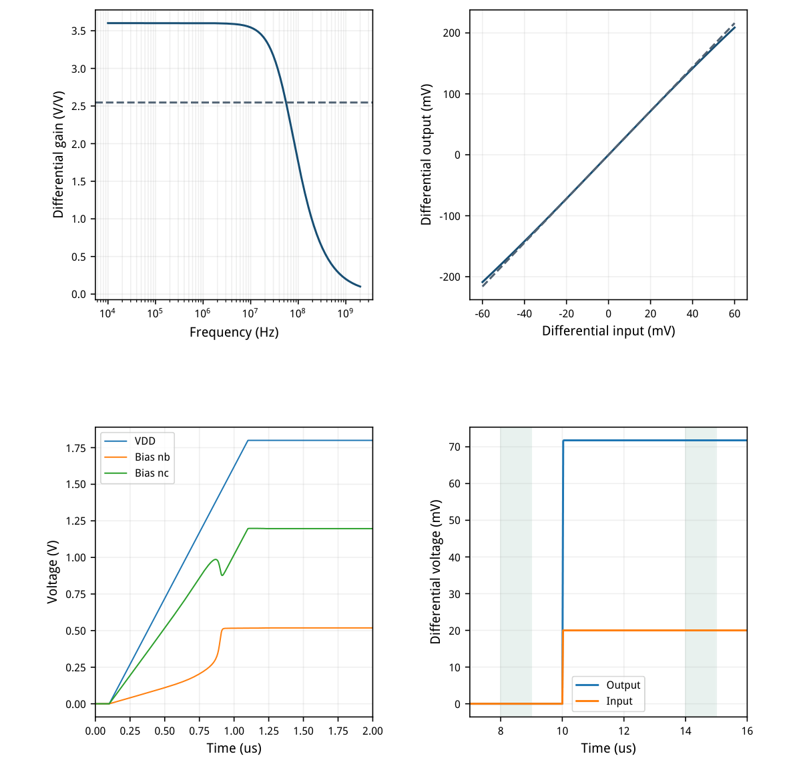
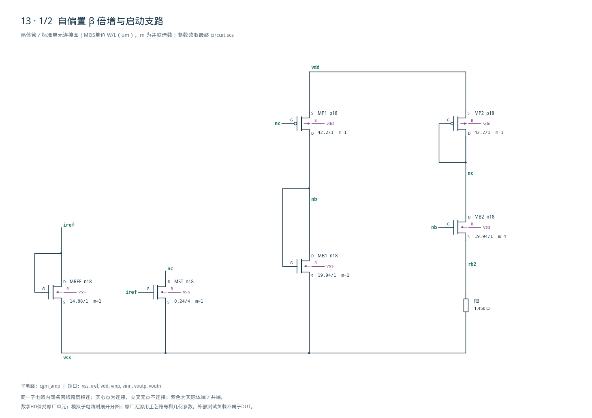
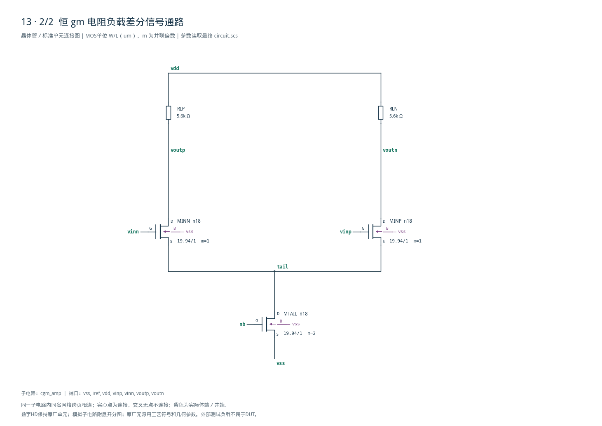

# 13 · 恒跨导增益放大器审查

[审查 PDF](review.pdf) · [实测结果](latest_results.json) · [验收合同](contract.json) · [最终网表](circuit.scs)

## 验收结果

本模块放大差分信号，并用β倍增环使输入跨导与电阻建立联系。相比固定电流偏置的电阻负载差分对，设计目标是降低增益对迁移率等工艺温度变化的敏感度。芯片中可用作模拟前端或连续时间滤波器的稳定增益级；本报告只验证nominal，尚未证明跨PVT增益稳定性。

结论：原nominal增益、带宽、功耗、线性度和零能量冷启动均通过。条件：SMIC18MMRF / tt / 1.8 V / 27°C；IREF=50 uA；输入共模0.95 V；每端负载500 fF。自偏置β倍增环产生输入跨导，电阻负载把差分电流转换为电压。

| 指标 | 实测 | 原门槛 | 10%边界 | 15%边界 | 单位 |
| --- | --- | --- | --- | --- | --- |
| 1MHz差分增益 | 3.60145 | 3.0–4.0 | 2.95–4.05 | 2.925–4.075 | V/V |
| −3dB带宽 | 55.4226 | ≥30 | ≥27 | ≥25.5 | MHz |
| VDD−输出共模 | 259.777 | 150–400 | 137.5–412.5 | 131.25–418.75 | mV |
| 确定性输出不平衡 | 0 | ≤10 | ≤11 | ≤11.5 | mV |
| 总VDD功耗 | 424.366 | ≤500 | ≤550 | ≤575 | uW |
| 最坏增量增益误差 | 3.3834 | ≤8 | ≤8.8 | ≤9.2 | % |

| 冷启动合同 | 实测 | 原门槛 |
| --- | --- | --- |
| 8–9us零输入不平衡 | 5.28e-14 mV | ≤10 mV |
| 14–15us绝对阶跃增益 | 3.58842 V/V | 3.0–4.0 V/V |
| 零输入负载压降 | 259.777 mV | 150–400 mV |
| 阶跃后负载压降 | 259.785 mV | 150–400 mV |
| 全部已存节点初值 | 0 V | 零能量初态 |

增益和共模范围按“固定中心、扩大误差窗口”放宽，未直接乘上下限。冷启动增益是阶跃后的绝对差分输出除20 mV，不能先减去零输入失调来掩盖不平衡。

只完成nominal点；未把单点增益写成27点PVT的max/min≤1.15证明，也未执行统计失配。零不平衡限于对称确定性模型。

## β倍增环、尺寸与实际工作点

同一NMOS单位用于主偏置、尾源和差分对；宽度专属LUT修正启动支路。

| 器件角色 | 模型 | 单位W/L(um) | m | 目标gm/ID |
| --- | --- | --- | --- | --- |
| MB1/MB2/TAIL/IN± | n18 | 19.94/1 | 1 / 4 / 2 / 1 | 14.00 |
| MP1/MP2 | p18 | 42.20/1 | 1 | 10.00 |
| MREF | n18 | 14.88/1 | 1 | 12.00 |
| MST | n18 | 0.24/4 | 1 | 8.56 |

| 实际工作点 | \|I\| / uA | gm/ID | 饱和余量/mV |
| --- | --- | --- | --- |
| MB1 | 46.998 | 13.822 | 394.3 |
| MB2 | 45.612 | 20.145 | 1056.8 |
| MP1 | 46.998 | 9.837 | 1105.1 |
| MP2 | 45.984 | 9.869 | 426.5 |
| MTAIL | 92.777 | 13.820 | 218.0 |
| MINP | 46.388 | 14.038 | 1074.1 |
| MST | 0.372 | 8.591 | 996.1 |

主支47.00 uA、输入46.39 uA/支。输入实际gm=0.6512 mS、gm/ID=14.04，接近目标14；体偏置使其VGS=0.6080 V，高于主管0.5182 V，但单位电流密度仍接近。

启动管W0.24/L4 um：专属LUT预测gm/ID=8.558、I=0.3755 uA；实际8.591、0.3720 uA。它启动后持续导通，已计入功耗。


[查看矢量图](markdown_assets/figure-02-01.svg)

## 频响、线性度与冷启动证据

供电、输入共模和参考电流分别按原题时序上升。

VDD与VCM在0.1–1.1 us从0升至1.8/0.95 V；IREF在1.2–1.22 us从0升至50 uA。差分输入在10–10.02 us从0升至20 mV。skipdc=yes且所有节点初值为0；没有预置非零自偏置节点。

DC扫描−60至+60 mV，每2 mV一点；中心增益由±2 mV差分计算，以±30/±60 mV相对零点的增量增益比较，最坏误差3.3834%。这不是SFDR或随机失配测试。



[查看矢量图](markdown_assets/figure-03-01.svg)

## 精确电路、修正与复现

结构近似、目标工艺LUT和完整测试合同需要同时保留。

RB=1.2 kΩ初版电流偏高：增益4.195、功耗520.1 uW，未满足完整原/放宽合同。保持W/L与RL，仅把RB调到1.45 kΩ，得到增益3.601、功耗424.4 uW，且冷启动与线性度仍通过。

理想平方律与无体效应假设下可估gm≈1/RB；最终实测gm主管×RB≈0.942，不能把RL/RB=3.862直接当成实际增益。中等反型、体效应、镜支路VDS不同以及有限输出电导都使该关系出现偏差。

最初用Wref10 um LUT选启动管gm/ID=12，却在W0.24 um下测得约8.59。补扫同W/L、VDS1.35 V的窄管表，以参考二极管预测栅压选点后得到8.558；最终尺寸不变，但依据已与实际几何一致。

复现：/home/IC/CodeX/virtuoso-bridge-lite/.venv/bin/python  scripts/case13\_constant\_gm.py PDF：同一Python运行 scripts/review\_pdf.py 13

AC/DC：runs/13/20260922T072020462547Z\_static冷启动：runs/13/20260922T072020597713Z\_startup

原任务：sky130-constant-gm-stable-gain-amplifier-pvt。 只声明nominal实测；PVT增益稳定性和随机失配仍未验证。

## 完整网表与电路图

[Spectre 网表](circuit.scs) · [全部分图 PDF](schematic/sheets.pdf) · [电路总图](schematic/full.svg) · [端子连接](schematic/connectivity.json)

<details>
<summary>展开完整 Spectre 网表</summary>

```spectre
// Self-biased beta multiplier, density-matched input pair and resistor loads.
simulator lang=spectre
subckt cgm_amp (vss iref vdd vinp vinn voutp voutn)
MREF (iref iref vss vss) n18 w=14.88u l=1u
MST (nc iref vss vss) n18 w=0.24u l=4u
MB1 (nb nb vss vss) n18 w=19.94u l=1u
MB2 (nc nb rb2 vss) n18 w=19.94u l=1u m=4
RB (rb2 vss) resistor r=1450
MP1 (nb nc vdd vdd) p18 w=42.2u l=1u
MP2 (nc nc vdd vdd) p18 w=42.2u l=1u
MTAIL (tail nb vss vss) n18 w=19.94u l=1u m=2
MINP (voutn vinp tail vss) n18 w=19.94u l=1u
MINN (voutp vinn tail vss) n18 w=19.94u l=1u
RLP (vdd voutp) resistor r=5600
RLN (vdd voutn) resistor r=5600
ends cgm_amp
```

</details>





## 报告来源

正文与表格整理自已交付的矢量 PDF，图表单独提取；本文件是后续整理的 Markdown，不是原 PDF 的编译输入。原 PDF、网表及测量数据保持原值。
