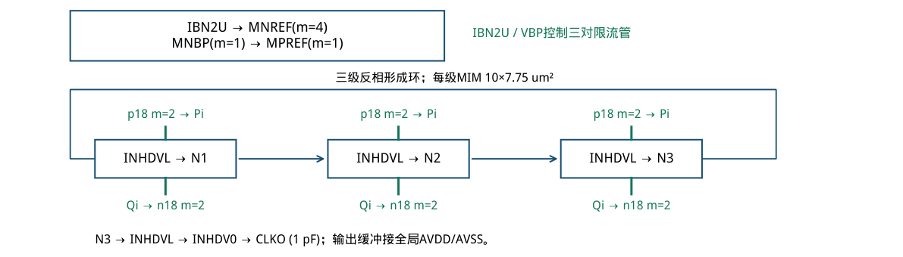
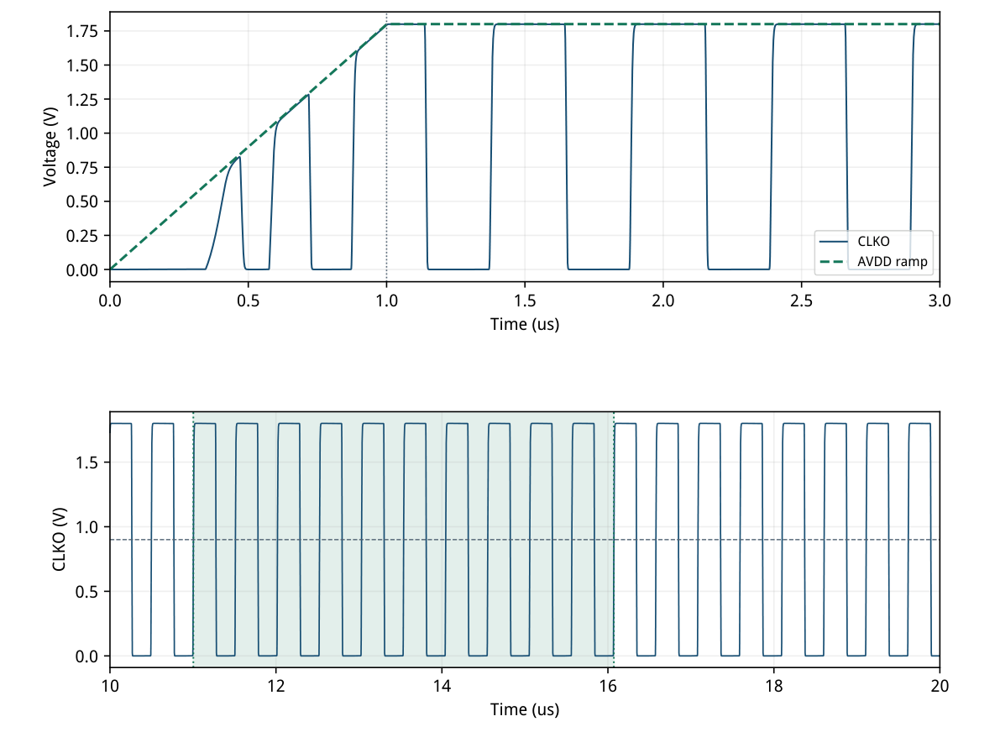
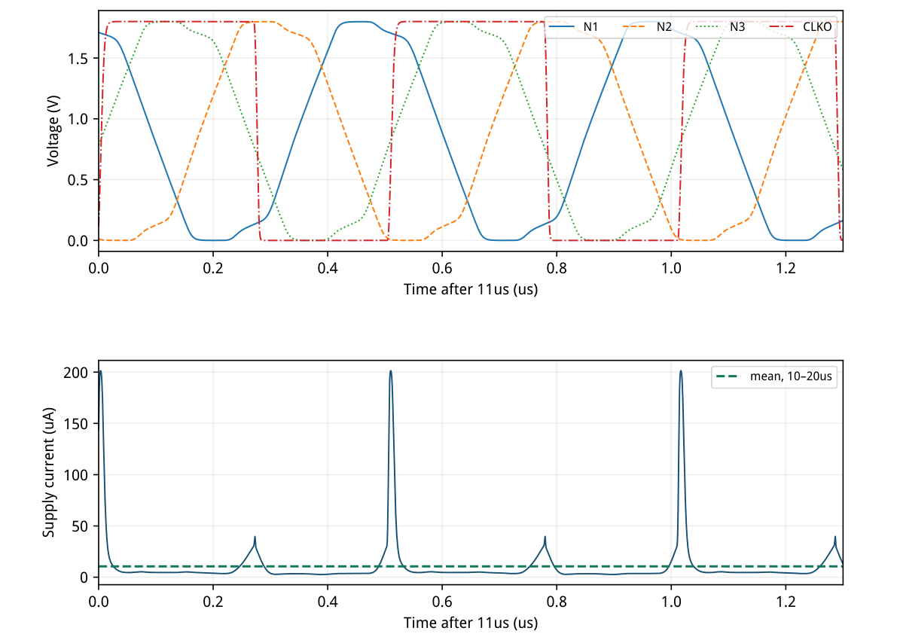
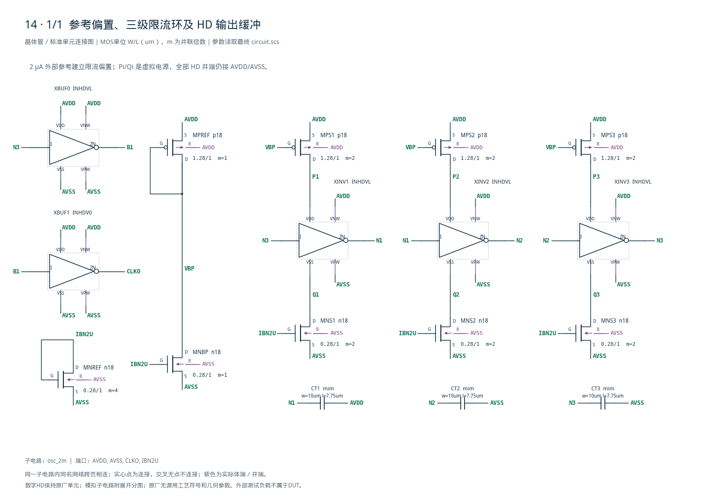

# 14 · 低功耗 2 MHz 振荡器审查

[审查 PDF](review.pdf) · [实测结果](latest_results.json) · [验收合同](contract.json) · [最终网表](circuit.scs)

## 验收结果

本模块利用外部微小偏置电流产生约2 MHz的内部时钟，并驱动后续数字电路。相比直接供电的高速反相器环，电流限制配合定时电容可降低振荡频率和功耗，代价是精度仍受器件与供电条件影响。芯片中常用于低功耗控制、待机管理和粗略时基；它不替代需要高精度频率基准的晶振。

结论：原nominal频率、输出摆幅、完整总功耗全部通过，未使用放宽。

条件：SMIC18MMRF tt / mim\_tt、1.8 V、27°C；VDD从0 V线性升至1.8 V，斜坡1 us；外部2 uA从测量后的AVDD流入IBN2U；CLKO负载1 pF。

| 指标 | 实测 | 原门槛 | 10%边界 | 15%边界 |
| --- | --- | --- | --- | --- |
| 频率/MHz | 1.97357005 | 1.8–2.2 | 1.78–2.22 | 1.77–2.23 |
| 摆幅/VDD | 1.000057741 | 0.95–1.05 | 0.945–1.055 | 0.9425–1.0575 |
| 总功耗/uW | 19.0392051 | ≤20 | ≤22 | ≤23 |

频率中心固定2 MHz，放宽只把±0.2 MHz窗口扩至±0.22/0.23 MHz；摆幅中心固定1×VDD，允许偏差由±0.05扩至±0.055/0.0575。起振、有限数据及完整测量窗口不放宽。

| 冻结的nominal维度 | 实施方式 |
| --- | --- |
| 瞬态总长 | 20 us，普通DC初始化，无强制IC或额外kick |
| 测量区间 | 10–20 us，端点插值并按实际时间积分 |
| 频率定义 | 半供电0.9 V，第2上升沿至第12上升沿共10周期 |
| 摆幅定义 | 10–20 us中max(CLKO)−min(CLKO) |
| 功耗定义 | 1.8 V×abs(mean I(VSENSE))，包含2 uA和负载驱动 |

19个上升沿落在稳态窗口，合同10周期终点为16.071854 us，早于20 us；信号覆盖完整高低电平。三项原门槛对应频率上下界、摆幅上下界和总功耗，共五个数值不等式。

原任务披露5个代表PVT点。本次只复现TT/1.8 V/27°C；其余4点、其他斜坡与负载、相噪、抖动、统计失配及PEX均未执行，不据此声称跨PVT频率精度。

DUT只含工艺MOS、原厂HD反相器和原厂MIM电容。理想电源、外部2 uA和1 pF仅出现在bench层，全部落在可追溯的输入快照内。

## 限流环、原厂 HD 与 gm/ID 尺寸

外部2 uA以4:1参考比例产生约0.5 uA转接电流，各限流支路再取2倍单位。

| 单位模型 | W/L (um) | gm/ID | ID/W(uA/um) | \|VGS\|表点/V | gm·ro |
| --- | --- | --- | --- | --- | --- |
| n18 | 0.28/1.00 | 15 | 1.8449 | 0.5018 | 214.97 |
| p18 | 1.28/1.00 | 15 | 0.3905 | 0.5196 | 337.98 |

LUT点：TT/27°C、L=1 um、|VDS|=0.45 V、VBS=0、参考W=10 um。 单位电流0.5 uA，精确Wn/Wp=0.271015/1.280503 um，按20 nm网格取0.28/1.28 um。

| 实际偏置管 | \|平均ID\|/uA | 实际gm/ID | 最小\|VDS\|−\|VDSAT\|/V |
| --- | --- | --- | --- |
| MNREF | 2.000006 | 14.5348 | 0.34192 |
| MNBP | 0.521884 | 14.4193 | 1.15983 |
| MPREF | 0.521827 | 14.6917 | 0.40372 |

实际值来自10–20 us时间加权平均；三只偏置管饱和余量均为正。窄器件和实际VDS使VGS偏离参考W=10 um的表值，因此LUT给初值，实际工作点作最终核查。

INHDVL内部Wn/Wp=0.28/0.42 um，INHDV0=0.60/0.90 um，L均0.18 um。环内VDD/VSS接Pi/Qi，VNW/VPW接全局AVDD/AVSS；原厂内部模型与尺寸均未修改。

三只MIM每只标称约75.2525 fF，总几何面积232.5 um²，未计布局边界。CT1接N1–AVDD；CT2/3接N2/3–AVSS，为电源斜坡提供实体非对称耦合。



[查看矢量图](markdown_assets/figure-02-01.svg)

## 电源斜坡起振与十周期测频

固定原任务启动激励，全部门槛仍仅使用10–20 us保存区间。

首次向上越过固定0.9 V为0.593553 us，发生于供电斜坡内部。这只是启动诊断，不作为额外起振时限。全程没有强制初值、噪声种子或隐藏脉冲源。

合同选择第2/12个上升沿：t2=11.004894711 us，t12=16.071854463 us，十周期=5.066959752 us，f=10/(t12−t2)=1.973570048 MHz。全部11个选中边沿均在规定区间。

窗口内所有18个完整周期平均得到1.973570015 MHz，与合同值相对差1.687849e-06%。这项交叉核验确认测频一致，确定性周期差不解释为物理抖动。



[查看矢量图](markdown_assets/figure-03-01.svg)

## 真实环内波形与完整功耗

1 pF负载、两级输出缓冲及外部2 uA都由VSENSE上游统一供电。

| 功耗口径 | 数值 | 说明 |
| --- | --- | --- |
| 实测平均供电电流 | 10.57733617 uA | VSENSE:p时间积分/10 us |
| 实测总供电功耗 | 19.03920510 uW | 包含偏置、核心与完整输出驱动 |
| 其中外部2 uA偏置 | 3.60000000 uW | 2 uA从测量后的AVDD引出 |
| 理想CL动态功耗估算 | 6.39436696 uW | CL·VDD²·f，仅用于预算说明 |

功耗门槛采用固定10–20 us区间，不能删去外部参考或改用环核心电流。负载估算不是额外实测分量，也不再加到已包含它的总功耗中。

第1级虚拟上轨0.8543–1.8002 V，下轨−0.00007–1.0444 V。限流管随充放电靠近轨端而退出饱和属于机制；HD阱仍接全局轨，微小瞬态越轨来自寄生耦合。



[查看矢量图](markdown_assets/figure-04-01.svg)

## 迭代、精度核验与保留的失败证据

所有三轮均保留实际输入、日志、PSF和测量结果；第三轮达到原门槛。

| 轮次 | 每只MIM/um² | 转接目标/uA | 频率/MHz | 总功耗/uW | 结论 |
| --- | --- | --- | --- | --- | --- |
| 1 | 90.00 | 1.00 | 1.6968732 | 19.310878 | 频率失败 |
| 2 | 81.50 | 1.00 | 1.8687452 | 20.072710 | 10%功耗放宽 |
| 3 | 77.50 | 0.50 | 1.9735700 | 19.039205 | 原门槛全过 |

第1轮90 um²电容带来1.697 MHz，频率不足。第2轮缩至81.5 um²后频率进入窗口，但功耗20.0727 uW高于原20 uW上限。不能只据频率通过判定本题完成。

第3轮采用0.5 uA LUT单位，MNREF用4个单位接收2 uA，转接镜只用1个单位，每级限流取2个单位；降低转接支路开销并把MIM缩至77.5 um²。最终频率1.97357 MHz，功耗19.0392 uW。

一阶估计f≈I/(3·C·VDD)=2.46085 MHz只用于初值；实际HD内部电容、非理想镜像、波形阈值和缓冲负载增加周期。没有把一阶估计代替晶体管仿真。

| 验证项目 | 证据 |
| --- | --- |
| Spectre容差 | reltol=2e-5，vabstol=1e-8 V，iabstol=1e-14 A |
| 瞬态步长 | maxstep=300 ps，errpreset=conservative；约1690步/周期 |
| PSF检查 | 实际保存波形；采样点有限，时间严格递增，覆盖20 us |
| 测量复核 | 端点插值、真实时间积分；全18周期平均与10周期一致 |
| 求解/模型检查 | 最终运行无警告；无CMI-2441模型尺寸越界 |

历史Sky130报告仅提供跨5个PVT点的频率极值和nominal功耗18.9772 uW，不能把极值当作本轮nominal频率。此次19.0392 uW来自SMIC18实际测量。

尚未验证非nominal PVT、器件匹配、版图寄生、频率噪声或外部2 uA的真实发生器；片上使用仍需单独设计和计入该偏置源。

## 完整电路、可复现输入与证据边界

接口固定为osc\_2m AVDD AVSS CLKO IBN2U；所有HD定义include位于bench层。

DUT：9只模拟MOS实例、5个原厂HD反相器、3只原厂MIM。n18/p18所有单元W≤1.28 um，远小于100 um模型上限；整数m保留同一LUT单位。

运行：/home/IC/CodeX/virtuoso-bridge-lite/.venv/bin/python  scripts/case14\_oscillator.py PDF：同一Python执行 scripts/review\_pdf.py 14

最终运行：runs/14/20260922T093117787976Z\_ramp目录内inputs/bench.scs与各DUT/HD/合同快照、run.json、output/bench.raw以及measurements.json共同构成证据链。前两轮也保留于runs/14。

原instruction、正式verifier、bench、reference电路和结果冻结于cases/14-oscillator/source/。LUT、PDK、HD来源及哈希随文件保留；未修改既有工艺、Bridge或LUT环境。

电路SHA256：383ec5c083dff63dfe2d4529615c33f22d541e3bf14d2c927e3655b98488c1a6

## 完整网表与电路图

[Spectre 网表](circuit.scs) · [全部分图 PDF](schematic/sheets.pdf) · [电路总图](schematic/full.svg) · [端子连接](schematic/connectivity.json)

<details>
<summary>展开完整 Spectre 网表</summary>

```spectre
// 2MHz coarse oscillator; all digital stages are unmodified HD cells.
simulator lang=spectre
subckt osc_2m (AVDD AVSS CLKO IBN2U)
MNREF (IBN2U IBN2U AVSS AVSS) n18 w=0.28u l=1u m=4
MNBP (VBP IBN2U AVSS AVSS) n18 w=0.28u l=1u
MPREF (VBP VBP AVDD AVDD) p18 w=1.28u l=1u
MPS1 (P1 VBP AVDD AVDD) p18 w=1.28u l=1u m=2
XINV1 (N3 N1 P1 Q1 AVDD AVSS) INHDVL
MNS1 (Q1 IBN2U AVSS AVSS) n18 w=0.28u l=1u m=2
CT1 (N1 AVDD) mim w=10u l=7.75u
MPS2 (P2 VBP AVDD AVDD) p18 w=1.28u l=1u m=2
XINV2 (N1 N2 P2 Q2 AVDD AVSS) INHDVL
MNS2 (Q2 IBN2U AVSS AVSS) n18 w=0.28u l=1u m=2
CT2 (N2 AVSS) mim w=10u l=7.75u
MPS3 (P3 VBP AVDD AVDD) p18 w=1.28u l=1u m=2
XINV3 (N2 N3 P3 Q3 AVDD AVSS) INHDVL
MNS3 (Q3 IBN2U AVSS AVSS) n18 w=0.28u l=1u m=2
CT3 (N3 AVSS) mim w=10u l=7.75u
XBUF0 (N3 B1 AVDD AVSS AVDD AVSS) INHDVL
XBUF1 (B1 CLKO AVDD AVSS AVDD AVSS) INHDV0
ends osc_2m
```

</details>



## 报告来源

正文与表格整理自已交付的矢量 PDF，图表单独提取；本文件是后续整理的 Markdown，不是原 PDF 的编译输入。原 PDF、网表及测量数据保持原值。
