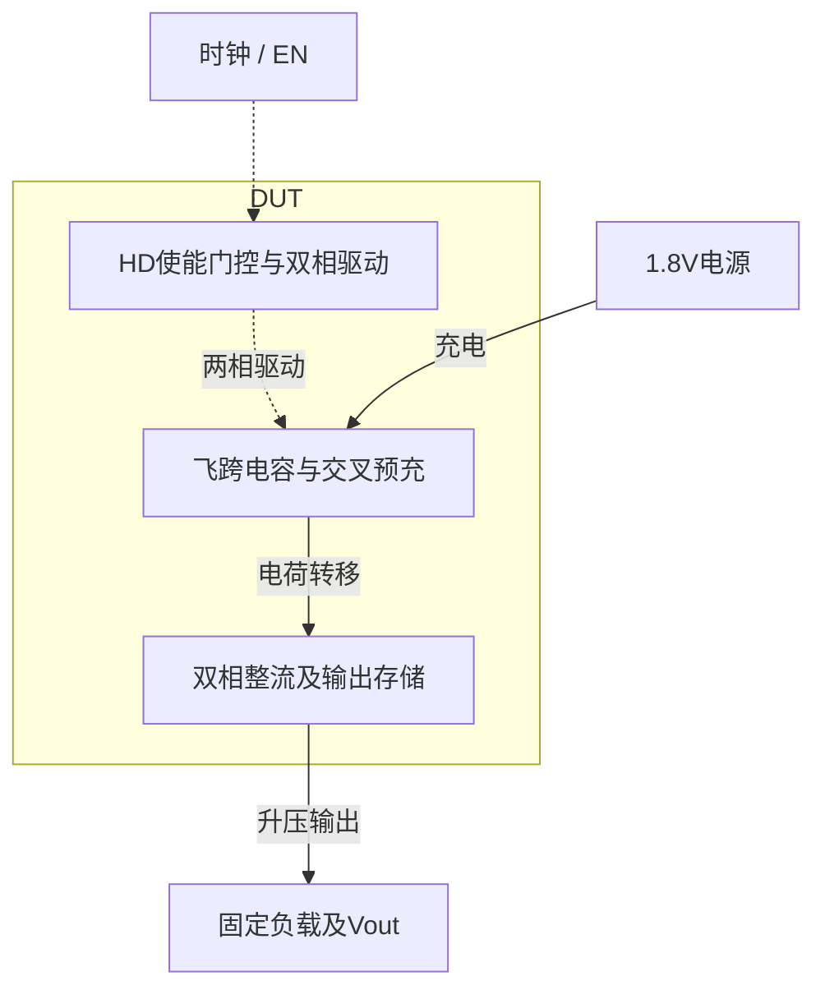
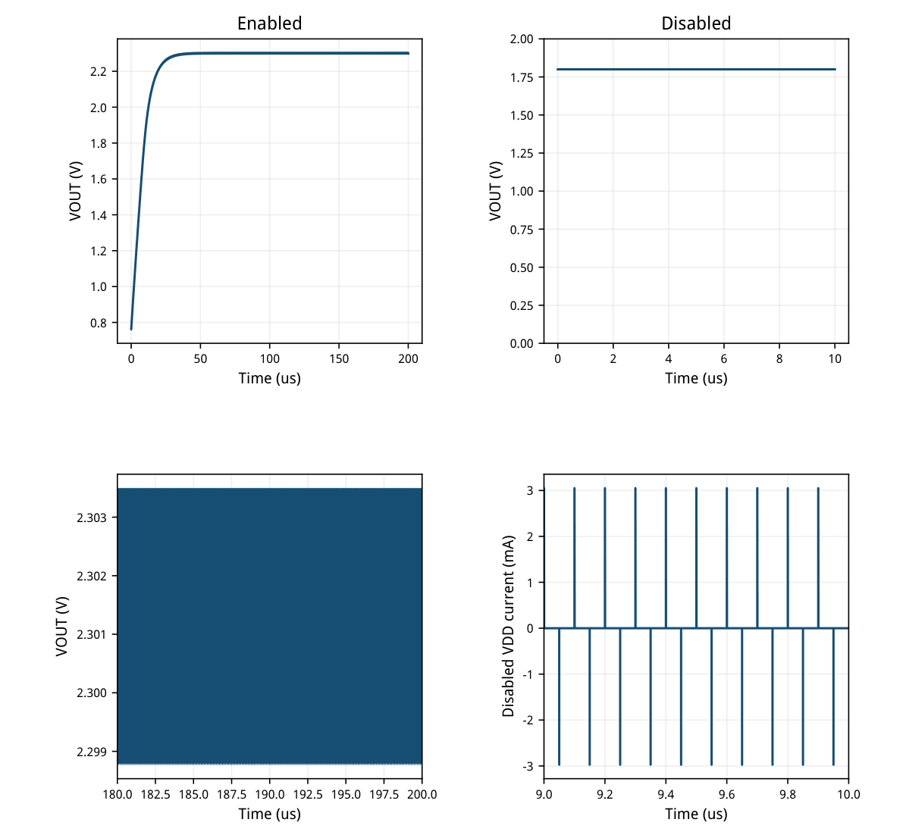
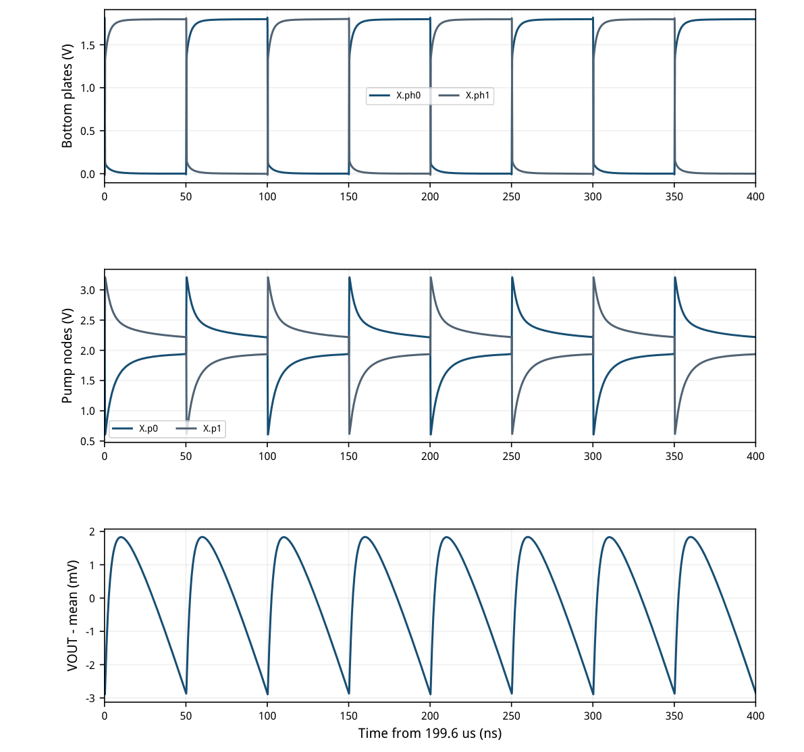
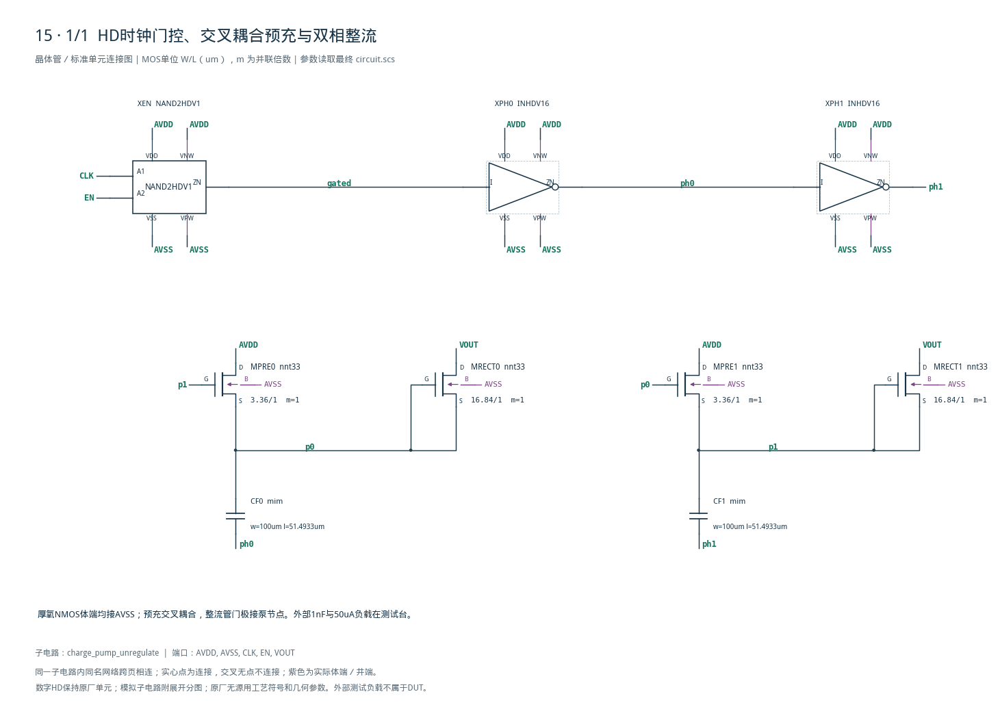

# 15 · 未稳压倍压电荷泵审查

[审查 PDF](review.pdf) · [实测结果](latest_results.json) · [验收合同](contract.json) · [最终网表](circuit.scs)

## 验收结果

本模块利用两相时钟搬运飞跨电容的电荷，从1.8V电源产生更高的直流输出，并通过使能门控停止泵送。交叉耦合预充与双相整流可减少单相泵的输出间歇，结构简单且无需电感；代价是整流压降、电容面积，以及输出随工艺和负载变化。它适合小电流偏置和辅助栅驱动供电，未稳压结构本身不能提供精密恒定输出。

结论：10%放宽范围内完成，原门槛差异见下表。

SMIC18MMRF TT / 1.8V / 40°C；10MHz输入、1ps边沿、时钟及EN各50Ω源阻抗。开启输出带1nF和50uA；关闭台仅带1nF，EN自零时刻拉低，外部时钟仍运行。

| 指标 | 实测 | 原门槛 | 10%边界 | 15%边界 | 单位 |
| --- | --- | --- | --- | --- | --- |
| 输出距2.5V误差 | 0.198339 | ≤0.3 | ≤0.33 | ≤0.345 | V |
| 输出纹波 | 4.72734 | ≤5 | ≤5.5 | ≤5.75 | mVpp |
| 开启平均电流 | 206.142 | ≤200 | ≤220 | ≤230 | uA |
| 关闭平均电流 | 0.770041 | ≤100 | ≤110 | ≤115 | nA |

输出平均2.301660961V，最小/最大2.298769820/2.303497157V。原窗口2.2–2.8V；以中心2.5V扩大误差，10%为2.17–2.83V，15%为2.155–2.845V。

开启仿真到200us，全部指标取190–200us；独立关闭仿真到10us，平均电流取9–10us。电流是供电感测源的时间平均再取绝对值，不是电流绝对值的平均。两种工作状态不共享电源感测支路。

只复现原八个代表点中的TT/40°C。未完成其余七点、完整PVT或失配；本题没有效率指标，也没有验证已充电状态下拉低EN的放电轨迹。

<!-- SYSTEM-BLOCK-DIAGRAM -->
## 系统框图

电路没有稳压反馈；独立关闭电流沿用使能端口测试。

实线表示信号或能量通路，虚线表示时钟、控制或偏置。DUT框外为外部端口或测试夹具；精确端子连接见后附基本电路图。



[独立Mermaid源文件](system_block_diagram.mmd) · [框图SVG](markdown_assets/system-block.svg)
<!-- END-SYSTEM-BLOCK-DIAGRAM -->

## 器件选择、gm/ID与两相电荷搬运

厚氧低阈值传输管、工艺MIM和未修改的HD数字单元。

NAND用EN门控外部时钟，串联两级反相器生成ph0/ph1。两块MIM电容交替抬升p0/p1；另一泵节点驱动预充MOS，把低相节点预充到接近AVDD。两只门极接泵节点的整流MOS把高相电荷送到VOUT。

| 角色 | 器件/几何 | 选点/用途 |
| --- | --- | --- |
| 两只整流MOS | nnt33 W16.84/L1um | gm/ID=6，初算250uA |
| 两只预充MOS | nnt33 W3.36/L1um | gm/ID=6，初算50uA |
| CF0/CF1 | mim，100um×51.4933um | 各名义5pF |
| 使能逻辑 | NAND2HDV1 | 原厂CDL尺寸与井端 |
| 两相驱动 | INHDV16×2 | 原厂CDL尺寸与井端 |

新表征在已有Spectre环境内完成，仅写入本工程lut\_supplement。选点TT/27°C、VDS1.8V、VSB0V；预测VGS=0.036378V、fT=4.818GHz。最终电路按原合同40°C运行，实际泵节点体效应和双向导通不能由这一个LUT工作点代替。

nnt33的零体偏置低阈值使正VGS表的gm/ID最高约6.96。曾请求gm/ID=8，被查表器明确拒绝；最终选择表内gm/ID=6，没有钳位、外推或把n18表冒充厚氧表。

两块MIM名义总板面积10298.7um²，模型包含电压和温度系数。外部1nF电容不计入片上MIM面积；本次未做布局、DRC或寄生提取。

DUT没有理想R/C、内部源或行为器件。NAND与反相器内部8只MOS保持原厂HD尺寸，四只模拟MOS按目标工艺gm/ID重新设计。

## 开启建立过程与独立关闭状态

沿原台采用DC初始解；未把它解释为任意电源斜坡下的冷启动保证。

最终单周期均值2.301660966V，190–200us均值2.301660961V。固定50uA负载一直存在；最后窗口计算真实上下峰值，没有用尾段平均减去漂移来缩小纹波。

关闭台自开始EN=0，输出约1.8V，仍有正负供电电流尖峰；原指标取9–10us带符号电流的时间平均，不要求输出归零，也不测试已开启状态关闭后的泄放。



[查看矢量图](markdown_assets/figure-03-01.svg)

## 最后四周期的泵送与输出纹波

10MHz原始时钟继续运行；曲线均来自最终实际瞬态数据。

电荷转移由MOS实际阈值、体效应、导通电阻、底板时序和MIM容值共同决定。两级HD反相器并非理想互补源，交叠与有限边沿会增加回流和动态损耗；不能由2×VDD直接预测带载输出。

输出纹波包含开关耦合尖峰。最终190–200us保留全部自适应样点，不用稀疏等间隔输出遗漏尖峰。



[查看矢量图](markdown_assets/figure-04-01.svg)

## 供电积分、数值复核与端电压

原台时间窗不变；收敛对照采用同一电路和完整200us运行。

| 指标（SI单位） | 1ns / 1e-5 | 0.5ns / 1e-6 | 绝对差 |
| --- | --- | --- | --- |
| vout_en_avg | 2.301675 | 2.301661 | 1.407e-05 |
| ripple_V | 0.0047288194 | 0.004727337 | 1.482e-06 |
| enabled_current_A | 0.0002060018 | 0.00020614185 | 1.401e-07 |
| disabled_current_A | 7.8456306e-10 | 7.7004128e-10 | 1.452e-11 |

初版1ps时钟边沿附近出现SPECTRE-16780：局部截断误差容差暂时放宽。相关日志完整保留；通过减小最大步长、收紧相对容差的独立运行比较最终输出、纹波及两种平均电流，不凭“0错误”自动忽略警告。

| 器件 | \|VGS\| | \|VGD\| | \|VDS\| | \|VGB\| | \|VDB\| | \|VSB\| |
| --- | --- | --- | --- | --- | --- | --- |
| MPRE0 | 2.6561 | 2.4111 | 2.5469 | 3.2088 | 1.8000 | 3.2088 |
| MPRE1 | 2.6561 | 2.5469 | 2.4111 | 3.2088 | 1.8000 | 3.2088 |
| MRECT0 | 0.0000 | 1.6928 | 1.6928 | 3.2088 | 2.3035 | 3.2088 |
| MRECT1 | 0.0000 | 1.6823 | 1.6823 | 3.2088 | 2.3035 | 3.2088 |

上表按网表端名计算；MRECT的有效源漏在整流导通时交换，VGS=0不代表未导通。厚氧器件使用固定3.63V工程筛查线，性能放宽不改变它；这只是1.1×标称电压的工程筛查，不是工厂寿命、结击穿或可靠性签核。核心HD数字管保持原厂1.8V供电。

0–2us及180–200us保存全部自适应样点；2–180us仅输出每100点之一以限制文件大小，求解器仍完整计算所有步。开启测量窗完全未抽点，关闭轨迹也未抽点；中段稀疏轨迹不用于宣称每次瞬态端压的严格上界。

## 迁移失败与最终取舍

目标工艺的阈值、体效应和电荷回流需要重新验证。

| 预充→整流 / 电容 / 钳位 | VOUT/V | 纹波/mV | 开启/uA |
| --- | --- | --- | --- |
| n33→n33 /10pF /gm8 | 2.06235 | 0.9170 | 106.464 |
| n33→n33 /10pF /gm14 | 2.08827 | 1.1907 | 114.555 |
| nnt33→nnt33 /10pF /gm6 | 2.61424 | 5.3203 | 290.002 |
| nnt33→nnt33 /5pF /gm6 | 2.06216 | 5.6786 | 232.721 |
| * n33→nnt33 /10pF /gm6 | 3.06161 | 3.7656 | 212.007 |
| * n33→nnt33 /5pF /gm6 | 2.93018 | 4.3373 | 189.247 |
| * n33→nnt33 /3pF +CL | 2.25340 | 39.3483 | 165.491 |
| * n33→nnt33 /5pF +CL | 2.83910 | 4.2151 | 196.480 |
| nnt33→nnt33 /10pF /gm6 PRE50u | 2.83088 | 4.1409 | 233.642 |
| 最终电路 | 2.30166 | 4.7273 | 206.142 |

带\*的混合管版本触发体结模型线性化，仅作故障诊断。常规n33从17.04um加宽到70.92um，输出只由2.06235升至2.08827V，仍低于15%边界。宽度增大减少部分导通压降，同时增加被泵节点和时钟驱动的寄生；不能靠无限加宽消除体效应阈值损失。

低阈值nnt33在gm/ID=6、16.84/1um下将10pF版输出提高到2.61424V，但开启电流290.002uA、纹波5.320mV，仍未合格。低阈值并不自动等于更低总电流；切换期间回流和耦合必须一起测量。

混合n33预充/nnt33整流版及钳位版出现启动体结CMI-2139/2144警告，且有端压越界或200us尚未稳定，未用于交付。最终返回全nnt33，用较窄预充管降低回流，并调整飞跨电容。未稳压泵在指定负载上的输出是电荷平衡结果；本项没有将负载减小、外部电容增大或时钟降频来制造通过。

## 精确DUT网表与HD来源

顶层端口顺序AVDD AVSS CLK EN VOUT；供电与井端全部明确。

三个HD实例共8只原厂MOS；四只模拟MOS和两块工艺MIM共同构成9个顶层实例、39个端子。后附完整图纸绘出全部模拟器件、HD信号/供电/井端。HD内部CDL完整副本和源块哈希随证据归档。

NAND2HDV1的端口为A1 A2 ZN VDD VSS VNW VPW；INHDV16为I ZN VDD VSS VNW VPW。VNW接AVDD、VPW接AVSS。未改写原厂晶体管宽长、并联倍数或模型名。

完整总图：cases/15-unregulated-pump/schematic/full.pdf 独立连接核对：schematic\_independent\_review.json 原厂单元与哈希：hd\_cells.scs / hd\_cells\_manifest.json

DUT SHA-256：e04ccef10f5421ebe9f379e9baa59e99fd238fb5b7db73ba28bf47e11f07b0de

## 原始验收复核与可重复证据

原题四项nominal判据与五个原始测量量独立重算。

独立逐段梯形积分、边界插值和极值检查，重算VOUT平均/最大/最小及两种感测电流。把这些原始测量量传给未修改的上游checks(rows,{TT40C})，保留其绝对平均电流和完整集合检查。未把TT单点冒称八点PVT完成。

模型、LUT、原题、HD源文件和最终两组输入快照均记录SHA-256。数值收敛对照与失败迭代保留各自不可覆盖的原始运行；Bridge若报license error，依据实际许可检查、0错误结束和PSF完整性区别字符串误报。

复现（工程根目录，既有virtuoso-bridge-lite/.venv）： python scripts/case15\_pump.py python scripts/confirm15.py python scripts/schematic15.py python scripts/audit15.py python scripts/review15.py 重新生成PDF后须逐页目检；交付状态不会自动继承。

最终运行：runs/15/20260926T041705233014Z\_enabled runs/15/20260926T041846193656Z\_disabled收敛基线及参数：numerical\_confirmation.json

保留范围：原10MHz/1ps/50Ω控制输入、50uA开启负载、1nF外部电容、开启200us及关闭10us、各自原平均窗口。没有对外部夹具或工艺模型进行性能优化。

未覆盖另外七个代表点、完整PVT、失配、效率、已充电后的关断泄放、版图及PEX。PDK与既有Bridge/Spectre/LUT环境未改。

## 完整网表与电路图

[Spectre 网表](circuit.scs) · [全部分图 PDF](schematic/sheets.pdf) · [电路总图](schematic/full.svg) · [端子连接](schematic/connectivity.json)

<details>
<summary>展开完整 Spectre 网表</summary>

```spectre
// Native thick-oxide charge transfer and unmodified HD clock logic.
simulator lang=spectre
subckt charge_pump_unregulate (AVDD AVSS CLK EN VOUT)
XEN (CLK EN gated AVDD AVSS AVDD AVSS) NAND2HDV1
XPH0 (gated ph0 AVDD AVSS AVDD AVSS) INHDV16
XPH1 (ph0 ph1 AVDD AVSS AVDD AVSS) INHDV16
CF0 (p0 ph0) mim w=100u l=51.49330587u
CF1 (p1 ph1) mim w=100u l=51.49330587u
MPRE0 (AVDD p1 p0 AVSS) nnt33 w=3.36u l=1u
MPRE1 (AVDD p0 p1 AVSS) nnt33 w=3.36u l=1u
MRECT0 (VOUT p0 p0 AVSS) nnt33 w=16.84u l=1u
MRECT1 (VOUT p1 p1 AVSS) nnt33 w=16.84u l=1u
ends charge_pump_unregulate
```

</details>



## 报告来源

正文与表格整理自已交付的矢量 PDF，图表单独提取；本文件是后续整理的 Markdown，不是原 PDF 的编译输入。原 PDF、网表及测量数据保持原值。
