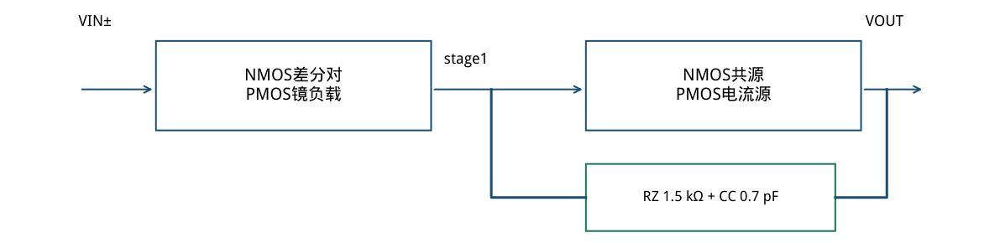
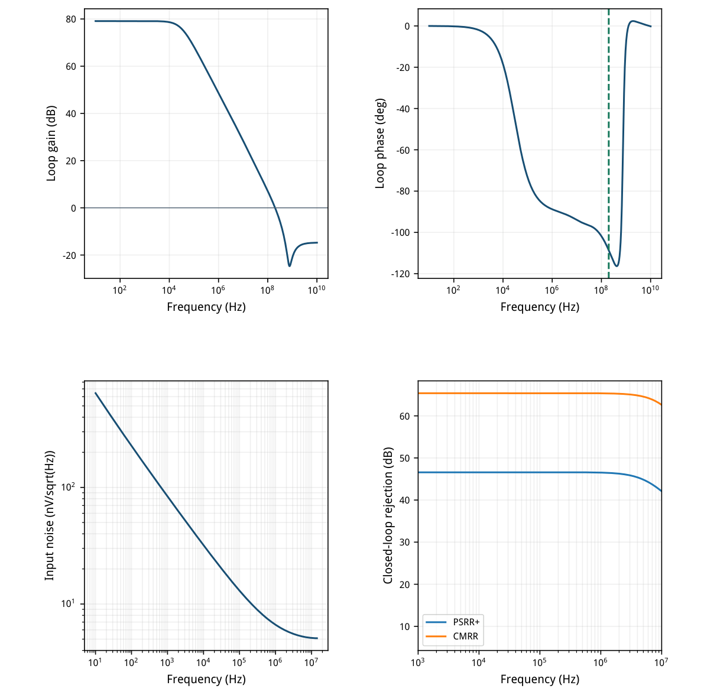
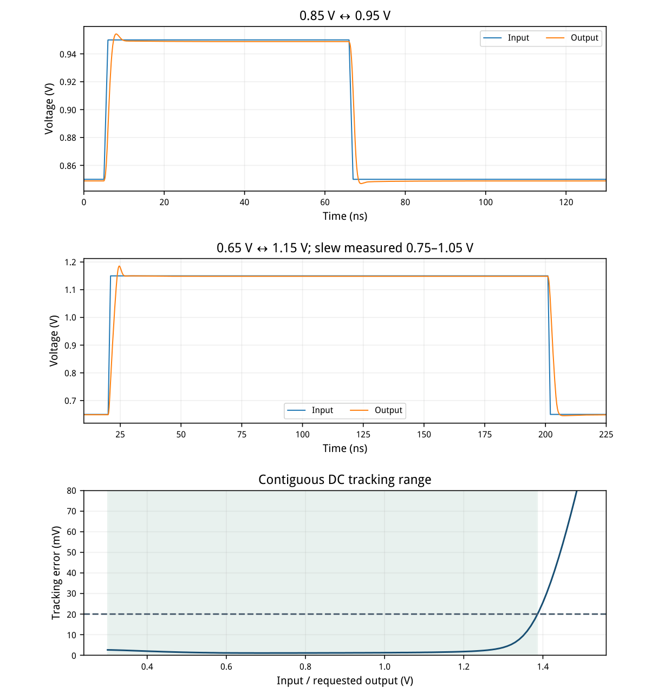
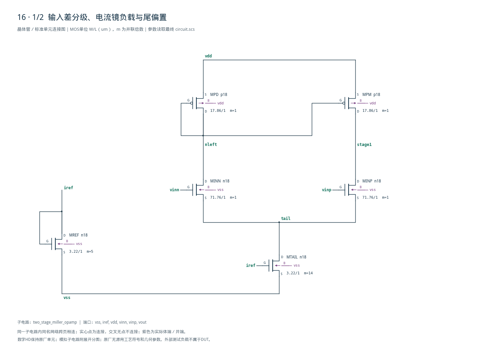
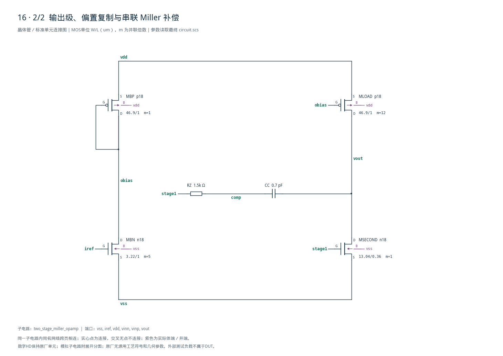

# 16 · 两级 Miller 运放审查

[审查 PDF](review.pdf) · [实测结果](latest_results.json) · [验收合同](contract.json) · [最终网表](circuit.scs)

## 验收结果

本模块通过两级电压放大获得较高开环增益，再用Miller补偿稳定负反馈。相比单级5T OTA，第二级提供额外增益和输出驱动能力，代价是额外电流与更复杂的补偿。芯片中常用于传感器读出、ADC驱动、开关电容电路和闭环放大；本例侧重速度与失调的联合取舍。

结论：10%放宽条件通过；仅UGB较原200 MHz低0.52%，其余原指标通过。条件：SMIC18MMRF / tt / 1.8 V / 27°C；外部参考50 uA；输入共模0.9 V；负载1 pF。记录全部nominal频域、动态与范围指标，不以单一环路增益代替完整验收。

| 指标 | 实测 | 原门槛 | 10%边界 | 15%边界 | 单位 |
| --- | --- | --- | --- | --- | --- |
| 10Hz环路增益 | 79.132 | ≥60.000 | ≥59.085 | ≥58.588 | dB |
| UGB | 198.961 | ≥200.000 | ≥180.000 | ≥170.000 | MHz |
| 相位裕量 | 71.344 | ≥60.000 | ≥54.000 | ≥51.000 | deg |
| 静态输出误差 | 1.165 | ≤25.000 | ≤27.500 | ≤28.750 | mV |
| 总功耗（含参考） | 1.554 | ≤2.000 | ≤2.200 | ≤2.300 | mW |
| 输入积分噪声 | 22.500 | ≤50.000 | ≤55.000 | ≤57.500 | uVrms |
| 闭环PSRR+ @1kHz | 46.614 | ≥35.000 | ≥34.085 | ≥33.588 | dB |
| 闭环PSRR+ @1MHz | 46.525 | ≥35.000 | ≥34.085 | ≥33.588 | dB |
| 闭环CMRR @1kHz | 65.402 | ≥55.000 | ≥54.085 | ≥53.588 | dB |
| 连续输出范围 | 1.086 | ≥0.800 | ≥0.720 | ≥0.680 | Vpp |
| 最坏建立时间 | 4.314 | ≤20.000 | ≤22.000 | ≤23.000 | ns |
| 最坏最终跟踪误差 | 1.201 | ≤2.000 | ≤2.200 | ≤2.300 | mV |
| 上升压摆率 | 153.045 | ≥50.000 | ≥45.000 | ≥42.500 | V/us |
| 下降压摆率 | 155.478 | ≥50.000 | ≥45.000 | ≥42.500 | V/us |

噪声增益20的实测−3 dB带宽14.098 MHz，积分10 Hz至该频率，得到22.500 uVrms。环路在10 Hz–10 GHz内只有一次下降跨越0 dB，之后没有回穿。

最终100 mV阶跃跟踪误差1.201 mV，等于阶跃幅度的1.201%，同时满足2 mV与2%两个原条件。未以放宽后的噪声带宽或负载制造通过。

## 电路结构、LUT尺寸与OP

两级电压放大，电流偏置，串联RC跨级补偿。

| 器件角色 | 模型 | L/um | 单位W/um | m | 目标gm/ID |
| --- | --- | --- | --- | --- | --- |
| MINN/MINP | n18 | 1.00 | 71.76 | 1 | 18.0 |
| MPD/MPM | p18 | 1.00 | 17.86 | 1 | 5.0 |
| MREF/MTAIL/MBN | n18 | 1.00 | 3.22 | 5 / 14 / 5 | 12.0 |
| MBP/MLOAD | p18 | 1.00 | 46.90 | 1 / 12 | 10.0 |
| MSECOND | n18 | 0.36 | 13.04 | 1 | 5.0 |

| 实际工作点 | \|I\|/uA | gm/ID | gm/gds | 饱和余量/V |
| --- | --- | --- | --- | --- |
| MINP | 69.22 | 18.20 | 243.6 | 0.355 |
| MINN | 68.79 | 18.25 | 299.4 | 0.583 |
| MPM | 69.22 | 5.04 | 198.3 | 0.692 |
| MTAIL | 138.01 | 12.33 | 124.4 | 0.204 |
| MSECOND | 623.91 | 4.88 | 74.3 | 0.629 |
| MLOAD | 623.91 | 9.82 | 307.4 | 0.724 |

输入对约69 uA/支，第二级623.9 uA。第二级gm约3.046 mS，1/gm约328 Ω；RZ大于此值，用于形成左半平面零点。完整相位仍由实际环路验证。

尾源、参考、输出负载用单位管并联；模型日志无尺寸越界警告。没有新增数字逻辑。



[查看矢量图](markdown_assets/figure-02-01.svg)

## 环路、抑制比与噪声

闭环噪声频带由独立AC测得；抑制比保持上游闭环注入方式。

环路采用原测试串联电压注入，T=−Vout/Vinn；DC保持单位反馈。PSRR输入固定、VDD AC=1；CMRR对vinp与串联反馈各注入同一AC单位，抑制比均为−20log10|Vout|。

输入噪声为PSF的V/sqrt(Hz)，平方后对频率积分再开根号。没有用开环UGB作为积分终点。



[查看矢量图](markdown_assets/figure-03-01.svg)

## 阶跃、压摆与连续范围

负载始终1 pF；同时验收正负两个方向，DC范围须围绕0.9 V连续。

输出连续范围0.300–1.386 V，共1.086 Vpp；低端受原扫描0.3 V边界限制，未声称0.3 V以下可用。建立时间从5/66 ns阶跃开始到最后进入2 mV误差窗，终值分别在65/130 ns检查。



[查看矢量图](markdown_assets/figure-04-01.svg)

## 精确电路、权衡与复现

一次第二级gm/ID调整同时改变速度、相位与输入失调。

初版第二级gm/ID=3时UGB150.90 MHz，低于15%放宽后的170 MHz下限。保持电流、补偿和其他尺寸，仅改到gm/ID=5，UGB升至198.96 MHz、PM由57.49°升至71.34°。输出静态误差从0.127增至1.165 mV，仍满足动态终值要求。

原因：第二级跨导增大、输出极点与补偿零点改变；其栅压从约0.991降到0.790 V，输入对漏压不再接近相等。因此速度提升同时增加系统失调并降低CMRR，必须联合验收，不能只看UGB。

复现： /home/IC/CodeX/virtuoso-bridge-lite/.venv/bin/python scripts/case16\_miller.py 生成PDF：同一Python运行 scripts/review\_pdf.py 16

静态：runs/16/20260922T064852230057Z\_static噪声：runs/16/20260922T064852421079Z\_noise动态：runs/16/20260922T064852632282Z\_dynamic

原任务：sky130-two-stage-miller-opamp-gain60-ugb200-pm60-noise50uv-pvt。未执行其余PVT点、另外两个代表性动态角落、失配或版图验证。198.96 MHz必须保留10%放宽通过标签。

## 完整网表与电路图

[Spectre 网表](circuit.scs) · [全部分图 PDF](schematic/sheets.pdf) · [电路总图](schematic/full.svg) · [端子连接](schematic/connectivity.json)

<details>
<summary>展开完整 Spectre 网表</summary>

```spectre
// Two-stage Miller amplifier, SMIC18 target-PDK gm/ID dimensions.
simulator lang=spectre
subckt two_stage_miller_opamp (vss iref vdd vinn vinp vout)
MREF (iref iref vss vss) n18 w=3.22u l=1u m=5
MTAIL (tail iref vss vss) n18 w=3.22u l=1u m=14
MINN (nleft vinn tail vss) n18 w=71.76u l=1u
MINP (stage1 vinp tail vss) n18 w=71.76u l=1u
MPD (nleft nleft vdd vdd) p18 w=17.86u l=1u
MPM (stage1 nleft vdd vdd) p18 w=17.86u l=1u
MBN (obias iref vss vss) n18 w=3.22u l=1u m=5
MBP (obias obias vdd vdd) p18 w=46.9u l=1u
MSECOND (vout stage1 vss vss) n18 w=13.040000000000001u l=.36u
MLOAD (vout obias vdd vdd) p18 w=46.9u l=1u m=12
RZ (stage1 comp) resistor r=1500
CC (comp vout) capacitor c=0.7p
ends two_stage_miller_opamp
```

</details>





## 报告来源

正文与表格整理自已交付的矢量 PDF，图表单独提取；本文件是后续整理的 Markdown，不是原 PDF 的编译输入。原 PDF、网表及测量数据保持原值。
