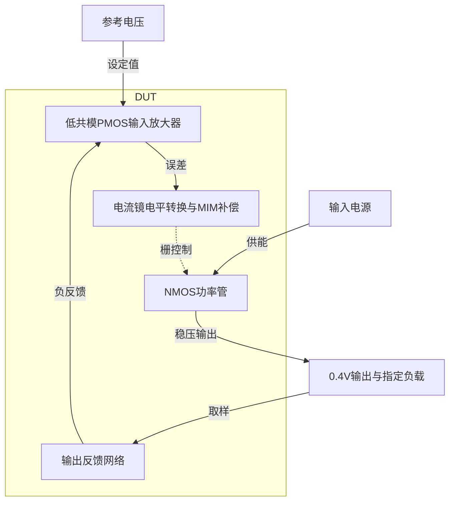
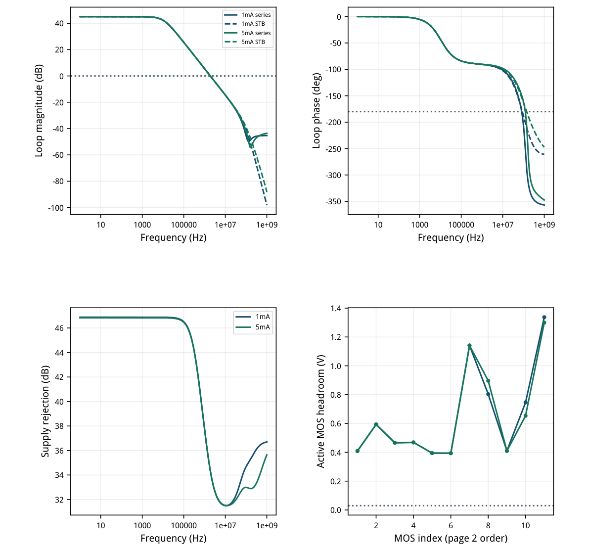
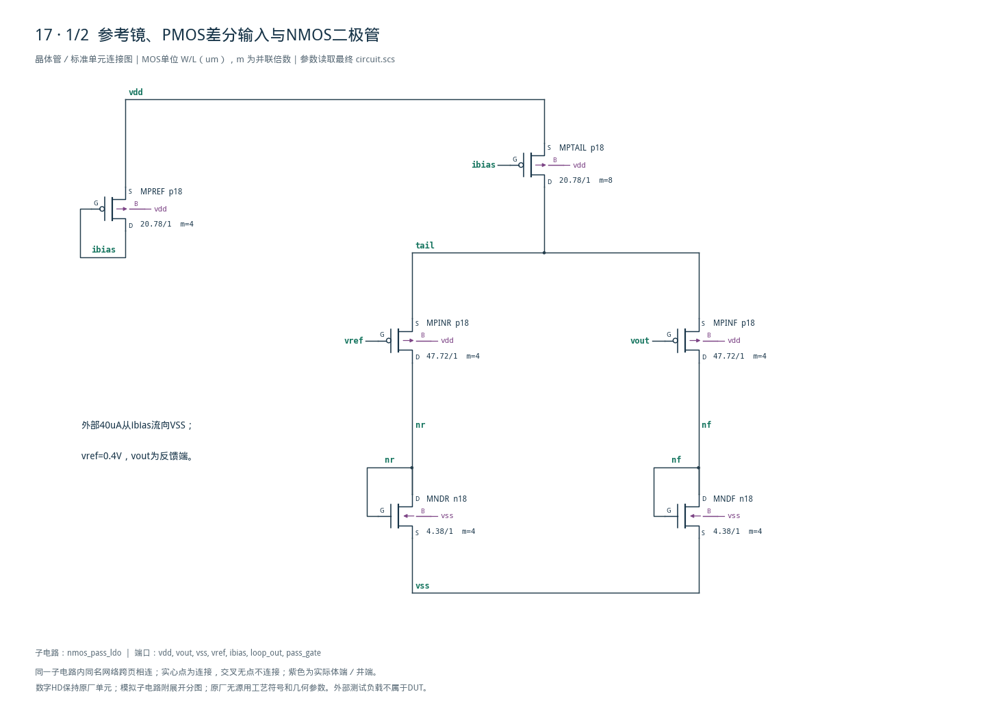
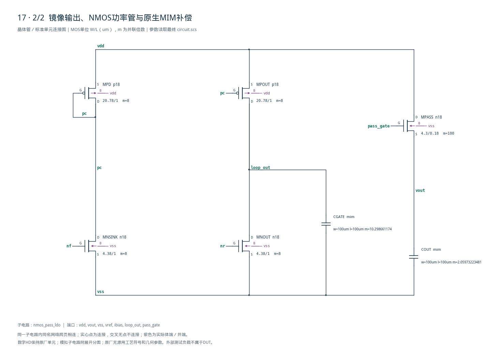

# 17 · 0.4V NMOS LDO审查

[审查 PDF](review.pdf) · [实测结果](latest_results.json) · [验收合同](contract.json) · [最终网表](circuit.scs)

## 验收结果

本模块通过误差放大器控制NMOS功率管，将1.8V输入稳压至约0.4V。PMOS输入对适应低参考电压，电流镜把误差信号转移到较高的功率管栅压，栅极MIM补偿控制环路带宽；代价是额外镜像支路电流、补偿面积和较大的输入输出压差。芯片中可为低压模拟或数字子模块提供局部电源，本次只验证1mA与5mA负载的标称工作。

结论：两种标称负载的全部原门槛通过；额外真实STB也通过。

SMIC18MMRF TT / 1.8V / 27°C，外部40uA偏置电流从ibias流向VSS，外部10pF不变；完整保留1mA与5mA两点。以下PM/GM均为严格大于门槛，工作点余量不放宽。

| 指标 | 1mA | 5mA | 原 | 10% | 15% | 单位 |
| --- | --- | --- | --- | --- | --- | --- |
| 输出距0.4V误差 | 1.5405 | 1.1137 | ≤50 | ≤55 | ≤57.5 | mV |
| 静态电流 | 246.39 | 247.04 | &lt;400 | &lt;440 | &lt;460 | uA |
| 原串联注入PM | 88.143 | 88.762 | &gt;45 | &gt;45 | &gt;45 | deg |
| 原串联注入GM | 40.399 | 47.336 | &gt;6 | &gt;5.0849 | &gt;4.5884 | dB |
| 真实STB PM | 87.965 | 88.583 | &gt;45 | &gt;45 | &gt;45 | deg |
| 真实STB GM | 38.598 | 44.716 | &gt;6 | &gt;5.0849 | &gt;4.5884 | dB |
| 1kHz PSRR | 46.882 | 46.834 | &gt;40 | &gt;39.085 | &gt;38.588 | dB |
| 有流MOS最小余量 | 393.79 | 393.88 | &gt;30 | &gt;30 | &gt;30 | mV |

输出分别0.40154054V、0.40111369V；最小原PM88.143°，最小STB PM87.965°。原网格每十倍频40点，最终160点；1Hz–1GHz完整覆盖，无额外0dB回穿。

其他52个工艺/供电/温度/负载点及50个失配种子未执行；没有将标称两点改写成54点PVT或失配通过。噪声、动态负载、布局、PEX不属于本题本次已测结论。

<!-- SYSTEM-BLOCK-DIAGRAM -->
## 系统框图

反馈、补偿和功率管构成同一稳压环路；参考与负载按本题合同保留。

实线表示信号或能量通路，虚线表示时钟、控制或偏置。DUT框外为外部端口或测试夹具；精确端子连接见后附基本电路图。



[独立Mermaid源文件](system_block_diagram.mmd) · [框图SVG](markdown_assets/system-block.svg)
<!-- END-SYSTEM-BLOCK-DIAGRAM -->

## 电路选择、gm/ID与实际工作点

镜像输出把输入共模约0.4V与功率管栅压约1V分开。

目标尾电流80uA，每输入支路40uA，输出及复制镜各约80uA；目标IQ约240uA。单位10uA查表后并联，功率管采用50uA单位m100；全部单位W/L在模型范围内。

| 角色 | 单位W/L um | LUT gm/ID | 单位ID uA |
| --- | --- | --- | --- |
| pbias | 20.78/1 | 14 | 10 |
| input | 47.72/1 | 18 | 10 |
| nmirror | 4.38/1 | 14 | 10 |
| pmirror | 20.78/1 | 14 | 10 |
| pass_unit | 4.3/0.18 | 14 | 50 |

| 器件 | ID@1mA/uA | ID@5mA/uA | gmID@5mA | 余量@1mA/V | 余量@5mA/V |
| --- | --- | --- | --- | --- | --- |
| MPREF | -40 | -40 | 13.9583 | 0.4092 | 0.4092 |
| MPTAIL | -80.573 | -80.574 | 13.9482 | 0.5937 | 0.5939 |
| MPINR | -40.837 | -40.685 | 17.7512 | 0.4660 | 0.4662 |
| MPINF | -39.736 | -39.889 | 17.8446 | 0.4689 | 0.4683 |
| MNDR | 40.837 | 40.685 | 13.8203 | 0.3944 | 0.3943 |
| MNDF | 39.736 | 39.889 | 13.9188 | 0.3938 | 0.3939 |
| MNSINK | 82.328 | 82.64 | 13.8139 | 1.1414 | 1.1410 |
| MNOUT | 83.38 | 83.412 | 13.7549 | 0.8034 | 0.8966 |
| MPD | -82.329 | -82.641 | 13.7921 | 0.4098 | 0.4099 |
| MPOUT | -83.38 | -83.412 | 13.7783 | 0.7465 | 0.6533 |
| MPASS | 1000 | 5000 | 14.1157 | 1.3373 | 1.2999 |

PMOS电流带原符号；余量=|VDS|-|VDSAT|。两点均11只MOS有流，最小余量约394mV，远大于固定30mV。无流MOS电容排除规则仍保留，实际补偿使用原生MIM。

## 原串联注入与真实STB交叉检查

两种返回量低频相同，高频受注入双向耦合影响，分别报告。

原台T=-V(loop\_out)/V(pass\_gate)；真实STB保存的是带符号返回量，低频相位+180°，按T=-loopGain归一后计算180°+phase。若直接把+180°当零相位，会错误多出180°相位裕量。

两种测量分别检查首个下降0dB和-180°交越，均有有限GM；不以没有相位交越为由填入无限裕量。高频差异不改变两负载原指标通过的结论。



[查看矢量图](markdown_assets/figure-03-01.svg)

## 原合同与数值精度确认

从40点/dec、1e-6收紧至160点/dec、1e-7，同一电路和夹具。

| 指标（SI/deg/dB） | 两负载最大差 | 预先固定上限 |
| --- | --- | --- |
| vout_V | 0 | 1e-06 |
| iq_A | 0 | 1e-08 |
| loop_ugb_Hz | 550.47 | 6000 |
| phase_margin_deg | 0.000478821 | 0.05 |
| gain_margin_db | 0.0327286 | 0.05 |
| stb_ugb_Hz | 422.368 | 6000 |
| stb_phase_margin_deg | 0.000391141 | 0.05 |
| stb_gain_margin_db | 0.00235088 | 0.05 |
| psrr_1k_dB | 0 | 0.01 |
| min_active_headroom_V | 0 | 1e-06 |

20项数值比较全部通过：最大UGB差550.47Hz，PM差小于0.0005°，GM差0.03273dB，输出、电流、PSRR及器件余量为0差异。加密点包含全部原点；最终采用加密结果。

原PSRR是在完整闭环下把VDD的AC幅度设为1、VLOOP设为0；功耗电流定义IQ=-I(VDD)-ILOAD-40uA，仅按原题扣除外部偏置。独立复核用供电电流分解、复数乘共轭及另一套插值重算20个标量。

原verifier没有可单独调用的标称检查函数；独立审计导入其门槛常量，将原5组不等式分别应用于两个标称负载，共10组通过，不改写上游54点/50种子完整验收语义。全部8个精度运行日志0错误/0警告。

## 最终精确网表与工艺无源

NMOS功率管总宽430um，以合法4.3um单位m100实现。

CGATE名义100pF、COUT名义20pF，均为原生mim，单位100×100um及m倍率；实际模型的面积/周边、电压和温度依赖保留。外部10pF不计入DUT，也没有用外部超大电容替代内部补偿。

端序MOS为D G S B；NMOS体端接VSS，PMOS体端接VDD。loop\_out与pass\_gate保持两个端口，由测试台的0V串联电压源及iprobe闭合；DUT内部没有短接，原注入点有效。

电路SHA-256：050cce2389d138c31156a14b1bf955093cbefb0018a2ec14f29689e12d65298d

## 设计认识、复现路径与范围

13实例48端子独立核对；附后两页展开所有器件及体端。

低参考电压与NMOS源跟随功率级需要不同的节点电压。直接把PMOS输入支路漏端当功率管驱动，会压缩输入管余量；本例用两路镜像输出完成电平转移，代价是约247uA静态电流。两个负载的全部11管余量已按实际OP检查。

较大的栅极补偿将主环路UGB控制在约1.9MHz，使低输出电容下仍有约88°PM。此题未规定瞬态建立门槛，因此不据AC结果宣称负载跃变或启动速度通过；未另减小负载来改善稳定性。

复现（工程根目录，现有Bridge Python）： python scripts/case17\_nmos\_ldo.py python scripts/confirm17.py python scripts/schematic17.py python scripts/audit17.py python scripts/review17.py 重建后应重新逐页查看报告和完整总图，再执行交付。

证据：source/与source\_provenance.json，circuit.scs、sizing.json、latest\_results.json，numerical\_plan/baseline/confirmation.json，verification\_audit.json，schematic/connectivity.json。源资料、模型、LUT及所有运行输入均保留哈希。

未覆盖其他52个PVT/负载点、50次失配、布局或PEX。原PDK、Virtuoso Bridge、Spectre与LUT环境未修改。本批次没有恢复用户已取消的额度监控。

## 完整网表与电路图

[Spectre 网表](circuit.scs) · [全部分图 PDF](schematic/sheets.pdf) · [电路总图](schematic/full.svg) · [端子连接](schematic/connectivity.json)

<details>
<summary>展开完整 Spectre 网表</summary>

```spectre
simulator lang=spectre
subckt nmos_pass_ldo (vdd vout vss vref ibias loop_out pass_gate)
MPREF (ibias ibias vdd vdd) p18 w=20.78u l=1u m=4
MPTAIL (tail ibias vdd vdd) p18 w=20.78u l=1u m=8
MPINR (nr vref tail vdd) p18 w=47.72u l=1u m=4
MPINF (nf vout tail vdd) p18 w=47.72u l=1u m=4
MNDR (nr nr vss vss) n18 w=4.38u l=1u m=4
MNDF (nf nf vss vss) n18 w=4.38u l=1u m=4
MNSINK (pc nf vss vss) n18 w=4.38u l=1u m=8
MNOUT (loop_out nr vss vss) n18 w=4.38u l=1u m=8
MPD (pc pc vdd vdd) p18 w=20.78u l=1u m=8
MPOUT (loop_out pc vdd vdd) p18 w=20.78u l=1u m=8
MPASS (vdd pass_gate vout vss) n18 w=4.3u l=.18u m=100
CGATE (loop_out vss) mim w=100u l=100u m=10.298661174
COUT (vout vss) mim w=100u l=100u m=2.05973223481
ends nmos_pass_ldo
```

</details>





## 报告来源

正文与表格整理自已交付的矢量 PDF，图表单独提取；本文件是后续整理的 Markdown，不是原 PDF 的编译输入。原 PDF、网表及测量数据保持原值。
