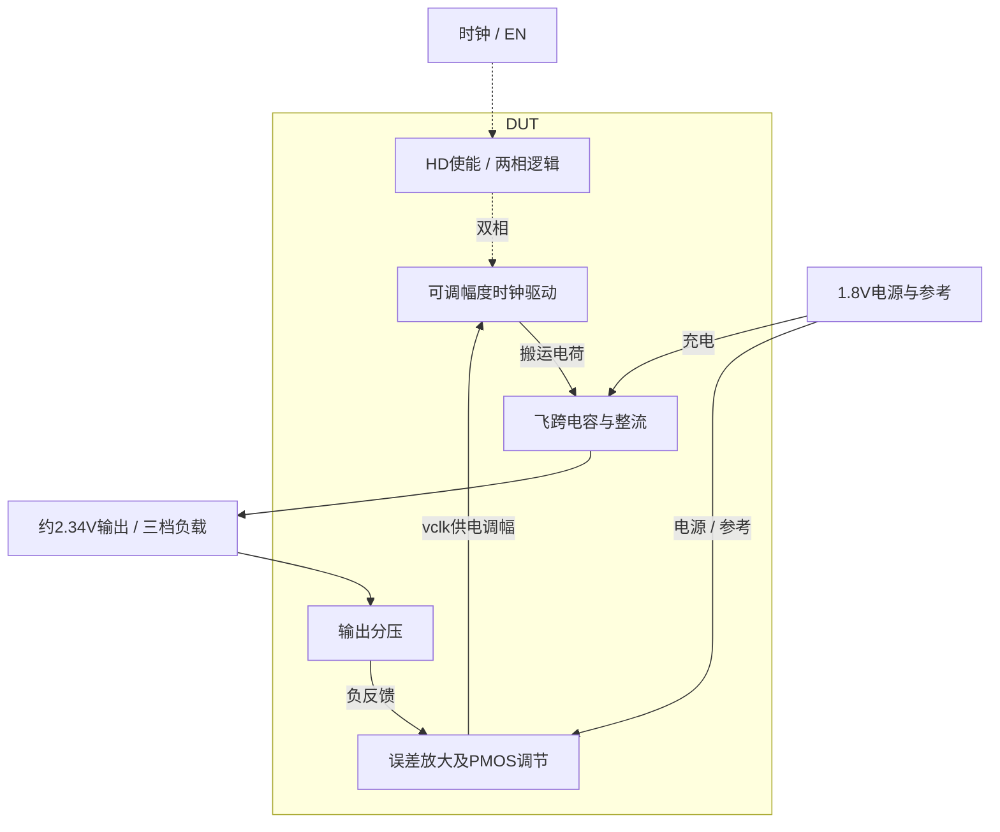
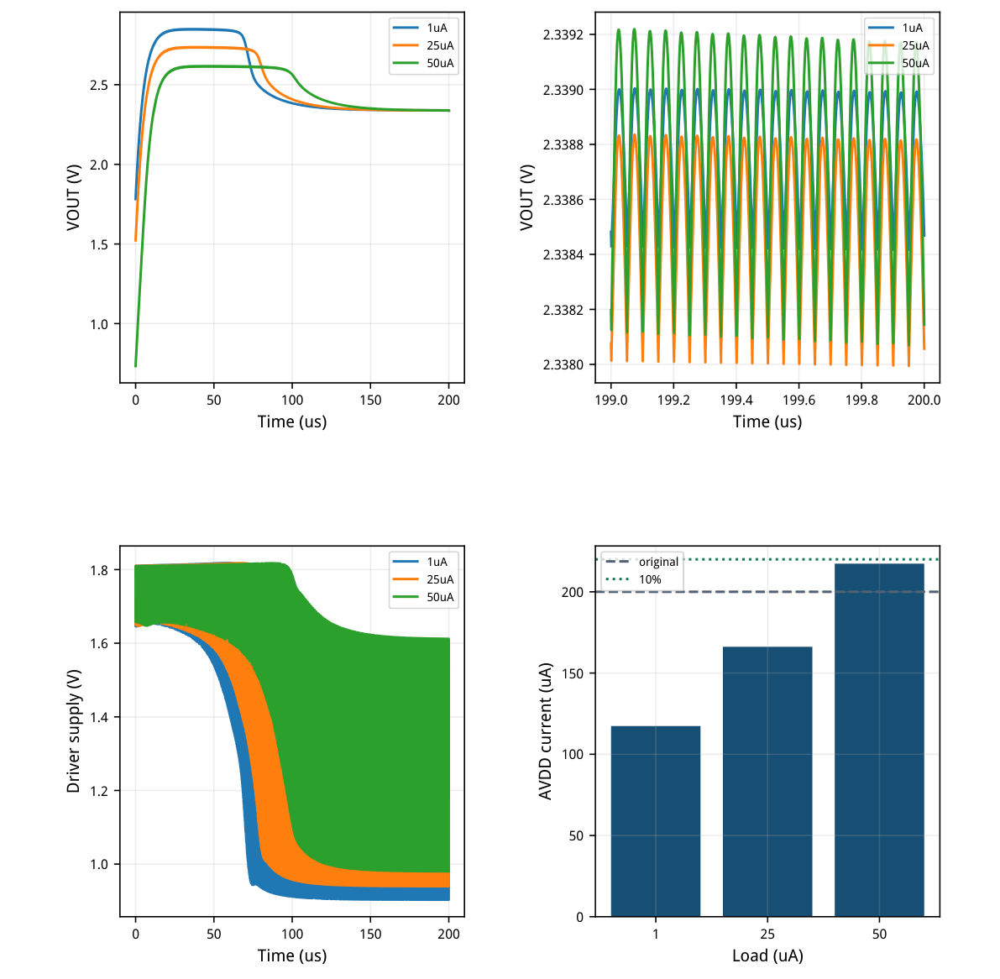
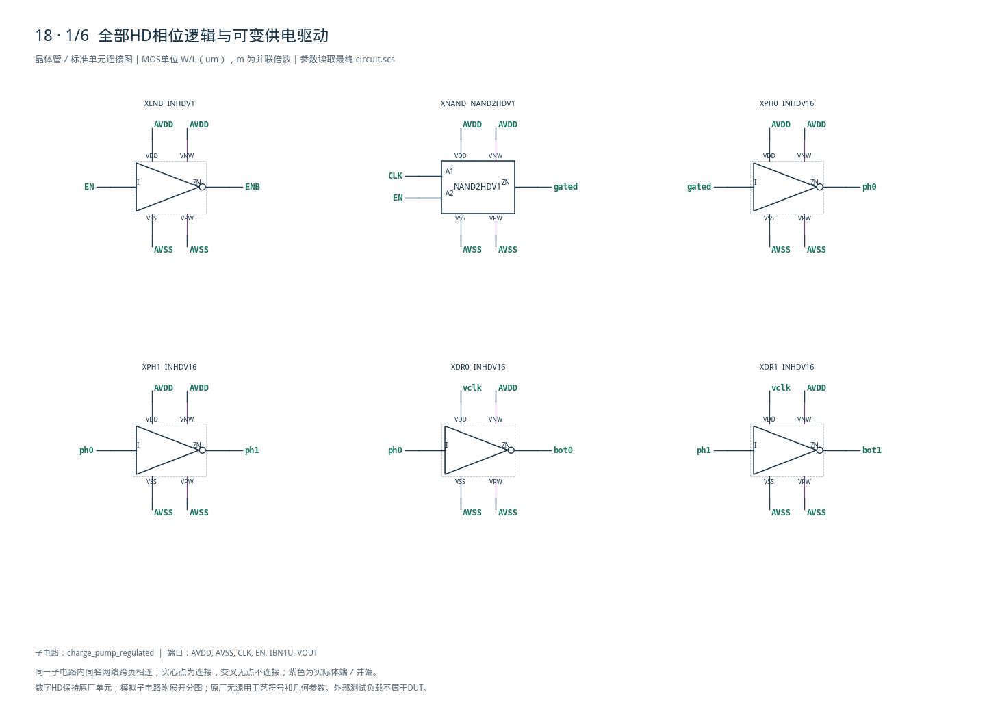
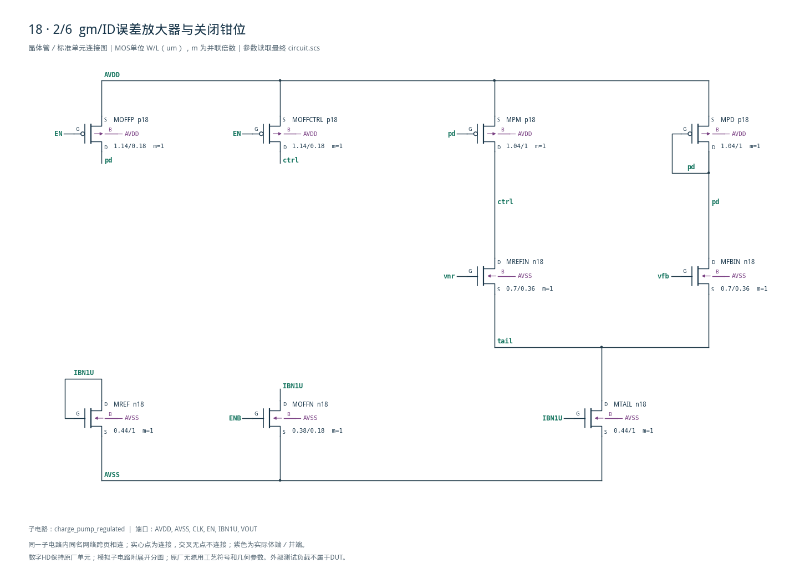
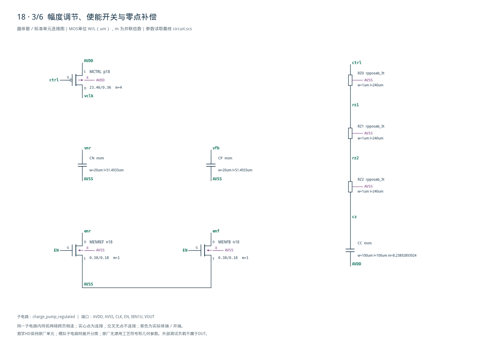
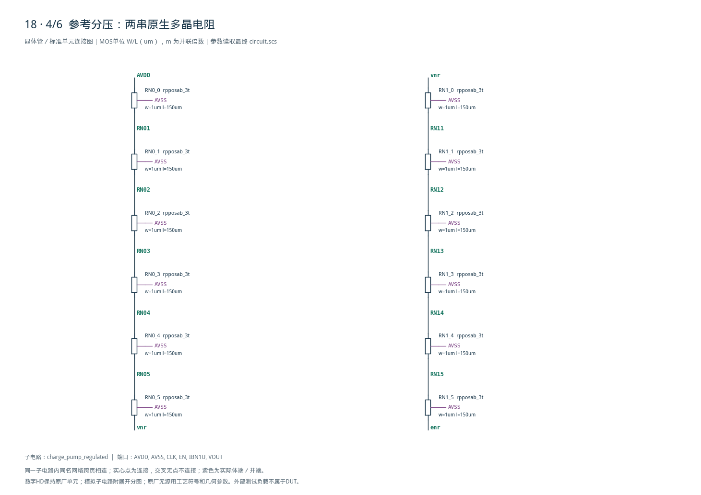
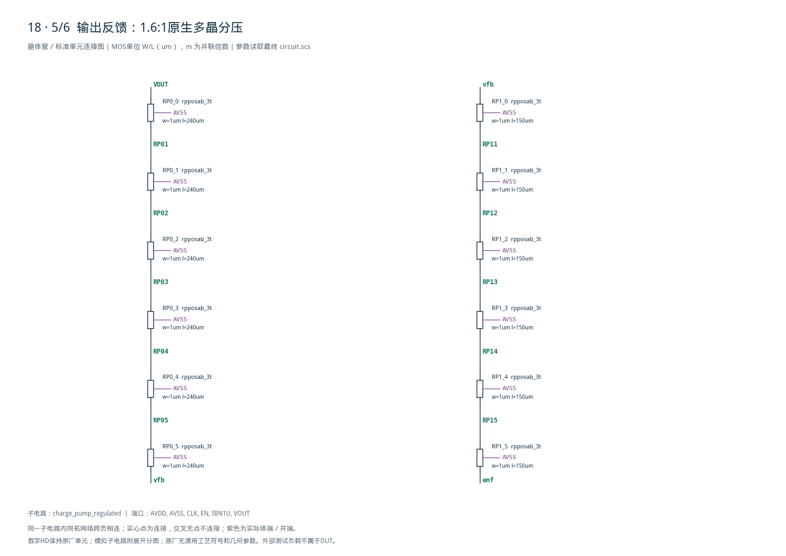
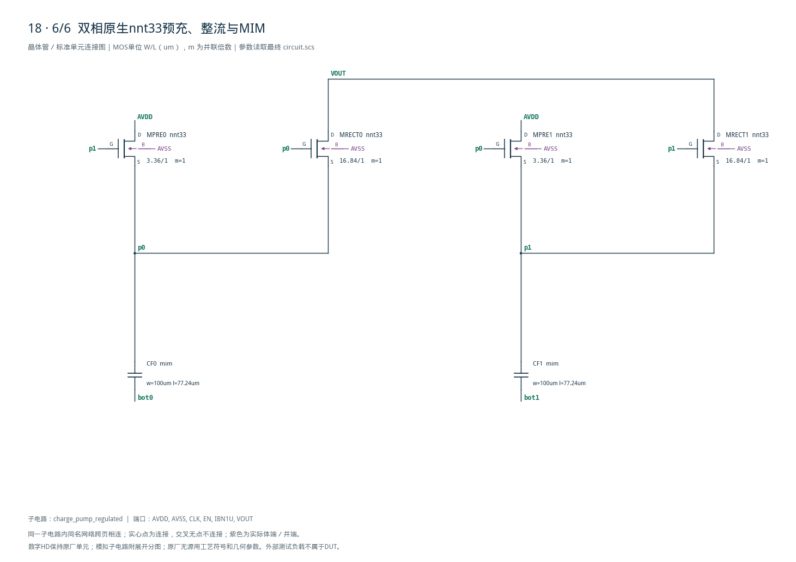

# 18 · 10MHz稳压电荷泵审查

[审查 PDF](review.pdf) · [实测结果](latest_results.json) · [验收合同](contract.json) · [最终网表](circuit.scs)

## 验收结果

本模块用双相飞跨电容产生高于1.8V的辅助电源，再以电阻分压、误差放大器和PMOS调节时钟驱动幅度，使输出靠近2.34V。相比未稳压电荷泵，它能减小负载引起的输出变化，但增加静态电流、反馈补偿及稳定性设计。芯片中可用于小电流偏置和辅助栅驱动，本次保留三档负载和独立关闭电流测量。

结论：10%档通过；50uA负载供电电流217.337uA，超过原200uA。

双相倍压功率级将1.8V提升至约2.34V，误差放大器调节底板HD驱动的供电幅度。无需电感，但有开关损耗、纹波和补偿面积代价，适合片内辅助偏置。

| 负载/uA | 平均输出/V | 误差/mV | 纹波/mV | AVDD电流/uA |
| --- | --- | --- | --- | --- |
| 1 | 2.338852287 | 1.147713 | 0.739390 | 117.369707 |
| 25 | 2.338631014 | 1.368986 | 1.073062 | 166.165706 |
| 50 | 2.339086421 | 0.913579 | 1.774309 | 217.336564 |

| 指标 | 原门槛 | 10% | 15% |
| --- | --- | --- | --- |
| 相对2.34V误差/mV | ≤117 | ≤128.7 | ≤134.55 |
| 输出纹波/mV | ≤5 | ≤5.5 | ≤5.75 |
| 开启AVDD电流/uA | ≤200 | ≤220 | ≤230 |
| 关闭AVDD电流/nA | ≤100 | ≤110 | ≤115 |

关闭独立DC电流1.095479732nA。全部电压、纹波与关闭电流通过原门槛；只有50uA负载开启电流使用10%档，距220uA边界2.663436uA。

TT/1.8V/40°C；开启1/25/50uA三种负载、外部1nF。每次200us，190–200us评分。其余5个开启PVT点与4个关闭PVT点未执行；不宣称完整PVT通过。

<!-- SYSTEM-BLOCK-DIAGRAM -->
## 系统框图

反馈改变时钟驱动幅度，未把该电路画成PWM或变频控制器。

实线表示信号或能量通路，虚线表示时钟、控制或偏置。DUT框外为外部端口或测试夹具；精确端子连接见后附基本电路图。



[独立Mermaid源文件](system_block_diagram.mmd) · [框图SVG](markdown_assets/system-block.svg)
<!-- END-SYSTEM-BLOCK-DIAGRAM -->

## 反馈调节与gm/ID初始尺寸

16个模拟MOS、5个原生MIM、27个原生多晶电阻、6个HD单元。

参考AVDD/2，输出反馈VOUT/2.6；五管OTA比较二者并控制PMOS MCTRL，改变底板驱动供电vclk。EN关闭时切断分压回路、钳位偏置和控制节点。NNT33预充/整流器承受升压节点电压。

| 角色 | 模型 | 单位W/L um | gm/ID | 初算I/uA |
| --- | --- | --- | --- | --- |
| bias | n18 | 0.44/1 | 14 | 1 |
| input | n18 | 0.7/0.36 | 22 | 0.5 |
| pload | p18 | 1.04/1 | 14 | 0.5 |
| enable_n | n18 | 0.38/0.18 | 10 | 10 |
| enable_p | p18 | 1.14/0.18 | 10 | 10 |
| control | p18 | 23.46/0.36 | 12 | 50 |
| precharge | nnt33 | 3.36/1 | 6 | 50 |
| rectifier | nnt33 | 16.84/1 | 6 | 250 |

MCTRL单位23.46/0.36um，m4。两只飞跨MIM各7.5pF；参考/反馈滤波各1pF；控制补偿80pF。RZ为3段W1/L240um工艺多晶电阻串联，总阻约230kΩ，提供稳定所需零点。

HD单元INHDV1、INHDV16、NAND2HDV1保持原厂CDL内部尺寸。底板驱动电源为vclk，井端仍接AVDD。gm/ID用于初算；动态开关及控制管不以固定饱和gm/ID代表整个周期。

## 完整启动轨迹与评分窗

保存点真实波形；开启仿真与关闭DC分别执行。

2–180us只减少保存点（skipcount100），求解仍遵守完整maxstep；190–200us评分区间保存全部求解点。全程端电压筛查因此是保存样本检查，不是连续时间峰值界限。



[查看矢量图](markdown_assets/figure-03-01.svg)

## 补偿迭代、数值复算与警告

保留原失败候选、原门槛未通过记录及全部实际日志。

首版80pF直接接AVDD，约20–40kHz低频振荡：1/25/50uA纹波约18.279/20.132/17.925mV。加入3段串联RZ后，纹波降至0.739/1.073/1.774mV；50uA供电电流从220.807降至217.337uA。

25项数值确认：maxstep1→0.5ns、reltol1e-5→1e-6，电路及合同不变。预设输出电压差50uV、电流差0.25uA、控制/vclk差1mV、关闭电流差0.05nA；最大开启电流差0.084215uA，均通过。

8个基线/精算运行均实际0错误。6个开启运行各保留5条SPECTRE-16780 LTE警告；关闭DC无警告。精度复算说明报告指标稳定，不能说警告已消失。未放过其他类别警告。

独立重算25个性能标量，核对48个“负载×器件”记录中的六类端电压极值；N18/P18固定1.98V、NNT33固定3.63V筛查通过。原4组检查诚实返回3过1未过，另行判定10%档通过。

供电电流只统计原合同AVDD感测支路；外部1uA偏置接在感测上游，因此不计入该数值。关闭试验为EN=CLK=0、无负载独立DC，不代表已充电输出的关断瞬态。

## 最终网表 1/2

全部实例原样列出；模拟与原厂HD供电/井端显式连接。

电路SHA-256：6fc878c0bf1ec3399b2991d1291687c0777fa5b3c642e9e8266ef6f957560e0c

## 最终网表 2/2

全部实例原样列出；模拟与原厂HD供电/井端显式连接。

电路SHA-256：6fc878c0bf1ec3399b2991d1291687c0777fa5b3c642e9e8266ef6f957560e0c

## 复现证据与适用范围

附后6页完整图纸；54实例、192端子独立覆盖。

工程根目录使用既有Bridge Python依次运行： python scripts/case18\_regulated\_pump.py python scripts/confirm18.py python scripts/schematic18.py python scripts/audit18.py python scripts/review18.py 生成报告后须实际逐页查看才能发布。

source/与source\_provenance保存原任务、检查器及哈希；contract固定测试窗口与功率口径；numerical\_plan/baseline/confirmation保留事前容差、两套运行和差异；audit与measurement-review保留独立数值和原检查失败原因。

所有PDK、LUT、HD源CDL和既有Spectre/Bridge环境未修改。理想激励及1nF输出负载仅位于测试台，DUT内部采用真实SMIC18 MOS、多晶电阻和MIM。报告不把原生MIM名义电容当作完成版图面积签核。

尚未验证：其他PVT、负载突变、带电关断、随机失配、噪声、版图、PEX及寿命可靠性。当前结论严格限于三组开启TT40°C及一组关闭DC的既定检查。

## 完整网表与电路图

[Spectre 网表](circuit.scs) · [全部分图 PDF](schematic/sheets.pdf) · [电路总图](schematic/full.svg) · [端子连接](schematic/connectivity.json)

<details>
<summary>展开完整 Spectre 网表</summary>

```spectre
simulator lang=spectre
subckt charge_pump_regulated (AVDD AVSS CLK EN IBN1U VOUT)
XENB (EN ENB AVDD AVSS AVDD AVSS) INHDV1
XNAND (CLK EN gated AVDD AVSS AVDD AVSS) NAND2HDV1
XPH0 (gated ph0 AVDD AVSS AVDD AVSS) INHDV16
XPH1 (ph0 ph1 AVDD AVSS AVDD AVSS) INHDV16
XDR0 (ph0 bot0 vclk AVSS AVDD AVSS) INHDV16
XDR1 (ph1 bot1 vclk AVSS AVDD AVSS) INHDV16
MREF (IBN1U IBN1U AVSS AVSS) n18 w=0.44u l=1u
MTAIL (tail IBN1U AVSS AVSS) n18 w=0.44u l=1u
MREFIN (ctrl vnr tail AVSS) n18 w=0.7000000000000001u l=.36u
MFBIN (pd vfb tail AVSS) n18 w=0.7000000000000001u l=.36u
MPD (pd pd AVDD AVDD) p18 w=1.04u l=1u
MPM (ctrl pd AVDD AVDD) p18 w=1.04u l=1u
MOFFN (IBN1U ENB AVSS AVSS) n18 w=0.38u l=.18u
MOFFP (pd EN AVDD AVDD) p18 w=1.1400000000000001u l=.18u
MOFFCTRL (ctrl EN AVDD AVDD) p18 w=1.1400000000000001u l=.18u
MENREF (enr EN AVSS AVSS) n18 w=0.38u l=.18u
MENFB (enf EN AVSS AVSS) n18 w=0.38u l=.18u
MCTRL (vclk ctrl AVDD AVDD) p18 w=23.46u l=.36u m=4
MPRE0 (AVDD p1 p0 AVSS) nnt33 w=3.36u l=1u
MPRE1 (AVDD p0 p1 AVSS) nnt33 w=3.36u l=1u
MRECT0 (VOUT p0 p0 AVSS) nnt33 w=16.84u l=1u
MRECT1 (VOUT p1 p1 AVSS) nnt33 w=16.84u l=1u
CF0 (p0 bot0) mim w=100u l=77.2399588054u
CF1 (p1 bot1) mim w=100u l=77.2399588054u
CC (cz AVDD) mim w=100u l=100u m=8.23892893924
CN (vnr AVSS) mim w=20u l=51.4933058702u
CP (vfb AVSS) mim w=20u l=51.4933058702u
RZ0 (ctrl rz1 AVSS) rpposab_3t w=1u l=240u
RZ1 (rz1 rz2 AVSS) rpposab_3t w=1u l=240u
RZ2 (rz2 cz AVSS) rpposab_3t w=1u l=240u
RN0_0 (AVDD RN01 AVSS) rpposab_3t w=1u l=150u
RN0_1 (RN01 RN02 AVSS) rpposab_3t w=1u l=150u
RN0_2 (RN02 RN03 AVSS) rpposab_3t w=1u l=150u
RN0_3 (RN03 RN04 AVSS) rpposab_3t w=1u l=150u
RN0_4 (RN04 RN05 AVSS) rpposab_3t w=1u l=150u
RN0_5 (RN05 vnr AVSS) rpposab_3t w=1u l=150u
RN1_0 (vnr RN11 AVSS) rpposab_3t w=1u l=150u
RN1_1 (RN11 RN12 AVSS) rpposab_3t w=1u l=150u
RN1_2 (RN12 RN13 AVSS) rpposab_3t w=1u l=150u
RN1_3 (RN13 RN14 AVSS) rpposab_3t w=1u l=150u
RN1_4 (RN14 RN15 AVSS) rpposab_3t w=1u l=150u
RN1_5 (RN15 enr AVSS) rpposab_3t w=1u l=150u
RP0_0 (VOUT RP01 AVSS) rpposab_3t w=1u l=240u
RP0_1 (RP01 RP02 AVSS) rpposab_3t w=1u l=240u
RP0_2 (RP02 RP03 AVSS) rpposab_3t w=1u l=240u
RP0_3 (RP03 RP04 AVSS) rpposab_3t w=1u l=240u
RP0_4 (RP04 RP05 AVSS) rpposab_3t w=1u l=240u
RP0_5 (RP05 vfb AVSS) rpposab_3t w=1u l=240u
RP1_0 (vfb RP11 AVSS) rpposab_3t w=1u l=150u
RP1_1 (RP11 RP12 AVSS) rpposab_3t w=1u l=150u
RP1_2 (RP12 RP13 AVSS) rpposab_3t w=1u l=150u
RP1_3 (RP13 RP14 AVSS) rpposab_3t w=1u l=150u
RP1_4 (RP14 RP15 AVSS) rpposab_3t w=1u l=150u
RP1_5 (RP15 enf AVSS) rpposab_3t w=1u l=150u
ends charge_pump_regulated
```

</details>













## 报告来源

正文与表格整理自已交付的矢量 PDF，图表单独提取；本文件是后续整理的 Markdown，不是原 PDF 的编译输入。原 PDF、网表及测量数据保持原值。
