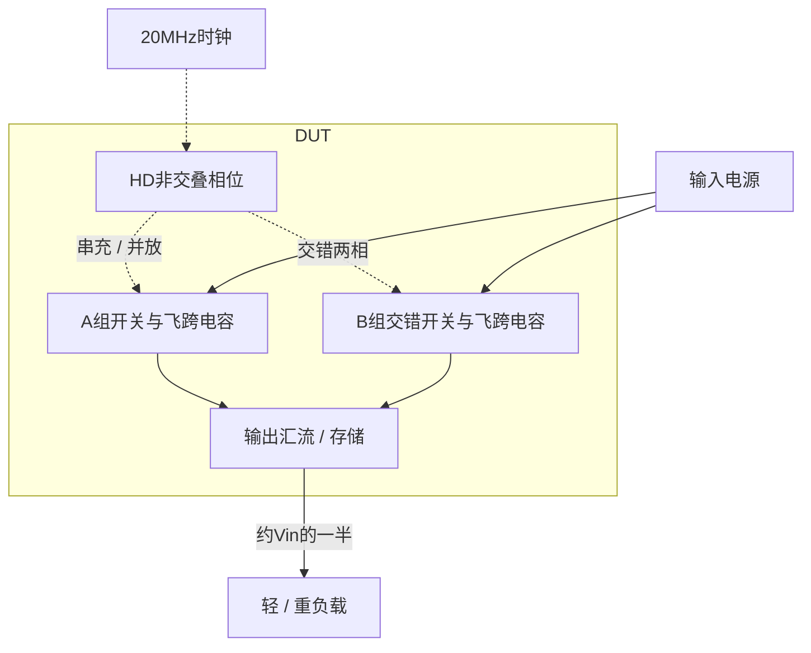
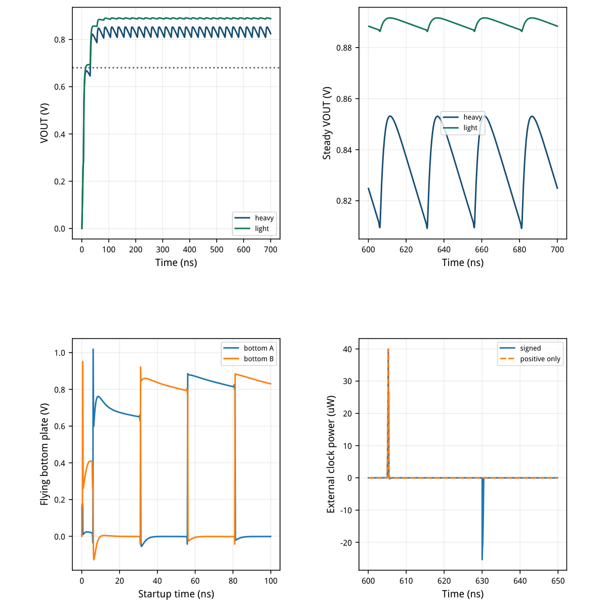
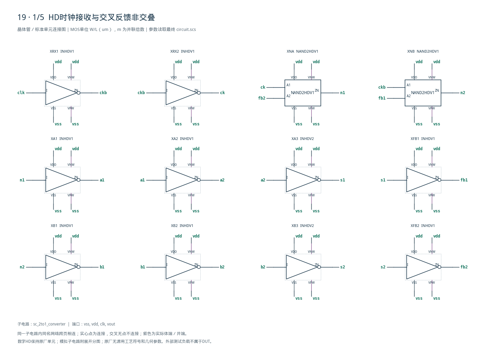
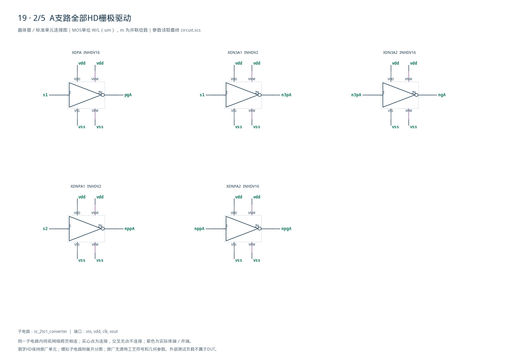
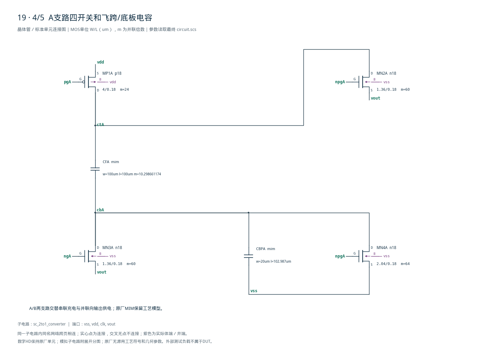
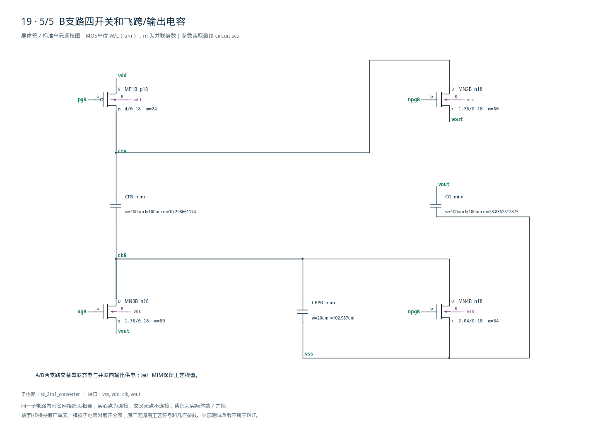

# 19 · 2:1开关电容降压审查

[审查 PDF](review.pdf) · [实测结果](latest_results.json) · [验收合同](contract.json) · [最终网表](circuit.scs)

## 验收结果

本模块用两组交错飞跨电容把电源降至约一半，HD非交叠逻辑控制每组在串联充电和并联放电之间切换。相比线性降压，它通过搬运电荷降低损耗且无需电感；代价是大电容面积、开关纹波及随负载变化的等效输出电阻。芯片中可用于中间电源轨和低功率片内供电，本次验证固定20MHz下的轻重负载。

结论：TT/1.8V/27°C全部轻重负载原门槛通过。

20MHz、50Ω时钟源，680Ω/6800Ω匹配负载；零初始储能启动。评分0.3–0.7us，共8个周期；飞跨与输出电容全部位于DUT内部。

| 指标 | 实测 | 原 | 10% | 15% |
| --- | --- | --- | --- | --- |
| 重载转换比下限 | 0.463932 | ≥0.42 | ≥0.378 | ≥0.357 |
| 重载转换比上限 | 0.463932 | ≤0.51 | ≤0.561 | ≤0.5865 |
| 重载效率下限 | 77.76 | ≥70 | ≥63 | ≥59.5 |
| 轻载转换比下限 | 0.494181 | ≥0.45 | ≥0.405 | ≥0.3825 |
| 轻载转换比上限 | 0.494181 | ≤0.51 | ≤0.561 | ≤0.5865 |
| 轻载效率下限 | 34.5676 | ≥30 | ≥27 | ≥25.5 |
| 重载纹波/mV | 43.9973 | ≤80 | ≤88 | ≤92 |
| 启动/ns | 31.6751 | ≤200 | ≤220 | ≤230 |
| 启动保持/V | 0.809154 | ≥0.6804 | ≥0.6804 | ≥0.6804 |
| 轻载总输入/uW | 336.621 | ≤500 | ≤550 | ≤575 |
| 输出电阻/Ω | 49.6229 | ≤100 | ≤110 | ≤115 |

两负载效率上限固定100%，供电、时钟与负载平均功率必须非负；启动保持目标固定0.6804V。全程模拟功率MOS端电压筛查上限1.98V，不放宽。

重/轻载输出0.835078269/0.889526694V；效率77.760038%/34.567621%。其余44个有源PVT及2个无源极端条件未执行。

<!-- SYSTEM-BLOCK-DIAGRAM -->
## 系统框图

固定频率开环电荷转移；没有额外误差放大器或负载调频环。

实线表示信号或能量通路，虚线表示时钟、控制或偏置。DUT框外为外部端口或测试夹具；精确端子连接见后附基本电路图。



[独立Mermaid源文件](system_block_diagram.mmd) · [框图SVG](markdown_assets/system-block.svg)
<!-- END-SYSTEM-BLOCK-DIAGRAM -->

## 电荷转移、gm/ID与原厂HD

两组四开关交错；数字单元尺寸保持原厂CDL。

串联相：PMOS把飞跨上板接VDD，浮置NMOS把下板接VOUT。并联相：上板经NMOS接VOUT，下板接地。A/B两组相反工作；交叉反馈NAND与延迟反相链生成非交叠相，10个分支HD单元驱动功率栅。

| 模拟角色 | 单位W/L um | 初算gm/ID | 单位ID/uA |
| --- | --- | --- | --- |
| floating_switch | 1.36/0.18 | 8 | 50 |
| ground_switch | 2.04/0.18 | 10 | 50 |
| high_switch | 4/0.18 | 8 | 50 |

| 元件 | 最终实现 |
| --- | --- |
| 浮置NMOS×4 | 1.36/0.18um，m60，总宽81.6um/只 |
| 高侧PMOS×2 | 4.00/0.18um，m24，总宽96um/只 |
| 底板NMOS×2 | 2.04/0.18um，m64，总宽130.56um/只 |
| CFA/CFB/CO | 100×100um MIM，m10.29866/10.29866/28.83625 |
| CBPA/CBPB | 20×102.9866um MIM，名义各2pF |

gm/ID只用于初始电流密度与宽度选择。功率MOS在开关过程中进入线性区、关断和反向传输，不能用固定饱和gm/ID描述整个周期。最终35实例含8功率MOS、5工艺MIM、22个HD单元，共176端子。

原厂HD：INHDV1、INHDV2、INHDV16和NAND2HDV1；源CDL哈希、引脚与每个内部MOS尺寸冻结。 MIM名义总量484pF，对应较大电容板面积；未含版图布线和PEX。

## 启动、稳态输出与时钟能量

完整实际波形；下板负尖峰不从观测范围中剔除。

电源功率按有符号供能取均值；外部时钟只积分正向瞬时功率，不用返回能量抵扣。所有内部HD时钟与栅极驱动损耗已经计入VDD，避免仅计算功率级效率。



[查看矢量图](markdown_assets/figure-03-01.svg)

## 功率口径、失败候选与验证

数值容差在精度复算前冻结；最终电路保持一致。

| 负载/Ω | VDD/uW | 正向CLK/uW | 负载/uW | 总输入/uW |
| --- | --- | --- | --- | --- |
| 680 | 1319.027254 | 0.150690 | 1025.793265 | 1319.177945 |
| 6800 | 336.470076 | 0.150690 | 116.361790 | 336.620766 |

首版底板NMOS m16：所有原性能门槛通过，但启动时MN4B的|VGD|约2.204V超过预设1.98V筛查。将其改为m64后，最终最大端电压1.919501V；代价是重载效率约79.29%降至77.76%、轻载效率约37.85%降至34.57%。

25项数值确认通过：maxstep0.5→0.25ns、reltol1e-6→1e-7。最大重载效率差0.011254个百分点&lt;0.1个百分点，最大供电功率差0.183756uW&lt;2uW，输出电阻差0.001472Ω&lt;0.1Ω；启动差0.0115ps。

独立复核121个标量：25项性能与96项功率管六端电压差。另调用原8组检查函数，仅把预期点集投影至TT1.8V27°C。4个基线/最终运行均实际0错误；模型、源资料、LUT与原厂HD哈希核对通过。

启动取0.6804V的最后一次上穿，并单独检查200–700ns最小输出；没有把“首次达到”当成持续启动。输出电阻使用相同条件下轻重载平均电压差除以平均电流差，最终49.622918Ω。

## 最终网表：全部模拟与HD实例

每个单元的电源与井端都显式连接；工艺MIM未替换为理想电容。

电路SHA-256：69f65f854aa02cd025a190dd4448aa16840e73ba6a835cdde88687dfe010f144

## 复现证据与范围

附后5页完整电路图，35实例176端子独立覆盖。

复现入口（工程根目录，既有Bridge Python）： python scripts/case19\_sc\_converter.py python scripts/confirm19.py python scripts/schematic19.py python scripts/audit19.py python scripts/review19.py 重新生成报告后须实际逐页查看，才可发布知识。

source/保留原任务与检查器；contract.json固定原轻重负载、时钟、启动与功率定义。numerical\_plan/baseline/confirmation分开保存容限和两套运行，verification\_audit.json给出独立积分及原检查函数结果；所有运行输入与真实日志均留在runs/19/。

本题未规定内部非交叠脉宽门槛；非交叠通过外部效率、输出纹波、轻载功耗和启动共同约束。端电压检查只是保存时间点上的工程筛查，不等于可靠性寿命认证或版图签核。

仅TT/1.8V/27°C。其余44有源PVT点、ll/hh无源极端、噪声、失配、版图和PEX未执行；没有宣称完整47条件通过。原PDK、Bridge、Spectre、LUT及上游知识保持不变。

## 完整网表与电路图

[Spectre 网表](circuit.scs) · [全部分图 PDF](schematic/sheets.pdf) · [电路总图](schematic/full.svg) · [端子连接](schematic/connectivity.json)

<details>
<summary>展开完整 Spectre 网表</summary>

```spectre
simulator lang=spectre
subckt sc_2to1_converter (vss vdd clk vout)
XRX1 (clk ckb vdd vss vdd vss) INHDV1
XRX2 (ckb ck vdd vss vdd vss) INHDV1
XNA (ck fb2 n1 vdd vss vdd vss) NAND2HDV1
XA1 (n1 a1 vdd vss vdd vss) INHDV1
XA2 (a1 a2 vdd vss vdd vss) INHDV1
XA3 (a2 s1 vdd vss vdd vss) INHDV2
XFB1 (s1 fb1 vdd vss vdd vss) INHDV1
XNB (ckb fb1 n2 vdd vss vdd vss) NAND2HDV1
XB1 (n2 b1 vdd vss vdd vss) INHDV1
XB2 (b1 b2 vdd vss vdd vss) INHDV1
XB3 (b2 s2 vdd vss vdd vss) INHDV2
XFB2 (s2 fb2 vdd vss vdd vss) INHDV1
XDPA (s1 pgA vdd vss vdd vss) INHDV16
XDN3A1 (s1 n3pA vdd vss vdd vss) INHDV2
XDN3A2 (n3pA ngA vdd vss vdd vss) INHDV16
XDNPA1 (s2 nppA vdd vss vdd vss) INHDV2
XDNPA2 (nppA npgA vdd vss vdd vss) INHDV16
XDPB (s2 pgB vdd vss vdd vss) INHDV16
XDN3B1 (s2 n3pB vdd vss vdd vss) INHDV2
XDN3B2 (n3pB ngB vdd vss vdd vss) INHDV16
XDNPB1 (s1 nppB vdd vss vdd vss) INHDV2
XDNPB2 (nppB npgB vdd vss vdd vss) INHDV16
MP1A (ctA pgA vdd vdd) p18 w=4.0u l=.18u m=24
MN3A (cbA ngA vout vss) n18 w=1.36u l=.18u m=60
MN2A (ctA npgA vout vss) n18 w=1.36u l=.18u m=60
MN4A (cbA npgA vss vss) n18 w=2.04u l=.18u m=64
CFA (ctA cbA) mim w=100u l=100u m=10.298661174
CBPA (cbA vss) mim w=20u l=102.98661174u
MP1B (ctB pgB vdd vdd) p18 w=4.0u l=.18u m=24
MN3B (cbB ngB vout vss) n18 w=1.36u l=.18u m=60
MN2B (ctB npgB vout vss) n18 w=1.36u l=.18u m=60
MN4B (cbB npgB vss vss) n18 w=2.04u l=.18u m=64
CFB (ctB cbB) mim w=100u l=100u m=10.298661174
CBPB (cbB vss) mim w=20u l=102.98661174u
CO (vout vss) mim w=100u l=100u m=28.8362512873
ends sc_2to1_converter
```

</details>










## 报告来源

正文与表格整理自已交付的矢量 PDF，图表单独提取；本文件是后续整理的 Markdown，不是原 PDF 的编译输入。原 PDF、网表及测量数据保持原值。
