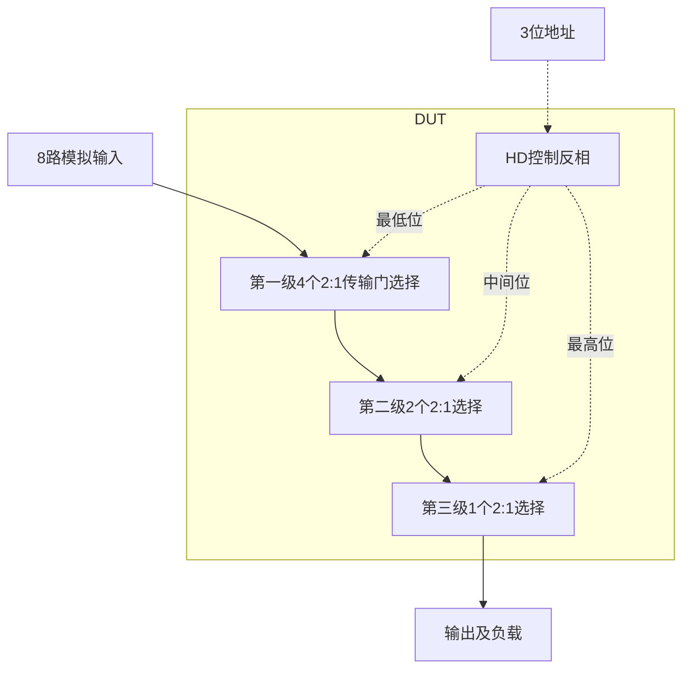
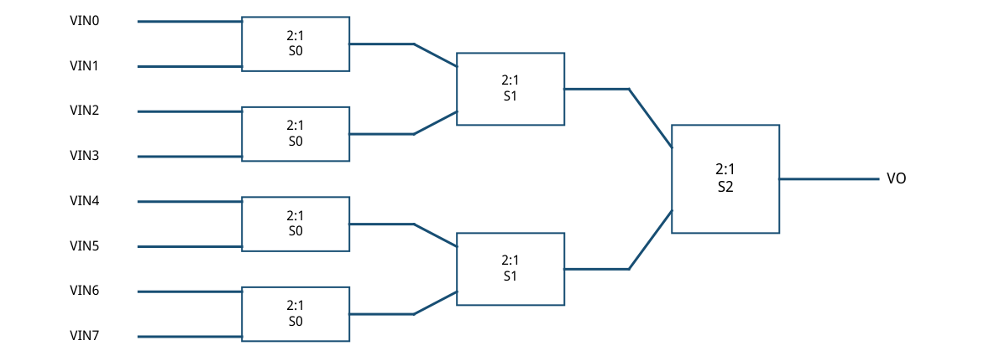
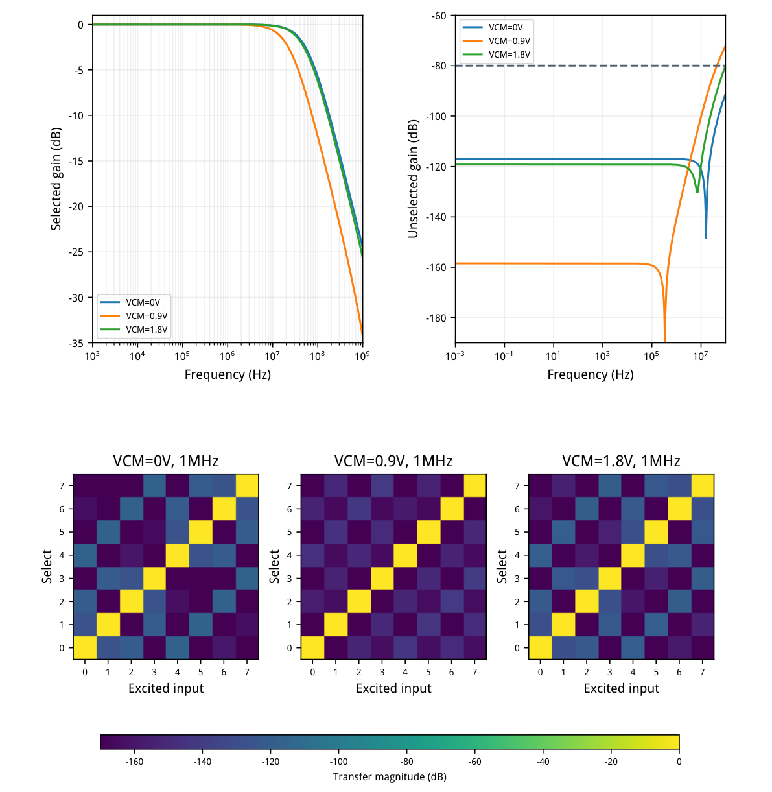
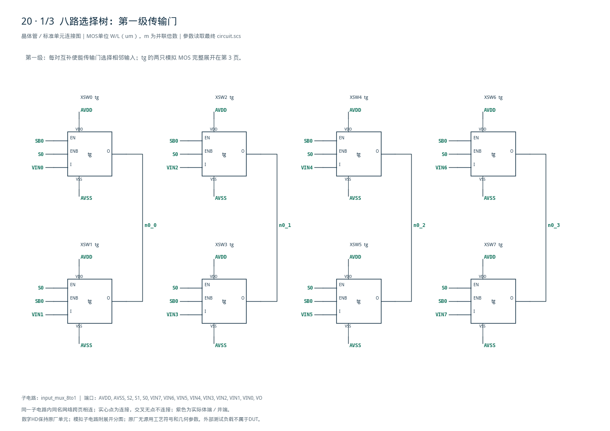
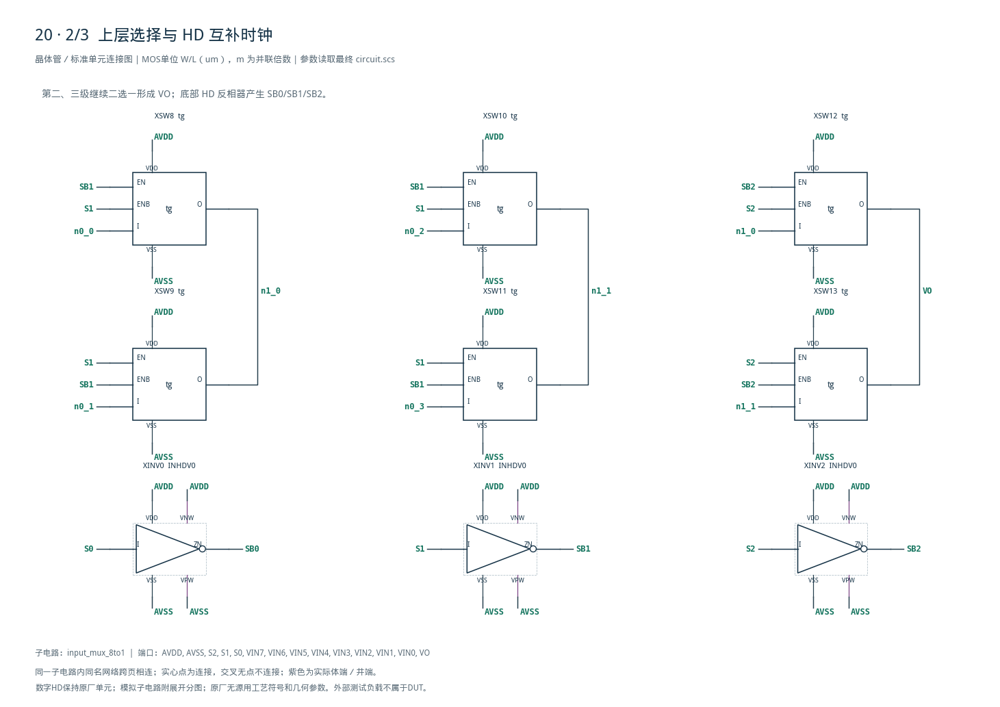
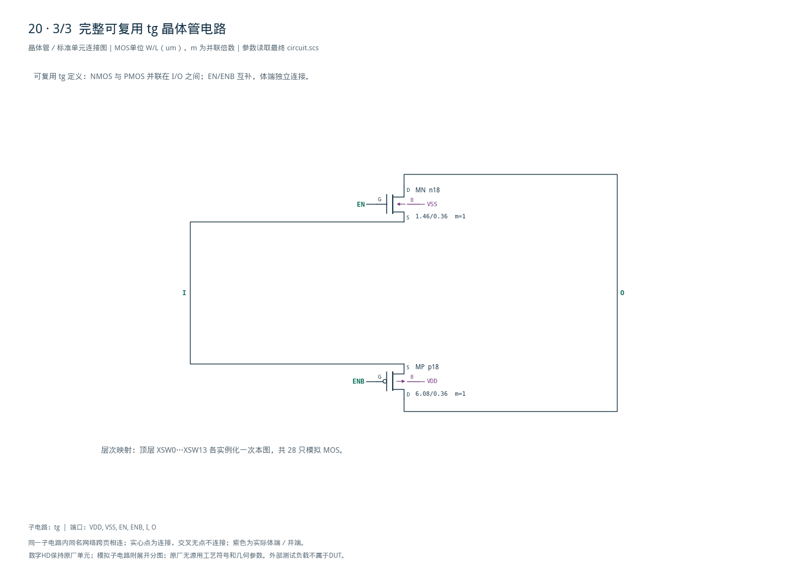

# 20 · 八选一模拟复用器审查

[审查 PDF](review.pdf) · [实测结果](latest_results.json) · [验收合同](contract.json) · [最终网表](circuit.scs)

## 验收结果

本模块用三位数字码，从八路模拟输入中选择一路送到公共输出。相比单NMOS开关，互补传输门可改善接近两条电源轨时的传输能力；三级二选一树简化控制，但导通电阻会串联累积。芯片中常用于多通道传感器共享ADC、模拟测试通路和输入选择，动态切换性能需另行检查。

结论：3共模×8选择码×8独立输入传输，全部原nominal指标通过。条件：SMIC18MMRF / tt / 1.8 V / 40°C。40°C沿用本题明确给出的nominal行。每个模拟输入、选择位、A VDD均经50 Ω驱动；AVSS按原bench接理想地，输出负载1 pF。

| 指标 | 实测 | 原门槛 | 10%边界 | 15%边界 | 单位 |
| --- | --- | --- | --- | --- | --- |
| 选通DC增益绝对误差 | 2.60577e-05 | ≤0.001 | ≤0.0011 | ≤0.00115 | dB |
| 最坏未选通DC增益 | -116.98 | ≤-80 | ≤-79.17 | ≤-78.79 | dB |
| 最坏未选通1MHz增益 | -117.016 | ≤-80 | ≤-79.17 | ≤-78.79 | dB |
| 最小选通带宽 | 24.971 | ≥5 | ≥4.5 | ≥4.25 | MHz |
| 最大AVDD电流 | 0.000137084 | ≤5 | ≤5.5 | ≤5.75 | uA |

| 共模/V | 状态/独立传输数 | 最小BW/MHz | 最坏串扰@1MHz/dB |
| --- | --- | --- | --- |
| 0 | 8 / 64 | 60.2926 | -117.016 |
| 0.9 | 8 / 64 | 24.9710 | -140.678 |
| 1.8 | 8 / 64 | 55.5527 | -119.374 |

总计24个选通状态、24条选通传输、168条未选通传输。每条只激励自己的输入源，另外7路AC为0；没有将8路同时激励的和当作独立隔离结果。

所有8路输入在每个状态共享同一DC共模。选通近DC增益在1 mHz测量；带宽相对自身该点下降3.000 dB。门限没有因中间电平Ron较大而改变。

本次不包含其他4个代表性PVT行、不同输入DC电平组合、切换瞬态、失真、噪声、失配和版图寄生；本例的静态隔离不代表动态切换无串扰。

<!-- SYSTEM-BLOCK-DIAGRAM -->
## 系统框图

实际实现为三级二选一树，未画成未实现的八路独热译码器。

实线表示信号或能量通路，虚线表示时钟、控制或偏置。DUT框外为外部端口或测试夹具；精确端子连接见后附基本电路图。



[独立Mermaid源文件](system_block_diagram.mmd) · [框图SVG](markdown_assets/system-block.svg)
<!-- END-SYSTEM-BLOCK-DIAGRAM -->

## 三级传输门树与HD控制

模拟开关依据目标PDK LUT起步，数字反相信号使用原厂HD单元。

| 角色 | W/L (um) | 初始gm/ID | LUT参考电流/说明 |
| --- | --- | --- | --- |
| n18模拟开关 | 1.46 / 0.36 | 10 | 20 uA |
| p18模拟开关 | 6.08 / 0.36 | 10 | 20 uA |
| INHDV0 ×3 | 原厂W/L | 不重新设计 | 6只原厂MOS |

| 共模/V | 单级Ron/Ω | 选通3级总Ron/Ω |
| --- | --- | --- |
| 0 | 823.32 | 2469.97 |
| 0.9 | 1974.21 | 5922.63 |
| 1.8 | 870.81 | 2612.43 |

每个2:1由两组互补传输门构成，总共14组、28只模拟MOS；选中路径串联3组。3个INHDV0产生选择反相，原厂n18/p18尺寸及模型未改；阱分别接AVDD/AVSS。

gm/ID饱和表只提供初始几何，表征温度27°C；实际验证为40°C。开关在VDS≈0的线性区，Ron取1/(gds,n+gds,p)，不用饱和余量或零电流下gm/ID验收开关。



[查看矢量图](markdown_assets/figure-02-01.svg)

## 完整选择矩阵与频率响应

矩阵行是选择码，列是被独立激励的输入；对角为选通路径。

最坏1MHz串扰在VCM=0 V，S=7、激励VIN3：−117.016 dB。矩阵共192条实际AC响应；每条均保留1 mHz至1 GHz原始复数数据。



[查看矢量图](markdown_assets/figure-03-01.svg)

## 精确电路、范围与复现

模拟路径只有PDK MOS；HD反相器定义另存hd\_cells.scs并冻结在运行快照。

工程认识：互补传输门能传输两轨附近电平，但Ron并不恒定；中点每级约1.974 kΩ，三段约5.923 kΩ，加外部源电阻与寄生后带宽24.97 MHz，为本例最差共模。不能只在0 V或VDD测试导通。

数字控制采用HD，模拟传输门仍按其开关角色选几何。此电路没有内部理想R/C、理想开关或行为源；50 Ω和1 pF都是外部合同。静态电源电流0.137 nA只代表本次确定性模型，不包含时钟切换功耗。

原验证器把公开deck的db(v(...))改为mag(v(...))后再计算dB；本例直接保留有限线性幅度再转换。带宽采用幅度×10^(−3/20)，未照抄公开deck中未替换的dB乘法。

复现：/home/IC/CodeX/virtuoso-bridge-lite/.venv/bin/python scripts/case20\_mux.py；PDF：scripts/review\_pdf.py 20最终运行：runs/20/20260922T074025982055Z\_matrix

原任务：sky130-analog-input-mux-8to1-pvt。总覆盖24个nominal状态；其他代表性PVT行、动态切码和版图效果未验证。

## 完整网表与电路图

[Spectre 网表](circuit.scs) · [全部分图 PDF](schematic/sheets.pdf) · [电路总图](schematic/full.svg) · [端子连接](schematic/connectivity.json)

<details>
<summary>展开完整 Spectre 网表</summary>

```spectre
// Three binary TG stages; standard-cell select complements.
simulator lang=spectre
subckt tg (VDD VSS EN ENB I O)
MN (O EN I VSS) n18 w=1.46u l=0.36u
MP (O ENB I VDD) p18 w=6.08u l=0.36u
ends tg
subckt input_mux_8to1 (AVDD AVSS S2 S1 S0 VIN7 VIN6 VIN5 VIN4 VIN3 VIN2 VIN1 VIN0 VO)
XINV0 (S0 SB0 AVDD AVSS AVDD AVSS) INHDV0
XINV1 (S1 SB1 AVDD AVSS AVDD AVSS) INHDV0
XINV2 (S2 SB2 AVDD AVSS AVDD AVSS) INHDV0
XSW0 (AVDD AVSS SB0 S0 VIN0 n0_0) tg
XSW1 (AVDD AVSS S0 SB0 VIN1 n0_0) tg
XSW2 (AVDD AVSS SB0 S0 VIN2 n0_1) tg
XSW3 (AVDD AVSS S0 SB0 VIN3 n0_1) tg
XSW4 (AVDD AVSS SB0 S0 VIN4 n0_2) tg
XSW5 (AVDD AVSS S0 SB0 VIN5 n0_2) tg
XSW6 (AVDD AVSS SB0 S0 VIN6 n0_3) tg
XSW7 (AVDD AVSS S0 SB0 VIN7 n0_3) tg
XSW8 (AVDD AVSS SB1 S1 n0_0 n1_0) tg
XSW9 (AVDD AVSS S1 SB1 n0_1 n1_0) tg
XSW10 (AVDD AVSS SB1 S1 n0_2 n1_1) tg
XSW11 (AVDD AVSS S1 SB1 n0_3 n1_1) tg
XSW12 (AVDD AVSS SB2 S2 n1_0 VO) tg
XSW13 (AVDD AVSS S2 SB2 n1_1 VO) tg
ends input_mux_8to1
```

</details>







## 报告来源

正文与表格整理自已交付的矢量 PDF，图表单独提取；本文件是后续整理的 Markdown，不是原 PDF 的编译输入。原 PDF、网表及测量数据保持原值。
