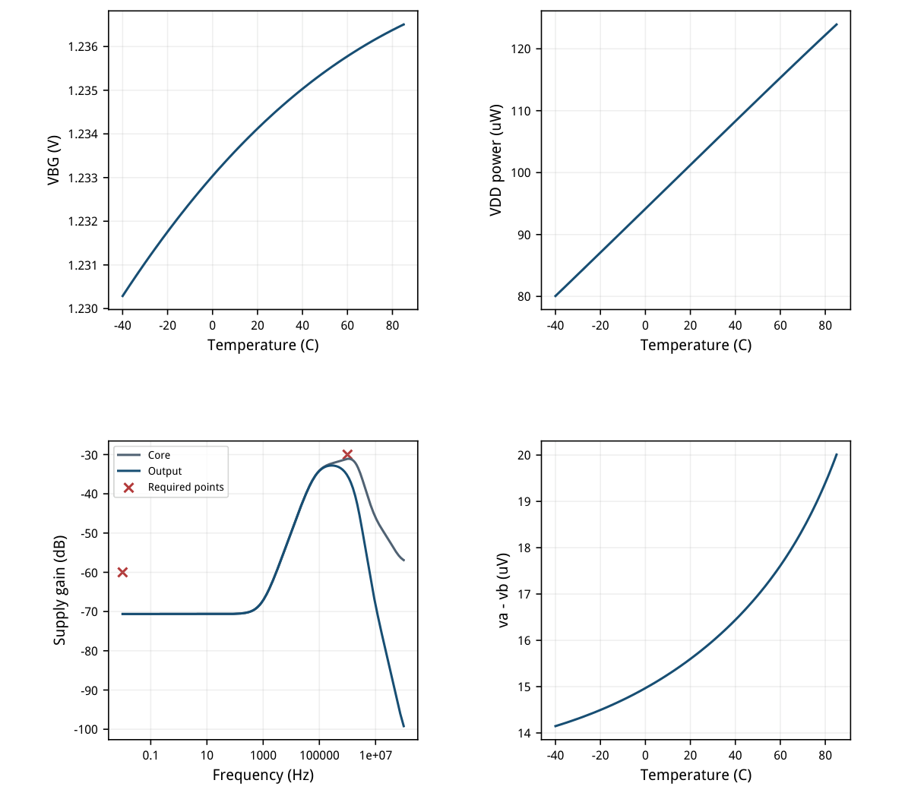
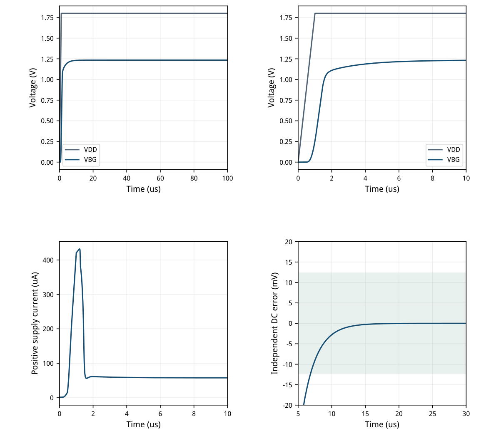
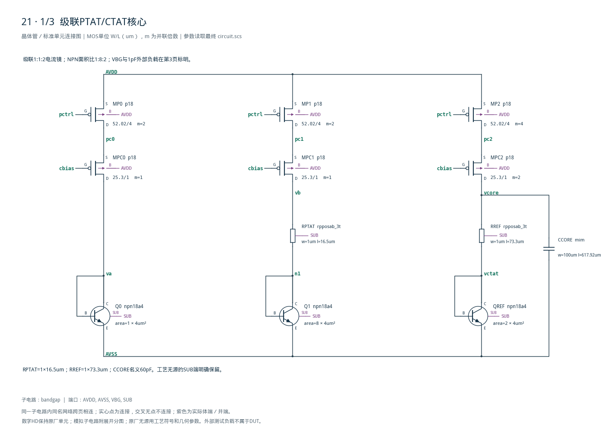
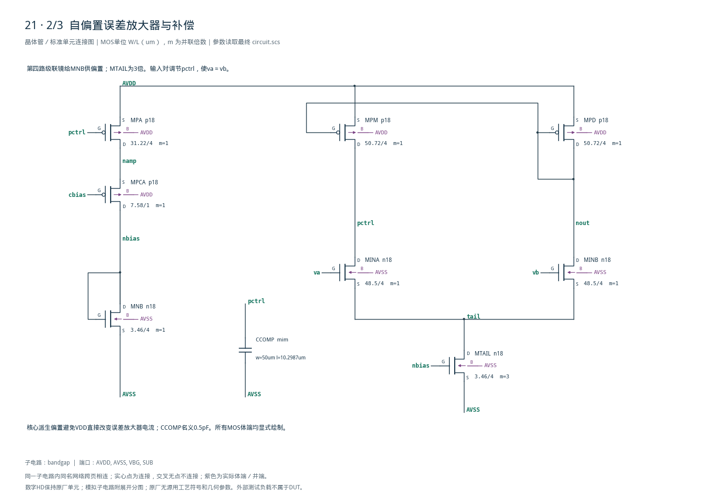
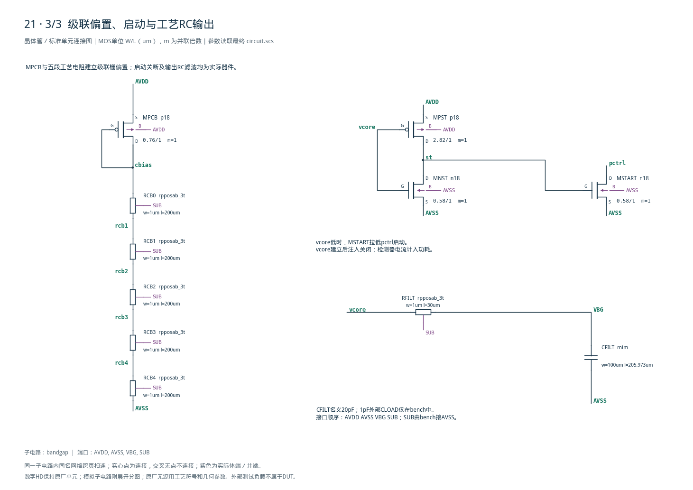

# 21 · 高PSRR带隙基准审查

[审查 PDF](review.pdf) · [实测结果](latest_results.json) · [验收合同](contract.json) · [最终网表](circuit.scs)

## 验收结果

本模块提供约1.2V的片上电压基准，并重点降低供电扰动对输出的影响。级联电流镜与核心派生的放大器偏置提高低频电源抑制，工艺RC滤波降低高频耦合；代价是更多偏置器件、电压余量和电容面积。它适合稳压器、传感器和混合信号芯片的安静参考节点；本设计仍是高阻核心，驱动采样负载需要另行设计缓冲器。

结论：五项适用nominal原门槛全部通过，无需10%或15%放宽。

条件：SMIC18MMRF TT / 1.8V / 27°C / 外部1pF。温漂保留-40至85°C、步长1°C的全部126点。该范围对应原题nominal gate，不代表另外三个代表性PVT点通过。

| 指标 | 实测 | 原门槛 | 10%边界 | 15%边界 | 单位 |
| --- | --- | --- | --- | --- | --- |
| 输出偏离1.2V | 34.4608 | ≤150 | ≤165 | ≤172.5 | mV |
| 全温扫温漂 | 40.3077 | ≤50 | ≤55 | ≤57.5 | ppm/°C |
| 供电耦合@0.01Hz | -70.6251 | ≤-60 | ≤-59.1721 | ≤-58.786 | dB |
| 供电耦合@1MHz | -35.3923 | ≤-30 | ≤-29.1721 | ≤-28.786 | dB |
| 90–100us启动终值误差 | 1.4216e-09 | ≤1 | ≤1.1 | ≤1.15 | % |

标称VBG=1.234461V，VDD功耗103.717uW。温扫电压1.230289–1.236506V；最大温扫功耗123.933uW。功耗仅为工程记录，原题没有功耗门槛。

负dB表示供电到输出的传递增益；本次等价电源抑制为70.625dB和35.392dB。10%/15%按耦合幅值扩大，不能对负dB数字直接乘百分比。电压窗口以1.2V为中心、原误差±150mV。

启动误差极小只表示同一确定性模型回到独立DC解，不表示绝对精度、随机失配或测量噪声达到该数量级。输出是高阻参考，1pF测试负载不等于ADC驱动验证。

## 结构与gm/ID尺寸依据

级联PTAT/CTAT核心、第四路自偏置、独立启动及物理RC输出。

误差放大器使va≈vb；Q0:Q1面积比1:8建立ΔVBE，经RPTAT形成PTAT电流。输出镜比1:2，RREF叠加QREF的VBE。级联管使上层镜漏压接近；第四路镜向MNB供电，避免VDD电阻偏置直接调制放大器电流。

| 器件 | 模型 | 单位W/L um | m | gm/ID | 初算I/uA |
| --- | --- | --- | --- | --- | --- |
| MP0/MP1/MP2 | p18 | 52.02/4 | 2/2/4 | 15 | 5 |
| MPC0/MPC1/MPC2 | p18 | 25.30/1 | 1/1/2 | 15 | 10 |
| MPA | p18 | 31.22/4 | 1 | 15 | 3 |
| MPCA | p18 | 7.58/1 | 1 | 15 | 3 |
| MINA/MINB | n18 | 48.50/4 | 1/1 | 22 | 4 |
| MPD/MPM | p18 | 50.72/4 | 1/1 | 16 | 4 |
| MNB/MTAIL | n18 | 3.46/4 | 1/3 | 12 | 3 |
| MPCB | p18 | 0.76/1 | 1 | 5 | 3 |
| MPST | p18 | 2.82/1 | 1 | 12 | 2 |
| MNST/MSTART | n18 | 0.58/1 | 1/1 | 12 | 2 |

全部MOS来自已有目标PDK TT LUT。L4um角色使用本工程既有补充表，VDS=0.9V；L1um角色也用现有0.9V表。体效应、低VDS余量和实际gm/ID均由最终OP复核。每单位镜宽52.02um，避免104um单实例超出100um模型范围。

原厂NPN npn18a4单位2×2um，area=1/8/2。工艺电阻均rpposab\_3t且W=1um：RPTAT16.5um、RREF73.3um、RFILT30um；RCB0–4各200um。所有第三端接SUB，bench把SUB接AVSS。

CCORE/CFILT/CCOMP为工艺MIM，名义60/20/0.5pF，总板面积约0.0829mm²，另有1pF外部负载。没有理想R/C、源或行为器件放在DUT内部；未做布局/DRC/PEX。

## 实际工作点与级联余量

全部18个MOS实例；电流幅度列取绝对值，电压符号沿Spectre定义。

| 器件 | \|ID\|/uA | gm/ID | VGS/V | VDS/V | \|VDS\|-\|VDSAT\| |
| --- | --- | --- | --- | --- | --- |
| MP0 | 10.098 | 14.802 | -0.5042 | -0.2072 | 0.0926 |
| MP1 | 10.098 | 14.802 | -0.5042 | -0.2072 | 0.0926 |
| MP2 | 20.193 | 14.800 | -0.5042 | -0.2062 | 0.0916 |
| MPC0 | 10.098 | 14.885 | -0.5831 | -0.8455 | 0.7279 |
| MPC1 | 10.098 | 14.885 | -0.5831 | -0.8455 | 0.7279 |
| MPC2 | 20.193 | 14.807 | -0.5841 | -0.3593 | 0.2407 |
| MPCB | 3.0672 | 4.934 | -0.7904 | -0.7904 | 0.4706 |
| MPA | 3.0325 | 14.798 | -0.5042 | -0.2078 | 0.0931 |
| MPCA | 3.0325 | 14.880 | -0.5826 | -1.0564 | 0.9390 |
| MNB | 3.0325 | 11.830 | 0.5359 | 0.5359 | 0.3866 |
| MTAIL | 8.9914 | 11.795 | 0.5359 | 0.2725 | 0.1233 |
| MINA | 4.4959 | 21.901 | 0.4747 | 1.0233 | 0.9567 |
| MINB | 4.4954 | 21.901 | 0.4747 | 1.0300 | 0.9634 |
| MPD | 4.4955 | 15.396 | -0.4975 | -0.4975 | 0.3874 |
| MPM | 4.4959 | 15.396 | -0.4975 | -0.5042 | 0.3941 |
| MPST | 2.1399 | 11.727 | -0.5655 | -1.7837 | 1.6358 |
| MNST | 2.14 | 0.966 | 1.2345 | 0.0163 | -0.6271 |
| MSTART | 6.2645e-06 | 30.164 | 0.0163 | 1.2958 | 1.2554 |

pc0/pc1/pc2=1.592759/1.592759/1.593767V，cbias=1.009637V。输出上层MP2是最紧余量，约91.57mV；这只证明nominal OP。

MSTART稳态电流6.265pA，注入关闭；检测器MPST仍有2.140uA直通电流，计入功耗。MNST处于预期低VDS状态，不能以放大管饱和条件判其失败。

## 全温扫与电源耦合

温扫126点；AC为0.01Hz–100MHz，正式门槛仅在0.01Hz和1MHz两点。

温漂=(max-min)/(平均电压×125)=40.307692ppm/°C。平均电压1.233962073V，按原.measure AVG沿温度积分，不把126点的简单算术平均替换它。

0.01Hz供电耦合-70.625079dB，1MHz为-35.392274dB。输出RC主要衰减高频耦合，无法修复直流供电依赖；低频改善来自级联及核心派生偏置。



[查看矢量图](markdown_assets/figure-04-01.svg)

## 独立DC目标下的真实供电启动

VDD在首1us从0升至1.8V，运行100us；无非零初值，无强制输出轨迹。

独立27°C DC目标=1.234460773V；90–100us时间平均=1.234460773V，误差约1.42e-09%，原门槛1%。输出初值0V，所保存网格上的峰值1.234460773V。

原题只约束100us内回到独立DC目标，未另设峰值电流、能量、入窗时间或过冲门槛。图中早期轨迹和供电电流作为完整工程证据；不把微小数值尾差解释成真实器件精度。



[查看矢量图](markdown_assets/figure-05-01.svg)

## 有因果依据的迭代记录

先测供电耦合，再隔离残余通路；失败运行和相同合同均保留。

| 版本 | 结构 | 0.01Hz / 1MHz | 结果 |
| --- | --- | --- | --- |
| 首版 | 长沟道镜；VDD电阻偏置 | -54.060 / -32.991dB | 低频失败 |
| 中间版 | 增加PMOS级联；偏置不变 | -57.463 / -34.759dB | 低频仍失败 |
| 最终版 | 第四路镜生成放大器偏置 | -70.625 / -35.392dB | 五项原门槛通过 |

长沟道提高输出电阻，但核心支路与输出支路漏压不同，仍有镜像误差随VDD变化。增加级联后，pc0/pc1/pc2约1.593V，上层镜漏压接近；输出参考的电源耦合下降，但尚未达到60dB目标。

低频AC显示放大器尾电流仍由VDD电阻支路调制；镜负载的二极管节点与pctrl跟随供电的斜率不同，通过输入对有限输出电阻转换成差分误差。最终从PTAT核心单独镜出约3uA，给MNB和三倍MTAIL建立偏置，切断该直接供电通路。

自偏置引入零电流平衡点，所以保留MPST/MNST/MSTART独立启动。最终1us供电斜坡从零供电起动，并回到独立DC解。CCORE60pF、CFILT20pF、CCOMP0.5pF和1pF外部负载在三版间保持一致。

这是一阶、无修调、高阻带隙。约0.083mm²的MIM电容板面积与级联电压余量是实际代价；没有宣称最小面积、最低功耗或完整PVT/失配鲁棒性。

## 原始算法、运行与证据边界

9项数值交叉核对、上游5项nominal checks及完整端子复核。

冻结原instruction、参考网表、正式verifier、utils、三份bench及netlist guide。独立重算Spectre温扫、AC和启动原始数据，并传给未改写的上游checks(rows,{NOMINAL})；五项nominal判断全部通过。未调用另外三个PVT点并冒称完整通过。

最终三组输入快照使用同一电路，模型和LUT哈希完整；32个器件、114个端子的型号、参数与连接独立核对。全部模拟MOS、BJT的体端/衬底和工艺无源参数均绘出，没有用功能框代替内部电路。

Spectre24.1实际日志均0错误/0警告。Bridge将日志中的license与“0 errors”组合误报license error；保留该元数据，并按成功许可检查、正常结束及完整PSF核实有效性。PDK、Bridge、Spectre和原LUT未修改。

复现：激活virtuoso-bridge-lite/.venv，在工程根目录执行： python scripts/case21\_highpsrr\_bandgap.py python scripts/schematic21.py python scripts/audit21.py python scripts/review21.py 重新生成后必须再次目检图纸和PDF；不会自动继承本次目检结论。

最终运行：runs/21/20260926T031354634964Z\_static runs/21/20260926T031355779063Z\_ac runs/21/20260926T031356432862Z\_startup

未覆盖：另外三个代表性工艺/电压/温度组合，完整笛卡尔PVT、失配、噪声、版图及PEX、输出缓冲与采样负载驱动。1°C步长的全温扫属于原功能合同；它不等于完成其他工艺角。

## 精确网表与完整图纸

顶层端口顺序AVDD AVSS VBG SUB；DUT只用目标工艺物理器件。

后附S1–S3为全部32个实例：18MOS、3NPN、8个工艺电阻、3个MIM电容，共114个端子。RFILT/CFILT是DUT的一部分，1pF外部CLOAD不计入DUT器件数。

完整总图：cases/21-highpsrr-bandgap/schematic/full.svg / full.pdf 连接清单：schematic/connectivity.json；独立图纸核对：schematic\_independent\_review.json

电路SHA-256：c44fb1be719bd559ccdcdeed956b61620db10de7cd08cefb35cf0b11f8f879de

## 完整网表与电路图

[Spectre 网表](circuit.scs) · [全部分图 PDF](schematic/sheets.pdf) · [电路总图](schematic/full.svg) · [端子连接](schematic/connectivity.json)

<details>
<summary>展开完整 Spectre 网表</summary>

```spectre
// Long-channel closed-loop bandgap plus physical RC output isolation.
simulator lang=spectre
subckt bandgap (AVDD AVSS VBG SUB)
MP0 (pc0 pctrl AVDD AVDD) p18 w=52.02u l=4u m=2
MP1 (pc1 pctrl AVDD AVDD) p18 w=52.02u l=4u m=2
MP2 (pc2 pctrl AVDD AVDD) p18 w=52.02u l=4u m=4
Q0 (va va AVSS SUB) npn18a4 area=1
RPTAT (vb n1 SUB) rpposab_3t w=1u l=16.5u
Q1 (n1 n1 AVSS SUB) npn18a4 area=8
RREF (vcore vctat SUB) rpposab_3t w=1u l=73.3u
QREF (vctat vctat AVSS SUB) npn18a4 area=2
CCORE (vcore AVSS) mim w=100u l=617.91967u
RFILT (vcore VBG SUB) rpposab_3t w=1u l=30u
CFILT (VBG AVSS) mim w=100u l=205.97322u
MPC0 (va cbias pc0 AVDD) p18 w=25.3u l=1u m=1
MPC1 (vb cbias pc1 AVDD) p18 w=25.3u l=1u m=1
MPC2 (vcore cbias pc2 AVDD) p18 w=25.3u l=1u m=2
MPCB (cbias cbias AVDD AVDD) p18 w=0.76u l=1u
RCB0 (cbias rcb1 SUB) rpposab_3t w=1u l=200u
RCB1 (rcb1 rcb2 SUB) rpposab_3t w=1u l=200u
RCB2 (rcb2 rcb3 SUB) rpposab_3t w=1u l=200u
RCB3 (rcb3 rcb4 SUB) rpposab_3t w=1u l=200u
RCB4 (rcb4 AVSS SUB) rpposab_3t w=1u l=200u
MPA (namp pctrl AVDD AVDD) p18 w=31.220000000000002u l=4u
MPCA (nbias cbias namp AVDD) p18 w=7.58u l=1u
MNB (nbias nbias AVSS AVSS) n18 w=3.46u l=4u
MTAIL (tail nbias AVSS AVSS) n18 w=3.46u l=4u m=3
MINA (pctrl va tail AVSS) n18 w=48.5u l=4u
MINB (nout vb tail AVSS) n18 w=48.5u l=4u
MPD (nout nout AVDD AVDD) p18 w=50.72u l=4u
MPM (pctrl nout AVDD AVDD) p18 w=50.72u l=4u
CCOMP (pctrl AVSS) mim w=50u l=10.298661u
MPST (st vcore AVDD AVDD) p18 w=2.82u l=1u
MNST (st vcore AVSS AVSS) n18 w=0.58u l=1u
MSTART (pctrl st AVSS AVSS) n18 w=0.58u l=1u
ends bandgap
```

</details>







## 报告来源

正文与表格整理自已交付的矢量 PDF，图表单独提取；本文件是后续整理的 Markdown，不是原 PDF 的编译输入。原 PDF、网表及测量数据保持原值。
