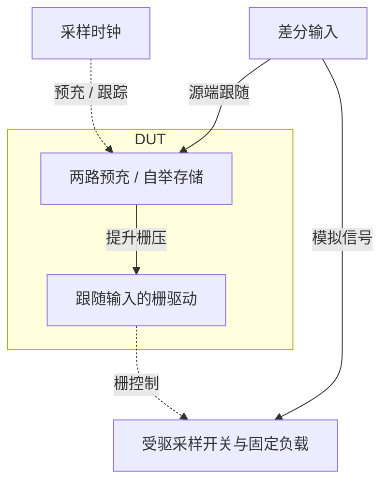
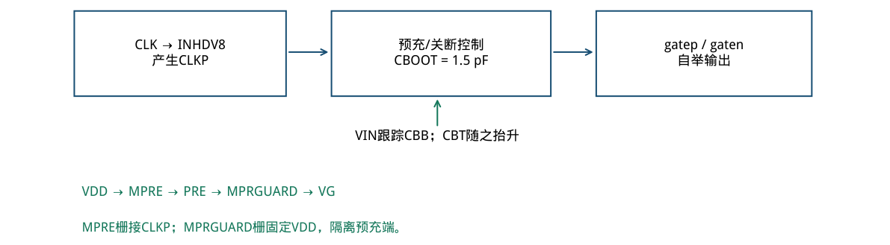
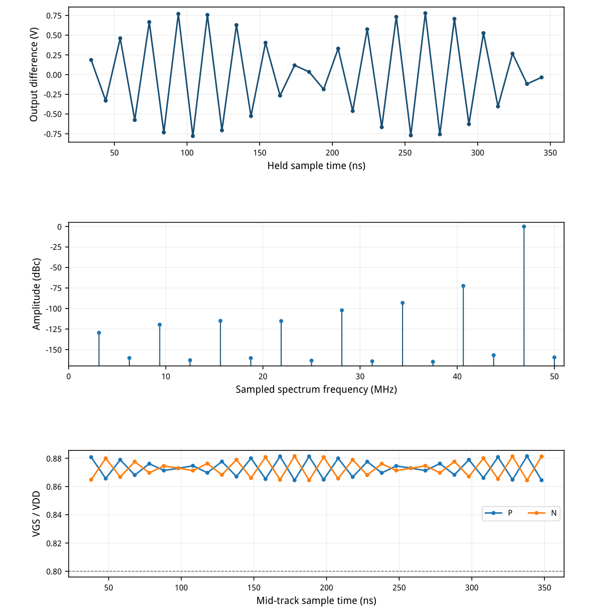
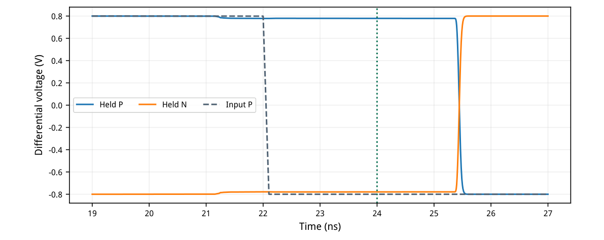
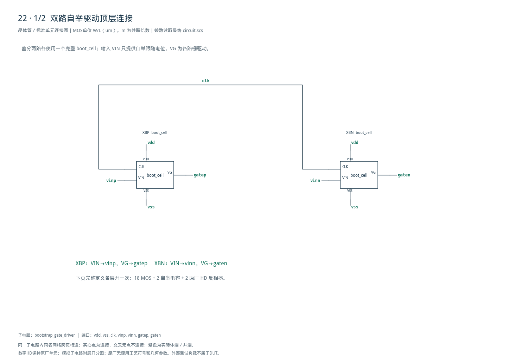
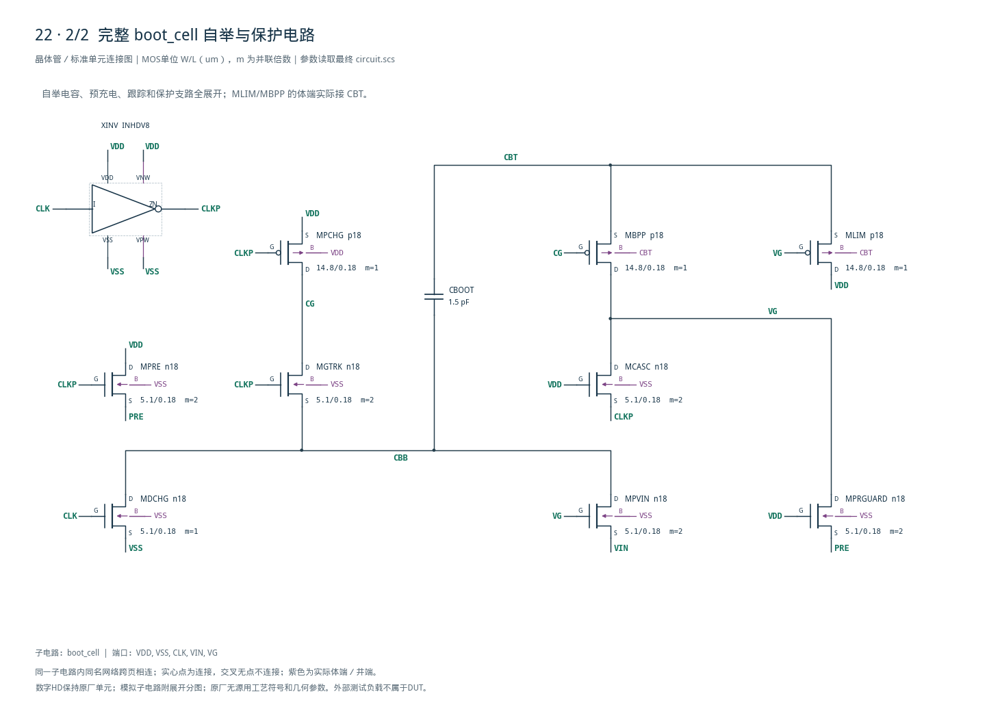

# 22 · 差分自举栅驱动器审查

[审查 PDF](review.pdf) · [实测结果](latest_results.json) · [验收合同](contract.json) · [最终网表](circuit.scs)

## 验收结果

本模块为差分采样开关生成随输入电压抬升的栅极驱动。相比直接用电源范围内时钟驱动NMOS，自举可使导通时的栅源电压更恒定，改善宽输入摆幅下的导通线性度；同时需要控制预充和关断时的器件端电压。芯片中常用于高速ADC输入采样、开关电容网络和精密采样保持电路。

结论：32点相干SDR、64个跟踪栅源电压、双向保持和DUT功耗均通过原nominal。

条件：SMIC18MMRF tt / 1.8 V / 27°C；100 MHz时钟、50 ps源边沿、50 Ω源阻抗及两级原厂HD缓冲；输入46.875 MHz，每侧0.4 V峰值、共模0.9 V；每侧固定1 pF保持电容。

| 指标 | 实测 | 原门槛 | 10%边界 | 15%边界 | 单位 |
| --- | --- | --- | --- | --- | --- |
| 采样SDR | 72.37828 | ≥72 | ≥71.085 | ≥70.588 | dB |
| 最小mid-track VGS | 0.864447 | ≥0.8 | ≥0.72 | ≥0.68 | VDD |
| 正样本保留增益 | 0.9745333 | ≥0.9 | ≥0.81 | ≥0.765 | V/V |
| 负样本保留增益 | 0.9745333 | ≥0.9 | ≥0.81 | ≥0.765 | V/V |
| DUT供电功耗 | 254.9556 | ≤500 | ≤550 | ≤575 | uW |

采样MOS属于测试台固定负载：宽度64 um保持；原Sky130长度0.15 um低于SMIC n18最小值，因此映射为0.18 um，并在两轮中固定。原手工时钟缓冲替换为INHDV8→INHDV16；这些是目标工艺迁移差异，不能称作原器件完全相同。

额外检查三组波形中驱动器和采样MOS的端电压：最大|VGS|或|VGD|=1.861416 V，最大|VDS|=1.913125 V。均通过1.98 V工程线；该线不代表已完成工艺寿命或可靠性签核。

72 dB目标采用总非基波功率SDR，不能与“最大单个杂散”的SFDR混用。原函数结果72.378282 dB，独立直接求和非基波功率结果72.378282 dB，避免大数相减的交叉核验一致。

只完成TT/1.8 V/27°C；其余10个PVT点、随机失配、热噪声和PEX未执行。本题500 uW限额仅针对DUT VDD，外部时钟缓冲功率独立列出，不将其误称为总系统能耗。

<!-- SYSTEM-BLOCK-DIAGRAM -->
## 系统框图

框图描述自举驱动及其受驱采样夹具；器件保护和端电压仍以原理图为准。

实线表示信号或能量通路，虚线表示时钟、控制或偏置。DUT框外为外部端口或测试夹具；精确端子连接见后附基本电路图。



[独立Mermaid源文件](system_block_diagram.mmd) · [框图SVG](markdown_assets/system-block.svg)
<!-- END-SYSTEM-BLOCK-DIAGRAM -->

## 自举回路、保护与固定测试负载

CLK低电平跟踪，高电平保持；左右驱动完全对称，分别跟随VINP/VINN。

| 角色 | 模型 | 单位W/L (um) | LUT gm/ID | 选点电流 |
| --- | --- | --- | --- | --- |
| 自举NMOS单位 | n18 | 5.1/0.18 | 8 | 200 uA |
| 自举PMOS单位 | p18 | 14.8/0.18 | 8 | 200 uA |
| 固定外部采样管 | n18 | 64/0.18 | 8，反查 | 2.51228 mA |

LUT均为VDS=0.9 V、VSB=0、TT/27°C；真实开关瞬态不保持该工作点。固定W64 um采样负载通过LUT电流密度反查，只作几何交叉记录，没有按结果调小负载。

每侧9只模拟MOS和1个原厂HD反相器，MPRE/MGTRK/MPVIN/MCASC/MPRGUARD为n单位m2，其余m1；左右各1.5 pF自举储能。电容、寄生负载和预充路径导致实际VGS低于理想VDD，须检验每个跟踪中点。

继承第31项发现的预充端电压问题，首版直接加入保护管，没有在本题重新使用已知端差过高的连接。MLIM/MBPP的PMOS体接CBT；版图必须保留所需独立井。

外部两级时钟缓冲、两只64 um采样MOS和两只1 pF电容只在bench层。DUT只含目标PDK MOS、原厂HD MOS与正值电容，没有内部源、理想R/L/S或行为元件。



[查看矢量图](markdown_assets/figure-02-01.svg)

## 近奈奎斯特频谱与64点栅源检查

输入46.875 MHz = 15/32 × 100 MHz；32个held样本34–344 ns，跟踪中点38–348 ns。

SDR=10log10[(P15+P17)/(ΣP1…31−P15−P17)]，包括Nyquist功率、排除DC；不加窗、不移除启动后的某些差样本。正负两侧每个跟踪中点VGS均读取真实gate−vin，未用对地栅压替代。没有加入噪声或从SDR外推ENOB。



[查看矢量图](markdown_assets/figure-03-01.svg)

## 保持隔离、功耗边界与精度对照

正负两份电路同时验证；22.0–22.1 ns反转输入，24 ns读取原极性的保留量。

| 端口 | 平均功率/uW | 边界 |
| --- | --- | --- |
| DUT VDD | 254.955574 | 原500 uW门槛使用此项 |
| 外部HD缓冲供电 | 58.873537 | 按原合同排除，另列 |
| 50 Ω前时钟源 | 1.906795 | 诊断；不是DUT VDD |

供电积分30–350 ns，共32个时钟周期；功耗为−1.8×平均I(VDD)，保留非负要求。输入源也可能供能，但本题没有以全部源总功率评分；本页不宣称完整系统能耗。

| 指标 | 最大步5 ps | 最大步2.5 ps | 绝对差 |
| --- | --- | --- | --- |
| SDR / dB | 72.3782155 | 72.3782821 | 6.659e-05 |
| 最小VGS / VDD | 0.864447011 | 0.86444702 | 9.616e-09 |
| DUT功耗 / uW | 254.953904 | 254.955574 | 0.00167 |

同电路reltol=2e−6、iabstol=1e−12、vabstol=1e−9、conservative。FFT中存在SPECTRE-16780局部LTE放宽警告；两轮都保留日志，缩步后原门槛保持通过。最终采用2.5 ps数据，无需进一步重复扫描。



[查看矢量图](markdown_assets/figure-04-01.svg)

## 精确DUT网表、证据与复现

左右自举驱动具有相同几何；外部固定采样负载不属于以下DUT网表。

源任务：sky130-bootstrap-sampler-fft。原instruction、reference、正式verifier及两个bench已冻结；提取后直接调用原analyze\_fft与nominal\_passes，只执行nominal，不调用其全PVT调度。

32点FFT额外使用直接求和非基波功率进行数值交叉检查，与原“总功率减信号”结果差小于1e−8 dB。72条器件检查覆盖静态正/负两份和FFT一份驱动及采样MOS；外部缓冲另作功率表征。

复现：/home/IC/CodeX/virtuoso-bridge-lite/.venv/bin/python scripts/case22\_bootstrap.py --maxst ep-ps 2.5 PDF：同一Python运行 scripts/review\_pdf.py 22运行：runs/22/20260922T094323883356Z\_static runs/22/20260922T094326591746Z\_fft

每个runs目录含bench、DUT、HD及合同/尺寸脚本快照、模型SHA-256、完整日志与PSF。numerical\_confirmation.json记录两轮对照，latest\_results.json保存32个样本、64个VGS及72条端差。

这一nominal通过只支持当前采样频率、输入幅度、时钟驱动和固定负载；没有验证其他工艺角、失配、相位噪声或版图寄生。

## 完整网表与电路图

[Spectre 网表](circuit.scs) · [全部分图 PDF](schematic/sheets.pdf) · [电路总图](schematic/full.svg) · [端子连接](schematic/connectivity.json)

<details>
<summary>展开完整 Spectre 网表</summary>

```spectre
simulator lang=spectre
subckt boot_cell (VDD VSS CLK VIN VG)
XINV (CLK CLKP VDD VSS VDD VSS) INHDV8
CBOOT (CBT CBB) capacitor c=1.5p
MDCHG (CBB CLK VSS VSS) n18 w=5.1u l=.18u
MPCHG (CG CLKP VDD VDD) p18 w=14.8u l=.18u
MLIM (VDD VG CBT CBT) p18 w=14.8u l=.18u
MPRE (VDD CLKP PRE VSS) n18 w=5.1u l=.18u m=2
MGTRK (CG CLKP CBB VSS) n18 w=5.1u l=.18u m=2
MBPP (VG CG CBT CBT) p18 w=14.8u l=.18u
MPVIN (CBB VG VIN VSS) n18 w=5.1u l=.18u m=2
MCASC (VG VDD CLKP VSS) n18 w=5.1u l=.18u m=2
MPRGUARD (VG VDD PRE VSS) n18 w=5.1u l=.18u m=2
ends boot_cell
subckt bootstrap_gate_driver (vdd vss clk vinp vinn gatep gaten)
XBP (vdd vss clk vinp gatep) boot_cell
XBN (vdd vss clk vinn gaten) boot_cell
ends bootstrap_gate_driver
```

</details>





## 报告来源

正文与表格整理自已交付的矢量 PDF，图表单独提取；本文件是后续整理的 Markdown，不是原 PDF 的编译输入。原 PDF、网表及测量数据保持原值。
